# python基础

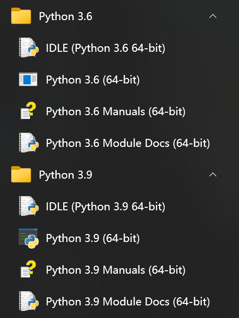

## 💡常用内置函数

### print函数

可以输出：数字，字符串（要加引号），含有运算符的表达式（3+5，输出8）

输出到：控制台，文件

相关转义符：/n换行，/t注意是占一个制表符（4个字母），/r覆盖前一个单词，/b退一格删去前一个字母

### input函数

返回结果为str类型

### range函数

range(start, stop, step)，**注意，所表示的序列不包括stop**。start不写时候默认0。

### type函数

返回对象类型

### id函数

返回对象的id值，地址值或者是标识符


## 标识符和保留字

标识符由字母、数字、下划线组成。

- 以单下划线开头 **_foo** 的代表**不能直接访问的类属性**，需通过类提供的接口进行访问，不能用 **from xxx import \*** 而导入。
- 以双下划线开头的 **__foo** 代表**类的私有成员**，以双下划线开头和结尾的 **__foo__** 代表 Python 里特殊方法专用的标识，如 **__init__()** 代表类的构造函数。

保留字：print(keyword.kwlist)

['False', 'None', 'True', 'peg_parser', 'and', 'as', 'assert', 'async', 'await', 'break', 'class', 'continue', 'def', 'del', 'elif', 'else', 'except', 'finally', 'for', 'from', 'global', 'if', 'import', 'in', 'is', 'lambda', 'nonlocal', 'not', 'or', 'pass', 'raise', 'return', 'try', 'while', 'with', 'yield']

## 注释

单行：#

多行：三引号


## 变量

标准数据类型五个：

- Numbers（数字）
- String（字符串）
- List（列表）
- Tuple（元组）
- Dictionary（字典）

### 数字

数字有四种类型

- int（有符号整型），其中**二进制0b开头，八进制0o开头，十六进制0x开头**
- long（长整型，也可以代表八进制和十六进制）
- float（浮点型）
- complex（复数）

### 字符串

单引号，双引号只能单行，三引号可以多行


### 数据类型转换

str()

int()——**整数数字串**转化为int类型，以及，float转化为int类型（会去掉小数部分）

float()——整数转化为float类型，以及，数字串转化为float类型


## 运算符

### 算术运算符

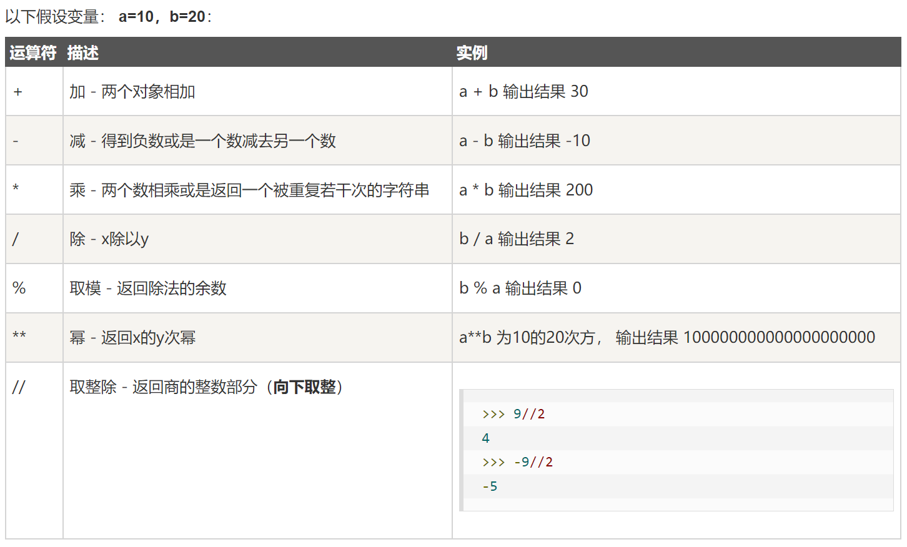

### 比较（关系）运算符

==，!=，>=, <=, <, >

**比较对象的标识/id使用 关键字 is**

### 赋值运算符

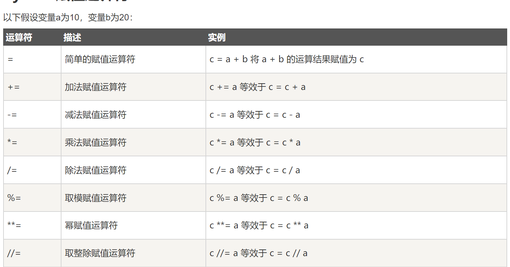

💡**交换赋值：a,b = b,a**

### 逻辑运算符

and

or

not

in

not in

### 位运算符

举例，a=60（0011 1100），b=13（0000 1101）

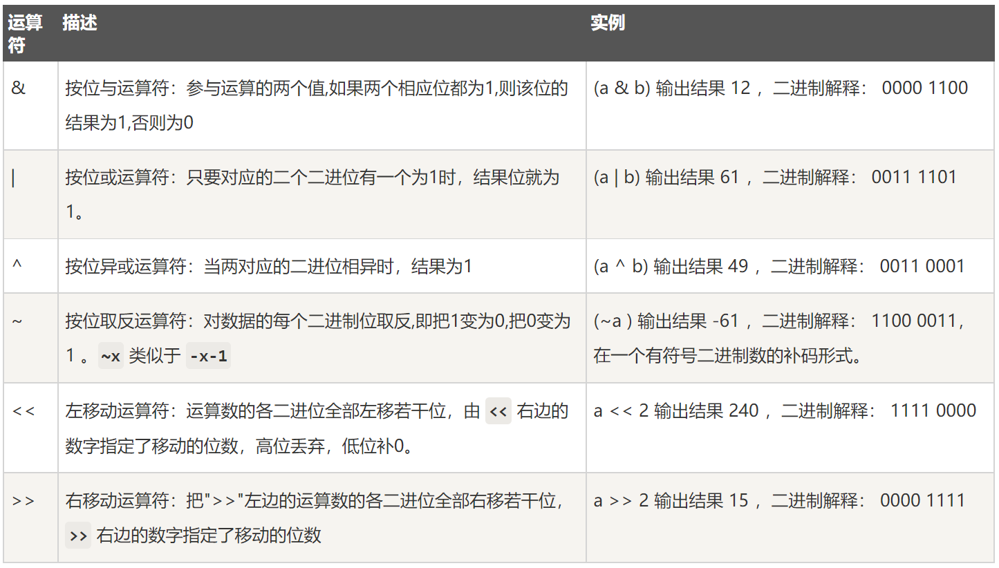

其中，左移相当于乘以2，右移相当于除以2

### 成员运算符

即in 和 not in

### 身份运算符

即 is 和 is not

### 运算符优先级

运算符优先级：

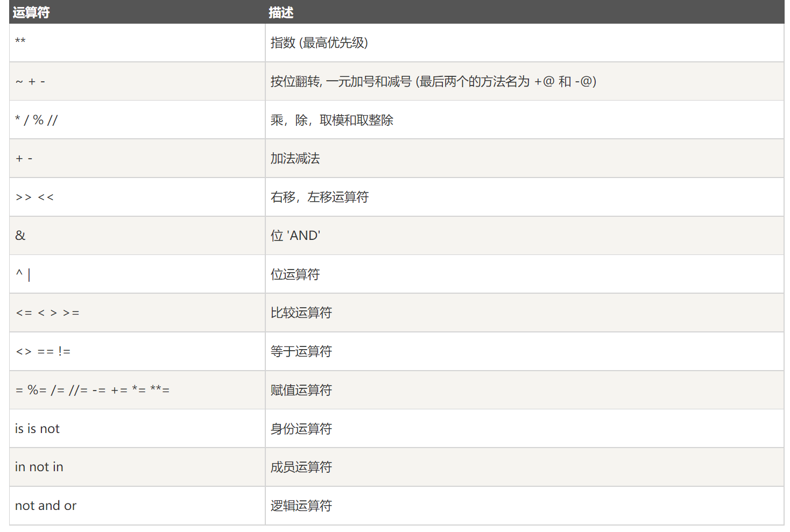

## 流程控制

### 顺序结构


### 选择结构

if语句

```python
if 判断条件1:
    执行语句1……
elif 判断条件2:
    执行语句2……
elif 判断条件3:
    执行语句3……
else:
    执行语句4……
```

条件表达式

- if 判断条件 ： 执行语句
- 执行语句1（true）  if  条件判断 else 执行语句2（flase）

### pass语句

用作占位语句

```python
pass
```

### 循环结构

while 循环

```python
while 判断条件(condition)：
    执行语句(statements)……
```

for-in循环

```python
for 自定义变量iterating_var in 可迭代对象sequence:
   statements(s)
```

不需要使用自定义变量时候，使用”__“ 代替

### 流程控制语句

break语句，通常和if语句一起用，只能作用于本层循环（多重循环时）

continue语句，进入下一个循环，只能作用于本次循环（多重循环时）

else语句，可以和while循环和for循环配合，**没有碰到break时候执行else**


## 列表

相当于其他语言的数组，但是可以存储除数字以外的其他数据。

列表的索引从0开始（正序时候），或者从-1开始（倒序时候）

可以存储重复数据

常用函数：

- list([xxxx,xx,xx])：创建列表
- list.index('xx'，start，stop)：查找列表中指定元素的索引（也可以在指定范围内查找）
- 增加元素：
  - list.append(obj)：末尾添加1个元素，未创建新列表
  - list.extend(seq)：末尾至少添加1个元素
  - list.insert(index, obj)：列表任意位置上添加元素
  - 切片添加：list[1:] = list2，1位置上开始切掉，然后换成list2
- 删除元素:
  - list.remove(obj)：移除列表中某个值的第一个匹配项
  - list.pop(index)：移除列表中的一个元素（默认最后一个元素），并且返回该元素的值
  - list.clear()：清空列表
  - **del list：删除列表**
- 修改元素
- 排序操作
  - list.sort()，默认升序（即reverse=False）
  - 内置函数sorted(list)，默认升序（即reverse=False）

### 切片操作

list[start: stop: step]，其中step默认为1。

step为负数时，第一个元素默认为列表最后一个元素

### 列表生成式

```python
[i*i for i in range(1,10)]
[列表元素表达式 for 自定义变量 in 可迭代对象]
```


## 字典

无序，键值对

- 创建字典：
  - dict = {'key': value, 'key1':value..........}
  - 内置函数dict()：dict(key=value, key=value........)
- 获取元素
  - [key]，如果不存在，报错
  - get(key，default)，如果不存在，输出None或者设定的默认值。
- 删除元素
  - del dict[key] ：删除特定值
  - del dict：删除整个字典
  - dict.clear()：清空字典
- 增加元素
  - dict[newKey] = value
- 查询操作，视图操作
  - dict.keys()
  - dict.values()
  - dict.items()：得到所有的键值对
- 遍历操作
  - for item in dict：遍历字典中的key

### 字典生成式

使用zip()内置函数，给定两个列表，合成为一个字典。

```python
dict = {key:value  for key,value in zip(keys, values)}
```


## 元组

**不可变序列，即元组每个元素指向的对象是不可变的**

- 创建元组
  - t = (xx,x,xxx,x,xx,)，小括号可以省略。只有一个元素时候，逗号不能省略
  - 内置函数t = tuple((xx,xx,xxx,))
- 元组的遍历
  - 使用for-in


## 集合

属于可变序列，集合是没有value的字典（**集合的元素是不能重复的**）

- 创建集合
  - 直接{}，s = {'xxx', 'hell', 110}
  - 内置函数set()，其中可以把列表、字符串、元组转成集合。{}不能表示空集合，set()才能
- 是否存在指定元素：in或者 not in
- 增加元素
  - set.add(obj)：一次添加一个元素
  - set.update(元组，列表，集合)：一次至少添加一个元素
- 删除操作
  - set.remove(obj)：删除某个元素，若不存在，则抛异常
  - set.discard(obj)：删除某个元素，不存在，不抛异常
  - set.pop(obj)：一次删除任意一个元素
  - set.clear()：清空集合
- 集合的关系
  - 相等 ==，元素相同就相等
  - 子集 s1.**issubset**(s2)
  - 超集 s1.issuperset(s2)
  - 是否有交集 s1.isdisjoint(s3)。有交集为False
- 集合的数学操作
  - 求交集：s1.intersection(s2)或s1 & s2
  - 求并集：s1.union(s2)或s1 | s2
  - 求差集：s1.difference(s2)或s1-s2
  - 求对称差集：s1.symmetric_difference(s2)或 s1~s2

### 集合生成式

```
{i*i for i in range(1,10)}
{集合元素表达式 for 自定义变量 in 可迭代对象}
```

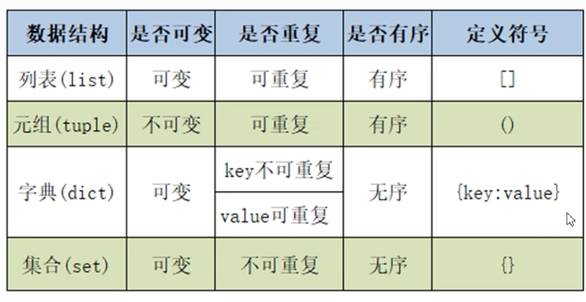

## 字符串

基本数据类型，不可变的字符序列。可以看成字符列表。

- 驻留机制

在进行字符串拼接时候，建议时候str的join()方法，而非+号

- 查询操作
  - str.index(substr)：查找子串第一次出现的位置，不存在抛ValueError
  - str.rindex(substr)：查找子串最后一次出现的位置，不存在抛ValueError
  - str.find(substr)：查找子串第一次出现的位置，不存在返回-1
  - str.rfind(substr)：查找子串最后一次出现的位置，不存在返回-1
- 大小写转换
  - str.upper()：所有字符都大写
  - str.lower()：所有字符都小写
  - str.swapcase()：大变小，小变大
  - str.capitalize()：第一个大写，其余小写
  - str.title()：每个单词的第一个大写，其余小写
- 内容对齐操作
  - 略

- 劈分操作
  - str.split(sep='xxxx'，maxsplit=xx)：左侧开发劈分。结果是个列表，sep默认是空格，maxplit指定最大劈分次数
  - str.rsplit((sep='xxxx'，maxsplit=xx)：右侧开始劈分，其他一样

- 判断操作
  - str.isidentifier()：是否是合法标识符
  - str.isspace()：是否空白字符组成
  - str.isalpha()：是否由字母组成
  - str.isdecimal()：是否由十进制数字组成
  - str.isnumeric：是否有数字组成
  - str.isalum：是否由数字和字母组成
- 替换与合并
  - str.replace(orig, new,（如果由多处，可以指定更换的）次数)
  - ‘xxxx’.join(str或者list)：列表或元组中的字符串合并成一个字符串。把字符串和列表都看成序列
- 比较操作：使用比较运算符
  - 原则：从第一个字符开始比较，不相等时，两个字符的比较结果就是两个字符串的比较结果。
  - 比较ordinal value原始值。使用内置函数ord(char)获得每个字符的原始值。
  - chr(数字)：获得对应原始值的字符
- 切片操作
  - 产生新的对象
  - str[start:stop:step]：start不指定时候默认为0，stop不知道时候默认为最后位置，指定时不包含stop（左闭右开区间）

- 💡格式化字符串
  - **%做占位符：‘xxxxx%s,xxxx%d’ % (str, int)**
  - **{}做占位符：'xxxxx{0}xxxx{1}xxxx{0}'.format(0内容,1内容,2,3....)**
  - 在字符串前加f：f'xxxx{直接变量名}xxxxxxxxxx{直接变量名}'
  - 指定宽度，精度：略

- 编码与解码
  - 编码：str.encode(encoding='GBK或UTF-8')
  - 解码：编码后.decode(encoding='GBK或UTF-8')

## 函数

### 定义

```python
def functionname( parameters ):   
    "函数_文档字符串"   
    function_suite   
    return [expression]
```

### 💡参数传递

- 关键字实参传递
- 位置实参传递

- 个数可变的位置参数**def fun(*args,xx其他参数,xxx)**：不论传了多少个参数，返回结果都是元组。
- 个数可变的关键字形参**def fun(\**args,xx其他参数,xxx)**：返回结果是字典。

总结：

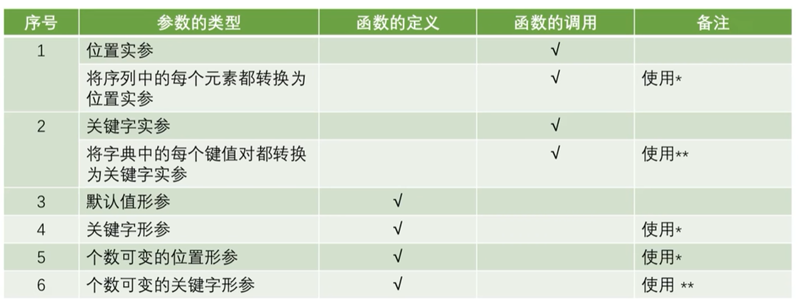

### 返回值

返回多个值时，结果为元组

### 变量的作用域

- 局部变量

函数内定义并使用。如果使用global声明，就变成了全局变量

- 全局变量

函数外定义的变量

### 递归函数

组成：递归调用与递归终止条件

## 异常处理

### 常见异常

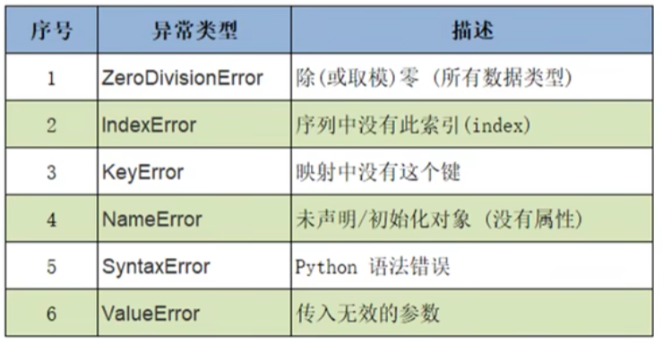

### try-（多个）except

```python
try:
<语句>        #运行别的代码
except <异常名字>：
<异常处理语句>        #如果在try部份引发了'name'异常
```


### try - except - else

```python
try:
<语句>        #运行别的代码
except <名字>：
<异常处理语句>         #如果在try部份引发了'name'异常
except <名字>，<数据>:
<异常处理语句>         #如果引发了'name'异常，获得附加的数据
else:
<语句>        #如果没有异常发生
```


### try - except - else - finally

```python
try:
<语句>        #运行别的代码
except <名字>：
<异常处理语句>         #如果在try部份引发了'name'异常
except <名字>，<数据>:
<异常处理语句>         #如果引发了'name'异常，获得附加的数据
else:
<语句>        #如果没有异常发生
finally：
<语句>        #无论有没有异常都要执行的代码
```

### traceback模块

使用traceback模块打印异常信息

```python 
import traceback
traceback.print_exc()
```


## 类

```python
class Student:
    pass
```

### 组成

- 属性
- 实例方法
  - 需要传入一个self
- 静态方法
  - @staticmethod注释，不能写self，什么都没有
- 类方法
  - @classmethod注释，要传一个cls

-  初始化方法，_\_init__(self,name,age，xxxxx)

```python
def __init__(self,name,age，xxxxx):
    self.name = name
    self.age = age
    xxx
```


### 实例化

```python
实例名 = 类名(初始化方法中除了self之外的参数)
```

实例化创建出来的是实例对象

### 调用实例方法

stu1.方法名()

或

Student.方法名(stu1)——方法定义处的self

### 调用类方法

类名Student.方法名()——不需要传入cls

### 调用静态方法

类名Student.方法名()——什么都不需要传递

### 动态绑定属性和方法

- 绑定属性
  - stu1.新的属性 = xxxx
- 绑定方法
  - stu1.定义在类之外的函数名 = 定义在类之外的函数名
  - 调用：stu1.函数名()

### 浅拷贝与深拷贝

**类对象的赋值**：只是形成了两个变量

- 浅拷贝
  - import copy，然后新实例 = copy.copy(旧实例)。
  - 源对象和拷贝对象会引用同一个子对象

- 深拷贝
  - 使用copy模块的deepcopy函数。
  - 源对象和拷贝对象的子对象也**不同**


## 面向对象

### 封装

私有属性，即不希望在类的对象外部被使用，前面加两个下划线

```python
def __init__(self,name,age):
    self.name = name
    self.__age = age
    
xxxxx后续代码就不能直接使用__age属性了。只能类的内部使用
```


### 继承

```python 
class 派生类名(父类1,父类2，xxx)
    def __init__(self,name,age,xxx):
        super().__init__(name,age,xxx)
        self.xx = xx
```

支持多继承，默认继承object类。

定义子类，必须在其构造函数中调用父类的构造函数

#### 方法重写

```python
class Parent:        # 定义父类
   def myMethod(self):
      print '调用父类方法'
 
class Child(Parent): # 定义子类
    def myMethod(self):
        super().myMethod() #执行父类的功能
        print '调用子类方法' #然后再执行特定的功能
```


#### object类

根父类。内置函数dir()查看指定对象的所有属性。

object类的__str\_\_()方法返回“对象的描述”


### 多态


### 特殊属性和方法

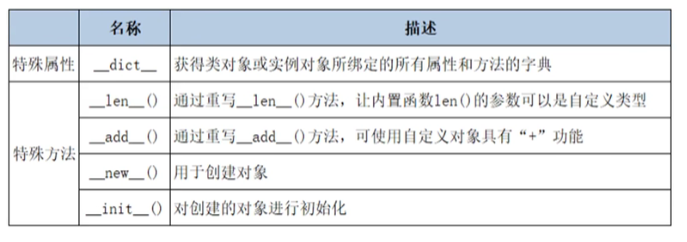

其他特殊属性：

- \__class__：输出对象所属的类
- \__bases__：输出父类类型（结果为一个元组）
- \__base__：输出定义类时候的第一个父类
- \__mro__：类的层次结构


## 模块

每个py文件就是一个模块，可以包含函数，语句，和类。

- 导入模块

```python
# 导入模块
import support [as 别名]
# 现在可以调用模块里包含的函数了

#从模块中导入一个指定的部分
from modname import name1[, name2[, ... nameN]]
```

- 常见模块：

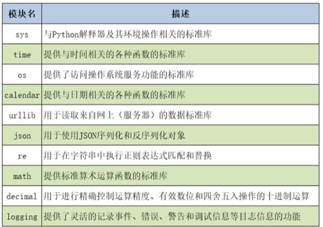

- 导入自定义模块
  - pycharm中把文件改为source
  - 用from xxx import xxx导入模块的某一部分

- 以主程序形式运行

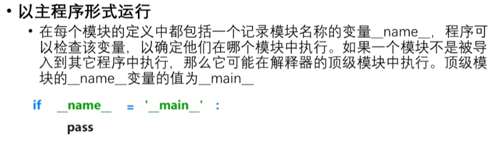

**只有在点击执行xxxx.py文件时候，才会执行 main里面的代码**


### 第三方模块的安装与使用

安装：

```
pip install 模块名
然后
import 模块名
```


## 包

- 定义：
  - 包含\__init__.py文件的目录称为包。
- 导入

```python
import 包名.模块名 as 别名
```


# 正则表达式

正则表达式的匹配方式：

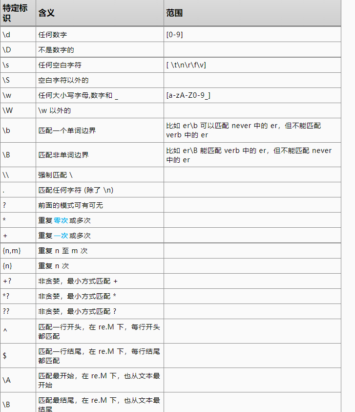

```python
import re
```

正则表达式的用法：

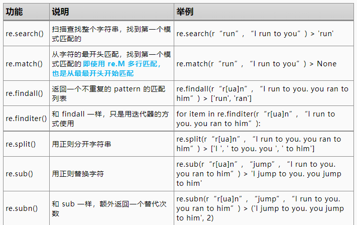


# 单元测试

```python
import unittest
```


测试类要去继承 `unittest.TestCase`

```python
def my_func(a):
    if a == 1:
        return 2
    elif a== -1:
        return 3
    else:
        return 1
    

class TestFunc(unittest.TestCase):
    def test_func(self):
        self.assertEqual(2, my_func(1))
        self.assertEqual(3, my_func(-1))
        for i in range(-100, 100):
            if i == 1 or i == -1:
                continue
            self.assertEqual(1, my_func(i))

if __name__ == "__main__":
    unittest.main()
```

## assert

具体能测的内容有：

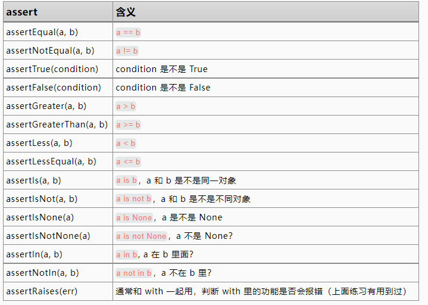

# python生成器

在 Python 中，使用了 **yield** 的函数被称为生成器（generator）。

```python
def need_return():
    for item in range(5):
        if item % 2 == 0:
            print("我要扔出去一个 item=%d 了" % item)
            yield item  # 这里就会返回给下面的 for 循环
            print("我又回到里面了")

for i in need_return():
    print("我在外面接到了一个 item=%d\n" % i)
```

返回：

```
我要扔出去一个 item=0 了
我在外面接到了一个 item=0

我又回到里面了
我要扔出去一个 item=2 了
我在外面接到了一个 item=2

我又回到里面了
我要扔出去一个 item=4 了
我在外面接到了一个 item=4

我又回到里面了
```

## 定义生成器类

```python
class NeedReturn:
    def __init__(self, init_value=0):
        self.tmp = init_value
        self.item = 0

    def __iter__(self):
        return self

    def __next__(self):
        while True:
            if self.item == self.tmp:
                self.tmp *= 2
                return self.item
            self.item += 1
            if self.item == 300:
                raise StopIteration

for i in NeedReturn(10):
    print(i)
```

​	输出：

```
10
20
40
80
160
```


# python装饰器

有一批 Function 都要做些前置或者后置的工作，我们可以统一给他们装修，用一个装饰器统一处理。将装饰器想象成套在函数外面的套娃。

如果函数前有前置需要处理的操作，没有装饰器的做法：

```python
def decorator(fn, name):  #注意，函数名可以当成参数传进来
    print(name+"say I'm in")    # 这是我的前处理
    return fn(name)

def outer_fn(name):
    print(name+"say I'm out")

decorator(outer_fn, "mofanpy")
```

使用装饰器后：

```python
def decorator(fn):
    def wrapper(name):
        print(name+"say I'm in_pre")    # 这是我的前处理
        res = fn(name)
        print(name+"say I'm in_post")   # 这是我的后处理
        return res
    return wrapper

@decorator     #@后面跟装饰器的函数名
def outer_fn(name):
    print(name+"say I'm out")

outer_fn("mofanpy")
```

结果:

```
mofanpysay I'm in_pre
mofanpysay I'm out
mofanpysay I'm in_post
```


# 下划线“_”的用法

1. 用于在解释器中存储最后一个表达式的值。
2. 忽略特定的值。
3. 给变量名或函数名赋予特殊的意义和功能。
4. 用作“国际化(i18n)”或“本地化(l10n)”。
5. 将数字的值分开。
