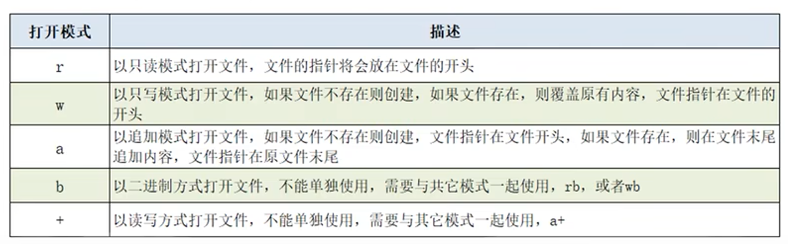
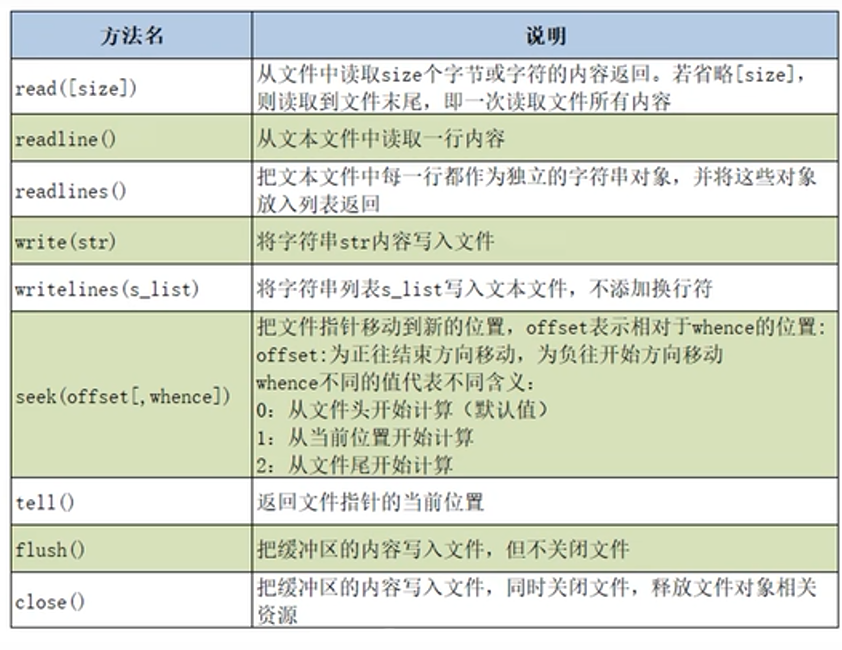

# 文件的读写操作

内置函数open()创建文件对象

```python 
file = open(filename [,mode,encoding])
```

使用readlines()读取文件内容，返回结果是列表

```python
file.readlines()
```

文件打开模式：



文件对象的常用方法：



# with语句（上下文管理器）

跳出with语句块之后，能确保文件关闭，（类似try-except-finally的效果）。

```python
with open('a.txt','r') as file:
    xxxxx
    
with 上下文表达式 
```

上下文表达式的结果是一个上下文管理器（实现了_\_\__enter(）\__和__\__exit(）\__方法的类对象）


# os模块的常用函数

os模块与os.path模块用于对文件或目录的操作。

```python
import os
os.system('notepan.exe')#打开系统自带的记事本
```

常用方法：

- os.getcwd():  返回当前工作目录
- os.listdir(path):  返回指定路径下的文件和目录xx
- os.mkdir(path [, mode]):  创建目录
- os.rmdir(path):  删除目录
- os.chdir(path): 将path设置为当前工作目录

os.path模块操作目录的常用方法：

- abspath(path)
- exits(path)
- join(path, name)
- splitext()
- basename(path)
- dirname(path)
- isdir(path)