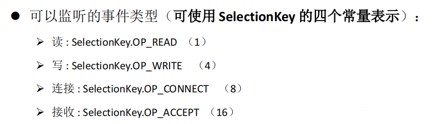
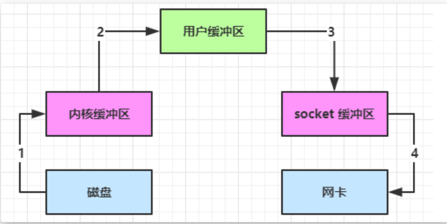

# File 类的使用

java.io.File类是**文件**和**文件目录路**径的抽象表示形式，与平台无关。

## 常用构造器


- `public File(String pathname)` 


- `public File(String parent,String child)`

以parent为父路径，child为子路径创建File对象。

- `public File(File parent,String child)`

根据一个**父File对象**和子文件路径创建File对象。

## 常用方法

### 获取功能


适用于文件目录（**要求文件目录存在**）的方法：


### 重命名功能

`public boolean renameTo(File dest)`

把文件重命名为指定的**文件路径**，注意，这里需要调用此方法的文件是真实存在的，且dest文件不能存在。

### 判断功能


### 创建功能

- `public boolean createNewFile()` ：创建文件。若文件存在，则不创建，返回false
- `public boolean mkdir()` ：创建文件目录。如果此文件目录存在，就不创建了。如果此文件目录的上层目录不存在，也不创建。 
- `public boolean mkdirs()` ：创建文件目录。**如果上层文件目录不存在，一并创建**。

**注意事项：如果你创建文件或者文件目录没有写盘符路径，那么，默认在项目路径下。** 

### 删除功能


### 总结

File类中的方法并未涉及到文件内容的操作。需要读取或写入文件内容，必须使用IO流来完成。

后续File类的对象常会作为参数传递到流的构造器中，指明读取或写入的终点。

# IO流

## 分类


其中：


体系：


（标蓝需要关注）

## 节点流（文件流）

FileReader / FileWriter

FileInputStream / FileOutputStream


## 处理流

### 缓冲流

处理流的一种，**作用是提高数据读写的速度**。同理有四个：

- **BufferedInputStream** **和** **BufferedOutputStream**
- **BufferedReader** **和** **BufferedWriter**

```java
@Test
    public void BufferedStreamTest() throws IOException {
        BufferedInputStream bis = null;
        BufferedOutputStream bos = null;
        try {
            //1. 造文件
            File srcFile = new File("它.jpg");
            File destFile = new File("ta.jpg");
            //2. 造liu
            //2.1 造节点流
            FileInputStream fis = new FileInputStream(srcFile);
            FileOutputStream fos = new FileOutputStream(destFile);
            //2.2 造处理流（如缓冲流）
            bis = new BufferedInputStream(fis);
            bos = new BufferedOutputStream(fos);

            //3.读写操作
            byte[] buffer = new byte[10];
            int len;
            while((len = bis.read(buffer)) != -1){
                bos.write(buffer,0,len);
            }
        } catch (IOException e) {
            e.printStackTrace();
        } finally {
            //4. 资源关闭：先外层，后内层。
            //实际中只需要关外层的流就行，内层会自动关闭
            if(bos != null){
                try {
                    bos.close();
                } catch (IOException e) {
                    e.printStackTrace();
                }
            }
            if(bis != null){
                try {
                    bis.close();
                } catch (IOException e) {
                    e.printStackTrace();
                }
            }
        }

    }
```

### 转换流

- 实现将字节的输入流按指定字符集转换为字符的输入流。
- 需要和InputStream“套接”。


### 标准输入输出流、打印流、数据流(了解)

标准输入输出流


打印流


数据流


### 对象流

> **对象序列化机制**允许把内存中的Java对象转换成平台无关的二进制流，从
>
> 而允许把这种二进制流持久地保存在磁盘上，或通过网络将这种二进制流传
>
> 输到另一个网络节点。//当其它程序获取了这种二进制流，就可以恢复成原
>
> 来的Java对象


注意：不能序列化`static`和`transient`修饰的成员变量

- 自定义对象的可序列化条件：
  - 1）实现Serializable借口，
  - 2）提供全局常量serialVersionUID，
  - 3）所有属性都是可序列化（基本数据类型默认可序列化）

## 随机存取文件流

直接继承于Object类，既可以读也可以写。


注意：如果文件存在则会**==默认==**从头覆盖数据。


- 读写操作举例：

```java
public void test()  {
    RandomAccessFile raf1 = null;
    RandomAccessFile raf2 = null;
    try {
        raf1 = new RandomAccessFile("ta.jpg", "r");
        raf2 = new RandomAccessFile("ta2.jpg", "rw");

        byte[] buffer = new byte[1024];
        int len;
        while((len = raf1.read(buffer)) != -1){
            raf2.write(buffer,0,len);

        }
    } catch (IOException e) {
        e.printStackTrace();
    } finally {
        if(raf1 != null){
            try {
                raf1.close();
            } catch (IOException e) {
                e.printStackTrace();
            }
        }
        if(raf2 != null){
            try {
                raf2.close();
            } catch (IOException e) {
                e.printStackTrace();
            }
        }
    }
}
```

- 数据的插入操作：使用StringBuilder先将后面的数据存一下


```java
public void test1() throws IOException {
        RandomAccessFile raf = new RandomAccessFile("hello.txt", "rw");
        raf.seek(3);//指针调到要插入数据的位置
        //保存指针后的所有数据到StringBuilder
        StringBuilder builder = new StringBuilder();
        byte[] buffer = new byte[10];
        int len;
        while((len = raf.read(buffer)) != -1){
            builder.append(new String(buffer,0,len));
        }
        //调回指针，开始插入
        raf.seek(3);
        raf.write("插入的信息".getBytes());
        //写回StringBuilder的数据
        raf.write(builder.toString().getBytes());

        raf.close();
    }
```

- RandomAccessFile类的作用：


## Path、Paths、Files

Path相当于升级版的File类

Paths


# NIO

## 三大组件


## ByteBuffer

### ByteBuffer基本使用

1. 向buffer写入数据（例如，`channel.read(buffer)`）
2. 调用flip()，切换至读模式
3. 从buffer读取数据（例如，`buffer.get()`）
4. 调用`clear()`或`compact()`切换至写模式
5. 重复1-4步骤

```java
public void test()  {
        RandomAccessFile raf1 = null;
        RandomAccessFile raf2 = null;
        try {
            raf1 = new RandomAccessFile("ta.jpg", "r");
            raf2 = new RandomAccessFile("ta2.jpg", "rw");

            byte[] buffer = new byte[1024];
            int len;
            while((len = raf1.read(buffer)) != -1){
                raf2.write(buffer,0,len);

            }
        } catch (IOException e) {
            e.printStackTrace();
        } finally {
            if(raf1 != null){
                try {
                    raf1.close();
                } catch (IOException e) {
                    e.printStackTrace();
                }
            }
            if(raf2 != null){
                try {
                    raf2.close();
                } catch (IOException e) {
                    e.printStackTrace();
                }
            }
        }
    }
```


### byteBuffer常用方法


#### 分配空间

- allocate()------->HeapByteBuffer，java堆内存；读写效率较低；收到垃圾回收的影响

- allocateDirect()------->DirectByteBuffer，直接内存；读写效率高（少一次拷贝）；使用系统内存，不会受到垃圾回收的影响；分配的效率低


#### 向buffer写入数据

1. 调用`channel.read(buffer)`：从channel中读取数据, 向 buffer 写入
2. 调用buffer.put()：向buffer写入

#### 从buffer读取数据

1. 调用channel.write(buffer)方法
2. 调用buffer.get()方法

注意：**get()会让position指针向后走**，如果想要重复读取数据：

- 调用`rewind()`将position重置为0
- 或者调用`get(int index)`读取特定索引的内容，**不会移动指针**

```java
/*ByteBuffer 常用方法：从buffer读取数据*/
@Test
public void byteBufferReadTest(){
    ByteBuffer buffer = ByteBuffer.allocate(10);
    buffer.put(new byte[]{'a','b','c','d'});
    buffer.flip();
    // 1. rewind() 从头开始读取
    /* byte[] bytes = new byte[4];
        buffer.get(bytes);//将数据读取到bytes数组中
        System.out.println((char)bytes[0]);//a

        buffer.rewind();//调用完rewind()后，position归零，可以从头开始读
        System.out.println((char) buffer.get());//a*/

    /*//2. mark & reset
        // mark 做一个标记，记录position 位置
        // reset 将position 位置 重置到 mark 的位置
        System.out.println((char)buffer.get());//a
        System.out.println((char)buffer.get());//b，第二次position位置改变了
        buffer.mark();//将标记加到索引为 2 的位置
        System.out.println((char)buffer.get());//c
        System.out.println((char)buffer.get());//d
        buffer.reset();//将position 重置到 mark位置
        //reset之后，还可以第二次读到c/d
        System.out.println((char)buffer.get());//c
        System.out.println((char)buffer.get());//d*/

    //3. get(int index)
    System.out.println((char) buffer.get(3));//直接拿到d
    System.out.println(buffer);//java.nio.HeapByteBuffer[pos=0 lim=4 cap=10],位置没有改变
}
```

#### 字符串与ByteBuffer之间的相互转换

```java
@Test
public void byteBufferStringTest(){
    /*//1. 字符串转为 ByteBuffer : 使用字符串的getBytes得到字节，然后将字节put到buffer中
        ByteBuffer buffer = ByteBuffer.allocate(19);
        buffer.put("hello".getBytes());
        buffer.flip();
        System.out.println((char)buffer.get(1));//e*/

    /*//2. Charset
        ByteBuffer buffer1 = StandardCharsets.UTF_8.encode("hello");
        //使用Charset的encode()方法，buffer自动切换到读模式：
        System.out.println(buffer1.position());//0
        System.out.println(buffer1.limit());//5*/

    //3. wrap(): nio提供的工具方法，将一个字节数组包装成一个buffer
    ByteBuffer buffer = ByteBuffer.wrap("hello".getBytes());

    //4. 转为字符串：同理，ByteBuffer转化为字符串也有很多办法
    java.lang.String string = StandardCharsets.UTF_8.decode(buffer).toString();
    System.out.println(string);//hello

}
```

### 分散读、集中写的思想


```java
public class TestScatteringRead {
    /*分散读取 即：一个文件中的不同内容要加载到不同buffer中 */
    public static void main(String[] args) {
        try (FileChannel channel = new RandomAccessFile("words.txt", "r").getChannel()) {
            ByteBuffer buffer1 = ByteBuffer.allocate(3);
            ByteBuffer buffer2 = ByteBuffer.allocate(3);
            ByteBuffer buffer3 = ByteBuffer.allocate(5);
            //channel.read()可以将数据分散写入多个buffer中
            long l = channel.read(new ByteBuffer[]{buffer1, buffer2, buffer3});
            System.out.println(l);//11

            buffer1.flip();
            buffer2.flip();
            buffer3.flip();

            System.out.println((char) buffer1.get(2));//e


        } catch (IOException e) {


        }
    }

    /*集中写入 即：把多个buffer中的内容写入到一个文件中*/
    @Test
    public void testGatheringWrite(){
        ByteBuffer buffer1 = StandardCharsets.UTF_8.encode("hello");//5个字节
        ByteBuffer buffer2 = StandardCharsets.UTF_8.encode("world");//5个字节
        ByteBuffer buffer3 = StandardCharsets.UTF_8.encode("你好");//6个字节

        try (FileChannel channel = new RandomAccessFile("words2.txt", "rw").getChannel()) {
            channel.write(new ByteBuffer[]{buffer1,buffer2,buffer3});
            //成功产生 words2.txt,内容为：helloworld你好

        } catch (IOException e) {
        }
    }
}
```

### 黏包半包分析

网络上的数据进行传输的时候，会有黏包和半包

例子：

多条数据要发送给服务器，数据之间使用\n 进行分隔，比如:

> Hello, world\n
>
> I'm zhangsan\n
>
> How are you?\n

变成了下面的两个byteBuffer

> Hello, world\nI'm zhangsan\nHo
>
> w are you?\n

编写程序，将错乱的数据恢复：

```java
public class TestByteBufferExam {
    public static void main(String[] args) {
        ByteBuffer source = ByteBuffer.allocate(32);
        source.put("Hello, world\nI'm zhangsan\nHo".getBytes());
        spilt(source);
        source.put("w are you?\n".getBytes());
        spilt(source);

    }
    private static void spilt(ByteBuffer source){
        source.flip();//改为读模式
        //遍历source ,寻找 \n
        for (int i = 0; i < source.limit(); i++) {

            if(source.get(i) == '\n'){//找到一条完整消息后:
                //1. 计算该消息的长度
                int length = i + 1 - source.position();
                ByteBuffer target = ByteBuffer.allocate(length);
                //2. 从 source 读，向 target 写
                for (int j = 0; j < length; j++) {
                    target.put(source.get());
                }
                //3. 每拆出一条完整消息，打印一下
                target.flip();
                System.out.print(StandardCharsets.UTF_8.decode(target).toString());
            }
        }
        //如果没有找到\n ,切换到写模式,出方法体
        source.compact();
    }
}
```

## 文件编程

### FileChannel

> 注意，FileChannel只能工作在阻塞模式下

#### 获取

通过getChannel()方法获取

- FileInputStream获取的channel只能读；
- FileOutputStream获取的channel只能写；
- RandomAccessFile可以通过构造器的mode（r/w/rw）参数设置读写模式；

#### 读取

`channel.read()`方法，返回值表示读到了多少字节，-1表示到达了文件的末尾

```java
int readBytes = channel.read(buffer);
```

#### 写入

channel的写入能力是有上限的，**特别是SocketChannel**，因此一般这么写入数据：

```java
ByteBuffer buffer = ...
buffer.put(...);  //存入数据 
buffer.flip();    //切换读模式

while(buffer.hasRemaining()){
    channel.write(buffer);  //从buffer中向channel中写入数据
}
```

在while中调用channel.wirte是因为write不能保证一次性将buffer中的内容全部写入channel

#### 关闭

channel也是一种资源，可以使用“`try with resource`”的语法关闭资源

```java
 try (FileChannel channel = new RandomAccessFile("words2.txt", "rw").getChannel()) {
     channel.write(new ByteBuffer[]{buffer1,buffer2,buffer3});
     //成功产生 words2.txt,内容为：helloworld你好
 } catch (IOException e) {
 }
```

使用前述各种FileInputStream等的close()也会间接调用channel的close()

#### 位置

获取当前位置

```java
long pos = channel.position();
```

设置当前位置

```java
long newPos= ..
channel.position(newPos);
```

#### 大小

使用size()获取文件的大小

### 两个filechannel间传输数据

transferTo()方法

```java
public class TestFileChannelTransferTo {
    public static void main(String[] args) {
        try (
                FileChannel from = new FileInputStream("data.txt").getChannel();
                FileChannel to  = new FileOutputStream("to.txt").getChannel();
        ) {
            //创建出新的to.txt文件，
            //效率高，底层使用零拷贝进行优化
            from.transferTo(0,from.size(),to);
        } catch (IOException e) {
            e.printStackTrace();
        }
    }
}
```

传输的最大大小为2g。改进的方法：多次传输。

```java
public class TestFileChannelTransferTo {
    public static void main(String[] args) {
        try (
                FileChannel from = new FileInputStream("data.txt").getChannel();
                FileChannel to  = new FileOutputStream("to.txt").getChannel();
        ) {
            //创建出新的to.txt文件，
            //效率高，底层使用零拷贝进行优化
            long size = from.size();
            //left变量表示还剩余多少字节
            for(long left = size; left>0; ) {
                left -= from.transferTo((size-left), left, to);
            }
        } catch (IOException e) {
            e.printStackTrace();
        }
    }
}
```

### Paths工具类和Path类

jdk7引入了Path和Paths类

- **Path表示文件路径**
- Paths是工具类，用来获取Path实例


### Files工具类

**ava.nio.file.Files类** 用于操作文件或目录的工具类

- 常用方法


- 比较有用的方法：walkFileTree、walk

```java
public class TestFilesWalkFileTree {
    /*需求：多级目录及其文件的拷贝*/
    private static void m4() throws IOException {
        String source ="C:\\Users\\jokerinmotion\\Desktop\\Sonstiges";
        String target ="D:\\here_is_the_destination";//目的文件夹刚开始是不存在的

        Files.walk(Paths.get(source)).forEach(path -> {
            try {
                String targetName = path.toString().replace(source,target);
                //是目录
                if (Files.isDirectory(path)) {
                    Files.createDirectory(Paths.get(targetName));
                }
                //是普通文件
                else if(Files.isRegularFile(path)){
                    Files.copy(path,Paths.get(targetName));
                }
            } catch (IOException e) {
                e.printStackTrace();
            }
        });
    }
    /*需求:删除多级目录 (很危险的做法:因为在回收站中不会留下)*/
    private static void m3() throws IOException {
//        Files.delete(Paths.get("C:\\Users\\jokerinmotion\\Desktop\\每周汇报 - 副本"));
        //以上会报错：DirectoryNotEmptyException
        Files.walkFileTree(Paths.get("C:\\Users\\jokerinmotion\\Desktop\\每周汇报 - 副本"),new SimpleFileVisitor<Path>(){
//            @Override
//            public FileVisitResult preVisitDirectory(Path dir, BasicFileAttributes attrs) throws IOException {
//                System.out.println("====> 进入目录："  + dir);
//                return super.preVisitDirectory(dir, attrs);
//            }

            @Override
            public FileVisitResult visitFile(Path file, BasicFileAttributes attrs) throws IOException {
//                System.out.println(file);
                Files.delete(file);//删除文件
                return super.visitFile(file, attrs);
            }

            @Override
            public FileVisitResult postVisitDirectory(Path dir, IOException exc) throws IOException {
//                System.out.println("<====退出目录："  + dir);
                Files.delete(dir);//删除文件夹
                return super.postVisitDirectory(dir, exc);
            }
        });
    }
    /*需求：查看以下文件夹下有多少jar包*/
    private static void m2() throws IOException {
        AtomicInteger jarCount = new AtomicInteger();//原子计数器
        Files.walkFileTree(Paths.get("E:\\Program Files\\Java\\jdk1.8.0_171"), new SimpleFileVisitor<Path>() {
            @Override
            public FileVisitResult visitFile(Path file, BasicFileAttributes attrs) throws IOException {
                if (file.toString().endsWith(".jar")) {
                    System.out.println(file);//打印出每个jar的文件目录
                    jarCount.incrementAndGet();
                }
                return super.visitFile(file, attrs);
            }
        });
        System.out.println("jar包的数量为：" + jarCount);
    }
    /*需求：查看文件夹和文件的数目*/
    private static void m1() throws IOException {
        AtomicInteger dirCount = new AtomicInteger();
        AtomicInteger fileCount = new AtomicInteger();//原子计数器
        /**
         * 这是一个典型的访问者模式应用
         */
        Files.walkFileTree(Paths.get("E:\\Program Files\\Java\\jdk1.8.0_171"), new SimpleFileVisitor<Path>() {
            @Override
            public FileVisitResult preVisitDirectory(Path dir, BasicFileAttributes attrs) throws IOException {
                System.out.println("======>" + dir);
                dirCount.incrementAndGet();
                return super.preVisitDirectory(dir, attrs);//这个不要删除
            }

            @Override
            public FileVisitResult visitFile(Path file, BasicFileAttributes attrs) throws IOException {
                System.out.println(file);
                fileCount.incrementAndGet();
                return super.visitFile(file, attrs);//这个不要删除
            }
        });
        System.out.println("dir count "+ dirCount);//文件夹的数目
        System.out.println("file count "+ fileCount);//文件的数目
    }
}
```

## NIO网络编程

### 阻塞与非阻塞


- 单线程阻塞模式

1. 创建了服务器
2. 绑定监听端口
3. 建立与客户端的连接：accept(),得到SocketChannel用来与客户端通信
4. 需要时，接收客户端发送的数据

```java
/*服务器端程序*/
public class Server {
    /*使用NIO 来理解单线程下的非阻塞模式 */
    public static void main(String[] args) throws IOException {

        //0. 一个放客户端发过来的数据的buffer
        ByteBuffer buffer = ByteBuffer.allocate(16);
        //1. 创建了服务器
        ServerSocketChannel ssc = ServerSocketChannel.open();
        ssc.configureBlocking(false); //ServerSocketChannel切换为非阻塞模式
        //2. 绑定监听端口
        ssc.bind(new InetSocketAddress(8080));

        //3. 连接集合
        List<SocketChannel> channels = new ArrayList<>();
        while(true) {//可能会有很多客户端
            //4. 建立与客户端的连接：accept(),得到SocketChannel用来与客户端通信
            SocketChannel sc = ssc.accept();//非阻塞，线程还会继续运行，没有连接就返回sc为null
            if(sc != null){
                channels.add(sc);
                sc.configureBlocking(false);//SocketChannel也切换为非阻塞
            }
            // 5. 可能需要接收客户端发送的数据
            for (SocketChannel channel : channels) {
                int read = channel.read(buffer);//非阻塞，线程还会继续执行，没有读到数据就返回 0
                if (read > 0){
                    buffer.flip();
                    java.lang.String string = StandardCharsets.UTF_8.decode(buffer).toString();
                    System.out.println(string);
                    buffer.clear();
                }
            }
        }
    }
}
```

```java
/*客户端程序：略*/
```

- 单线程非阻塞模式

非阻塞模式下，没有连接请求、没有接收数据的时候，服务器端的线程也一直在运行，也是一种资源的浪费！

### Selector选择器模式

> 选择器（Selector） 是 SelectableChannle 对象的多路复用器，Selector 可以同时监控多个SelectableChannel 的 IO 状况，也就是说，利用 Selector可使一个单独的线程管理多个 Channel。Selector 是非阻塞 IO 的核心。

**多路复用**：单线程配合Selector完成对多个Channel可读写事件的监控

#### Selector的使用步骤

##### 创建

 Selector selector = Selector.open()

##### 绑定/注册Channel事件

```java
ssc.configureBlocking(false);
ssc.register(selector, 绑定的事件);
```



##### 监听Channel事件

可以通过以下方法监听是否有事件发生，方法的返回值代表有多少channel发生了事件

法一：阻塞直到绑定事件发生

```java
int count = selector.select();
```

法二：阻塞直到绑定事件发生，或是超时(ms)

```java
int count = selector.select(long timeout);
```

法三：不会阻塞，也就是不管有没有事件，立刻返回，自己根据返回值检查是否有事件

```java
int count = selector.selectNow();
```

实例：

```java
public class Server {
    public static void main(String[] args) throws IOException {
        //1. 创建Selector, 管理多个channel
        Selector selector = Selector.open();

        ServerSocketChannel ssc = ServerSocketChannel.open();
        ssc.configureBlocking(false);

        //2. 建立selector 和 channel　之间的联系（注册）
        // 注册后返回的SelectionKey 就是事件发生后，通过它可以知道事件 和 哪个channel的事件
        SelectionKey sscKey = ssc.register(selector, 0, null);
        // 设置sscKey 只关注 accept 事件
        sscKey.interestOps(SelectionKey.OP_ACCEPT);

        ssc.bind(new InetSocketAddress(8080));
        List<SocketChannel> channels = new ArrayList<>();
        while(true) {
            //3. select()方法：没有事件发生时线程阻塞，有事件发生线程才会恢复运行
            // select 在事件未处理时，它不会阻塞
            // 因此要注意：事件要么处理，要么取消，否则线程还是不会阻塞：
            selector.select();

            //4. 处理事件
            Set<SelectionKey> selectionKeys = selector.selectedKeys();// selectedKeys()返回一个集合，内部包含了所有发生的事件
            Iterator<SelectionKey> iter = selectionKeys.iterator();
            while(iter.hasNext()){
                SelectionKey key = iter.next();//拿到事件
                iter.remove();// 处理key时，要从selectionKeys集合中删除，否则下次处理就会有问题
                //5. 区分事件类型
                if (key.isAcceptable()) { //如果是 accept事件
                    ServerSocketChannel channel = (ServerSocketChannel) key.channel(); //拿到触发事件的channel
                    SocketChannel sc = channel.accept();//事件的处理
                    sc.configureBlocking(false);
                    SelectionKey scKey = sc.register(selector, 0, null);
                    scKey.interestOps(SelectionKey.OP_READ);
                }else if(key.isReadable()){ //如果是 read 事件
                    SocketChannel channel = (SocketChannel)key.channel(); //SocketChannel才有读事件
                    ByteBuffer buffer = ByteBuffer.allocate(16);
                    channel.read(buffer); //channel 读到 buffer里面
                    buffer.flip(); //老样子，buffer切到读模式后，可以从buffer中拿到数据做接下来的操作：...
                    //..
                    buffer.clear();
                }
//                key.cancel();  //事件的取消
            }
        }
    }
}
```

##### select何时不阻塞

- 事件发生时
- 调用select.wakeup()
- 调用select.close()
- selector所在线程interrupt

#### 在read操作时处理客户端断开

```java
//..
else if(key.isReadable()){ //如果是 read 事件
    try {
        SocketChannel channel = (SocketChannel)key.channel(); //SocketChannel才有读事件
        ByteBuffer buffer = ByteBuffer.allocate(16);
        int read = channel.read(buffer);//channel 读到 buffer里面
        if(read ==-1){
            key.channel(); //客户端正常断开，read返回-1，也要取消key
        }
        buffer.flip(); //老样子，buffer切到读模式后，可以从buffer中拿到数据做接下来的操作：...
        //..
        buffer.clear();
    } catch (IOException e) {
        e.printStackTrace();
        key.channel();//客户端异常断开，需要将key取消（从selector中的keys集合中真正删除key）
    }
}
```

#### 消息边界问题

三种思路：1）固定消息长度；2）按分割符拆分，效率低；3）**TLV格式**：类型-长度-数据

具体代码实现，看Network.SelectorMode.Server

#### ByteBuffer大小分配

略，netty有更好解决办法

#### 写入内容过多问题

略。

### 更进一步

#### 利用多线程优化

boss 线程只用用管accept事件；worker线程用来关注读写事件。

- 问题：worker线程的初始化问题


- 解决：使用队列Queue进行线程间的通信，boss将任务放入，worker将任务执行

实现代码具体见：Network.MultiThread

## NIO vs BIO

### stream vs channel

- stream 不会自动缓冲数据，仅支持阻塞API；
- channel可以利用系统提供的发送缓冲区和接收缓冲区，同时支持阻塞和非阻塞API，还可以配合selector实现多路复用
- 相同点：二者均为全双工，读写可以同时进行（需要展开）

### IO模式

同步阻塞、同步非阻塞；**异步阻塞(不存在！！)**、异步非阻塞；多路复用

#### （同步）阻塞IO


#### （同步）非阻塞IO


#### （同步）多路复用


**Java中通过Selector实现多路复用**

- 当没有事件是，调用select方法会被阻塞住
- 一旦有一个或多个事件发生后，就会处理对应的事件，从而实现多路复用

**多路复用与阻塞IO的区别**

- 阻塞IO模式下，**若线程因accept事件被阻塞，发生read事件后，仍需等待accept事件执行完成后**，才能去处理read事件
- 多路复用模式下，一个事件发生后，若另一个事件处于阻塞状态，不会影响该事件的执行

#### 异步IO

- ==同步：线程自己去获取结果（一个线程）==
  - ==例如：线程调用一个方法后，需要等待方法返回结果==
- ==异步：线程之间不去获取结果，而是由其他线程送结果（至少两个线程）==
  - ==例如：线程A调用一个方法后，继续向下运行，运行结果由线程B返回==


- 线程1调用方法后立刻返回，**不会被阻塞也不需要立即获取结果**
- 当方法的运行结果出来以后，由线程2通过回调方法将结果返回给线程1

#### 信号驱动(不常用)

### 零拷贝

#### 问题描述

传统IO将一个文件通过Socket写出

```java
File f = new File("data.txt");
RandomAccessFile file = new RandomAccessFile(f, "r");

byte[] buf = new byte[(int)f.length()];
file.read(buf);

Socket socket = new ServerSocket(8080).accept();
socket.getOutputStream().write(buf);
```

内部工作流如下：

https://nyimac.gitee.io/2021/04/18/Netty%E5%AD%A6%E4%B9%A0%E4%B9%8BNIO%E5%9F%BA%E7%A1%80/#%E5%BC%82%E6%AD%A5IO



#### NIO优化

- 通过DirectByteBuffer：


- 进一步优化：**零拷贝**


**注意：零拷贝适合小文件传输**

### AIO(NIO 2.0)

AIO 用来解决数据复制阶段的阻塞问题

- 同步意味着，在进行读写操作时，线程需要等待结果，还是相当于闲置
- 异步意味着，在进行读写操作时，线程不必等待结果，而是将来由操作系统来通过回调方式由另外的线程来获得结果

> 异步模型需要底层操作系统（Kernel）提供支持
>
> - Windows 系统通过 IOCP **实现了真正的异步 IO**
> - Linux 系统异步 IO 在 2.6 版本引入，但其**底层实现还是用多路复用模拟了异步 IO，性能没有优势**

略。

