# 反射机制

## 概述

静态语言和动态语言

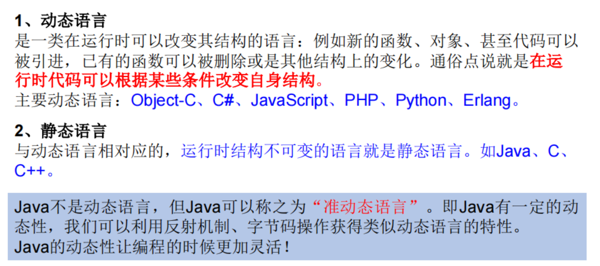


java反射机制

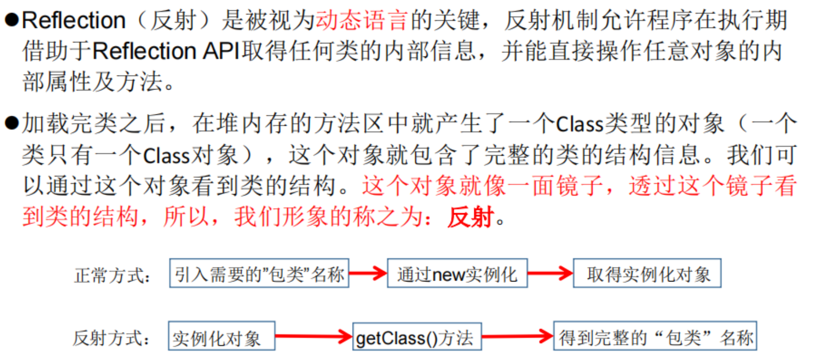


java反射机制提供的功能

- 在运行时判断任意一个对象所属的类
- 在运行时构造任意一个类的对象
- 在运行时判断任意一个类所具有的成员变量和方法
- 在运行时获取泛型信息
- 在运行时调用任意一个对象的成员变量和方法
- 在运行时处理注解
- 生成动态代理


## Class类

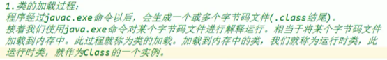

Class类的实例就对应着一个**运行时类（除了类，其他结构也行）**。

### 获取Class实例

```java
/*文件名：ReflectionTest.java*/
//方式一：调用 运行时类 的属性
Class clazz1 = Person.class;

//方式二：通过运行时类的对象，调用getClass()
Person p1 = new Person();
Class clazz2 = p1.getClass();

//方式三：调用Class的静态方法：forName(String ClassPath)
Class clazz3 = Class.forName("com.atguigu.java.Person");

System.out.println(clazz1 == clazz2);//true
System.out.println(clazz1 == clazz3);//true,运行时类Person是内存中同一个运行时类

//方式四：使用类的加载器:ClassLoader（了解）
ClassLoader classLoader = ReflectionTest.class.getClassLoader();
Class clazz4 = classLoader.loadClass("com.atguigu.java.Person");
```

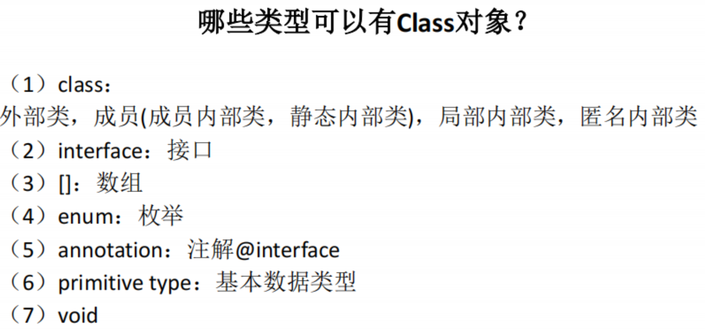


## 类的加载于ClassLoader的理解

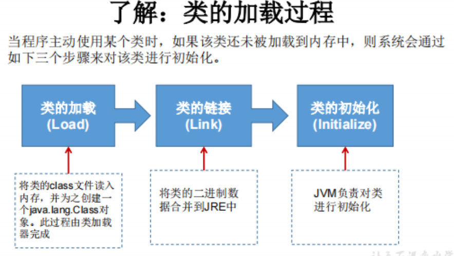

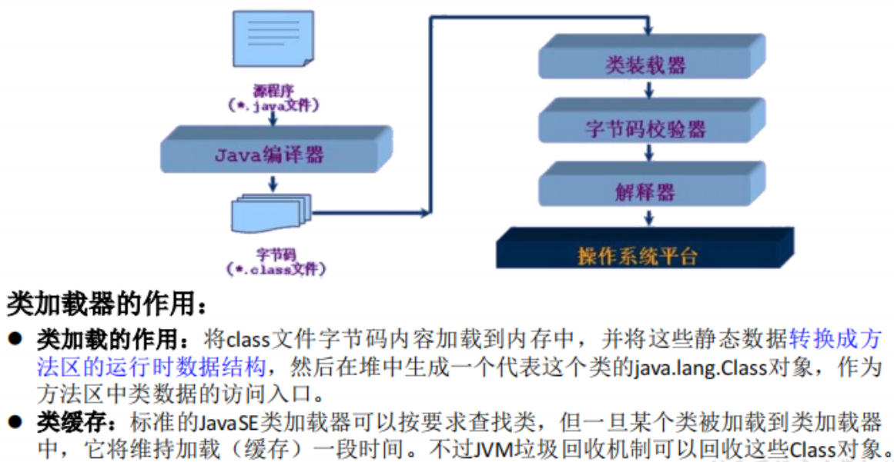

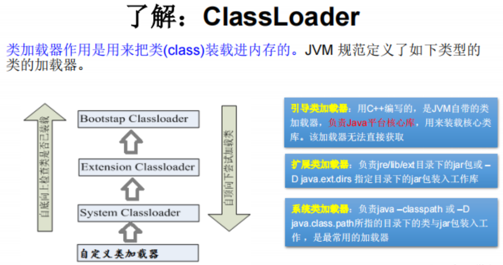


- 💡使用ClassLoader加载配置文件

```java
@Test
    public void test1() throws IOException {
        Properties pros = new Properties();
        //此时的文件默认在当前module下
        //读取配置文件的方式一
//        FileInputStream fis = new FileInputStream("jdbc.properties");
//        pros.load(fis);

        //读取配置文件的方式二：使用ClassLoader
        //此时配置文件默认识别为，当前module的src下
        ClassLoader classLoader = ClassLoaderTest.class.getClassLoader();
        InputStream is = classLoader.getResourceAsStream("jdbc1.properties");
        pros.load(is);
        
        System.out.println(pros.getProperty("user")+"  "+pros.getProperty("password"));
    }
```


## 💡创建运行时类的对象

运行时类的对象，相当于加载到内存中的Person类。

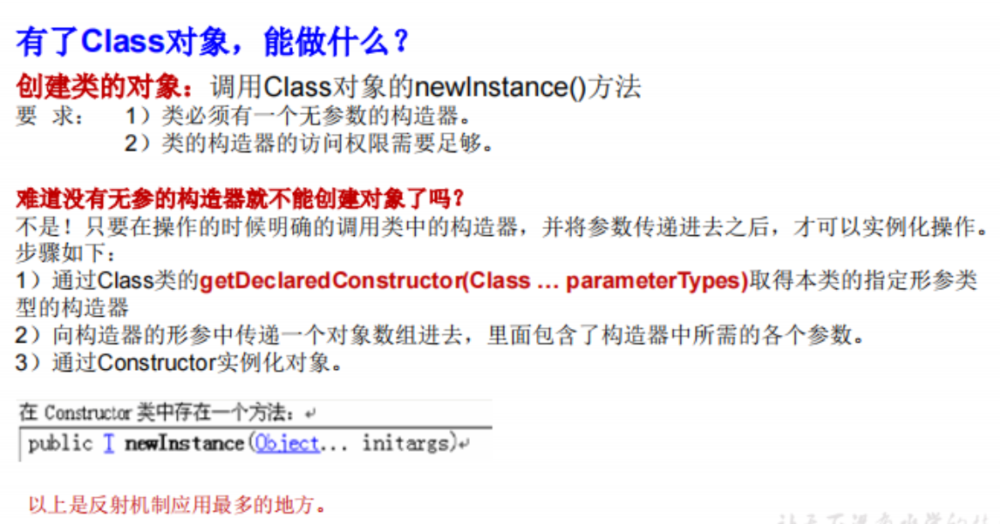

举例

```java
Class<Person> clazz = Person.class;
Person person = clazz.newInstance();//自动转化为Person类
System.out.println(person);
```

注意，javaBean中要求提供一个public的空参构造器。原因：

1. 便于通过反射，创建运行时类的对象
2. 便于子类继承此运行时类时，默认调用super()时，保证父类有此构造器


## 获取运行时类的完整结构

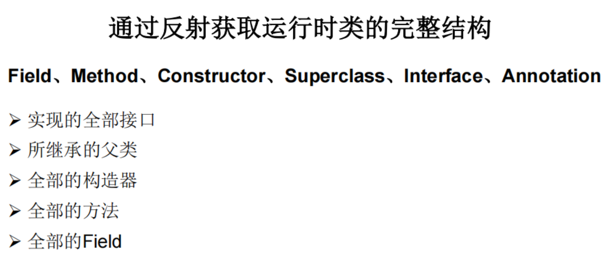


### 属性

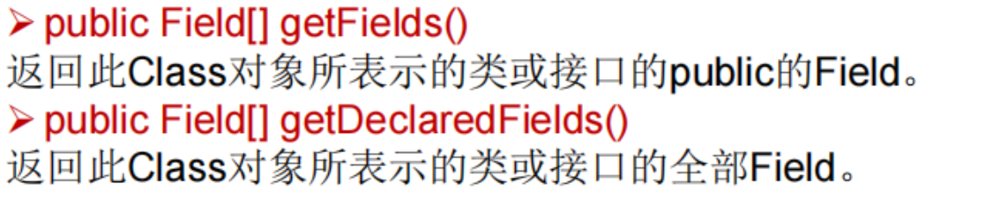

另外，也可以获取得到所有属性的权限修饰符、数据类型、变量名等结构（少用）：

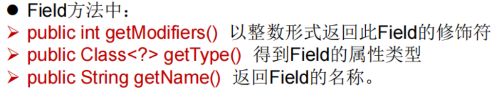

### 方法

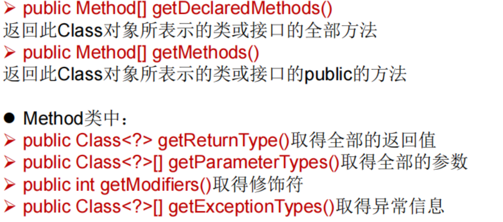

### 构造器等其他

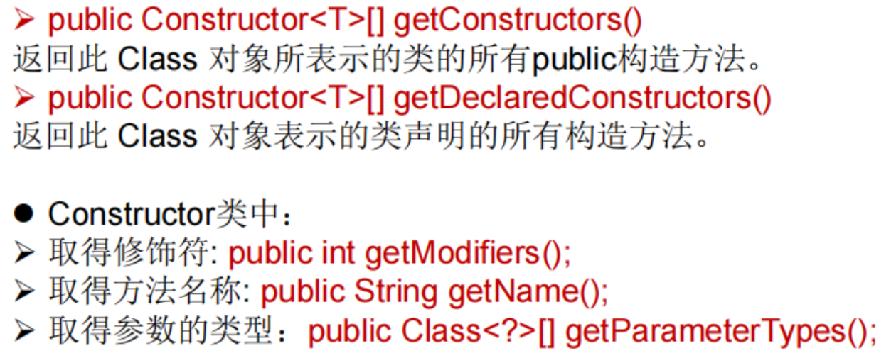

父类以及实现接口

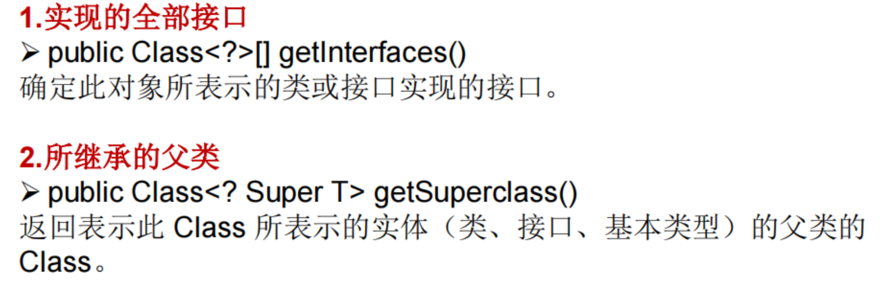

其他

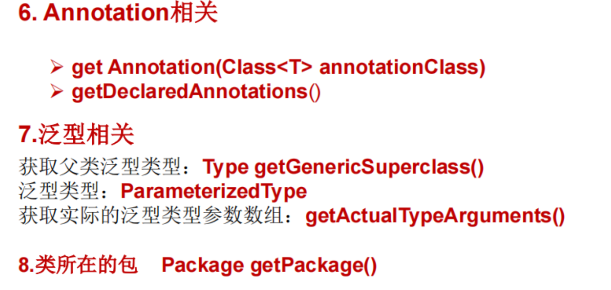


## 调用运行时类的指定结构

### 指定属性

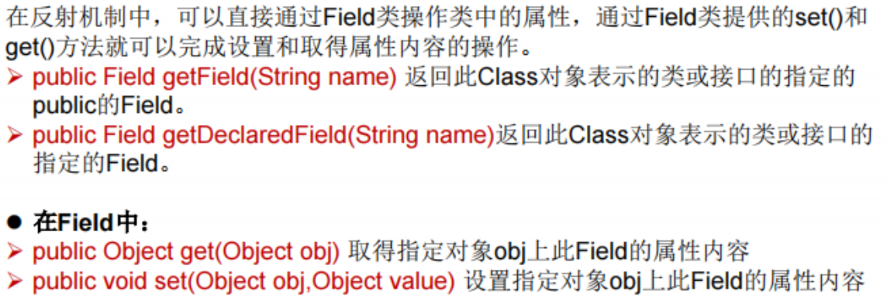

举例

```java
Class clazz = Person,class;
//创建运行时类的对象
Person p = (Person) clazz.newInstance();

//1. getDeclaredField(String fieldName) 获取运行时类中指定变量名的属性
Field name = clazz.getDeclaredField ("name");
//2. 保证属性是可访问的
name.setAccessible(true);
//3. 获取、设置指定对象的此属性值
name.set(p,"Tom");
```


### 指定方法

```
Class clazz = Person,class;
//创建运行时类的对象
Person p = (Person) clazz.newInstance();

//1. getDeclaredMethod() 获取运行时类中指定方法
//参数1为方法名，参数2为形参列表
Field name = clazz.getDeclaredMethod("show",String.class);
//2. 保证方法是可访问的
show.setAccessible(true);
//3. 调用方法的invoke()
show.invoke(p,"CHN");
```

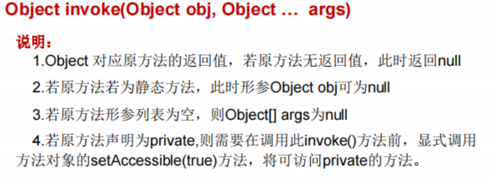

对于静态属性和方法，可以：`show.invoke(Person.class)`或者`show.invoke(null)`（因为直接Class就是表示运行时类）


### 指定构造器

略


## 反射的应用-动态代理

### 代理设计模式

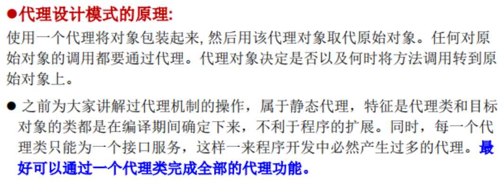

#### 静态代理

```java
/**
 * 静态代理举例
 */
interface ClothFactory{
    void produceCloth();
}
//代理类
class ProxyClothFactory implements ClothFactory{

    private ClothFactory factory;//用被代理对象进行实例化

    public ProxyClothFactory(ClothFactory factory){
        this.factory = factory;
    }

    @Override
    public void produceCloth() {
        System.out.println("准备工作");

        factory.produceCloth();

        System.out.println("后续工作");
    }
}
//被代理类
class NikeClothfactory implements ClothFactory{
    @Override
    public void produceCloth() {
        System.out.println("nike工厂的生产工作");
    }
}
public class StaticProxyTest {
    public static void main(String[] args) {
        //创建代理类和被代理类的对象
        ClothFactory nike = new NikeClothfactory();
        ClothFactory proxyClothFactory = new ProxyClothFactory(nike);

        proxyClothFactory.produceCloth();
    }
}
```

运行结果：

> 准备工作
> 		nike工厂的生产工作
> 		后续工作


#### 动态代理

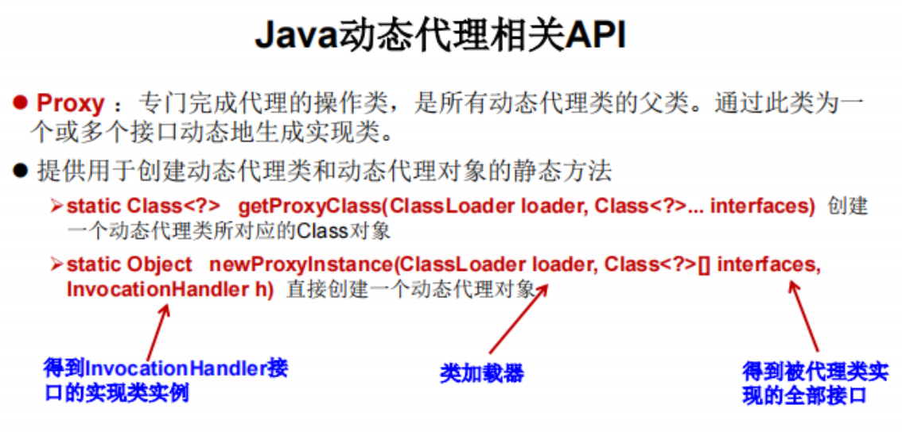

```java
/**
 * 动态代理举例
 */
interface Human{
    String getBelief();
    void eat(String food);
}
//被代理类
class Superman implements Human{
    @Override
    public String getBelief() {
        return "Superman believes in justice";
    }

    @Override
    public void eat(String food) {
        System.out.println("superman likes to eat" + food);
    }
}
class ProxyFactory{

    //调用方法，返回一个处理类的对象：
    public static Object getProxyInstance(Object obj){ //obj为被代理类的对象
        MyInvocationHandler handler = new MyInvocationHandler();
        handler.bind(obj);
        return Proxy.newProxyInstance(obj.getClass().getClassLoader(), obj.getClass().getInterfaces(), handler);
    }
}
class MyInvocationHandler implements InvocationHandler{
    private Object obj;//需要使用代理类的对象辅助，Obj指的是被代理类的对象
    public void bind(Object obj){
        this.obj = obj;
    }
    //当通过代理类的对象调用方法a时，就会自动地调用如下的方法：invoke()
    @Override
    public Object invoke(Object proxy, Method method, Object[] args) throws Throwable {
        Object returnVal = method.invoke(obj, args);
        return returnVal;
    }
}
public class ProxyTest {
    public static void main(String[] args) {
        Superman superman = new Superman();
        Human proxyInstance = (Human) ProxyFactory.getProxyInstance(superman);
        System.out.println(proxyInstance.getBelief());
        proxyInstance.eat("bread and milk");
    }
}
```

运行结果

> Superman believes in justice
> 		superman likes to eatbread and milk


### 动态代理与AOP

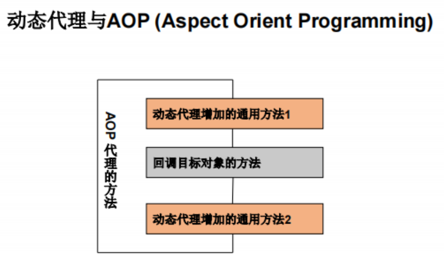

