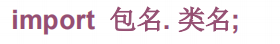
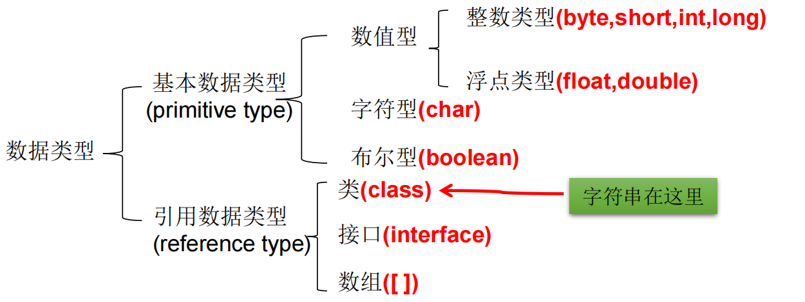
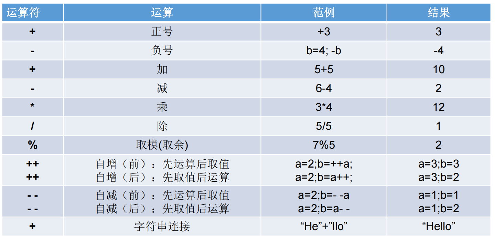
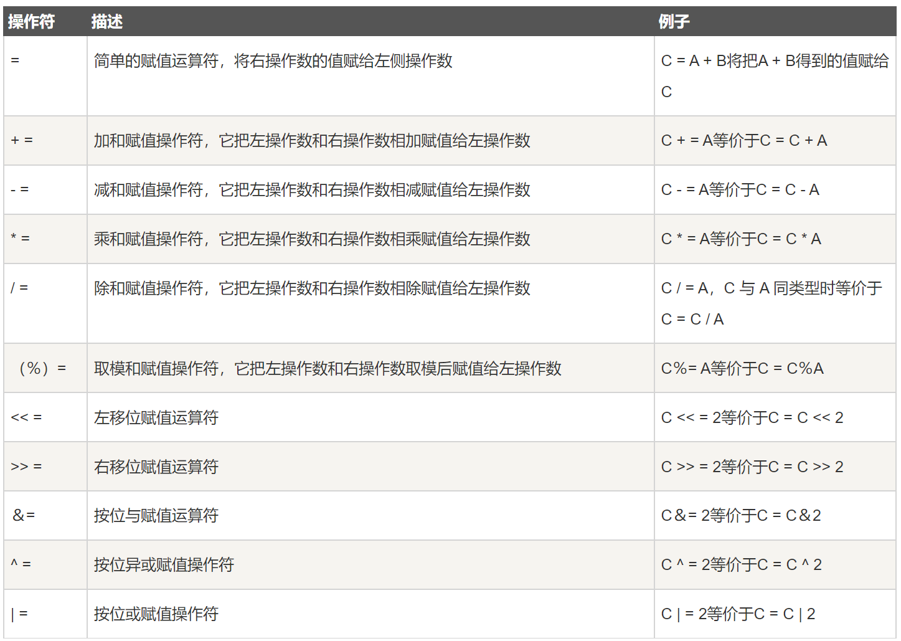
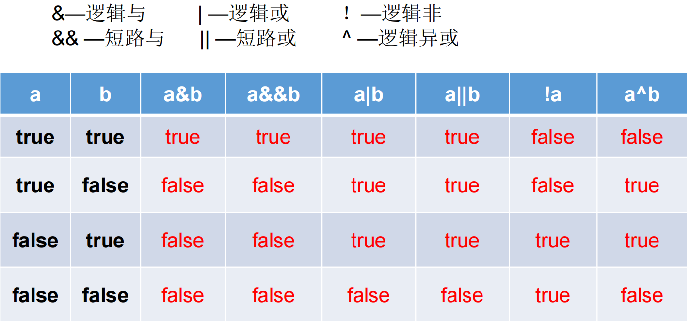
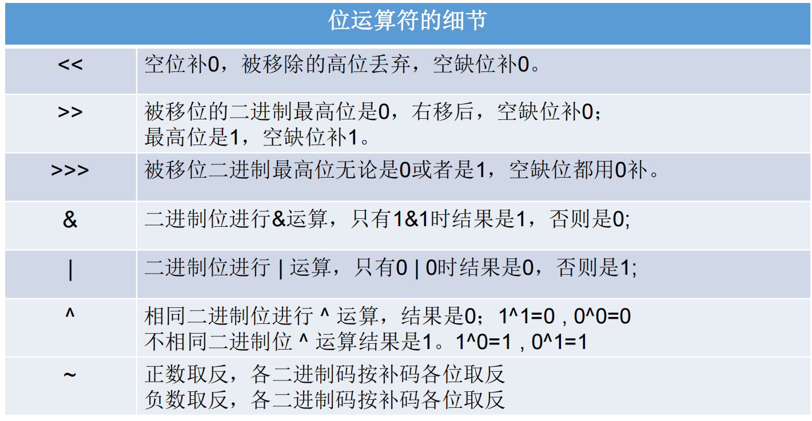
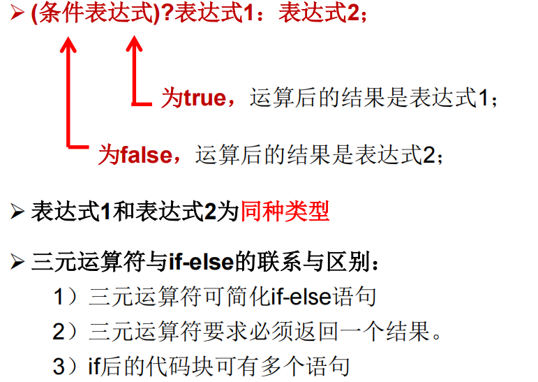
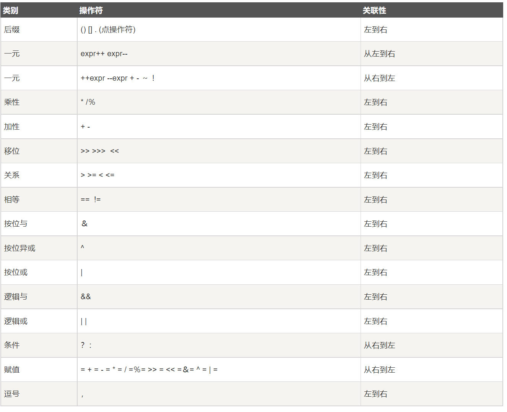
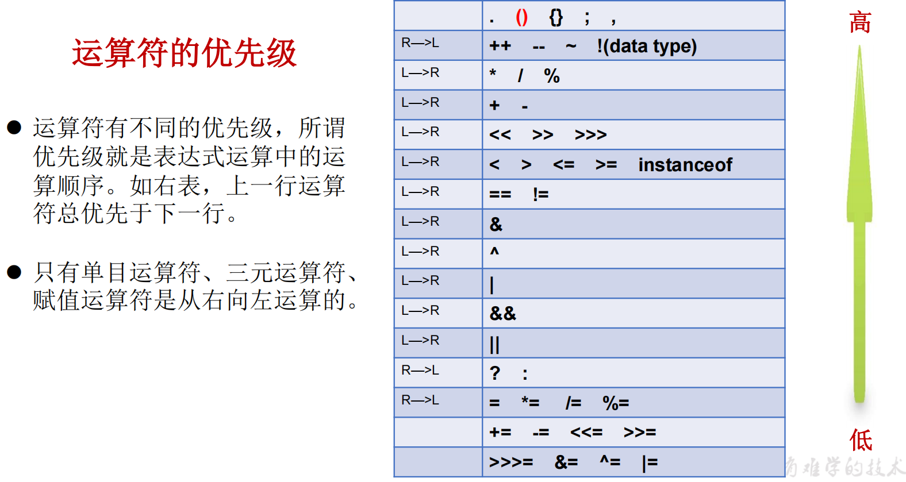

#  JAVA 基础语法

Java SE标准版

Java EE企业版

记事本+命令行编写java:


## 注释

### 单行注释

````java
// XXXXXXXXX
````

### 多行注释

```java
/*
XXXXXX
XXXX
*/
```

### 文档注释

java特有，会被**javadoc**所解析

```java
/**
@author XXXXXX
@version V1.0
xxxxxxx
*/
```


## Java API文档

package——>class

在一个java源文件中可以声明多个class，但是**只能最多有一个类声明为public的。**

而且要求public的类的类名和源文件名相同。

程序的入口是main()方法，格式是固定的，如下：

```java
public static void main(String[] args){
    //args 是arguments：参数，也可以写成a
    //[]可以移动位置
    System.out.println("hello world");//ln表示输出完后会换行。
    System.out.print("hello world");//只输出，不换行
}
```

每一行执行语句都是分号结尾

## 关键字keyword


### this 


this的用法：

1. “this.”修饰属性或方法

这个用法可以在形参与成员名字重名的情况下进行区分。此时“this.”可以理解为”**当前对象的....**“或者”**当前正在创建的对象的......**“

例子：

```java
class Person {
    private int age = 10;
   
    //构造器：
    public Person(){
   		System.out.println("初始化年龄："+age);
	}
   	
    public int GetAge(int age){
        this.age = age; //这里形参和属性重名了！！！，使用了this关键字
        return this.age;
    }
}
 
public class test1 {
    public static void main(String[] args) {
        Person Harry = new Person();
        System.out.println("Harry's age is "+Harry.GetAge(12));
    }
}
```


2. "this(行参列表)"调用本类中的**其他**构造器

这个用法的情况是，如果在初始化中需要考虑的事情很多，则**构造器可能会有很多重复的代码**，为了减少冗余，使用"this(行参列表)" 来调用构造器。

使用时注意：


### package 

- 引入包的概念管理项目中的类，
- 使用package声明类或接口所属的包，声明在源文件的首行
- 包的名称属于标识符，遵循标识符的命名规则规范，
- 同一个包下不能命名同名的接口、类；不同的包下，则可以。

格式：


### import

import，为使用定义在不同包中的Java类，需用import语句来引入指定包层次下所需要的类或全部类(.*)。**import语句告诉编译器到哪里去寻找类。**

语法格式：

==注意：==


### super

- ”super.XXXX“调用属性和方法

当需要在子类中调用**1）父类的被重写方法或2）同名的属性**时，要使用 super 关键字。

super可以理解为”父类的“


- "super(参数)"调用构造器


### instanceof

a instanceof A：判断**对象a是否是类A的实例**。返回值为boolean类型


用法**：为了避免在向下转型时候出现ClassCastException异常，在转之前先进行instanceof的判断。**

### static

理解为：static修饰的变量或方法，就不再是具体的某个对象所有，而是整个类共享的。

例子：所有中国人都有”国籍=中国“的属性，所有就”国籍“这个属性就会被定义为static

static可以修饰：属性、方法、代码块、内部类

- 使用static修饰属性(成员变量)

则该变量属于所在的类，而非对象特有。称为**静态变量（类变量）**。

据此，属性还可以分为实例变量和静态变量

```java
P
```


## 保留字reserved word

## 标识符Identifier

凡是可以自己取名字的地方都叫标识符

1. 命名规则：不遵守则编译不通过

- 所有的标识符都应该以字母（A-Z 或者 a-z）,美元符（$）、或者下划线（_）开始
- 首字符之后可以是字母（A-Z 或者 a-z）,美元符（$）、下划线（_）或数字的任何字符组合
- 关键字不能用作标识符
- 标识符是大小写敏感的
- 合法标识符举例：age、$salary、_value、__1_value
- 非法标识符举例：123abc、-salary

2. 命名规范：（建议）

- - - - 类名规范：大驼峰式（首字母大写，后单词首字母大写）
      - 变量名规范：小驼峰式（首字母小写，后单词首字母大写）
      - 方法名规范：小驼峰式

## 变量

### 定义变量的格式

```java
//数据类型 变量名 =  变量值;
int a, b, c;             // 声明三个int型整数：a、 b、c
int d = 3, e = 4, f = 5; // 声明三个整数并赋予初值
byte z = 22;             // 声明并初始化 z
String s = "runoob";     // 声明并初始化字符串 s
double pi = 3.14159;     // 声明了双精度浮点型变量 pi
char x = 'x';            // 声明变量 x 的值是字符 'x'。
```

### 变量的分类

#### 按数据类型分类



注意，float 和 long的数值后面需要跟一个f/F和L/l。

​			char只能写一个字符**（声明变量时使用一对单引号）**，表示方式可以是：

1. 一个字符

2. 一个转义字符

3. 直接用Unicode表示的字符型常量，如 ’\u0123‘ 表示 ‘  ？’

   ​	String是引用数据类型，声明变量时，**使用一对双引号**

##### 自动类型转换

- - **自动类型转换（隐式）**

  - - 规则：数据范围**从小到大**去转换；

- - **强制类型转换（显式）**

- - - **格式：** 范围小的类型 范围小的变量名 = **（范围小的类型）**原本范围大的数据

    - - 例子：int num = (int)  100L;

    - 注意：

    - - 不推荐使用强制类型转换，可能发生数溢出，精度损失
      - **byte/short/char三种类型都可以发生数学运算（首先被提升到int**），例如加法+
      - boolean类型不能发生类型转换（不能变成1和0）


#### 按变量在类中声明的位置分类


## 运算符

### 分类

- 算术运算符
- 关系运算符
- 位运算符
- 逻辑运算符
- 赋值运算符
- 其他运算符

### 算术运算符



- - - 加、减、乘、除（只看商不看余数）

    - 取余%、

    - 赋值与复合赋值（+=/-=/.........）

    - 自增、自减（单独使用，混合使用）

    - 比较（==.<=,>=,>,<,!=六种）

    - 逻辑运算（与&&   或||   非！）

    - **三元运算符**

    - - 定义：区别于一元、二元，需要三个数据才能操作的运算符
      - 格式：**数据类型   变量名称 条件判断 ?  表达式A：表示式B;**
      - 流程：

- - - - 1. 首先判断条件是否成立，如果成立，
        2. 将表达式A的值赋值给左侧变量
        3. 如果不成立，将B赋值给左侧变量

- - - - 注意：

- - - - 1. 必须同时保证A和B都符合左侧的数据类型
        2. 三元运算的结果必须被使用，不能干一个式子晾着

### 赋值运算符



符号：=

支持连续赋值：

```java
int i1, i2;
i1=i2=10;
int i3=10,i4=12;
```

### 比较运算符(关系运算符)


### 逻辑运算符

逻辑运算操作的都是布尔对象



- 区分& 和&&

1. 相同点：运算结果相同
2. 不同点：当符号左边是true的时候，二者都会执行符合右边的运算
3. 不同点：当符合左边是false的时候，&会执行符合右边的运算，&&则不会

- 区别| 与||

1. 相同点：运算结果相同
2. 不同点：当符号左边是false的时候，二者都会执行符合右边的运算
3. 不同点：当符合左边是true的时候，| 会执行符合右边的运算，|| 则不会

注意，开发中推荐使用&&和 ||

### 位运算符

Java定义了位运算符，应用于整数类型(int)，长整型(long)，短整型(short)，字符型(char)，和字节型(byte)等类型。

位运算符是对整数的二进制进行的运算




### 三元运算符(条件运算符)

三元运算符的格式：

> variable x = (expression) ? value if true : value if false



另外，三元运算符可以嵌套使用

### 运算符的优先级





## 流程控制

顺序结构

### 分支结构

#### if语句

```java
if(布尔表达式)
{
   //如果布尔表达式为true将执行的语句
}
```

#### if else 语句

```java
if(布尔表达式){
   //如果布尔表达式的值为true
}else{
   //如果布尔表达式的值为false
}
```

#### if....else if ....else语句

```java
if(布尔表达式 1){
   //如果布尔表达式 1的值为true执行代码
}else if(布尔表达式 2){
   //如果布尔表达式 2的值为true执行代码
}else if(布尔表达式 3){
   //如果布尔表达式 3的值为true执行代码
}else {
   //如果以上布尔表达式都不为true执行代码
}
```

#### switch case结构

```java
switch(expression){
    case value ://value为常量
       //语句
       break; //可选
    case value :
       //语句
       break; //可选
    //你可以有任意数量的case语句
    default : //可选
       //语句
}
```

switch 语句中的变量类型可以是： byte、short、int 或者 char。从 Java SE 7 开始，switch 支持字符串 String 类型了，同时 case 标签必须为字符串常量或字面量。

### 循环结构

初始化①；布尔表达式②；步进表达式④；循环体③。        

#### for循环

```java
for(初始化; 布尔表达式; 更新) {
    //代码语句
}
```

#### while循环

```java
初始化语句;
while(条件判断){
    循环体;
    步进语句;
}
```

#### do while循环

```
初始化语句;
do{
    循环体;
    步进语句;
}while(条件判断);
```

#### 死循环和嵌套循环

最简单无限循环格式：while(true)，for(;;)。

```java
while(true){
    循环体;
    //也可以加if来控制死循环的停止！！
}
```

嵌套循环一般使用for循环，循环次数：内X外

#### 特殊关键字的使用

##### break

1. break可以用于结束循环

2. break 一般用于switch case结构

##### continue

**只能使用在循环结构中**，作用：结束当次循环，**马上开始**下次循环。

在嵌套循环中，需要通过标签，来指明要跳出的是哪层循环

##### return

用于结束一个方法（方法类似于C中的函数）

## 数组

数组(Array)，是多个**相同类型数据**按一定顺序排列的集合，并使用一个名字命名，并通过**编号的方式**对这些数据进行统一管理。


### 一维数组

#### 声明数组变量

```java
dataType[] arrayRefVar;   // 首选的方法
dataType arrayRefVar[];  // 效果相同，但不是首选方法
//例子
int[] ids;//声明一个int类型的数组
double[] myList; //声明一个double类型的数组
```

#### 初始化（创建数组）

```java
//静态初始化:
dataType[] arrayRefVar = {value0, value1, ..., valuek};//类型推断
//动态初始化：
dataType[] arrayRefVar = new dataType[arraySize];
```

- - - 动态格式：数据类型[]  数组名词 =  new 数据类型 [数组长度]
    - 静态格式：数据类型[]  数组名词 =  new 数据类型 [ ] { 元素1,元素2,......}

或者：数据类型[]  数组名词 =   数据类型 []{元素1,元素2,......}

数组初始完成，长度则确定。

#### 数组元素的引用

通过角标（从0开始）

#### 数组的长度与遍历

长度使用Array类的属性length

#### 数组元素的默认初始化值


#### 一维数组的内存解析

- - - 栈（Stack）:存放在方法中的局部变量。方法的运行在栈中。
    - 堆（Heap）：**==new出来的变量，都在这里==**。
    - 方法区（Method Area）：存储.class相关信息。
    - 本地方法栈（Native Method Stack）.........
    - 寄存器（pc Register）.........

### 二维数组

二维数组可以理解为，数值元素为，**有两个元素的一维数组**。

#### 	声明和初始化

type 可以为基本数据类型和复合数据类型，typeLength1 和 typeLength2 必须为正整数，typeLength1 为行数，typeLength2 为列数。

```java
//动态初始化
//type[][] typeName = new type[typeLength1][typeLength2];
//例子：
int[][] a = new int[2][3];//第一种情况
String[][] a1 = new String[3][];//第二种情况
```

技巧，静态初始化后，前面的[ ] [ ]就不可以有数字了

#### 元素的引用

同样使用角标。

调外层的时候可以只写一个角标。

#### 数组的长度和遍历

length属性，返回的是第一维度的数组长度。因为数组的元素也是数组，可以通过引用得到第二维度的数组长度

遍历：

```java
public class ArrayTest{
    piblic static void main(String[] args){
        int[][] a = new int[23][34]
        for(int i=0; i< a.length;i++){
            for(int j =0; j<a[i].length;j++){
                System.out.print(a[i][j]);
            }
        }
    }
}
```

#### 二维数组元素的默认初始化值

第一维元素的初始化值为，地址值

第二维元素的初始化值为，具体的一维元素初始化值。

#### 二维数组的内存解析

略

### 数组中涉及到的常见算法

先略，视频未看

### Arrays工具类

java.util.Arrays 类能方便地操作数组，它提供的所有方法都是静态的。

比较常见的方法有：


### 数组使用中的常见异常

