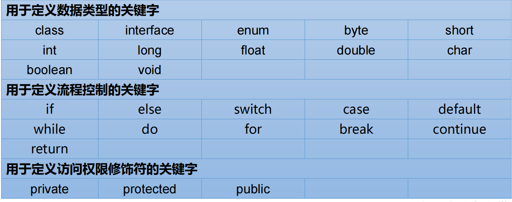
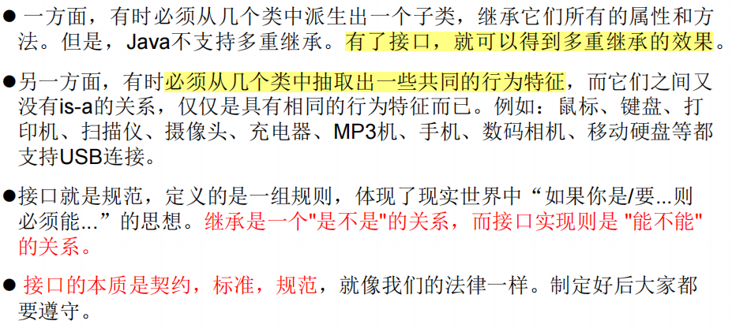
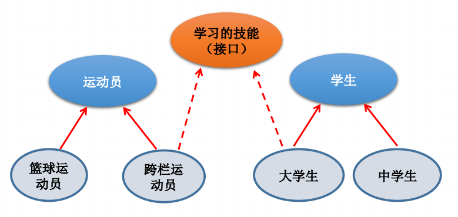
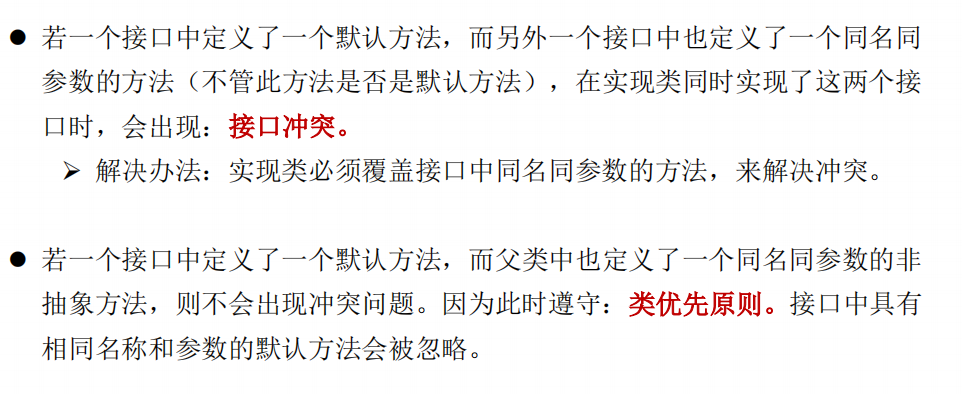
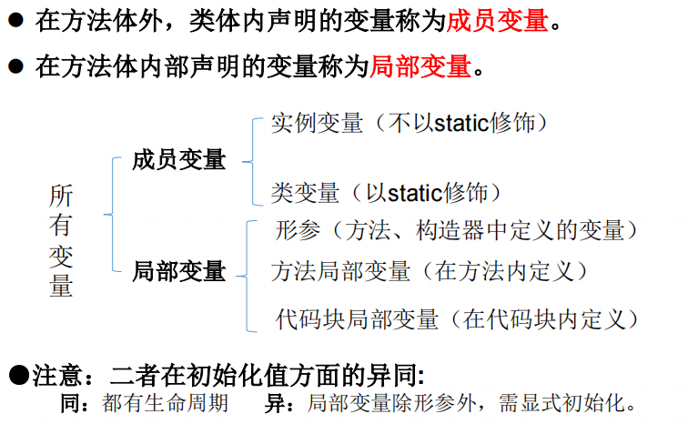
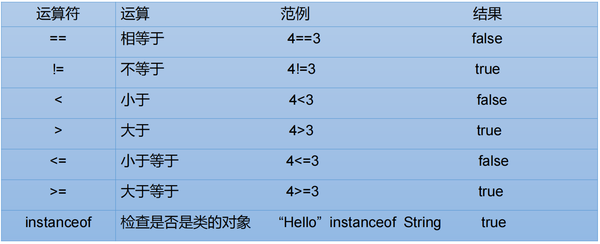
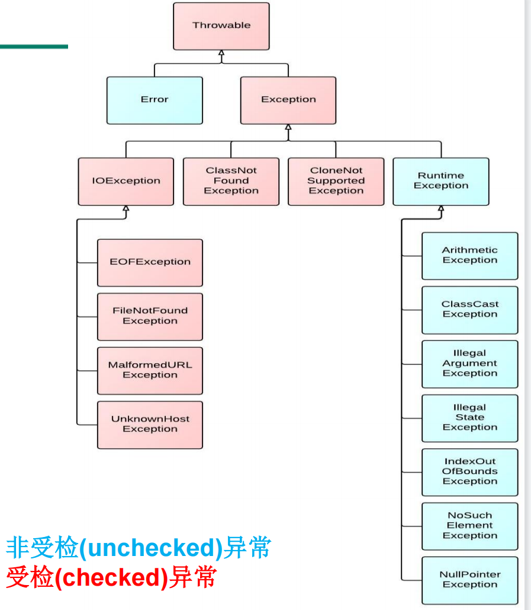
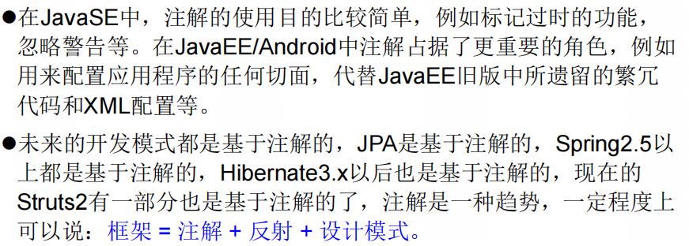

#  JAVA 基础语法

Java SE标准版

Java EE企业版

记事本+命令行编写java:


## 注释

### 单行注释

````java
// XXXXXXXXX
````

### 多行注释

```java
/*
XXXXXX
XXXX
*/
```

### 文档注释

java特有，会被**javadoc**所解析

```java
/**
@author XXXXXX
@version V1.0
xxxxxxx
*/
```


## Java API文档

package——>class

在一个java源文件中可以声明多个class，但是**只能最多有一个类声明为public的。**

而且要求public的类的类名和源文件名相同。

程序的入口是main()方法，格式是固定的，如下：

```java
public static void main(String[] args){
    //args 是arguments：参数，也可以写成a
    //[]可以移动位置
    System.out.println("hello world");//ln表示输出完后会换行。
    System.out.print("hello world");//只输出，不换行
}
```

每一行执行语句都是分号结尾

## 关键字keyword




### this 


this的用法：

1. “this.”修饰属性或方法

这个用法可以在形参与成员名字重名的情况下进行区分。此时“this.”可以理解为”**当前对象的....**“或者”**当前正在创建的对象的......**“

例子：

```java
class Person {
    private int age = 10;
   
    //构造器：
    public Person(){
   		System.out.println("初始化年龄："+age);
	}
   	
    public int GetAge(int age){
        this.age = age; //这里形参和属性重名了！！！，使用了this关键字
        return this.age;
    }
}
 
public class test1 {
    public static void main(String[] args) {
        Person Harry = new Person();
        System.out.println("Harry's age is "+Harry.GetAge(12));
    }
}
```

2. "this(行参列表)"调用本类中的**其他**构造器

这个用法的情况是，如果在初始化中需要考虑的事情很多，则**构造器可能会有很多重复的代码**，为了减少冗余，使用"this(行参列表)" 来调用构造器。

使用时注意：


### package 

- 引入包的概念管理项目中的类，
- 使用package声明类或接口所属的包，声明在源文件的首行
- 包的名称属于标识符，遵循标识符的命名规则规范，
- 同一个包下不能命名同名的接口、类；不同的包下，则可以。

格式：


### import

import，为使用定义在不同包中的Java类，需用import语句来引入指定包层次下所需要的类或全部类(.*)。**import语句告诉编译器到哪里去寻找类。**

语法格式：

==注意：==


### super

- ”super.XXXX“调用属性和方法

当需要在子类中调用**1）父类的被重写方法或2）同名的属性**时，要使用 super 关键字。

**super可以理解为”父类的“**


- "super(参数)"调用构造器


### instanceof 

a instanceof A：判断**对象a是否是类A的实例**。返回值为boolean类型


用法**：为了避免在向下转型时候出现ClassCastException异常，在转之前先进行instanceof的判断。**

### static

static修饰的变量或方法，就不再是具体的某个对象所有，而是**整个类共享**的。

例子：所有中国人都有”国籍=中国“的属性，所有就”国籍“这个属性就会被定义为static

static可以修饰：属性、方法、代码块、内部类

- 使用static修饰属性(静态变量)

则该变量属于所在的类，而非对象特有。称为**静态变量（类变量）**。

据此，**属性还可以分为实例变量和静态变量**。

注意：

1. 可以通过`类名.属性`的方式直接加载静态变量，此时不需要new一个对象；
2. 由于类只会加载一次，则静态变量在内存中也只会存在一份，存在**方法区的静态域**中。

- 使用static修饰方法(静态方法)


同理，根据是否有static修饰，可以分为**静态方法(类方法)和非静态方法**

注意：

1. 可以通过`类名.方法`的方式直接加载静态方法，此时不需要new一个对象；

2. 静态方法中，只能调用静态的方法或属性；非静态方法，都可以。

### final

作用：可以用来修饰类、方法、变量。

用法：

- final修饰类：此类不能被其他类所继承

例子：String类、System类、StringBuffer类等

- final修饰方法：该方法不能在被重写


例子：Object类中的getClass()方法

```java
Public class Person{
    public final void show(){
        System.out.println("具体的方法");
    }
}
class Man extends Person{
     public void show(){
        System.out.println("另外一个具体的重写方法");
         //报错，父类中final修饰的方法不能被重写
    }
}
```

- final修饰变量：**修饰后的”变量“就变为了常量（相当于赋值）**，不能再从新赋值

  ​		1)final修饰属性

  可以考虑赋值的位置：显式初始化、代码块中赋值、构造器中赋值、

  ​		2)final修饰局部变量

  ​		方法体内部：

  ```java
  class Test{
  	public void menthod(){
          final int num = 10; //常量要大写
  //        NUM +=10; 因为final后不可以再重新赋值，此处报错
      }
  }
  ```

  ​		形参：

  ```java
  class Test{
  	public void menthod(final int num){
  //        num = num + 1; 报错：调用方法后，传入的实参就是常量的最后值，不能再赋值
          return num;
      }
  }
  ```

- static final 的用法
  1. 用来修饰属性：**全局常量**
  2. 用来修饰方法：较少？

### abstract


#### abstract 修饰类：抽象类

- 格式：`abstract class A{}`

- 抽象类的特性：
  - **不能实例化（即该类没有对象）**
  - 开发中一般会有子类继承于抽象类，
  - 所以，抽象类中一定有构造器，便于子类实例化时候调用

#### abstract 修饰方法：抽象方法

- 格式：`public abstract void menthod()`，注意，抽象方法没有方法体

```java
public abstract class Employee
{
   private String name;
   private String address;
   private int number;
   
   public abstract double computePay();//注意，抽象方法没有方法体！！
   
   //其余代码
}
```

- 抽象方法的特性：
  - **如果一个类包含抽象方法，那么该类必须是抽象类**。
  - 任何子类必须重写父类的抽象方法，或者声明自身为抽象类。
  - 继承抽象方法的子类必须重写该方法，方可实例化。否则，该子类也必须声明为抽象类。

#### 使用上的注意点

- 不能修饰属性、构造器
- 不能用来修饰private方法、静态方法、final方法、final类

### interface接口

**接口和类，是两个并列的结构。**

##### 概述



##### 接口的声明

语法格式：

```java
[可见度] interface 接口名称 [extends 其他的接口名] {
        // 声明变量 
    	//都是全局常量，因此public static final这几个关键字可以省略
    
        // 抽象方法
    	//同理，public abstract 也可以省略
}
```

例子：

```java
/* 文件名 : Animal.java */
interface Animal {
   public void eat();
   public void travel();
}
```

##### 接口与类的异同

1. 相似点：

- 一个接口可以有多个方法。
- **接口文件保存在 .java 结尾的文件中，文件名使用接口名**。
- 接口的字节码文件保存在 .class 结尾的文件中。
- 接口相应的字节码文件必须在与包名称相匹配的目录结构中。

2. 不同点：

- 接口**不能用于实例化对象**。
- 接口**没有构造方法**。
- 接口中所有的**方法必须是抽象方法**，Java 8 之后 接口中可以使用 default 关键字修饰的非抽象方法。
- 接口不能包含成员变量，除了 static 和 final 变量。
- 接口不是被类继承了，而是要被类实现。
- 接口支持多继承。

##### 接口的特性

- 接口中每一个方法也是隐式抽象的,接口中的方法会被隐式的指定为 **public abstract**（只能是 public abstract，其他修饰符都会报错）。
- 接口中可以含有变量，但是接口中的变量会被隐式的指定为 **public static final** 变量（并且只能是 public，用 private 修饰会报编译错误）。由于是全局常量，可以使用`接口.变量名`调用
- 接口中的方法是不能在接口中实现的，只能**由实现接口的类来实现接口中的方法**。




##### 接口的实现——implements关键字

当类实现接口的时候，**类要实现接口中所有的方法**。**否则，类必须声明为抽象的类**。

类使用implements关键字实现接口。在类声明中，**Implements关键字放在class声明后面**。

语法格式：

```java
class Subclass extends Superclass ...implements InterfaceA [,InterfaceB..., ...] {
    //接口各种变量的定义
    
    //接口各种抽象方法的重写
}
```


##### 接口间的继承

一个接口能继承另一个接口，和类之间的继承方式比较相似。接口的继承使用extends关键字，子接口继承父接口的方法。**接口的继承，可以多继承。**

例子：

```java
// 文件名: Football.java
public interface Football extends Sports
{
   //抽象方法： 
   public void homeTeamScored(int points);
   public void visitingTeamScored(int points);
   public void endOfQuarter(int quarter);
}
```

##### java8接口的新特性


开发中的注意点：



调用接口中的默认方法

```java
/*文件名为InterfaceA.java*/
public interface InterfaceA{
    //静态方法：
    public static void method1(){
        //方法体
    }
    //默认方法：
    public default void method2(){
        //方法体
    }
}

/*文件名为SubclassTest.java*/
class Subclass extends Superclass implements InterfaceA{
    public void myMethod(){
        method2();					//调用子类自己重写的默认方法
        super.method2();			//调用父类中声明的和默认方法同名同参数的非抽象方法
        InterfaceA.super.method2(); //调用接口中的默认方法
    }
}
```


## 保留字reserved word

## 标识符Identifier

凡是可以自己取名字的地方都叫标识符

1. 命名规则：不遵守则编译不通过

- 所有的标识符都应该以字母（A-Z 或者 a-z）,美元符（$）、或者下划线（_）开始
- 首字符之后可以是字母（A-Z 或者 a-z）,美元符（$）、下划线（_）或数字的任何字符组合
- 关键字不能用作标识符
- 标识符是大小写敏感的
- 合法标识符举例：age、$salary、_value、__1_value
- 非法标识符举例：123abc、-salary

2. 命名规范：（建议）

- - - - 类名规范：大驼峰式（首字母大写，后单词首字母大写）
      - 变量名规范：小驼峰式（首字母小写，后单词首字母大写）
      - 方法名规范：小驼峰式

## 变量

### 定义变量的格式

```java
//数据类型 变量名 =  变量值;
int a, b, c;             // 声明三个int型整数：a、 b、c
int d = 3, e = 4, f = 5; // 声明三个整数并赋予初值
byte z = 22;             // 声明并初始化 z
String s = "runoob";     // 声明并初始化字符串 s
double pi = 3.14159;     // 声明了双精度浮点型变量 pi
char x = 'x';            // 声明变量 x 的值是字符 'x'。
```

### 变量的分类

#### 按数据类型分类


注意，float 和 long的数值后面需要跟一个f/F和L/l。

​			char只能写一个字符**（声明变量时使用一对单引号）**，表示方式可以是：

1. 一个字符

2. 一个转义字符

3. 直接用Unicode表示的字符型常量，如 ’\u0123‘ 表示 ‘  ？’

   ​	String是引用数据类型，声明变量时，**使用一对双引号**

##### 自动类型转换

- - **自动类型转换（隐式）**

  - - 规则：数据范围**从小到大**去转换；

- - **强制类型转换（显式）**

- - - **格式：** 范围小的类型 范围小的变量名 = **（范围小的类型）**原本范围大的数据

    - - 例子：int num = (int)  100L;

    - 注意：

    - - 不推荐使用强制类型转换，可能发生数溢出，精度损失
      - **byte/short/char三种类型都可以发生数学运算（首先被提升到int**），例如加法+
      - boolean类型不能发生类型转换（不能变成1和0）

#### 按变量在类中声明的位置分类



## 运算符

### 分类

- 算术运算符
- 关系运算符
- 位运算符
- 逻辑运算符
- 赋值运算符
- 其他运算符

### 算术运算符


- - - 加、减、乘、除（只看商不看余数）

    - 取余%、

    - 赋值与复合赋值（+=/-=/.........）

    - 自增、自减（单独使用，混合使用）

    - 比较（==.<=,>=,>,<,!=六种）

    - 逻辑运算（与&&   或||   非！）

    - **三元运算符**

    - - 定义：区别于一元、二元，需要三个数据才能操作的运算符
      - 格式：**数据类型   变量名称 条件判断 ?  表达式A：表示式B;**
      - 流程：

- - - - 1. 首先判断条件是否成立，如果成立，
        2. 将表达式A的值赋值给左侧变量
        3. 如果不成立，将B赋值给左侧变量

- - - - 注意：

- - - - 1. 必须同时保证A和B都符合左侧的数据类型
        2. 三元运算的结果必须被使用，不能干一个式子晾着

### 赋值运算符


符号：=

支持连续赋值：

```java
int i1, i2;
i1=i2=10;
int i3=10,i4=12;
```

### 比较运算符(关系运算符)



### 逻辑运算符

逻辑运算操作的都是布尔对象


- 区分& 和&&

1. 相同点：运算结果相同
2. 不同点：当符号左边是true的时候，二者都会执行符合右边的运算
3. 不同点：当符合左边是false的时候，&会执行符合右边的运算，&&则不会

- 区别| 与||

1. 相同点：运算结果相同
2. 不同点：当符号左边是false的时候，二者都会执行符合右边的运算
3. 不同点：当符合左边是true的时候，| 会执行符合右边的运算，|| 则不会

注意，开发中推荐使用&&和 ||

### 位运算符

Java定义了位运算符，应用于整数类型(int)，长整型(long)，短整型(short)，字符型(char)，和字节型(byte)等类型。

位运算符是对整数的二进制进行的运算


### 三元运算符(条件运算符)

三元运算符的格式：

> variable x = (expression) ? value if true : value if false


另外，三元运算符可以嵌套使用

### 运算符的优先级


## 流程控制

顺序结构

### 分支结构

#### if语句

```java
if(布尔表达式)
{
   //如果布尔表达式为true将执行的语句
}
```

#### if else 语句

```java
if(布尔表达式){
   //如果布尔表达式的值为true
}else{
   //如果布尔表达式的值为false
}
```

#### if....else if ....else语句

```java
if(布尔表达式 1){
   //如果布尔表达式 1的值为true执行代码
}else if(布尔表达式 2){
   //如果布尔表达式 2的值为true执行代码
}else if(布尔表达式 3){
   //如果布尔表达式 3的值为true执行代码
}else {
   //如果以上布尔表达式都不为true执行代码
}
```

#### switch case结构

```java
switch(expression){
    case value ://value为常量
       //语句
       break; //可选
    case value :
       //语句
       break; //可选
    //你可以有任意数量的case语句
    default : //可选
       //语句
}
```

switch 语句中的变量类型可以是： byte、short、int 或者 char。从 Java SE 7 开始，switch 支持字符串 String 类型了，同时 case 标签必须为字符串常量或字面量。

### 循环结构

初始化①；布尔表达式②；步进表达式④；循环体③。        

#### for循环

```java
for(初始化; 布尔表达式; 更新) {
    //代码语句
}
```

#### while循环

```java
初始化语句;
while(条件判断){
    循环体;
    步进语句;
}
```

#### do while循环

```
初始化语句;
do{
    循环体;
    步进语句;
}while(条件判断);
```

#### 死循环和嵌套循环

最简单无限循环格式：while(true)，for(;;)。

```java
while(true){
    循环体;
    //也可以加if来控制死循环的停止！！
}
```

嵌套循环一般使用for循环，循环次数：内X外

#### 特殊关键字的使用

##### break

1. break可以用于结束循环

2. break 一般用于switch case结构

##### continue

**只能使用在循环结构中**，作用：结束当次循环，**马上开始**下次循环。

在嵌套循环中，需要通过标签，来指明要跳出的是哪层循环

##### return

用于结束一个方法（方法类似于C中的函数）

## 数组

数组(Array)，是多个**相同类型数据**按一定顺序排列的集合，并使用一个名字命名，并通过**编号的方式**对这些数据进行统一管理。


### 一维数组

#### 声明数组变量

```java
dataType[] arrayRefVar;   // 首选的方法
dataType arrayRefVar[];  // 效果相同，但不是首选方法
//例子
int[] ids;//声明一个int类型的数组
double[] myList; //声明一个double类型的数组
```

#### 初始化（创建数组）

```java
//静态初始化:
dataType[] arrayRefVar = {value0, value1, ..., valuek};//类型推断
//动态初始化：
dataType[] arrayRefVar = new dataType[arraySize];
```

- - - 动态格式：数据类型[]  数组名词 =  new 数据类型 [数组长度]
    - 静态格式：数据类型[]  数组名词 =  new 数据类型 [ ] { 元素1,元素2,......}

或者：数据类型[]  数组名词 =   数据类型 []{元素1,元素2,......}

数组初始完成，长度则确定。

#### 数组元素的引用

通过角标（从0开始）

#### 数组的长度与遍历

长度使用Array类的属性length

#### 数组元素的默认初始化值


#### 一维数组的内存解析

- - - 栈（Stack）:存放在方法中的局部变量。方法的运行在栈中。
    - 堆（Heap）：**==new出来的变量，都在这里==**。
    - 方法区（Method Area）：存储.class相关信息。
    - 本地方法栈（Native Method Stack）.........
    - 寄存器（pc Register）.........

### 二维数组

二维数组可以理解为，数值元素为，**有两个元素的一维数组**。

#### 	声明和初始化

type 可以为基本数据类型和复合数据类型，typeLength1 和 typeLength2 必须为正整数，typeLength1 为行数，typeLength2 为列数。

```java
//动态初始化
//type[][] typeName = new type[typeLength1][typeLength2];
//例子：
int[][] a = new int[2][3];//第一种情况
String[][] a1 = new String[3][];//第二种情况
```

技巧，静态初始化后，前面的[ ] [ ]就不可以有数字了

#### 元素的引用

同样使用角标。

调外层的时候可以只写一个角标。

#### 数组的长度和遍历

length属性，返回的是第一维度的数组长度。因为数组的元素也是数组，可以通过引用得到第二维度的数组长度

遍历：

```java
public class ArrayTest{
    piblic static void main(String[] args){
        int[][] a = new int[23][34]
        for(int i=0; i< a.length;i++){
            for(int j =0; j<a[i].length;j++){
                System.out.print(a[i][j]);
            }
        }
    }
}
```

#### 二维数组元素的默认初始化值

第一维元素的初始化值为，地址值

第二维元素的初始化值为，具体的一维元素初始化值。

#### 二维数组的内存解析

略

### 数组中涉及到的常见算法

先略，视频未看

### Arrays工具类

java.util.Arrays 类能方便地操作数组，它提供的所有方法都是静态的。

比较常见的方法有：


### 数组使用中的常见异常


## 异常处理

### 异常体系结构

java程序在执行过程中的异常（Throwable）可分为2类：

- Error错误类

Java虚拟机无法解决的严重问题。如：JVM系统内部错误、资源耗尽等严重情况。比如：==StackOverflowError==和==OOM==。一般不编写针对性的代码进行处理。

错误不是异常，而是脱离程序员控制的问题。错误在代码中通常被忽略。例如，当栈溢出时，一个错误就发生了，它们在编译也检查不到的。

- Exception异常类

其它因编程错误或偶然的外在因素导致的一般性问题，可以使用针对性的代码进行处理。例如:

捕获错误最理想的是在**编译期间**，但有的错误只有在**运行时**才会发生。由此可以将异常进一步分为：==编译时异常（checked检查性异常）和运行时异常（unchecked非检查性异常）==。



- Throwabel类的主要方法

| **序号** | **方法及说明**                                               |
| -------- | ------------------------------------------------------------ |
| 1        | **public String getMessage()** 返回关于发生的异常的详细信息。<br />这个消息在Throwable 类的构造函数中初始化了。 |
| 2        | **public Throwable getCause()** <br />返回一个Throwable 对象代表异常原因。 |
| 3        | **public String toString()**<br /> 使用getMessage()的结果返回类的串级名字。 |
| 4        | **public void printStackTrace()** <br />打印toString()结果和栈层次到System.err，即错误输出流。 |
| 5        | **public StackTraceElement [] getStackTrace()**<br /> 返回一个包含堆栈层次的数组。下标为0的元素代表栈顶，最后一个元素代表方法调用堆栈的栈底。 |
| 6        | **public Throwable fillInStackTrace()** <br />用当前的调用栈层次填充Throwable 对象栈层次，添加到栈层次任何先前信息中。 |

- 关于异常可以又两大块问题：
  - 异常的生成
    - 自动生成
    - 手动生成(合适位置进行`throw new 异常`)
  - 异常的处理
    - try-catch-finaly机制（应用场景：合适的位置）
    - throws + 异常类型（应用场景：方法的声明处）

### 异常处理机制

在编写程序时，经常要在可能出现错误的地方加上检测的代码，如进行x/y运算时，要**检测分母为0，数据为空，输入的不是数据而是字符**等。过多的if-else分支会导致程序的代码加长、臃肿，可读性差。

因此采用异常处理机制。


#### try-catch-finally机制

使用 try 和 catch 关键字可以捕获异常。**try/catch 代码块放在异常可能发生的地方**。

try/catch代码块中的代码称为保护代码，使用 try/catch 的语法如下：

```java
try{
   //可能出现异常的代码，保护代码块
}catch(异常类型1 异常的变量名1){
  // 异常的处理方式1
}catch(异常类型2 异常的变量名2){
  // 异常的处理方式2
}catch(异常类型3 异常的变量名3){
  // 异常的处理方式3
}finally{
  //无论是否发生异常，都无条件执行的语句
}
```

- try关键字

捕获异常的第一步是用`try{…}`语句块选定捕获异常的范围，将可能出现异常的代码放在try语句块中。

try结构中声明的变量，出了try结构后就不能再被调用。**解决方法：在tr结构外面声明并初始化**

```java
int num = 0; //小技巧：在try结构外面定义变量
try{
    num = XXXXX;
}
```

- catch关键字

在catch语句块中是对异常对象进行处理的代码。每个try语句块可以伴随一个或多个catch语句，用于处理可能产生的不同类型的异常对象。

> 注意：catch中的异常类型如果有子父类关系，则要求子类一定声明在父类的上面。否则，报错。


- finally关键字

不论：在try代码块中是否发生了异常事件，catch语句是否执行，catch语句是否有异常，catch语句中是否有return，**finally块中的语句都会被执行。**

**finally的用法：像数据库连接、网络编程Socket等资源，JVM是不能自动回收的，需要我们手动进行资源释放，这样的操作就可以声明在finally中。**

- try-catch-finally结构的使用注意

1. 该结构可以嵌套；
2. catch 不能独立于 try 存在；
3. try 代码后不能既没 catch 块也没 finally 块；
4. try, catch, finally 块之间不能添加任何代码；

- try-catch-finally的使用场景


1. **对于运行时异常，没有必要使用try-catch结构，**
2. **但是对于编译时异常则可以通过try-catch操作将其延迟到运行时再出现**

#### ”throws+异常类型“机制

> 如果一个方法(中的语句执行时)可能生成某种异常，但是并不能确定如何处理这种异常，则此方法应**显示地**声明抛出异常，**表明该方法将不对这些异常进行处理，而由该方法的调用者负责处理。**

使用场景：

`throws+异常类型`写在**方法的声明处。**

语法格式：

- 在方法声明中用throws语句可以声明抛出异常的列表，throws后面的异常类型可以是方法中产生的异常类型，也可以是它的父类。 

```java
/*文件名为：ExceptionTest.java*/
public class ExceptionTest{
    public static void main(String[] args){
		//main方法中就不能再抛出异常了，因为一般不会又调用main()方法的
        try{
			method2();
		}catch(IOException e){
			e.printStackTrace();
		}
		
//		method3(); //如果调用method3(),则不会报错，因为method3()已经处理完异常
	}
	
	public static void method3(){
		try{
			method2();
		}catch(IOException e) {
			e.printStackTrace();
		}
	}
	
	public static void method2() throws IOException{
		method1();//会有异常，还需要抛出异常
	}
	
	public static void method1() throws FileNotFoundException,IOException{
		File file = new File("hello1.txt");
		//...
	}
}
```

#### 总结

- 两者的区别

`try-catch-finally`是真正将异常处理掉了，

`throws 异常类型`只是将异常抛给了方法的调用者，并没有处理异常。

- 两者的选择

1. 两个方式只选一个，不需要都用，

2. 父类中被重写的方法没有用`throws 异常类型`处理异常，则子类重写的方法也不能使用`throws 异常类型`
3. 执行的方法a中，先后调用了另外的几个递进关系的方法。则**建议**这几个方法使用throws方式，而执行方法a中使用try-catch-finally处理

### 手动抛出异常throw 

Java异常类对象除在程序执行过程中出现异常时由系统自动生成并抛出，**也可根据需要使用人工创建并抛出**。可以使用 throw 关键字抛出一个异常，无论它是新实例化的还是刚捕获到的。

```java
/*文件名为StudentTest.java*/
public class StudentTest{
    
    public static void main(String[] args){
        try{
            Student s = new Student();
        	s.regist(-11111111);
        }catch(Exception e){
            System.out.println(e.getMessage());
        }
            //Student s = new Student();
        	//s.regist(-11111111);//子类中抛出了异常，需处理
        
    }
}
class Student{
    private int id;
    public void regist(int id) throw Exception{ //这里可以进行异常处理
        if(id >0){		//学号正常的情况
            this.id =id;
        }else{ 
            //这里就可以手动生成一个异常对象，比如：
           
//          throw new RuntimeException(); //根据异常对象的构造器不同，还有其他声明方式
       		thorw new Exception("您输入的数据非法！！")
        }           
    }
    
}
```

### 用户自定义异常类

用户自定义异常类MyException，用于描述数据取值范围错误信息。

- 自定义方法
  - 用户自己的异常类**必须继承**现有的异常类，一般是：Exception或者RuntimeException
  - 提供全局常量：serialVersionUID
  - 提供重载的构造器

```java
public class MyException extends RuntimeException{
    static final long serialVersionUID = xxxxxxxL;
    
    //构造器
    public MyException(){
        
    }
    //...
}
```

### 异常总结


## 注解(Annotation)

### 概述

注解不同于注释




### 举例


- 实例三：跟踪代码依赖性，实现替代配置文件功能


