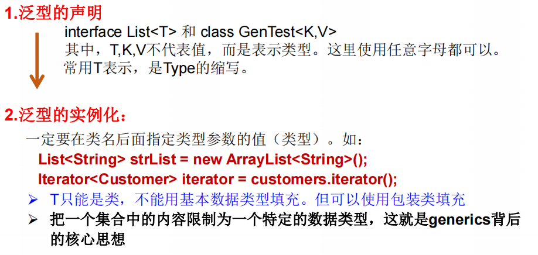
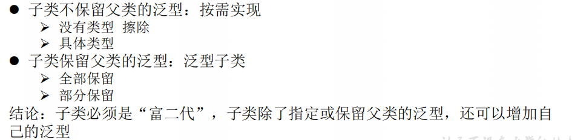
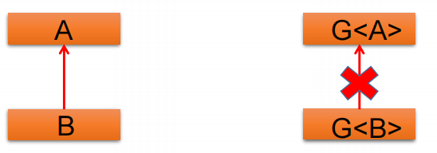
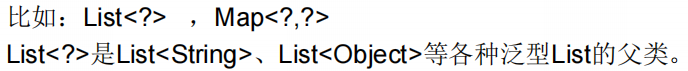
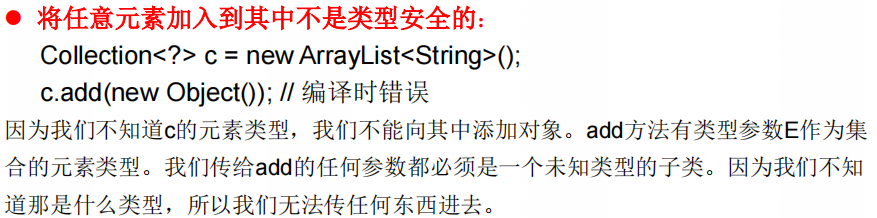
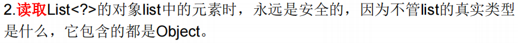
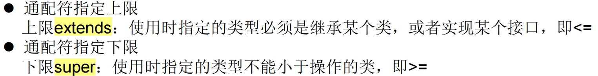

# Java泛型

## 定义与背景

> ==Java 泛型（generics）==是 JDK 5 中引入的一个新特性, 泛型提供了编译时类型安全检测机制，该机制允许程序员在编译时检测到非法的类型。

- 泛型的本质是**参数化类型（Parameterized type，把元素的类型设计成一个参数，这个类型参数叫做泛型。）**，也就是说所操作的数据类型**（不能是基本数据类型，只能是类）**被指定为一个参数。

- 所谓泛型，就是允许在定义类、接口时**通过一个标识**表示类中某个属性的类型或者是某个方法的返回值及参数类型。

- 这个类型参数将在使用时（例如，继承或实现这个接口，用这个类型声明变量、创建对象时）被确定（即传入实际的类型参数，也称为类型实参）。

- 为什么要有泛型的演示：

```java
@Test
public void test1(){
    List list = new ArrayList();
    //需求：存放学生数据
    list.add(23);
    list.add(93);
    list.add(54);
    list.add(88);
    //问题一：类型不安全
    list.add("something that is not an Integer");

    for (Object score: list){
        //问题二：强转时，容易出现ClassCastException类型转换异常
        int stuScore = (int) score;
        System.out.println(stuScore);
    }
}
```

## 泛型的使用

### 在集合中使用泛型

- 以ArrayList为例

```java
@Test
public void test2(){
    ArrayList<Integer> list = new ArrayList<>();//定义的时候指明Integer类型

    list.add(12
    // list.add(new Date());编译报错
    // list.add("something");编译报错

    for(Integer score:list){
        int stuScore = score;
        System.out.println(stuScore);
    }
}
```

在方法、属性、构造器中，可以使用类或接口的泛型。

- 以HashMap为例

```java
@Test
public void test3(){
    HashMap<String, Integer> map = new HashMap();//可以省略后面的泛型，但是<>不能省略

    map.put("张三",100);
    map.put("jack",88);
    //map.put(2,4);//报错
    map.put("rick",88);
    map.put("morty",88);

    System.out.println(map);
    System.out.println("***************");
    //遍历
//    Set<String> strings = map.keySet();
//    Iterator<String> iterator = strings.iterator();
//    while(iterator.hasNext()){
//        String key = iterator.next();
//        Integer value = map.get(key);
//        System.out.println(key + "=====" + value);
//    }
    //<Map.Entry<String, Integer>>为泛型的嵌套
    Set<Map.Entry<String, Integer>> entry = map.entrySet();
    Iterator<Map.Entry<String, Integer>> iterator = entry.iterator();
    while(iterator.hasNext()){
        Map.Entry<String, Integer> e = iterator.next();
        String key = e.getKey();
        Integer value = e.getValue();
        System.out.println(key+"-==========="+ value);
    }
}
```

- 总结

1. 集合接口或集合类在jdk5时，修改为带泛型的结构
2. 在实例化集合类时，可以指明具体的泛型类型
3. 指明完以后，内部结构（方法、属性、构造器等）使用到类的泛型的位置，都指定为实例化时的泛型类型

例子：`add(E e)`----------->实例化后：`add(Integer e)`

4. 再次强调：泛型类型必须是个类，不能是基本数据类型。
5. 实例化时，没有使用泛型的话，默认为Object类型

6. 类型推断（jdk7新特性）

```java
HashMap<String, Integer> map = new HashMap<String, Integer>();
HashMap<String, Integer> map = new HashMap<>();//可以省略后面的泛型，但是<>不能省略
```

## 自定义泛型结构

### 泛型类/泛型接口



举例：

```java
public class Order<T> {

    String orderName;
    int orderId;
    //类的内部结构就可以使用类的泛型
    T orderT;

    public Order(){};

    public Order(String orderName, int orderId, T order) {
        this.orderName = orderName;
        this.orderId = orderId;
        this.orderT = order;
    }

    public T getOrderT() {
        return orderT;
    }

    public void setOrderT(T orderT) {
        this.orderT = orderT;
    }

    @Override
    public String toString() {
        return "Order{" +
                "orderName='" + orderName + '\'' +
                ", orderId=" + orderId +
                ", orderT=" + orderT +
                '}';
    }
}
```

#### 继承于泛型类/接口

1.继承时就指明父类的泛型类型，则子类的实例化不再需要指明泛型。

```java
public class SubOrder extends Order<String>{
    //...
}
```

2. 不指明的时候，子类也仍然是泛型类

```JAVA
public class SubOrder<T> extends Order<T>{
    //...
}
```

#### 使用注意

- 泛型类可能有多个参数，此时应将多个参数一起放在尖括号内。比如：`<E1,E2,E3>`
- **泛型类的构造器**如下：`public GenericClass(){}`。而下面是错误的：`public GenericClass<E>(){}`
- 实例化后，操作原来泛型位置的结构必须与指定的泛型类型一致。
-  **泛型不同的引用不能相互赋值**。尽管在编译时`ArrayList<String>`和`ArrayList<Integer>`是两种类型，但是，在运行时只有一个`ArrayList`被加载到JVM中。
-  泛型如果不指定，将被擦除，泛型对应的类型均按照Object处理，但不等价于Object。**经验：**泛型要使用一路都用。要不用，一路都不要用。
- 如果泛型结构是一个接口或抽象类，则不可创建泛型类的对象。
- jdk1.7，泛型的简化操作：`ArrayList<Fruit> flist = new ArrayList<>();`
- 泛型的指定中不能使用基本数据类型，可以使用包装类替换。
- 在类/接口上声明的泛型，在本类或本接口中即代表某种类型，可以作为非静态属性的类型、非静态方法的参数类型、非静态方法的返回值类型。但**==在静态方法中不能使用类的泛型==**。
- 异常类不能是泛型的
- 不能使用`new E[]`。但是可以使用强转：`E[] elements = (E[])new Object[capacity]`;
- 参考：ArrayList源码中声明：Object[] elementData，而非泛型参数类型数组。
- 父类有泛型，子类可以选择保留泛型也可以选择指定泛型类型：



举例：

1. 情况一：

```java
class Father<T1, T2> {
}
// 子类不保留父类的泛型
// 1)没有类型 擦除
class Son1 extends Father {// 等价于class Son extends Father<Object,Object>{
}
// 2)具体类型
class Son2 extends Father<Integer, String> {
}
// 子类保留父类的泛型
// 1)全部保留
class Son3<T1, T2> extends Father<T1, T2> {
}
// 2)部分保留
class Son4<T2> extends Father<Integer, T2> {
}
```

2. 情况二

```java
class Father<T1, T2> {
}
// 子类不保留父类的泛型
// 1)没有类型 擦除
class Son<A, B> extends Father{//等价于class Son extends Father<Object,Object>{
}
// 2)具体类型
class Son2<A, B> extends Father<Integer, String> {
}
// 子类保留父类的泛型
// 1)全部保留
class Son3<T1, T2, A, B> extends Father<T1, T2> {
}
// 2)部分保留
class Son4<T2, A, B> extends Father<Integer, T2> {
}
```

### 泛型方法

方法，也可以被泛型化，不管此时定义在其中的类是不是泛型类。在泛型方法中可以定义泛型参数，此时，参数的类型就是传入数据的类型。 

泛型方法是可以声明为静态的。

#### 声明格式

```java
//[访问权限] <泛型> 返回类型 方法名([泛型标识 参数名称]) 抛出的异常
```

#### 声明举例

```java
public <E> List<E> fromArrayToList(E[] arr){
    ArrayList<E> list = new ArrayList<>();

    for(E e : list){
        list.add(e);
    }
    return list;
}
//以上方法功能：将一个元素是E类型的数组转化为List集合
```

- 泛型类和泛型方法的使用情景


操作数据库的时候，可以先定义一个DAO(Database Access Object)类，里面定义数据表的共性操作。然后再具体造DAO的相关只能操作某一个表的子类(CustomerDao、StudentDao)。

## 泛型在继承上的体现

如果B是A的一个子类型（子类或者子接口），而G是具有泛型声明的类或接口，**G<B>并不是G<A>的子类型！**

比如：String是Object的子类，但是List<String >并不是List<Object>的子类。



但是，A<G>和B<G>仍然具备子父类关系。

## 通配符的使用

类型通配符：<?>



即，类A是类B的父类，G<B>并不是G<A>的子类型，二者共同的父类是：G<?>

### 使用通配符后的读写操作

- 写入操作




- 读取操作





### 有限制的通配符



举例：

```java
<? extends Number> (无穷小 , Number]
//只允许泛型为Number及Number子类的引用调用
                    
<? super Number> [Number , 无穷大) 
//只允许泛型为Number及Number父类的引用调用                 
              
<? extends Comparable>
/只允许泛型为实现Comparable接口的实现类的引用调用
```


