# java集合框架

集合数组都是对多个数据进行存储操作的结构，简称java容器。

- 数组存储的特点

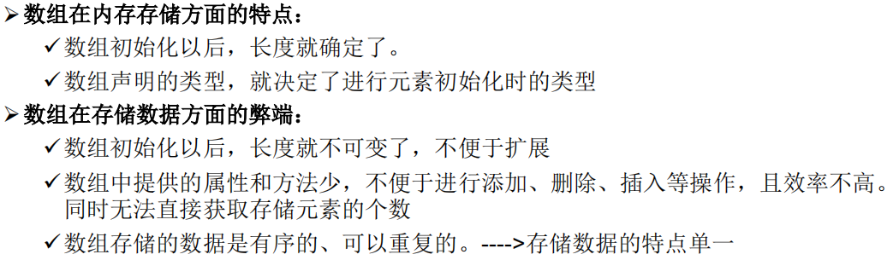

- 集合的使用场景

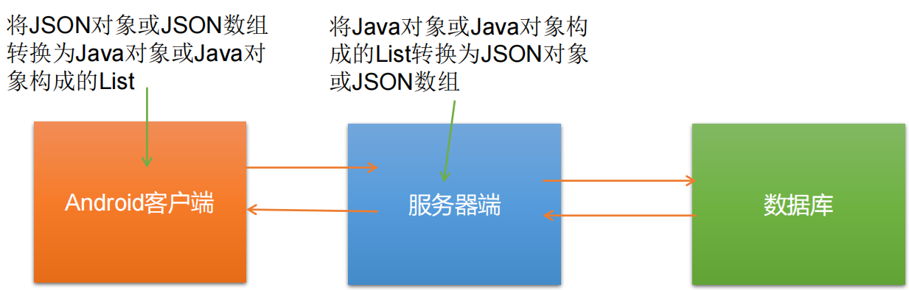

- java集合
  - Collection接口：单列数据，定义了存取一组对象的方法的集合
    - **List接口**：元素有序、可重复的集合。也称为**“动态数组”**。
    - **Set接口**：元素无序、不可重复的集合。（和高中数学的集合概念类似）
    - 还有其他接口

  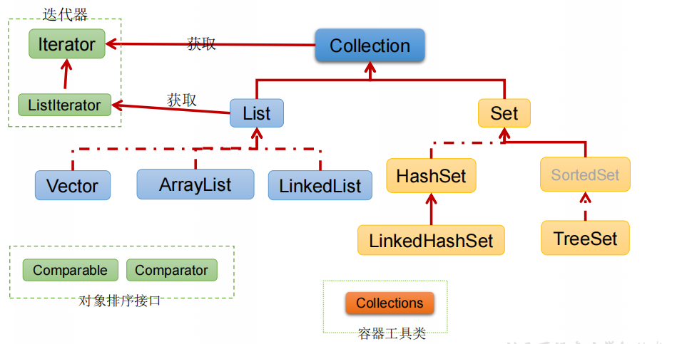

  - Map接口：双列数据，保存具有映射关系“key-value对”的集合

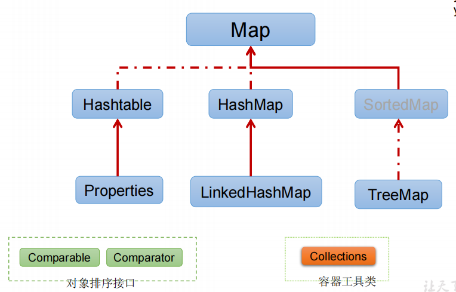

## Collection接口

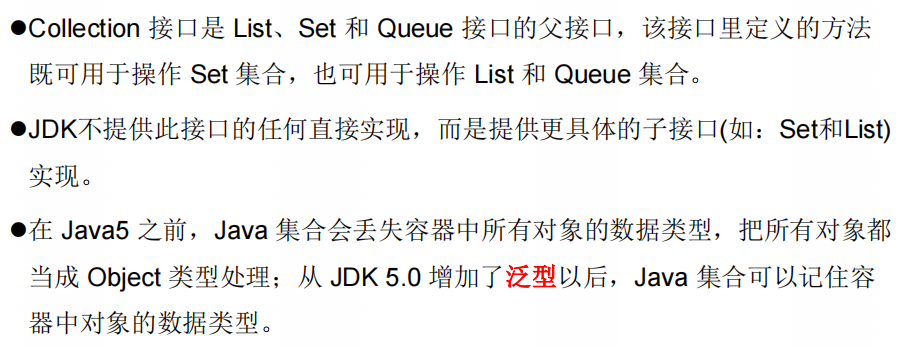

### 抽象方法的使用

```java
Collection coll = new ArrayList();
//接口不能调用方法，需要使用实现接口的子类
```

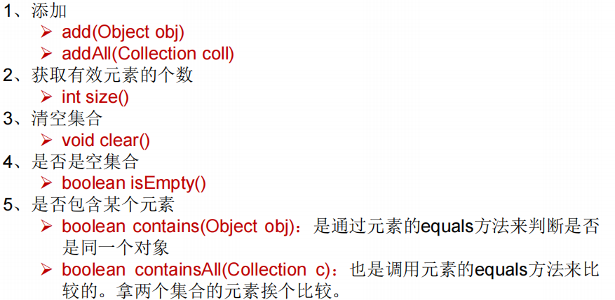

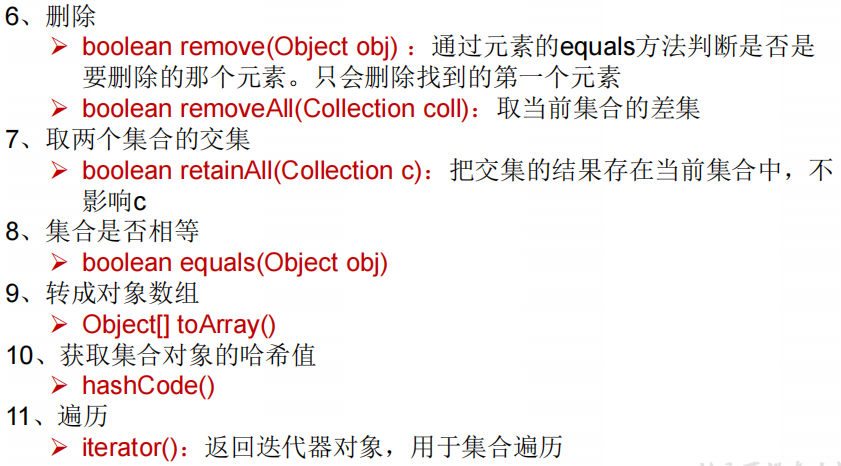

注意 

1. 向Collection接口的实现类添加数据obj的时候，要求obj所在类要重写equals()方法

2. **集合转化为数组使用`toArrays()`方法；数组转换为集合使用Array类的静态方法`asList()`方法**

例子：

```java
@Test
    public void test2(){
        Collection coll = new ArrayList();
        coll.add(124);
        coll.add(1241415367L);

        //集合——>数组：toArray()方法
        Object[] arr = coll.toArray();
        for (int i = 0; i < arr.length; i++) {
            System.out.println(arr[i]);
        }
        //数组——>集合：Array类的静态方法asList()
        List<String> list = Arrays.asList(new String[]{"bb", "aa", "cc"});
        System.out.println(list);

        //特例
        List<int[]> ints = Arrays.asList(new int[]{1, 2, 4, 5});
        System.out.println(ints);//[[I@ba8a1dc]，一个为一维数组，元素是int类型
        System.out.println(ints.size());//1
    }
```

### Iterator迭代器接口

使用 Iterator 接口遍历集合元素

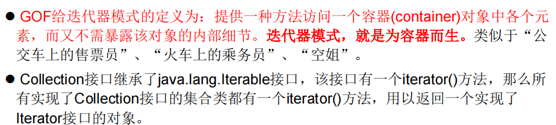

- 接口的实例化

```java
Iterator iterator = coll.iterator();
```

- 接口方法

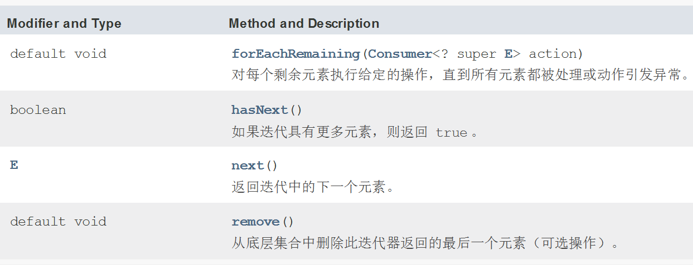

#### 用Iterator迭代器遍历集合元素

```java
@Test
public void test(){
    Collection coll = new ArrayList();
    coll.add(124);
    coll.add(1241415367L);

    Iterator iterator = coll.iterator();
    System.out.println(iterator.next());
    //hasNext():判断是否还有下一个元素
    while(iterator.hasNext()){
        //next():①指针下移 ②将下移以后集合位置上的元素返回
        System.out.println(iterator.next());
    }
}
```

#### 删除某个特定元素

```java
@Test
    public void test4(){
        Collection coll = new ArrayList();
        coll.add(124);
        coll.add(1241415367L);
        coll.add("Tom");

        System.out.println(coll);

        //删除集合某个特定元素
        Iterator iterator = coll.iterator();
        while(iterator.hasNext()){
            Object obj = iterator.next();
            if("Tom".equals(obj)){
                iterator.remove();
            }
        }
        //遍历集合
        Iterator iterator1 = coll.iterator();
        while(iterator1.hasNext()){
            System.out.println(iterator1.next());
        }

    }
```

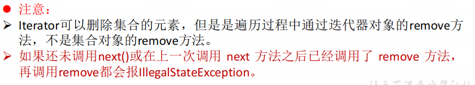

#### 使用foreach循环遍历集合和数组元素

也称为增强for循环

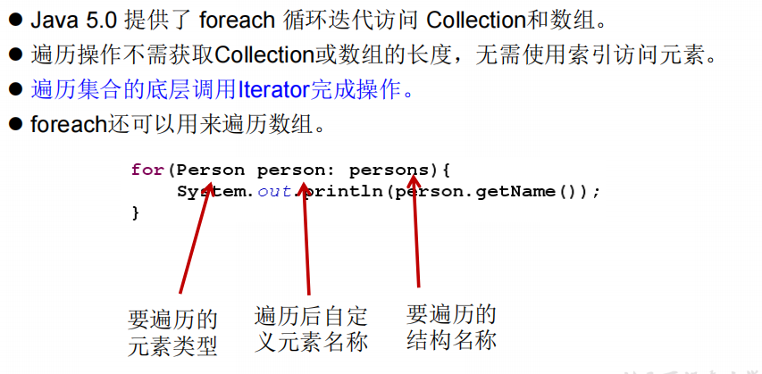

格式：

```java
Collection coll = new ArrayList();
coll.add(124);
coll.add(1241415367L);
coll.add("Tom");

//遍历元素
for(Object obj : coll){
    System.out.println(obj);
}

```

注意：增强for循环是将元素的值重新赋给了obj，然后再显示出来，**修改obj的话原有数组或集合的元素不会改变**

### List子接口

List接口的实现类常用的有：`ArrayList`、`LinkedList`和`Vector`。三者的异同点如下：

- 相同点

存储的都是有序、可重复的数据

- 不同点

`ArrayList`是List的主要实现类，是线程不安全的，效率高；底层使用`Object[]`存储

`LinkedList`：对于频繁的插入、删除操作，使用此类效率比`ArrayList`高；底层使用双向链表存储

`Vector`是线程安全的，效率低；

三个类的源码分析略过。。。。

#### 接口方法

List除了从Collection集合继承的方法外，List 集合里添加了一些**根据索引来操作集合元素**的方法，具体如下：

- `void add(int index, Object ele)`:在inde位置插入ele元素
- `boolean addAll(int index, Collection eles)`:从index位置开始将eles中的所有元素添加进来
- `Object get(int index)`:获取指定index位置的元素
- `int indexOf(Object obj)`:返回obj在集合中首次出现的位置，**如果不存在则返回-1**
- `int lastIndexOf(Object obj)`:返回obj在当前集合中末次出现的位置
- `Object remove(int index)`:移除指定index位置的元素，并返回此元素
- `Object set(int index, Object ele)`:设置指定index位置的元素为ele
- `List subList(int fromIndex, int toIndex)`:返回从fromIndex到toIndex位置**（左闭右开）**的子集合

#### 常用方法总结

增：add(Object obj)

删：remove(int index) / remove(Object obj)

改：set( int index, Object ele)

查：get(int index)

插：add( int index, Object ele)

长度：size()

遍历：1）Iterator 迭代器  2）增强for循环 3）普通循环

### Set子接口

#### 特性

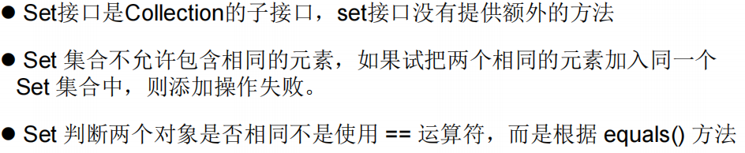

- 无序性

不等于随机性。存储的数据在底层数组中并非按照数组索引的顺序添加，而且根据数据的哈希值。

- 不可重复性

保证添加的元素按照equals()判断时，不能返回ture，即：相同的元素只能添加一个

**注意，Set接口中没有定义其他接口方法。**

#### 实现类

Set接口的主要实现类有：`HashSet`、`LinkedHashSet`、`TreeSet`

- `HashSet、`：Set接口的主要实现类；线程不安全；可以存储null值
- `LinkedHashSet、`：是HashSet的子类；可以按照添加的顺序遍历；
- `TreeSet`：底层使用**红黑树**结构存储数据；

##### HashSet类                                                                                                                                                                                                                                                                                                                                                                                                                                                   

- HashSet的底层结构，是`数据+链表`结构：

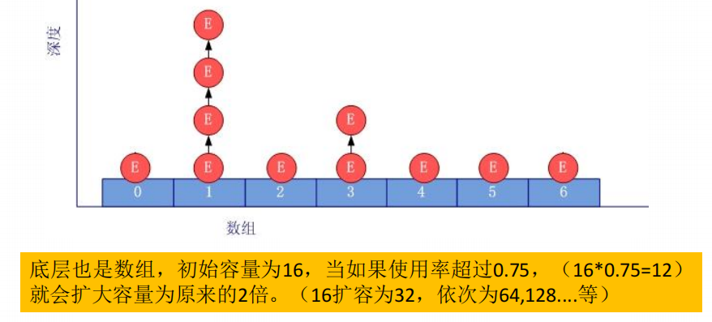

- HashSet中添加元素的过程：

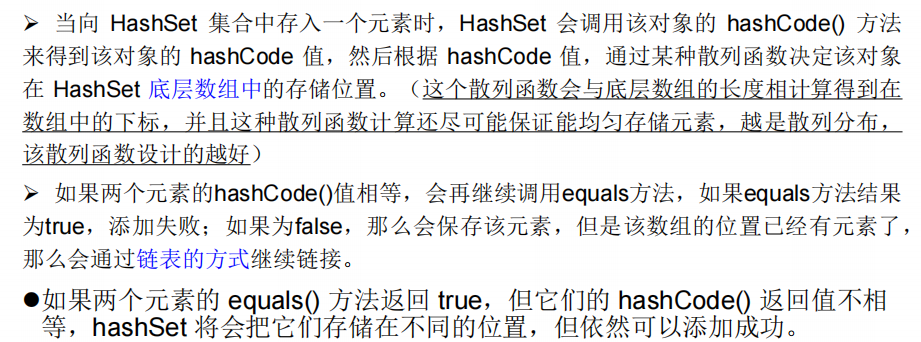

- 重写equals()和hashCode()方法的技巧：**两个方法的重写要保持一致性**

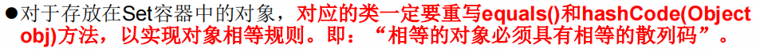

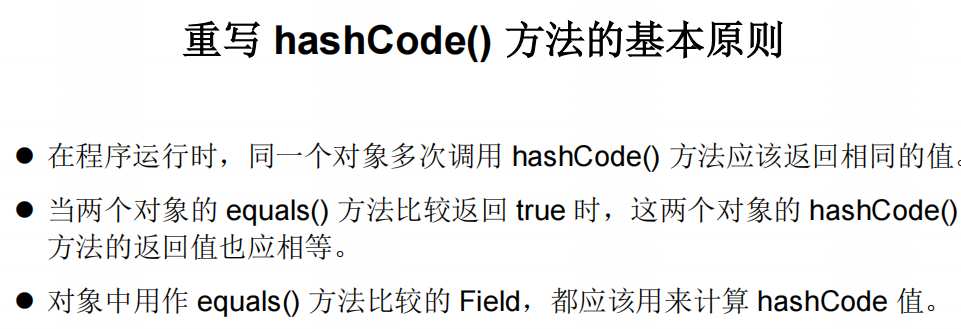

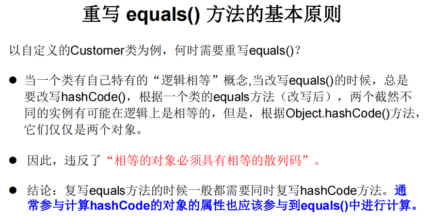

##### LinkedHashSet类

是HashSet的子类，在添加数据的同上，每个数据的同上，每个数据还维护了两个引用，记录了此数据的前一个数据和后一个数据。

因此，对于频繁的插入、删除操作，使用此类效率比HashSet更好。

##### TreeSet类

