# java集合框架

集合数组都是对多个数据进行存储操作的结构，简称java容器。

- 数组存储的特点


- 集合的使用场景


- java集合
  - Collection接口：单列数据，定义了存取一组对象的方法的集合
    - **List接口**：元素有序、可重复的集合。也称为**“动态数组”**。
    - **Set接口**：元素无序、不可重复的集合。（和高中数学的集合概念类似）
    - 还有其他接口

  

  - Map接口：双列数据，保存具有映射关系“**key-value对**”的集合


## Collection接口


### 抽象方法的使用

```java
Collection coll = new ArrayList();
//接口不能调用方法，需要使用实现接口的子类
```


#### 集合与数组间的互换 

1. 向Collection接口的实现类添加数据obj的时候，要求obj所在类要重写equals()方法

2. **集合转化为数组使用`toArrays()`方法；数组转换为集合使用Array类的静态方法`asList()`方法**

例子：

```java
@Test
    public void test2(){
        Collection coll = new ArrayList();
        coll.add(124);
        coll.add(1241415367L);

        //集合——>数组：toArray()方法
        Object[] arr = coll.toArray();
        for (int i = 0; i < arr.length; i++) {
            System.out.println(arr[i]);
        }
        //数组——>集合：Array类的静态方法asList()
        List<String> list = Arrays.asList(new String[]{"bb", "aa", "cc"});
        System.out.println(list);

        //特例
        List<int[]> ints = Arrays.asList(new int[]{1, 2, 4, 5});
        System.out.println(ints);//[[I@ba8a1dc]，一个为一维数组，元素是int类型
        System.out.println(ints.size());//1
    }
```

### Iterator迭代器接口

使用 Iterator 接口遍历集合元素


- 接口的实例化

```java
Iterator iterator = coll.iterator();
```

- 接口方法


#### 用Iterator迭代器遍历集合元素

```java
@Test
public void test(){
    Collection coll = new ArrayList();
    coll.add(124);
    coll.add(1241415367L);

    Iterator iterator = coll.iterator();
    System.out.println(iterator.next());
    //hasNext():判断是否还有下一个元素
    while(iterator.hasNext()){
        //next():①指针下移 ②将下移以后集合位置上的元素返回
        System.out.println(iterator.next());
    }
}
```

#### 删除某个特定元素

```java
@Test
    public void test4(){
        Collection coll = new ArrayList();
        coll.add(124);
        coll.add(1241415367L);
        coll.add("Tom");

        System.out.println(coll);

        //删除集合某个特定元素
        Iterator iterator = coll.iterator();
        while(iterator.hasNext()){
            Object obj = iterator.next();
            if("Tom".equals(obj)){
                iterator.remove();
            }
        }
        //遍历集合
        Iterator iterator1 = coll.iterator();
        while(iterator1.hasNext()){
            System.out.println(iterator1.next());
        }

    }
```


#### 使用foreach循环遍历集合和数组元素

也称为增强for循环


格式：

```java
Collection coll = new ArrayList();
coll.add(124);
coll.add(1241415367L);
coll.add("Tom");

//遍历元素
for(Object obj : coll){
    System.out.println(obj);
}

```

注意：增强for循环是将元素的值重新赋给了obj，然后再显示出来，**修改obj的话原有数组或集合的元素不会改变**

### List子接口

List接口的实现类常用的有：`ArrayList`、`LinkedList`和`Vector`。三者的异同点如下：

- 相同点

存储的都是有序、可重复的数据

- 不同点

`ArrayList`是List的**主要实现类**，是线程不安全的，效率高；底层使用`Object[]`存储

`LinkedList`：对于频繁的插入、删除操作，使用此类效率比`ArrayList`高；底层使用双向链表存储

`Vector`是线程安全的，效率低；

三个类的源码分析略过。。。。

#### 接口方法

List除了从Collection集合继承的方法外，List 集合里添加了一些**根据索引来操作集合元素**的方法，具体如下：

- `void add(int index, Object ele)`:在inde位置插入ele元素
- `boolean addAll(int index, Collection eles)`:从index位置开始将eles中的所有元素添加进来
- `Object get(int index)`:获取指定index位置的元素
- `int indexOf(Object obj)`:返回obj在集合中首次出现的位置，**如果不存在则返回-1**
- `int lastIndexOf(Object obj)`:返回obj在当前集合中末次出现的位置
- `Object remove(int index)`:移除指定index位置的元素，并返回此元素
- `Object set(int index, Object ele)`:设置指定index位置的元素为ele
- `List subList(int fromIndex, int toIndex)`:返回从fromIndex到toIndex位置**（左闭右开）**的子集合

#### 常用方法总结

增：add(Object obj)

删：remove(int index) / remove(Object obj)

改：set( int index, Object ele)

查：get(int index)

插：add( int index, Object ele)

长度：size()

遍历：1）Iterator 迭代器  2）增强for循环 3）普通循环

### Set子接口

#### 特性


- **无序性**

不等于随机性。存储的数据在底层数组中并非按照数组索引的顺序添加，而且**==根据数据的哈希值。==**

- **不可重复性**

保证添加的元素按照equals()判断时，不能返回ture，即：相同的元素只能添加一个

**注意，Set接口中没有定义其他接口方法。**

#### 实现类

Set接口的主要实现类有：`HashSet`、`LinkedHashSet`、`TreeSet`

- `HashSet、`：Set接口的主要实现类；线程不安全；可以存储null值
- `LinkedHashSet、`：是HashSet的子类；可以按照添加的顺序遍历；
- `TreeSet`：底层使用**红黑树**结构存储数据；

##### HashSet类                                                                                                                                                                                                                                                                                                                                                                                                                                                   

- HashSet的底层结构，是`数据+链表`结构：


- HashSet中添加元素的过程：


- 重写equals()和hashCode()方法的技巧：**两个方法的重写要保持一致性**


##### LinkedHashSet类

是HashSet的子类，在添加数据的同上，每个数据的同上，每个数据还维护了两个引用，记录了此数据的前一个数据和后一个数据。

因此，对于频繁的插入、删除操作，使用此类效率比HashSet更好。

##### TreeSet类

TreeSet 是 SortedSet 接口的实现类，TreeSet 可以确保集合元素处于排序状态。

1. **TreeSet中必须添加相同类的对象**

```java
public void test2(){
    TreeSet set = new TreeSet();
    set.add(124);
    set.add("hellos");//不能添加不同类的对象

    System.out.println(set);//ClassCastException
}
```

- TreeSet的自然排序（对象的类要去实现Comparable接口）

自然排序中，比较两个对象是否相同的标准为：`compareTo()`返回0；而不是equals()返回true

举例：

```java
@Test
public void test3(){
    TreeSet set = new TreeSet();//构造器不加参数，默认自然排序

    set.add(new User("tom",24));
    set.add(new User("jack",25));
    set.add(new User("jerry",54));
    set.add(new User("rick",64));
    set.add(new User("rick",56));

    Iterator iterator = set.iterator();
    while( iterator.hasNext()){
        System.out.println(iterator.next());
    }
}

public class User implements Comparable{
	//...其他内容
    //..
    @Override
    public int compareTo(Object o) {
        if ( o instanceof User){
            User user = (User) o;
//            return this.name.compareTo(user.name);//按照姓从小到打排列
//            return -this.name.compareTo(user.name);//姓名从大到小排序
            int compare = this.name.compareTo(user.name);
            if(compare !=0){
                return compare;
            }else{
                return Integer.compare(this.age,user.age);
                //姓名先从小到大排列，年龄再从小到大排列
            }
        }else{
            throw new RuntimeException("input unrecognisable!");

        }

    }
}
```

- TreeSet的定制排序

定制排序中，比较两个对象是否相同的标准为：`compare()`返回0；而不是equals()返回true

```java
@Test
    public void test4(){
        Comparator comparator = new Comparator(){
            //按照年龄从小到大排序
            @Override
            public int compare(Object o1, Object o2) {
                if(o1 instanceof User && o2 instanceof User){
                    User u1 = (User) o1;
                    User u2 = (User) o2;
                    return Integer.compare(u1.getAge(),u2.getAge());
                }else{
                    throw new RuntimeException("Input Unrecognisable");
                }
            }
        };

        TreeSet set = new TreeSet(comparator);

        set.add(new User("tom",24));
        set.add(new User("jack",25));
        set.add(new User("jerry",54));
        set.add(new User("rick",64));
        set.add(new User("rick",56));

        Iterator iterator = set.iterator();
        while( iterator.hasNext()){
            System.out.println(iterator.next());
        }
    }
```

## Map接口

### 概述

#### 继承树

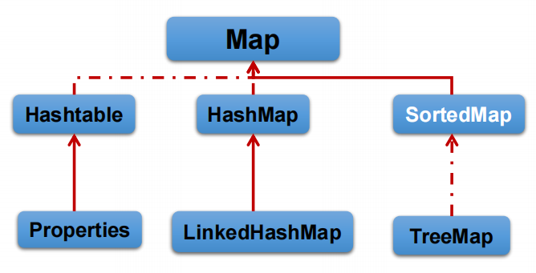                          

- HashMap：作为Map的**主要实现类**；线程不安全的、效率高；可以存储null的key和value；底层使用`数组+链表+红黑树(JDK 1.8之后)`的结构
  - LinkedHashMap：在HashMap基础上，添加了一对指针，指向了前一个和后一个元素（同理ArrayList类和LinkedList类的关系），可以按照添加的顺序遍历；**对于频繁的遍历操作**，此类执行效率高于HashMap；
- TreeMap：类似于TreeSet，可以对添加的key-value对进行排序，实现排序遍历（**按照key来排**）；底层使用**红黑树**
- Hashtable：古老的实现类，会很少用；线程安全的，效率低；不能存储null的key和value
  - Properties：常用来处理配置文件，key-value都是String类型。

#### 内存特点

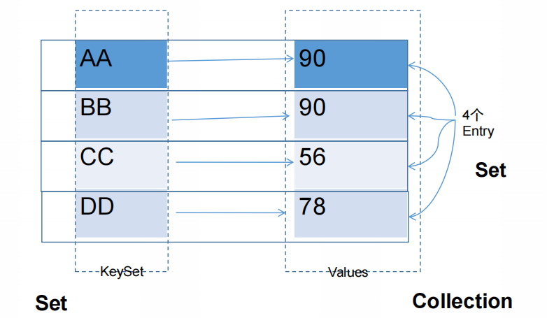

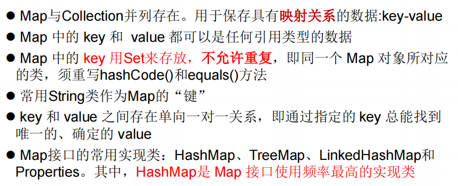

- Map中的key：无序的、**不可重复的（即要求，HasMap中的key所在的类要重写equals()和hasdCode()方法）**、使用Set存储；
- Map中的value：无序的、可重复的，使用Collection存储；**(value所在的类要重写equals()方法）**
- 一个key-value键值对：构成了一个Entry对象
- Map中的entry：无序的、不可重复的、使用Set存储；

### Map接口的常用方法

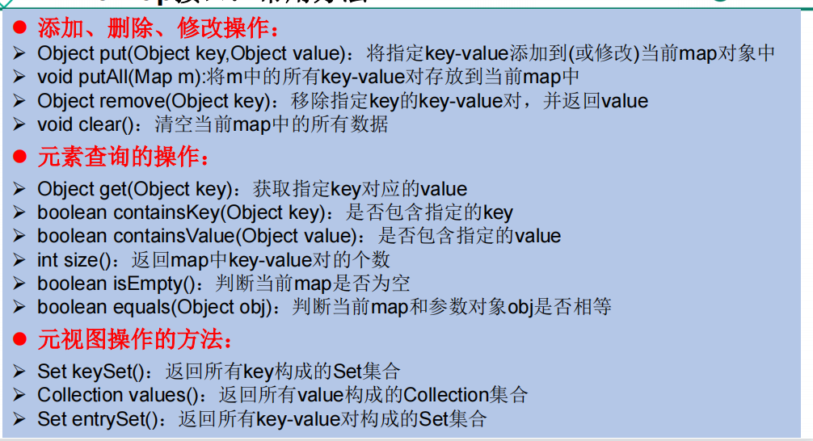

一些例子：

```java
	@Test
    public void test1(){
        Map map = new HashMap();
        //put()
        //添加操作
        map.put("AA",123);
        map.put(23,4567);
        map.put("BB",83);
        //修改操作
        map.put("AA",123134);
        System.out.println(map);//结果为：{AA=123134, BB=83, 23=4567}

        HashMap map1 = new HashMap();
        map1.put("cc",243);
        map1.put("dd",243);

        //putAll()
        map.putAll(map1);
        System.out.println(map);

        //remove()
        Object cc = map.remove("cc");
        System.out.println(cc);//243
        Object cc1 = map.remove("cc",243);
        System.out.println(cc1);//false

        //clear()
        map.clear();
        System.out.println(map);//结果为{}
        System.out.println(map.size());//0
    }
```

- 遍历操作

```java
	@Test
    public void test2(){
        Map map = new HashMap();
        map.put("AA",123);
        map.put(23,4567);
        map.put("BB",83);
        map.put("cc",83);

        //遍历所以的key集：keySet()
        Set set = map.keySet();//得到所有key组成的Set集合
        Iterator iterator = set.iterator();
        while(iterator.hasNext()){
            System.out.println(iterator.next());
        }
        System.out.println("***************************");
        //遍历所有的value集合：values()
        Collection values = map.values();
//        Iterator iterator1 = values.iterator();
//        while(iterator1.hasNext()){
//            System.out.println(iterator1.next());
//        }
        for(Object obj : values){
            System.out.println(obj);
        }
        System.out.println("***************************");
        //遍历所有的key-value:
        //方式一：entrySet()方法
        Set entrySet = map.entrySet();
        Iterator iterator1 = entrySet.iterator();
        while(iterator1.hasNext()){
//            System.out.println(iterator1.next());
            Object o = iterator1.next();
            Map.Entry entry = (Map.Entry) o;
            System.out.println(entry.getKey()+"---->"+entry.getValue());
        }
        System.out.println("***************************");
        //方式二：keySet()+ get(Object key)
        Set set1 = map.keySet();//得到所有key组成的Set集合
        Iterator iterator2 = set.iterator();
        while(iterator2.hasNext()){
            Object key = iterator2.next();
            Object value = map.get(key);
            System.out.println(key + "======="+ value);
        }
    }
```

### 实现类：HashMap

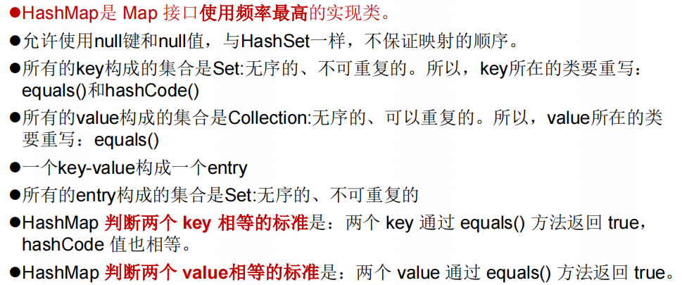

#### 💡HaspMap的底层实现（面试）

- jdk7的实现：

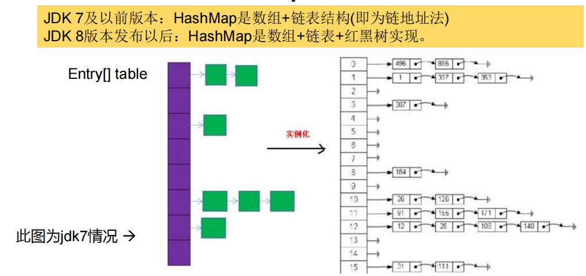

- jdk8的相关改进

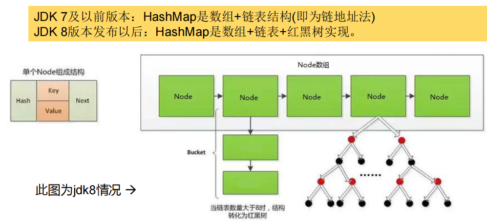

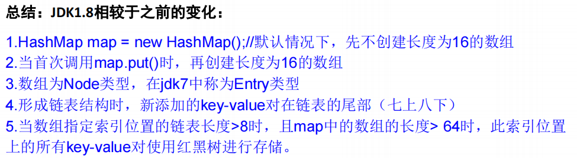

- **其他具体内容于底层源码分析暂略**

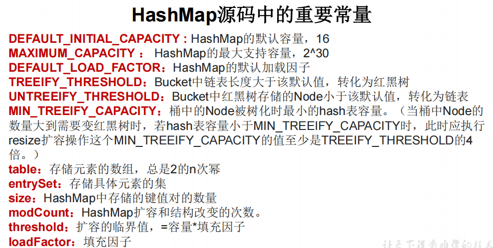

#### 子类LinkedHashMap的底层实现(了解)                                                                                                                                                                                                                                                                                                                                                                                                                                                                                                                                                                                                                                                                                                                                                                                                                                                                                                                                                                                                                                                                                                                                                                                                                                                                                                                                                                                                                                                                                                                                                                                                                                                                                                                                                                                                                                                                                                                                                                                                                                                                               

略

### 实现类：TreeMap类

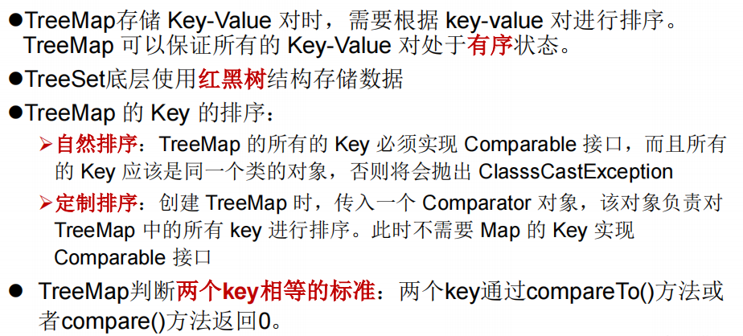

### 实现类：Hashtable

很少使用，最多面试考一下Hashtable和HashMap的不同

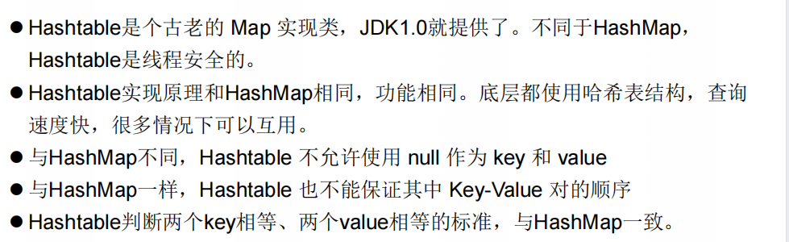

### 实现类：Properties

- Properties 类是 Hashtable 的子类，该对象用于处理属性文件

- 由于属性文件里的 key、value 都是字符串类型，所以 **Properties 里的 key 和 value 都是字符串类型**

- 存取数据时，建议使用`setProperty(String key,String value)`方法和`getProperty(String key)`方法

## Collections工具类

Collections 是一个操作Collection 和 Map 等集合的工具类。（操作数组的工具类：Arrays）

工具类的特点，方法基本上都是静态方法。

### 常用方法

#### 排序操作

- `reverse(List)`：反转 List 中元素的顺序
- `shuffle(List)`：对 List 集合元素进行随机排序
- `sort(List)`：根据元素的自然顺序对指定 List 集合元素按升序排序
- `sort(List，Comparator)`：根据指定的 Comparator 产生的顺序对 List 集合元素进行排序
- `swap(List，int， int)`：将指定 list 集合中的 i 处元素和 j 处元素进行交换

#### 查找、替换

- `Object max(Collection)`：根据元素的自然顺序，返回给定集合中的最大元素
- `Object max(Collection，Comparator)`：根据 Comparator 指定的顺序，返回给定集合中的最大元素
- `Object min(Collection)`：同理
- `Object min(Collection，Comparator)`：同理
- `int frequency(Collection，Object)`：返回指定集合中指定元素的出现次数
- `void copy(List dest,List src)`：将src中的内容复制到dest中 

```java
	@Test
    public void test1(){
        List list = new ArrayList();
        list.add(123);
        list.add(156);
        list.add(-23);
        list.add(1);
        list.add(0);

        //报错：IndexOutOfBoundsException: Source does not fit in dest
        //List dest = new ArrayList();
        //Collections.copy(dest,list);
        //System.out.println(dest);
        
        //正确写法
        List dest = Arrays.asList(new Object[list.size()]);
        //造了一个元素为Object的数组
        Collections.copy(dest,list);
        System.out.println(dest);
        
    }
```

- `boolean replaceAll(List list，Object oldVal，Object newVal)`：使用新值替换List 对象的所有旧值

#### 同步控制

Collections 类中提供了多个 `synchronizedXxx()` 方法，该方法可使将指定集合**包装成线程同步的集合**，从而可以解决多线程并发访问集合时的线程安全问题。

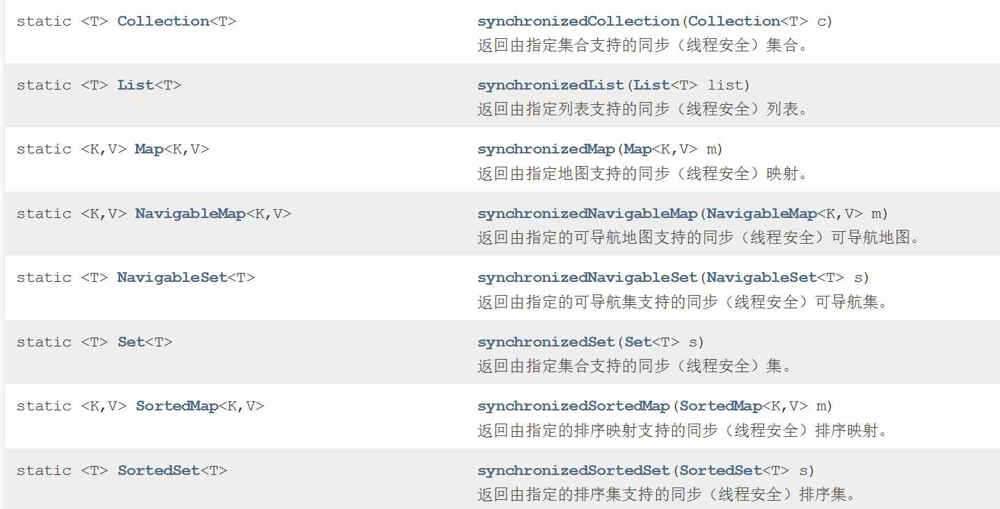

## 队列Queue

### 实现的集合


### 优先队列PriorityQueue

详见api

### 单调队列


## 栈Stack

### 实现的集合

#### Stack


#### LinkedList


### 单调栈
