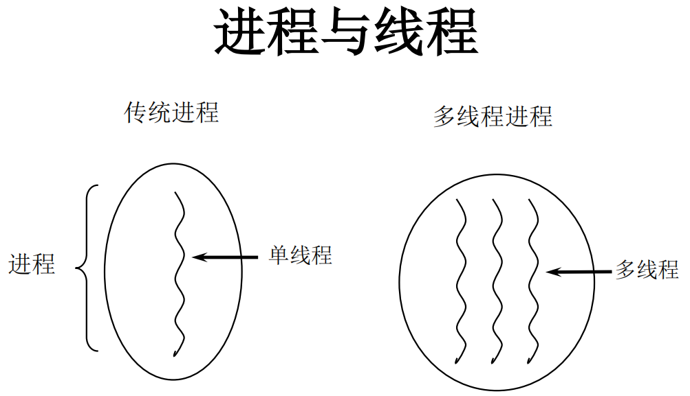

# 基本概念：程序、进程、线程

## 程序

**程序(program)**是为完成特定任务、用某种语言编写的一组指令的集合。

即指一段静态的代码，静态对象。

## 进程

**进程(process)**是程序的一次执行过程，或是正在运行的一个程序。

进程是一个动态的过程：有它自身的产生、存在和消亡的过程。（即生命周期）


## 线程

进程可进一步细化为**线程（thread）**，是**一个程序内部的一条执行路径**。



- 若一个进程同一时间**并行**执行多个线程，就是支持多线程的

- **线程作为调度和执行的单位，每个线程拥有独立的运行栈和程序计数器(pc)**，线程切换的开销小 

- 一个进程中的多个线程共享相同的内存单元/内存地址空间它们从同一堆中分配对象，可以访问相同的变量和对象。这就使得线程间通信更简便、高效。但多个线程操作共享的系统资源可能就会带来安全的隐患。

### 线程的生命周期

要想实现多线程，必须在主线程中创建新的线程对象。

Java语言使用**Thread类及其子类的对象来表示线程**，在它的一个完整的生命周期中通常要经历如下的**五种状态**：

- 新建状态:

  使用 **new** 关键字和 **Thread** 类或其子类建立一个线程对象后，该线程对象就处于新建状态。它保持这个状态直到程序 **start()** 这个线程。

- 就绪状态:

  当线程对象调用了**start()方法之后**，该线程就进入就绪状态。就绪状态的线程处于就绪队列中，要等待JVM里线程调度器的调度。

- 运行状态:

  如果就绪状态的线程获取 CPU 资源，就可以执行 **run()**，此时线程便处于运行状态。处于运行状态的线程最为复杂，它可以变为阻塞状态、就绪状态和死亡状态。

- 阻塞状态:

  如果一个线程执行了**sleep（睡眠）、suspend（挂起）等方法**，失去所占用资源之后，该线程就从运行状态进入阻塞状态。在睡眠时间已到或获得设备资源后可以重新进入就绪状态。可以分为三种：

  - **等待阻塞**：运行状态中的线程执行 wait() 方法，使线程进入到等待阻塞状态。
  - **同步阻塞**：线程在获取 synchronized 同步锁失败(因为同步锁被其他线程占用)。
  - **其他阻塞**：通过调用线程的 sleep() 或 join() 发出了 I/O 请求时，线程就会进入到阻塞状态。当sleep() 状态超时，join() 等待线程终止或超时，或者 I/O 处理完毕，线程重新转入就绪状态。

- 死亡状态:

  一个运行状态的线程完成任务或者其他终止条件发生时，该线程就切换到终止状态


## 单核与多核CPU的理解


## 并行与并发

- 并行：多个CPU同时执行多个任务。比如：多个人同时做不同的事。  
- 并发：一个CPU(采用时间片)同时执行多个任务。比如：秒杀、多个人做同一件事。

## 使用多线程的优点

以单核CPU为例，只使用单个线程先后完成多个任务（调用多个方法），肯定比用多个线程来完成用的时间更短，为何仍需多线程呢？


- 何时使用多线程：


# 线程的创建和使用

## 方式一：继承Thread类

### 步骤

1. 定义子类继承Thread类。

2. 子类中重写Thread类中的run方法。

3. 创建Thread子类对象，即创建了线程对象。

4. 调用线程对象start方法：1)启动线程；2)调用run方法

举例如下：
```java
/*文件名：ThreadTest.java*/

//1.定义子类继承Thread类
class MyThread extends Thread{
    
    //2.子类重写Thread中的run方法
    @Override
    public void run(){
        //....
        //将此线程要执行的操作声明在run()中
    }
}

public class ThreadTest{
    public static void main(String[] args){
        //3.创建子类对象
        MyThread t1 = new MyThread();
        //4.调用子类start()方法
        t1.start();
        
        //main方法中的其他操作仍然还在主线程中进行
        System.out.println("some other operation...");
        
    }
   
}
```

### 注意点


### Thread类的常用方法

|                 方法名                 | 说明                                                         |
| :------------------------------------: | :----------------------------------------------------------- |
|           public void run()            | 通常需要重写此方法，将创建的线程要执行的操作声明在此方法中   |
|          public void start()           | 启动当前线程；调用当前线程的run()方法                        |
| public final void setName(String name) | 设置当前线程的名字                                           |
|               getName()                | 获取当前线程的名字                                           |
|                 join()                 | 当某个程序执行流中调用其他线程的 join() 方法时，调用线程将被阻塞，直到 join() 方法加入的 join 线程执行完为止。 |
|        final boolean isAlive()         | 判断当前线程是否存活                                         |
|                                        |                                                              |
|              **静态方法**              | **说明**                                                     |
|          static void yield()           | 暂停当前正在执行的线程对象，并执行其他线程。                 |
|     static Thread currentThread()      | 返回对当前正在执行的线程对象的引用。                         |
|      static sleep(long millitime)      | 在指定的毫秒数内让当前正在执行的线程休眠（暂停执行），此操作受到系统计时器和调度程序精度和准确性的影响。 |
|                                        |                                                              |

### 线程的优先级

线程的优先级在Thread 类的属性中定义，具体为：


- 涉及的方法：


- 注意


## 方式二：实现Runnable接口

### 步骤

1. 定义子类A，实现Runnable接口。
2. 子类A中**重写**Runnable接口中的**run方法**。
3. 通过Thread类含参构造器创建线程对象。
4. 将**Runnable接口的子类对象a**作为实际参数传递给**Thread类的构造器**中。
5. 调用Thread类的start()方法：1）开启线程；2）调用Runnable子类接口的run方法。

举例如下：

```java
/*文件名为ThreadTest.java*/

//1.定义子类，实现Runnable接口
class MyThread implements Runnable{
    
    //2.子类中重写Runnable接口中的run方法。
    @Override
    public void run(){
        //...
        //将此线程要执行的操作声明在run()中
    }
}

public class ThreadTest{
    public static void main(String[] args){
        //3.通过Thread类含参构造器创建线程对象
        MyThread myThread = new MyThread();
        //4.将Runnable接口的子类对象作为实际参数传递给Thread类的构造器中
        Thread t1 = new Thread(myThread);
        
        //5.调用Thread类的start()方法
       	t1.start();
    }
}
```

### 注意点

- 线程名字叫t1，而不叫myThread。
- 另外，如果需要再启动一个新的线程，应该再创建一个Thread对象：`Thread t2 = new Thread()`;
- 同一个子类对象a中的属性，是new出来的所以thread对象（t1, t2,....）共有的，不需要使用static关键字

## 两种方式的联系和区别

- 联系

1. Thread类本质上也实现了Runnable接口，即：

`public class Thread extends Object implements Runnable`

2. 两种方式都需要重写run()方法，将线程要执行的逻辑声明在run()中


- 区别

1. 实现的方式没有类的单继承性的局限性
2. 实现的方式更适合：多个线程有共享数据的情况

