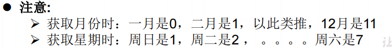

# 字符串相关的常用类

## String 类

### String类的特性


- String类实习了Serializable 接口： 字符串是支持序列化的
- String类实习了Comparable接口：字符串是可以比较大小的
- String 代表**不可变**的字符串序列
  - 通过字面量的方式（区别于new方式，如：`String s1 = "abcds";`）给一个字符串赋值，此时的字符串值赋值在字符串常量池中。字符串常量池中不会存储相同内容的字符串。
  - 对字符串重新赋值、进行连接操作时，指定了新的内存区域赋值，不能在原有的value上进行赋值；

### String对象的实例化

```java
String str = "hello";

//本质上this.value = new char[0];
String s1 = new String(); 

//this.value = original.value;
String s2 = new String(String original); 

//this.value = Arrays.copyOf(value, value.length);
String s3 = new String(char[] a); 

String s4 = new String(char[] a,int startIndex,int count);
```


### 字符串不同拼接操作的对比

```java
@Test
public void trimTest(){
    String s1 = "javaEE";
    String s2 = "hadoop";

    String s3 = "javaEEhadoop";
    String s4 = "javaEE" + "hadoop";
    String s5 = s1 + "hadoop";
    String s6 = "javaEE" + s2;
    String s7 = s1 + s2;

    System.out.println(s3 == s4);//true
    System.out.println(s3 == s5);//false
    System.out.println(s3 == s6);//false
    System.out.println(s3 == s7);//false
    System.out.println(s5 == s6);//false
    System.out.println(s5 == s7);//false
    System.out.println(s6 == s7);//false
}
```


面试题：返回的结果分别是什么？？？

```java
public class StringTest {
    String str = new String("good");
    char[] ch = { 't', 'e', 's', 't' };
    public void change(String str, char ch[]) {
        str = "test ok";
        ch[0] = 'b'; 
	}
    public static void main(String[] args) {
        StringTest ex = new StringTest();
        ex.change(ex.str, ex.ch);
        System.out.println(ex.str + " and ");   //good
        System.out.println(ex.ch);              //test
    } 
}
```

### String类的常用方法


### String类与其他结构的转换

#### 与基本数据类型和包装类

- String转化为基本数据类型和包装类

方法：调用包装类的静态方法`parseXxxx(str);`

- 基本数据类型和包装类转化为String

方法：调用String重载的`valueOf(xxxx);`

#### 与char[]（字符数组）之间的转换

- String——>char[]数组

方法：调用String 的 `toCharArray()`方法

- char[]数组——>String

方法：调用String的构造器

#### 与byte[]（字节数组）之间的转换

- String——>byte[]数组：编码的过程

方法：调用String 的 `getBytes()`方法

- byte[]数组——>String：解码的过程

方法：调用String的构造器：`new String(xxxx, 编码集)`

## StringBuffer类、StringBuilder类

### 定义

> 当对字符串进行修改的时候，需要使用 StringBuffer 和 StringBuilder 类。
>
> 和 String 类不同的是，StringBuffer 和 StringBuilder 类的对象能够被多次的修改，并且不产生新的未使用对象。

- StringBuffer类：**可变的**字符序列；线程安全的；底层使用char[]存储
- StringBuilder类：**可变的**字符序列；线程不安全的；底层使用char[]存储

**注意：可变的字符序列指的是：底层的char[] value字符串数组可以不断扩容。**

### StringBuffer的常用方法


| 方法名                                  | 描述                                                   |
| --------------------------------------- | ------------------------------------------------------ |
| public StringBuffer append(String s)    | 将指定的字符串追加到此字符序列。                       |
| public StringBuffer reverse()           | 将此字符序列用其反转形式取代。                         |
| public delete(int start, int end)       | 移除此序列的子字符串中的字符。                         |
| public insert(int offset, int i)        | 将 `int` 参数的字符串表示形式插入此序列中              |
| insert(int offset, String str)          | 将 `str` 参数的字符串插入此序列中                      |
| replace(int start, int end, String str) | 使用给定 `String` 中的字符替换此序列的子字符串中的字符 |
| void setCharAt(int index, char ch)      | 将给定索引处的字符设置为 `ch`。                        |
| char charAt(int index)                  | 返回此序列中指定索引处的 `char` 值。                   |
| ...                                     | ....                                                   |

**==注意，涉及有开始结束位置的，都是“左闭右开”的==**

- 方法的总结：


增：`append(xxxx)`

删：`delete(int start, int end)`

改：`setCharAt(int index, char ch)`、`replace(int start, int end, String str)`

查：`charAt(int index)`

插：`insert(int offset, int i)`

长度：`length()`

(少用)遍历：for循环、charAr()、toString()方法

### StringBuffer、StringBuilder和String的效率对比

由高到低：StringBuilder > StringBuffer > String


# 时间日期API

##  JDK8之前

### java.lang.System类

System类提供的public static long currentTimeMillis()用来**返回当前时间与1970年1月1日0时0分0秒之间以毫秒为单位的时间差（也叫时间戳）**。

格式：

```java
long time = System.currentTimeMillis();
System.out.println(time);//1627269906781
```

### java中两个Date类

#### java.util.Date类

表示特定的瞬间，精确到毫秒


注意，`Date(long date)`构造器的参数是毫秒，创建了一个指定时间的Date对象

#### java.sql.Date类

作用：创建sql数据库中的日期

构造器：`Date(long date)`创建一个指定时间的Date对象

#### 两个对象间的转换

- util.Date对象——>sql.Date对象（相当于**从父类往子类转**）

方法一：利用多态性，强制类型转换

```java
Date date = new java.sql.Date(14525554414L);
java.sql.Date date1 = (java.sql.Date) date;
System.out.println(date);//1970-06-18
System.out.println(date1);//1970-06-18
```

方法二：利用Date类的getTime()方法

```java
Date date2 = new Date();
java.sql.Date date3 = new java.sql.Date(date2.getTime());
System.out.println(date3.toString());//2021-07-26
System.out.println(date3);//2021-07-26
```

### SimpleDateFormat类

Date类的API不易于国际化，大部分被废弃了，**java.text.SimpleDateFormat**类是一个不与语言环境有关的方式来格式化和解析日期的具体类。

它允许进行：1)**格式化：日期——>文本**；2）**解析：文本——>日期**

#### 格式化


注意，参数pattern可以借助如下简写字母，进行指定：


#### 解析


### Calendar(日历)类

是一个抽象类

#### 实例化

由于是抽象类，不能直接new一个对象。有两个办法:

- 创建其子类GregorianCalendar的对象

- 调用静态方法使用Calendar.getInstance()

格式：`Calendar calendar = Calendar.getInstance();`

#### 常用方法

- get()——获取Calendar类中的一些属性

举例：

```java
int day = calendar.get(Calendar.DAY_OF_MONTH);
System.out.println(day);//26
```

其他：


- void set()——将如上的指定的属性设置成其他值


```java
calendar.set(Calendar.DAY_OF_MONTH,31);
day = calendar.get(Calendar.DAY_OF_MONTH);
System.out.println(day);//31
```

- getTime()——得到一个Date对象，相对于将日历类——>Date对象

```java
Date date4  = calendar.getTime();
System.out.println(date4);//Sat Jul 31 14:22:15 CST 2021
```

- setTime()——反过来，Date类——>日历类

```java
Date date5 = new Date();
calendar.setTime(date5);
System.out.println(calendar.get(Calendar.DAY_OF_WEEK));
```



## JDL 8中


### LocalDate、LocalTime、LocalDateTime 类


#### 实例化


#### 获取属性——getXxx()方法


#### 设置属性——withXxxxx()方法


体现了**不可变性**，因为修改完相应的属性后返回了新的对象。

#### 加减


仍然体现了**不可变性**，因为修改完相应的属性后返回了新的对象。

### Instant类


#### 实例化


举例：

```java
Instant instant = Instant.now();
```

通过给定的毫秒数获取Instant实例


举例
```java
Instant instant1 = Instant.Instant.ofEpochMilli(12846555196L);
```


#### 其他方法


### DateTimeFormatter 类

类似于SimpleDateFormat类，用于格式化或解析日期、时间

#### 实例化

- 方式一：

预定义的标准格式。如：`ISO_LOCAL_DATE_TIME`、`ISO_LOCAL_DATE`、 `ISO_LOCAL_TIME`

- 方式二：

本地化相关的格式。如：`ofLocalizedDateTime(FormatStyle.LONG)`

- 方式三

自定义的格式。如：`ofPattern(“yyyy-MM-dd hh:mm:ss”)`

#### 具体使用

略

## 其他API


# java 比较器

在Java中经常会涉及到对象数组的排序问题，那么就涉及到对象之间的比较问题。

Java实现对象排序的方式有**两种接口**：

1. **自然排序：java.lang.Comparable**
2. **定制排序：java.util.Comparator**

## Comparable接口——自然排序

### 举例

完成接口的类有：


### 实现方式

实现 Comparable 的类必须实现 compareTo(Object obj) 方法，两个对象即通过 `compareTo(Object obj)` 方法的返回值来比较大小。

- compareTo()方法重写的规则

如果当前对象this大于形参对象obj，则返回正整数，

如果当前对象this小于形参对象obj，则返回负整数，

如果当前对象this等于形参对象obj，则返回零。

- 例子：自定义的Goods对象的大小比较


## Comparator接口——定制排序

> 当元素的类型没有实现java.lang.Comparable接口而又不方便修改代码，或者实现了java.lang.Comparable接口的排序规则不适合当前的操作，那么可以考虑使用 Comparator 的对象来排序，强行对多个对象进行整体排序的比较。

### 实现方式

重写`compare(Object o1,Object o2)`方法，比较o1和o2的大小：

- 如果方法返回正整数，则表示o1大于o2；
- 如果返回0，表示相等；
- 返回负整数，表示o1小于o2。


例子：


## 对比

Comparable接口的方式一旦指定，能够保证接口的实现类的对象在任何位置都可以比较大小

Comparator接口属于临时性比较，


# System类

不可被实例化，相当于是一个工具类。

## 成员变量

| `static PrintStream` | `err`  “标准”错误输出流。 |
| -------------------- | ------------------------- |
| `static InputStream` | `in`  “标准”输入流。      |
| `static PrintStream` | `out`  “标准”输出流       |

## 成员方法

| 方法名                            | 作用                                                         |
| --------------------------------- | ------------------------------------------------------------ |
| native long currentTimeMillis()： | 返回当前时间（以毫秒为单位）。                               |
| void exit(int status)：           | 终止当前运行的Java虚拟机。                                   |
| void gc()                         | 该方法的作用是请求系统进行垃圾回收。至于系统是否立刻回收，则取决于系统中垃圾回收算法的实现以及系统执行时的情况 |
| String getProperty(String key)：  | 该方法的作用是获得系统中属性名为key的属性对应的值。系统中常见的属性名以及属性的作用如下表所示 |
| ...                               | ...                                                          |

# Math类


举例

```java
public void MathTest(){
	int abs = Math.abs(-123);
	System.out.println(abs);
}
```


# BigInteger与BigDecimal

## BigInteger类

> Integer类作为int的包装类，能存储的最大整型值为2^31^-1，Long类也是有限的最大为2^63^-1。如果要表示再大的整数，不管是基本数据类型还是他们的包装类都无能为力，更不用说进行运算了

BigInteger表示：不可变的任意精度整数。


- 构造器

`BigInteger (String val)`：根据字符串构建BigInteger对象

- 方法


## BigDecial类


- 构造器

`public BigDecimal(double val)` 

`public BigDecimal(String val)`

- 方法


# 枚举类enum

## 定义


另外，如果枚举类中只有一个对象，则可以作为单例模式的实现方式。

## 枚举类的定义

### 方式一：自定义

- 方法
  - 私有化类的构造器，保证不能在类的外部创建其对象
  - 在类的内部创建枚举类的实例。声明为：`public static final` 
  - 对象如果有实例变量，应该声明为private final，并在构造器中初始化

- 举例：季节

```java
class Season{
    //1.声明Season对象的属性：
    private final String seasonName;
    private final String seasonDesc;
    //2.私有化类的构造器，并给对象属性赋值
    private Season(String seasonName,String seasonDesc){
        this.seasonName = seasonName;
        this.seasonDesc = seasonDesc;
    }
    //3.提供当前枚举类的多个对象：public static final的
    public static final Season Spring = new Season("春天", "春暖花开");
    public static final Season Summer = new Season("夏天", "夏日炎炎");
    public static final Season Autumn = new Season("春天", "秋高气爽");
    public static final Season Winter = new Season("春天", "白雪皑皑");

    //4.其他诉求：获取枚举类对象的属性
    public String getSeasonName() {
        return seasonName;
    }
    public String getSeasonDesc() {
        return seasonDesc;
    }
    // 5.其他诉求:toString()方法
    @Override
    public String toString() {
        return "Season{" +
                "seasonName='" + seasonName + '\'' +
                ", seasonDesc='" + seasonDesc + '\'' +
                '}';
    }
}
```

### 方式二：enum关键字

- 使用说明


- 实例：季节

```java
enum Season1{
    //1.提供当前枚举类的多个对象：逗号隔开，分号结尾
    SPRING("春天", "春暖花开"),
    SUMMER("夏天", "夏日炎炎"),
    AUTUMN("秋天", "秋高气爽"),
    WINTER("冬天", "白雪皑皑");

    //2.声明Season对象的属性：
    private final String seasonName;
    private final String seasonDesc;
    //3.私有化类的构造器，并给对象属性赋值
    private Season1(String seasonName,String seasonDesc){
        this.seasonName = seasonName;
        this.seasonDesc = seasonDesc;
    }

    //4.其他诉求：获取枚举类对象的属性
    public String getSeasonName() {
        return seasonName;
    }
    public String getSeasonDesc() {
        return seasonDesc;
    }
}
```

