# Object类

lang包下的类，是所有Java类的根父类，即：如果在类的声明中未使用extends关键字指明其                                                                                                                                                                                                                                                                                                                                                                                                                                                                                                                                                                                                                                                                                                                                                                                                                                                                                                                                                                                                                                                                                                                                                                                                                                                                                                                                                                                                                                                                                                                                                                                                                                                                                                                                                                                                                                                                                                                                                                                                                                                                                                                                                                                                                                                                                                                               父类，则默认父类为java.lang.Object类。

#### 构造器

只有一个空参的构造器

```java
Object();
```

#### 属性

无

#### 方法

|          方法名字          | 用法                                                         |
| :------------------------: | ------------------------------------------------------------ |
|  protected Object clone()  | 创建并返回此对象的副本，少用。                               |
| protencted void finalize() | 当垃圾收集确定不再有对该对象的引用时，垃圾收集器在对象上调用该对象。<br />注意，一般不主动调用。 |
|       int hashcode()       | 返回对象的哈希码值。                                         |
|     String toString()      | 返回对象的字符串表示形式（类名和应用地址）。                 |
| boolean equals(Object obj) | 判断一些其他对象是否等于此对象。                             |

##### equals()方法

所有类都继承了Object，也就获得了equals()方法。equals()方法可以被重写。

- 用法


例子：

```java
Customer cust1 = new Customer("Tom",22);
Customer cust2 = new Customer("Tom",22);
System.out.println(cust1==cust2); //false
System.out.println(cust1.equals(cust2)); //false
```


- 重写equals()方法，使得自定义类在使用时候比较的是两个对象的”实体内容“是否相同

重写后的方法体大概长这样：

```java
public boolean equals(Object obj){
    if(this == obj){
        //地址一样
        return true;
    }
    if(obj instanceof Xxxxx){//Obj和要比较的对象的对象类型相同
        Xxxx cuts1 = (Xxxx)obj; //obj形参强转成相同对象类型
        //具体的功能实现
    }
    return false;
}
```

**在开发中使用快捷键重写equals()方法**

##### toString()方法

toString()方法在Object类中定义，其返回值是String类型，返回**类名和它的引用地址**。

- 用法


- 重写方法，使得自定义类在调用方法时候返回**类名和实体内容信息**

Eclipse中，有快捷方法生成重写方法。Source-->toString

# Wrapper包装类/封装类

#### 单元测试

使用Junit的java包，声明测试方法为public、没有返回值和形参。（在真实开发中，直接@Test然后导包就行）

在方法体内测试相关的代码，**只需要左键双击测试方法名**，然后run as - Junit Test1

```java
package test;

import org.junit.Test;

public class JunitTest1 {
	@Test
	public void umrobotTest() {
		//测试代码
	}
  
}
```

执行结构没有出现异常，为绿条；否则是红条。

单元测试的好处很多，有：

> 可以确保单个方法按照正确预期运行，如果修改了某个方法的代码，只需确保其对应的单元测试通过，即可认为改动正确。此外，测试代码本身就可以作为示例代码，用来演示如何调用该方法。
>
> 使用JUnit进行单元测试，我们可以使用断言（`Assertion`）来测试期望结果，可以方便地组织和运行测试，并方便地查看测试结果。此外，JUnit既可以直接在IDE中运行，也可以方便地集成到Maven这些自动化工具中运行。

#### 包装类的定义

针对八种基本数据类型定义相应的引用类型—包装类（封装类）


#### 使用

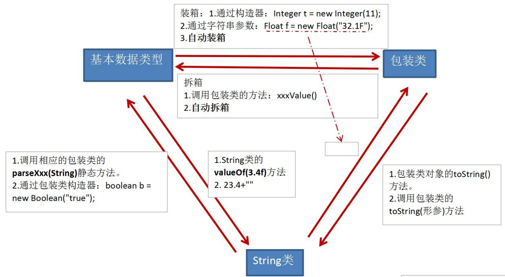

# 抽象类

> 随着继承层次中一个个新子类的定义，类变得越来越具体，而父类则更一般，更通用。类的设计应该保证父类和子类能够共享特征。有时将一个父类设计得非常抽象，以至于它没有具体的实例，这样的类叫做抽象类。

#### 类的声明

 Java 语言中使用 `abstract class` 来定义抽象类

#### abstract关键字的使用

见：？？？

#### 抽象类的使用场景


#### 抽象类的匿名子类

语法格式

```java
public class PersonTest{
    public static void main(String[] args){
        
        //***************创建抽象类的匿名子类**************
        //创建了匿名子类(抽象Person类的子类)的对象：P
        Person p = new Person(){
			@Override
			public void eat() {
				System.out.println(" can eat");
			}
			@Override
			public void breath() {
				System.out.println("can breath");
			}	
		};//分号不要忘  
    }
}

class abstract Person{
    public void eat(){
		syso("some method");
    }
	public void breath(){
        syso("some method");
    }
}

```


# 字符串相关的常用类

## String 类

### String类的特性

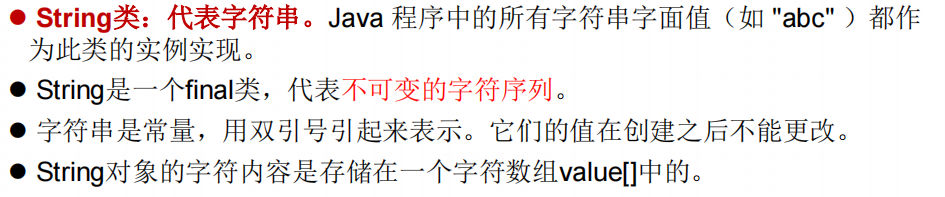

- String类实习了Serializable 接口： 字符串是支持序列化的
- String类实习了Comparable接口：字符串是可以比较大小的
- String 代表**不可变**的字符串序列
  - 通过字面量的方式（区别于new方式，如：`String s1 = "abcds";`）给一个字符串赋值，此时的字符串值赋值在字符串常量池中。字符串常量池中不会存储相同内容的字符串。
  - 对字符串重新赋值、进行连接操作时，指定了新的内存区域赋值，不能在原有的value上进行赋值；

### String对象的实例化

```java
String str = "hello";

//本质上this.value = new char[0];
String s1 = new String(); 

//this.value = original.value;
String s2 = new String(String original); 

//this.value = Arrays.copyOf(value, value.length);
String s3 = new String(char[] a); 

String s4 = new String(char[] a,int startIndex,int count);
```


### 字符串不同拼接操作的对比

```java
@Test
public void trimTest(){
    String s1 = "javaEE";
    String s2 = "hadoop";

    String s3 = "javaEEhadoop";
    String s4 = "javaEE" + "hadoop";
    String s5 = s1 + "hadoop";
    String s6 = "javaEE" + s2;
    String s7 = s1 + s2;

    System.out.println(s3 == s4);//true
    System.out.println(s3 == s5);//false
    System.out.println(s3 == s6);//false
    System.out.println(s3 == s7);//false
    System.out.println(s5 == s6);//false
    System.out.println(s5 == s7);//false
    System.out.println(s6 == s7);//false
}
```

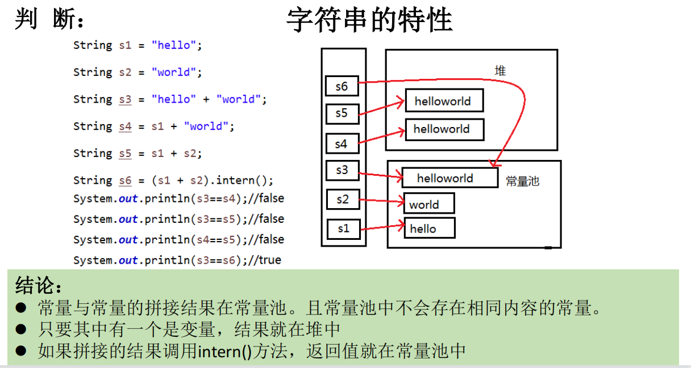

面试题：返回的结果分别是什么？？？

```java
public class StringTest {
    String str = new String("good");
    char[] ch = { 't', 'e', 's', 't' };
    public void change(String str, char ch[]) {
        str = "test ok";
        ch[0] = 'b'; 
	}
    public static void main(String[] args) {
        StringTest ex = new StringTest();
        ex.change(ex.str, ex.ch);
        System.out.println(ex.str + " and ");   //good
        System.out.println(ex.ch);              //test
    } 
}
```

### String类的常用方法

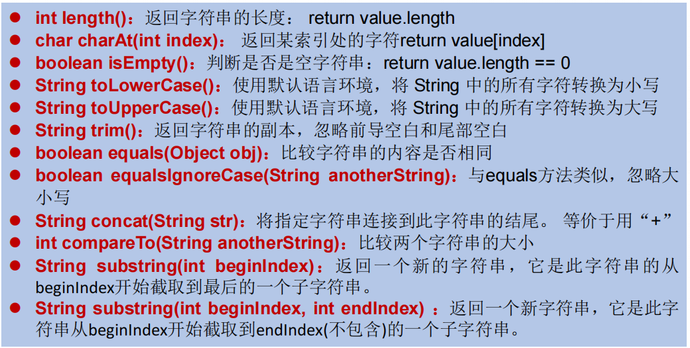

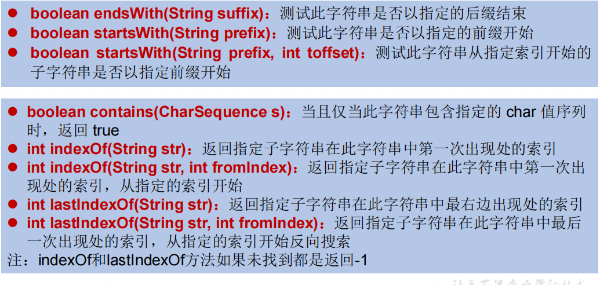


### String类与其他结构的转换

#### 与基本数据类型和包装类

- String转化为基本数据类型和包装类

方法：调用包装类的静态方法`parseXxxx(str);`

- 基本数据类型和包装类转化为String

方法：调用String重载的`valueOf(xxxx);`

#### 与char[]（字符数组）之间的转换

- String——>char[]数组

方法：调用String 的 `toCharArray()`方法

- char[]数组——>String

方法：调用String的构造器

#### 与byte[]（字节数组）之间的转换

- String——>byte[]数组：编码的过程

方法：调用String 的 `getBytes()`方法

- byte[]数组——>String：解码的过程

方法：调用String的构造器：`new String(xxxx, 编码集)`

## StringBuffer类、StringBuilder类

### 定义

> 当对字符串进行修改的时候，需要使用 StringBuffer 和 StringBuilder 类。
>
> 和 String 类不同的是，StringBuffer 和 StringBuilder 类的对象能够被多次的修改，并且不产生新的未使用对象。

- StringBuffer类：**可变的**字符序列；线程安全的；底层使用char[]存储
- StringBuilder类：**可变的**字符序列；线程不安全的；底层使用char[]存储

**注意：可变的字符序列指的是：底层的char[] value字符串数组可以不断扩容。**

### StringBuffer的常用方法

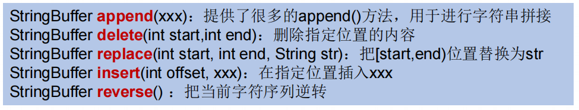

| 方法名                                  | 描述                                                   |
| --------------------------------------- | ------------------------------------------------------ |
| public StringBuffer append(String s)    | 将指定的字符串追加到此字符序列。                       |
| public StringBuffer reverse()           | 将此字符序列用其反转形式取代。                         |
| public delete(int start, int end)       | 移除此序列的子字符串中的字符。                         |
| public insert(int offset, int i)        | 将 `int` 参数的字符串表示形式插入此序列中              |
| insert(int offset, String str)          | 将 `str` 参数的字符串插入此序列中                      |
| replace(int start, int end, String str) | 使用给定 `String` 中的字符替换此序列的子字符串中的字符 |
| void setCharAt(int index, char ch)      | 将给定索引处的字符设置为 `ch`。                        |
| char charAt(int index)                  | 返回此序列中指定索引处的 `char` 值。                   |
| ...                                     | ....                                                   |

**==注意，涉及有开始结束位置的，都是“左闭右开”的==**

- 方法的总结：


增：`append(xxxx)`

删：`delete(int start, int end)`

改：`setCharAt(int index, char ch)`、`replace(int start, int end, String str)`

查：`charAt(int index)`

插：`insert(int offset, int i)`

长度：`length()`

(少用)遍历：for循环、charAr()、toString()方法

### StringBuffer、StringBuilder和String的效率对比

由高到低：StringBuilder > StringBuffer > String


# 时间日期API

##  JDK8之前

### java.lang.System类

System类提供的public static long currentTimeMillis()用来**返回当前时间与1970年1月1日0时0分0秒之间以毫秒为单位的时间差（也叫时间戳）**。

格式：

```java
long time = System.currentTimeMillis();
System.out.println(time);//1627269906781
```

### java中两个Date类

#### java.util.Date类

表示特定的瞬间，精确到毫秒

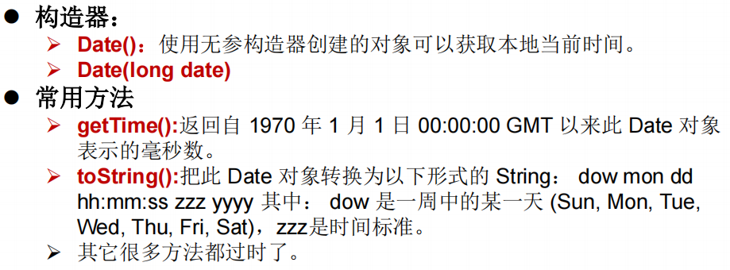

注意，`Date(long date)`构造器的参数是毫秒，创建了一个指定时间的Date对象

#### java.sql.Date类

作用：创建sql数据库中的日期

构造器：`Date(long date)`创建一个指定时间的Date对象

#### 两个对象间的转换

- util.Date对象——>sql.Date对象（相当于**从父类往子类转**）

方法一：利用多态性，强制类型转换

```java
Date date = new java.sql.Date(14525554414L);
java.sql.Date date1 = (java.sql.Date) date;
System.out.println(date);//1970-06-18
System.out.println(date1);//1970-06-18
```

方法二：利用Date类的getTime()方法

```java
Date date2 = new Date();
java.sql.Date date3 = new java.sql.Date(date2.getTime());
System.out.println(date3.toString());//2021-07-26
System.out.println(date3);//2021-07-26
```

### SimpleDateFormat类

Date类的API不易于国际化，大部分被废弃了，**java.text.SimpleDateFormat**类是一个不与语言环境有关的方式来格式化和解析日期的具体类。

它允许进行：1)**格式化：日期——>文本**；2）**解析：文本——>日期**

#### 格式化


注意，参数pattern可以借助如下简写字母，进行指定：

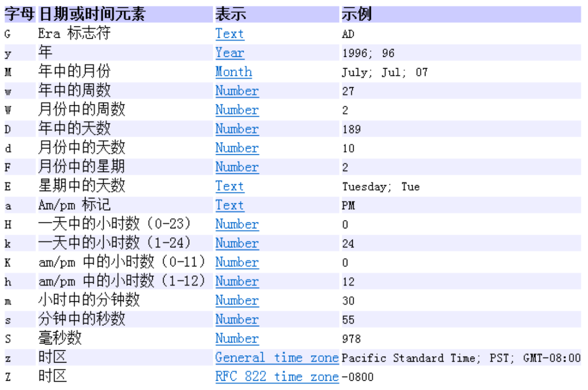

#### 解析


### Calendar(日历)类

是一个抽象类

#### 实例化

由于是抽象类，不能直接new一个对象。有两个办法:

- 创建其子类GregorianCalendar的对象

- 调用静态方法使用Calendar.getInstance()

格式：`Calendar calendar = Calendar.getInstance();`

#### 常用方法

- get()——获取Calendar类中的一些属性

举例：

```java
int day = calendar.get(Calendar.DAY_OF_MONTH);
System.out.println(day);//26
```

其他：

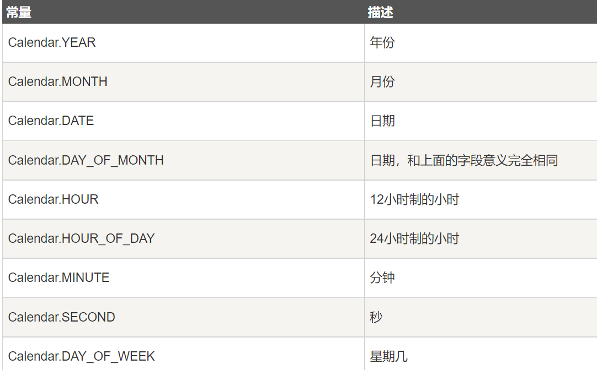

- void set()——将如上的指定的属性设置成其他值


```java
calendar.set(Calendar.DAY_OF_MONTH,31);
day = calendar.get(Calendar.DAY_OF_MONTH);
System.out.println(day);//31
```

- getTime()——得到一个Date对象，相对于将日历类——>Date对象

```java
Date date4  = calendar.getTime();
System.out.println(date4);//Sat Jul 31 14:22:15 CST 2021
```

- setTime()——反过来，Date类——>日历类

```java
Date date5 = new Date();
calendar.setTime(date5);
System.out.println(calendar.get(Calendar.DAY_OF_WEEK));
```


## JDL 8中


### LocalDate、LocalTime、LocalDateTime 类


#### 实例化


#### 获取属性——getXxx()方法

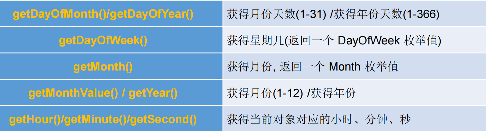

#### 设置属性——withXxxxx()方法


体现了**不可变性**，因为修改完相应的属性后返回了新的对象。

#### 加减


仍然体现了**不可变性**，因为修改完相应的属性后返回了新的对象。

### Instant类


#### 实例化


举例：

```java
Instant instant = Instant.now();
```

通过给定的毫秒数获取Instant实例


举例
```java
Instant instant1 = Instant.Instant.ofEpochMilli(12846555196L);
```


#### 其他方法

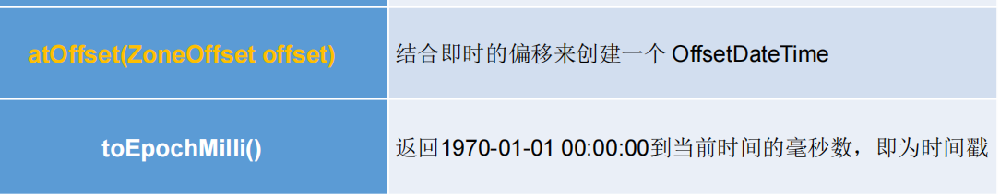

### DateTimeFormatter 类

类似于SimpleDateFormat类，用于格式化或解析日期、时间

#### 实例化

- 方式一：

预定义的标准格式。如：`ISO_LOCAL_DATE_TIME`、`ISO_LOCAL_DATE`、 `ISO_LOCAL_TIME`

- 方式二：

本地化相关的格式。如：`ofLocalizedDateTime(FormatStyle.LONG)`

- 方式三

自定义的格式。如：`ofPattern(“yyyy-MM-dd hh:mm:ss”)`

#### 具体使用

略

## 其他API


# 💡java 比较器

在Java中经常会涉及到对象数组的排序问题，那么就涉及到对象之间的比较问题。

Java实现对象排序的方式有**两种接口**：

1. **自然排序：java.lang.Comparable**
2. **定制排序：java.util.Comparator**

## Comparable接口——自然排序

### 举例

完成接口的类有：

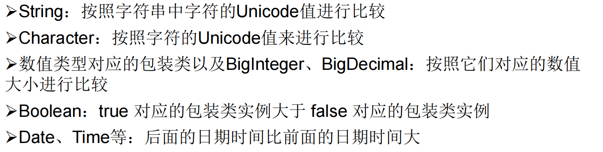

### 实现方式

实现 Comparable 的类必须实现 `compareTo(Object obj)` 方法，两个对象即通过 `compareTo(Object obj)` 方法的返回值来比较大小。

- compareTo()方法重写的规则

如果当前对象this大于形参对象obj，则返回正整数，

如果当前对象this小于形参对象obj，则返回负整数，

如果当前对象this等于形参对象obj，则返回零。

- 例子：自定义的Goods对象的大小比较


## Comparator接口——定制排序

> 当元素的类型没有实现java.lang.Comparable接口而又不方便修改代码，或者实现了java.lang.Comparable接口的排序规则不适合当前的操作，那么可以考虑使用 Comparator 的对象来排序，强行对多个对象进行整体排序的比较。

### 实现方式

重写`compare(Object o1,Object o2)`方法，比较o1和o2的大小：

- 如果方法返回正整数，则表示o1大于o2；
- 如果返回0，表示相等；
- 返回负整数，表示o1小于o2。


例子：


## 对比

Comparable接口的方式一旦指定，能够保证接口的实现类的对象在任何位置都可以比较大小

Comparator接口属于临时性比较，


# System类

不可被实例化，相当于是一个工具类。

## 成员变量

| `static PrintStream` | `err`  “标准”错误输出流。 |
| -------------------- | ------------------------- |
| `static InputStream` | `in`  “标准”输入流。      |
| `static PrintStream` | `out`  “标准”输出流       |

## 成员方法

| 方法名                            | 作用                                                         |
| --------------------------------- | ------------------------------------------------------------ |
| native long currentTimeMillis()： | 返回当前时间（以毫秒为单位）。                               |
| void exit(int status)：           | 终止当前运行的Java虚拟机。                                   |
| void gc()                         | 该方法的作用是请求系统进行垃圾回收。至于系统是否立刻回收，则取决于系统中垃圾回收算法的实现以及系统执行时的情况 |
| String getProperty(String key)：  | 该方法的作用是获得系统中属性名为key的属性对应的值。系统中常见的属性名以及属性的作用如下表所示 |
| ...                               | ...                                                          |

# Math类


举例

```java
public void MathTest(){
	int abs = Math.abs(-123);
	System.out.println(abs);
}
```


# BigInteger与BigDecimal

## BigInteger类

> Integer类作为int的包装类，能存储的最大整型值为2^31^-1，Long类也是有限的最大为2^63^-1。如果要表示再大的整数，不管是基本数据类型还是他们的包装类都无能为力，更不用说进行运算了

BigInteger表示：不可变的任意精度整数。


- 构造器

`BigInteger (String val)`：根据字符串构建BigInteger对象

- 方法


## BigDecial类


- 构造器

`public BigDecimal(double val)` 

`public BigDecimal(String val)`

- 方法


# 枚举类enum

## 定义


另外，如果枚举类中只有一个对象，则可以作为单例模式的实现方式。

## 枚举类的定义

### 方式一：自定义

- 方法
  - 私有化类的构造器，保证不能在类的外部创建其对象
  - 在类的内部创建枚举类的实例。声明为：`public static final` 
  - 对象如果有实例变量，应该声明为private final，并在构造器中初始化

- 举例：季节

```java
class Season{
    //1.声明Season对象的属性：
    private final String seasonName;
    private final String seasonDesc;
    //2.私有化类的构造器，并给对象属性赋值
    private Season(String seasonName,String seasonDesc){
        this.seasonName = seasonName;
        this.seasonDesc = seasonDesc;
    }
    //3.提供当前枚举类的多个对象：public static final的
    public static final Season Spring = new Season("春天", "春暖花开");
    public static final Season Summer = new Season("夏天", "夏日炎炎");
    public static final Season Autumn = new Season("春天", "秋高气爽");
    public static final Season Winter = new Season("春天", "白雪皑皑");

    //4.其他诉求：获取枚举类对象的属性
    public String getSeasonName() {
        return seasonName;
    }
    public String getSeasonDesc() {
        return seasonDesc;
    }
    // 5.其他诉求:toString()方法
    @Override
    public String toString() {
        return "Season{" +
                "seasonName='" + seasonName + '\'' +
                ", seasonDesc='" + seasonDesc + '\'' +
                '}';
    }
}
```

### 方式二：enum关键字

- 使用说明

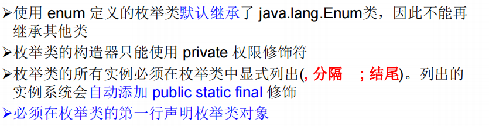


- 实例：季节

```java
enum Season1{
    //1.提供当前枚举类的多个对象：逗号隔开，分号结尾
    SPRING("春天", "春暖花开"),
    SUMMER("夏天", "夏日炎炎"),
    AUTUMN("秋天", "秋高气爽"),
    WINTER("冬天", "白雪皑皑");

    //2.声明Season对象的属性：
    private final String seasonName;
    private final String seasonDesc;
    //3.私有化类的构造器，并给对象属性赋值
    private Season1(String seasonName,String seasonDesc){
        this.seasonName = seasonName;
        this.seasonDesc = seasonDesc;
    }

    //4.其他诉求：获取枚举类对象的属性
    public String getSeasonName() {
        return seasonName;
    }
    public String getSeasonDesc() {
        return seasonDesc;
    }
}
```

## Enum类的常用方法


## 使用enum关键字定义的枚举类实现接口

- 情况一：实现接口，再enum类中实现抽象方法

略

- 情况二：枚举类的对象分别实现接口中的抽象方法

例子：

```java
enum Season1{
    //1.提供当前枚举类的多个对象：逗号隔开，分号结尾
    SPRING("春天", "春暖花开"){
        @Override
        public void show(){
            System.out.prinln("这里是每个对象不同的抽象方法");
        }
    },
    SUMMER("夏天", "夏日炎炎"){
        @Override
        public void show(){
            System.out.prinln("这里是每个对象不同的抽象方法");
        }
    },
    AUTUMN("秋天", "秋高气爽"){
        @Override
        public void show(){
            System.out.prinln("这里是每个对象不同的抽象方法");
        }
    },
    WINTER("冬天", "白雪皑皑"){
        @Override
        public void show(){
            System.out.prinln("这里是每个对象不同的抽象方法");
        }
    };
    
    //...
}
interface Info{
    void show();
}
```

