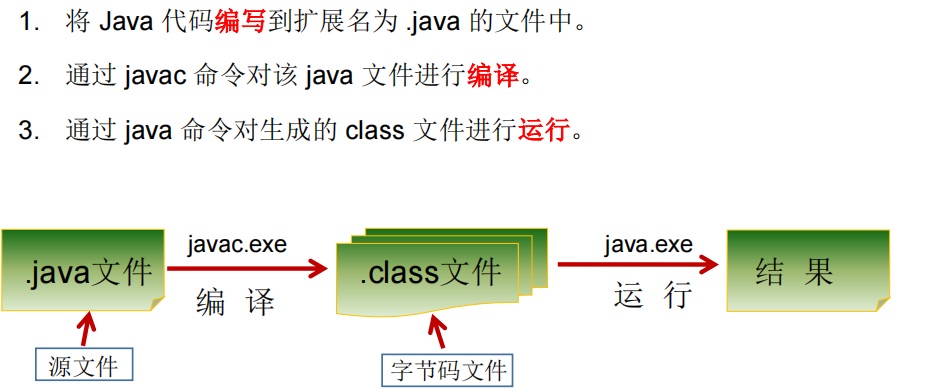

# JAVA 基础语法

Java SE标准版

Java EE企业版

记事本+命令行编写java:



## 注释

### 单行注释

````java
// XXXXXXXXX
````

### 多行注释

```java
/*
XXXXXX
XXXX
*/
```

### 文档注释

java特有，会被**javadoc**所解析

```java
/**
@author XXXXXX
@version V1.0
xxxxxxx
*/
```


## Java API文档

package——>class

在一个java源文件中可以声明多个class，但是**只能最多有一个类声明为public的。**

而且要求public的类的类名和源文件名相同。

程序的入口是main()方法，格式是固定的，如下：

```java
public static void main(String[] args){
    //args 是arguments：参数，也可以写成a
    //[]可以移动位置
    System.out.println("hello world");//ln表示输出完后会换行。
    System.out.print("hello world");//只输出，不换行
}
```

每一行执行语句都是分号结尾

## 关键字keyword


## 保留字reserved word

## 标识符Identifier

凡是可以自己取名字的地方都叫标识符

1. 命名规则：不遵守则编译不通过

- 所有的标识符都应该以字母（A-Z 或者 a-z）,美元符（$）、或者下划线（_）开始
- 首字符之后可以是字母（A-Z 或者 a-z）,美元符（$）、下划线（_）或数字的任何字符组合
- 关键字不能用作标识符
- 标识符是大小写敏感的
- 合法标识符举例：age、$salary、_value、__1_value
- 非法标识符举例：123abc、-salary

2. 命名规范：（建议）

- - - - 类名规范：大驼峰式（首字母大写，后单词首字母大写）
      - 变量名规范：小驼峰式（首字母小写，后单词首字母大写）
      - 方法名规范：小驼峰式

## 变量

### 定义变量的格式

```java
//数据类型 变量名 =  变量值;
int a, b, c;             // 声明三个int型整数：a、 b、c
int d = 3, e = 4, f = 5; // 声明三个整数并赋予初值
byte z = 22;             // 声明并初始化 z
String s = "runoob";     // 声明并初始化字符串 s
double pi = 3.14159;     // 声明了双精度浮点型变量 pi
char x = 'x';            // 声明变量 x 的值是字符 'x'。
```

### 变量的分类

#### 按数据类型分类


注意，float 和 long的数值后面需要跟一个f/F和L/l。

​			char只能写一个字符，表示方式可以是：

1. 一个字符
2. 一个转义字符
3. 直接用Unicode表示的字符型常量，如 ’\u0123‘ 表示 ‘  ？’

#### 按变量在类中声明的位置分类

