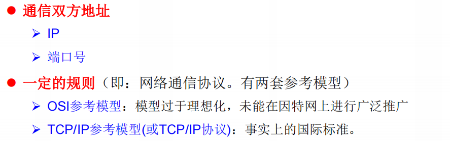
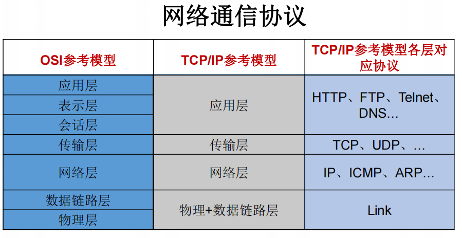

# 概述






## 通信要素一：IP和端口号

### IP

在java中用`InetAddress`类代表IP

实例化：getByName(String host)、getLocalHost()方法

```java
public class InternetTest {
    public static void main(String[] args) {
        try {
            InetAddress inet1 = InetAddress.getByName("192.168.10.14");
            System.out.println(inet1);//s输出为/192.168.10.14
        } catch (UnknownHostException e) {
            e.printStackTrace();
        }
    }
}
```

- IP分类

ipv4、IPv6

- 域名：www.daidu.com等等

- **本地回路地址：127.0.0.1 对应的域名为：localhost**

### 端口号


- 分类


### Socket

端口号与IP地址的组合得出一个网络套接字：**Socket**。

## 通信要素二：网络协议

### TCP/IP协议簇


### 传输层协议：TCP、UDP


# TCP网络编程


## 客户端编程

### 步骤

- **创建 Socket****：**根据指定服务端的 IP 地址或端口号构造 Socket 类对象。若服务器端响应，则建立客户端到服务器的通信线路。若连接失败，会出现异常。
- **打开连接到 Socket 的输入/出流**： 使用 getInputStream()方法获得输入流，使用getOutputStream()方法获得输出流，进行数据传输
- **按照一定的协议对 Socket 进行读/写操作**：通过输入流读取服务器放入线路的信息（但不能读取自己放入线路的信息），通过输出流将信息写入线程。
- **关闭 Socket**：断开客户端到服务器的连接，释放线路

### 实例

```java
@Test
    public void client(){
        Socket socket = null;
        OutputStream os = null;
        try{
            //1.创建Socket对象，指明服务器的ip和端口号
            InetAddress inet = InetAddress.getByName("127.0.0.1");
            socket = new Socket(inet,8899);

            //2.获取一个输出流。用于输出数据
            os = socket.getOutputStream();
            
            //3.写出数据的操作
            os.write("这里是客户端".getBytes());
        }catch(IOException e){
            e.printStackTrace();
        }finally {
            //5.资源的关闭
            if(os != null){
                try {
                    os.close();
                } catch (IOException e) {
                    e.printStackTrace();
                }
            }
            if(socket != null){
                try {
                    socket.close();
                } catch (IOException e) {
                    e.printStackTrace();
                }
            }
        }

    }
```


## 服务端编程

### 步骤


### 实例

```java
@Test
    public void server() {

        ServerSocket ss = null;
        Socket socket = null;
        InputStream is = null;
        ByteArrayOutputStream baos = null;
        try {
            //1.创建服务器端的ServerSocket对象，指明自己的端口号
            ss = new ServerSocket(8899);
            //2. 调用accept()方法，接收来自客户端的Socket
            socket = ss.accept();
            //3. 获取输入流
            is = socket.getInputStream();

            //拿到流以后，接下来的操作就是将流动的数据显示在操作台上
            //4. 读取输入流当中的数据
            baos = new ByteArrayOutputStream();
            byte[] buffer = new byte[5];
            int len;
            while ((len = is.read(buffer)) != -1){
                baos.write(buffer, 0, len);

            }
            //读取到后的具体操作：。。。。。
            System.out.println(baos.toString());
        } catch (IOException e) {
            e.printStackTrace();
        } finally {
            //5. 关闭资源
            if (baos != null){
              //...
            }
            if (is != null){
               //...
            }
            if (socket != null){
               //...
            }
            if (ss != null){
               //,,,
            }

        }
```

# UDP网络编程


## 发送端编程


## 接收端编程
