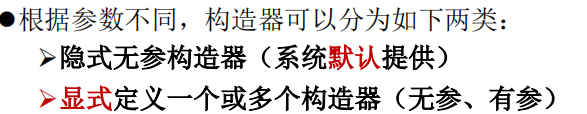
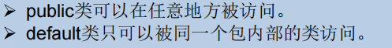

# 面向对象OOP


## 类和对象

### 类的结构


#### 类

类是一组属性（成员变量）和行为（成员方法）的集合。是抽象的。

类的创建

```java
public class 类的名称{
    （一个类里面的）多种成员变量;//属性声明
    (类里面含有的)多种成员方法，定义的时候没有static;//方法声明
}
```


#### 对象

对象是类的一个实例，创建一个对象的过程就是对类的实例化。

**注意，创建对象，也可以是在所在类的里面创建！！（有点套娃哦）**

##### 创建对象

```java
public class Puppy{
   public Puppy(String name){
      //这个构造器仅有一个参数：name
      System.out.println("小狗的名字是 : " + name ); 
   }
   public static void main(String[] args){
   	  //创建对象的格式如下：！！！！！！！！！！！！！！！！！！！！！！！！！
      Puppy myPuppy = new Puppy( "tommy" );
      //即: 类名 对象名字(自己取) = new 类名();
   }
}
```

##### 匿名对象

1. 没有显式地将创建出来的对象赋给一个变量名，即为匿名对象

2. 匿名对象**只能调用一次**
3. 使用场景：把匿名对象赋值给另外一个有名的对象，

```java
mall.show(new Phone());
//new Phone()是一个匿名对象
```

#### 属性（成员变量）

属性，也是成员变量，= field、域等等名称

##### 属性的声明


举例：

```java
public class Person{
    private int age; //无初始化的属性声明
    public String name = "Ben";// 有初始化的属性声明
}
```

##### 属性的调用

对象.属性名

##### 属性的初始化值

属性没有初始化之前的默认值和一维数组的默认初始化值一样。

##### 与局部变量的异同点

- 局部变量声明在方法、构造方法或者语句块中；
- 局部变量在方法、构造方法、或者语句块被执行的时候创建，当它们执行完成后，变量将会被销毁；
- 访问修饰符不能用于局部变量；
- 局部变量只在声明它的方法、构造方法或者语句块中可见；
- 局部变量是在栈上分配的。
- 局部变量没有默认值，所以局部变量被声明后，必须经过初始化，才可以使用。


##### 属性赋值的先后顺序

属性赋值的方法有以下几种：

1. 默认初始化
2. 显式初始化
3. 构造器中初始化
4. 通过”对象.方法“或者”对象.属性“的方式，进行赋值

以上的操作顺序是：1 - 2 - 3 - 4

#### 方法

##### 方法的分类


##### 方法的声明

```java
权限修饰符 返回值类型 方法名(参数类型 参数名){
    ...
    方法体
    ...
    return 返回值;
}
```

1. **修饰符：**修饰符，这是可选的，告诉编译器如何调用该方法。定义了该方法的访问类型。

- 访问控制修饰符 : **default, public , protected, private**
- 非访问控制修饰符 : final, abstract, static, synchronized


2. **返回值类型 ：**方法可能会返回值。returnValueType 是方法返回值的数据类型。有些方法执行所需的操作，但没有返回值。在这种情况下，returnValueType 是关键字**void**。


3. **方法名：**是方法的实际名称，**属于标识符**。方法名和参数表共同构成方法签名。


4. **参数类型：**参数像是一个占位符。当方法被调用时，传递值给参数。这个值被称为实参或变量。参数列表是指方法的参数类型、顺序和参数的个数。参数是可选的，方法可以不包含任何参数。


5. **方法体：**方法体包含具体的语句，定义该方法的功能。

##### return关键字的使用

- 作用范围：方法体

- 作用：

1. 结束方法
2. 针对有返回值类型的方法，使用”return 数据“的方法返回所要的数据

- return 关键字后面不能声明执行语句

##### 方法使用中的注意点

- 方法的使用中，可以调用**当前类**的属性或方法	
  - 特殊情况：方法A中又调用了方法A，则为：递归方法

- 方法中，不可以定义方法

##### 方法重载Overload

- 定义：在同一个类中，允许存在一个以上的**同名方法**，只要它们的**参数个数或者参数类型不同**即可

- 特点：与返回值类型无关，只看参数列表，且参数列表必须不同。(参数个数或参数类型)。调用时，根据方法参数列表的不同来区别。

##### 可变个数的形参

JavaSE 5.0 中提供了**Varargs(**variable number of arguments**)**机制，允许直接定义能和多个实参相匹配的形参。从而，可以用一种更简单的方式，来传递个数可变的实参。

- 声明格式如下：在方法声明中，在指定参数类型后加一个省略号(...)

```java
//typeName... parameterName
//数据类型... 变量名
```

1. 可变参数方法的参数部分指定类型的参数个数可以是**0个，1个或多个**；
2. 可变个数形参的方法与同名的方法之间，彼此**构成重载**；
3. 可变参数方法的使用 与 方法参数部分使用数组是一致的，**无法构成重载不能共存**；
4. 方法的参数部分有可变形参，需要放在**形参声明的最后**；
5. 在一个方法的形参位置，**最多只能声明一个**可变个数形参

- 调用实例

```java
public class VarargsDemo {
    public static void main(String args[]) {
        // 调用可变参数的方法
        printMax(34, 3, 3, 2, 56.5);
        printMax(new double[]{1, 2, 3});
    }
    public static void printMax( double... numbers) {
        // double... numbers为可变个数形参
        if (numbers.length == 0) {
            System.out.println("No argument passed");
            return;
        }
 
        double result = numbers[0];
 
        for (int i = 1; i <  numbers.length; i++){
            if (numbers[i] >  result) {
                result = numbers[i];
            }
        }
        System.out.println("The max value is " + result);
    }
}
```

输出结果：

> The max value is 56.5
> 		The max value is 3.0


##### 方法参数的值传递机制

方法，必须由其所在类或对象**调用**才有意义。方法含有两种参数：

形参：方法声明时的参数；

实参：方法调用时，实际传给形参的参数值。

Java里方法的参数传递方式只有一种：**值传递。**即：将实际参数值的副本（复制品）传入方法内，而参数本身不受影响。

- 变量、参数是基本数据类型时   的值传递

将实参基本数据类型变量的**“数据值”**传递给形参

- 变量、参数是引用数据类型时   的值传递

将实参引用数据类型变量的**“地址值”**传递给形参。

另外，如果将对象（类的实例）进行赋值，赋值也是地址值，也就是：两个对象变量都指向了**堆空间中的同一个对象实体**。

##### 递归方法                                                                                                                                                                                                                                                                                                                                                                                                                                                                                                                                                                                                                                                                                                                                                                                                                                                                                                                                                                                                                                                                                                                                                                                                                                                                                                                                                                                                                                                                                                                                                                                                                                                                                                                                                                                                                                                                                                                                                                                                                                                                                                                                                                                                                                                                                                                                                                                                                                                                                                                                                                                                                                                                                                                                                                                                                                                                                                                                                                                                                                                                                                                                                                                                                                                                                                                                                                                                                                                                                                                                                                                                                                                                                                                                                                                                                                                                                                                                                                                                                                                                                                                                                                                                                                                                                                                                                                                                                                                                                                                                                                                                                                                                                                                                                                                                                                                                                                                                                                                                                                                                                                                                                                                                                                                                                                                                                                                                                                                                                                                                                                                                                                                                                                                                                                                                                                                                                                                                                                                                                                                                                                                                                                                                                                                                                                                                                                                                                                                                                                                                                                                                                                                                                                                                                                                                                                                                                                                                                                                                                                                                                                                                                                                                                                                                                                                                                                                                                                                                                                                                                                                                                                                                                                                                                                                                                                                                                                                                                                                                                                                                                                                                                                                                                                               

递归方法，resuision，即，方法体内调用它自身。

方法递归包含了一种隐式的循环，它会重复执行某段代码，但这种重复执行无须循环控制。

递归一定要向已知方向递归，否则这种递归就变成了无穷递归，类似于死循环。

#### 构造器(构造方法)

##### 作用

constructor构造器，作用是：**==创建对象；给对象进行初始化（比如对属性的初始化）==**。

##### 特征

- 每个类都有构造方法。
- 如果没有显式地为类定义构造方法，Java 编译器将会为该类提供一个**默认的空参的构造方法**。

默认的构造器：在每次创建对象就在使用默认的构造器：

```java
Person p1 = new Person(); //new + 构造器
```


- 在创建一个对象的时候，至少要调用一个构造方法。
- 多个构造器也**可以构成重载**

##### 分类



##### 定义构造器

语法格式：

```java
class Person{
    //构造器语法：
//    修饰符 类名(行参列表){
//        初始化语句
//    }
    public Person(){
        //初始化语句
    } 
}
```

举例：


##### 使用的注意事项


### 拓展知识

#### 特殊的类：JavaBean


#### UML类图

**类图**是软件工程的[统一建模语言](https://zh.wikipedia.org/wiki/統一建模語言)一种静态结构图，该图描述了系统的类集合，类的属性和类之间的关系。


#### MVC设计模式


## 三大特征

### 封装和隐藏

#### 对属性的封装

> 隐藏对象内部的复杂性，只对外公开简单的接口。便于外界调用，从而提高系统的可扩展性、可维护性。通俗的说，把该隐藏的隐藏起来，该暴露的暴露出来。这就是封装性的设计思想。

方法：通过**private关键字**对属性进行封装或叫隐藏，相当于从类外面不能直接对属性进行赋值，而是需要通过**setXXX方法**进行赋值;

Java中通过将数据声明为**私有的(private)**，再提供**公共的（public）方法:getXxx()和setXxx()**实现对该属性的操作，以实现下述目的：

1. 用private关键字来隐藏一个类中不需要对外提供的实现细节；

2. 用setXXX方法来为属性赋值，不需要返回值，是void；

3. 用getXXX方法来调用属性，方法需要return相应的值。


使用者只能通过事先定制好的方法来访问数据，可以方便地加入控制逻辑，限制对属性的不合理操作；

便于修改，增强代码的可维护性；

#### 4种权限修饰符

Java权限修饰符**public**、**protected**、**(缺省)**、**private**置于**类的成员**定义前，用来限定对象对该类成员的访问权限：


注意：

- 类的成员包括：属性、方法、构造器、内部类

- 而修饰类（class）的权限修饰只可以用public和（缺省）。其中：



### 继承性

> 多个类中存在相同属性和行为时，将这些内容抽取到单独一个类中，
>
> 那么多个类无需再定义这些属性和行为，只要继承那个类即可。

继承性解决的是：共性抽取的问题。

此处的多个类称为**子类(派生类/subclass)**，单独的这个类称为**父类(基类或超类/superclass)**。

#### 类的继承格式

```java
class 父类 {
}
 
class 子类 extends 父类 {
}
```

#### 继承的特性

1. 子类继承了父类**所有非private的属性和方法**；


2. 对于，父类中private的成员结构，子类不能直接调用，需要**借助getter/setter等方法**才行；


3. 子类继承父类后，可以自己继续进行**功能上的拓展（对应extends关键字）**；


4. Java支持：单继承、多重继承、不同类继承同一个类，但是**不支持多继承**


#### Object类

##### 定义

Object类是所有Java类的根父类如果在类的声明中未使用extends关键字指明其父类，则默认父类为java.lang.Object类。

例子：


##### 使用

**子类可以使用 Object 的所有方法**

#### 方法重写(override/overwrite)

