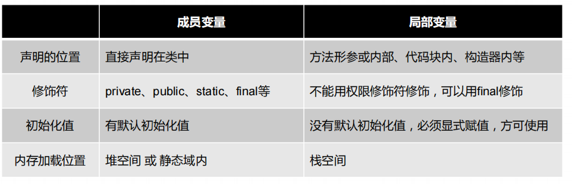
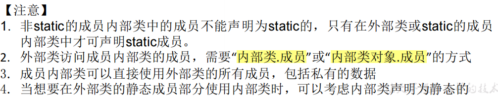
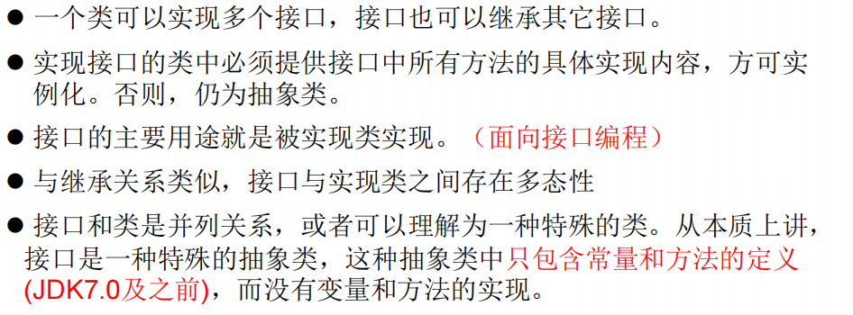
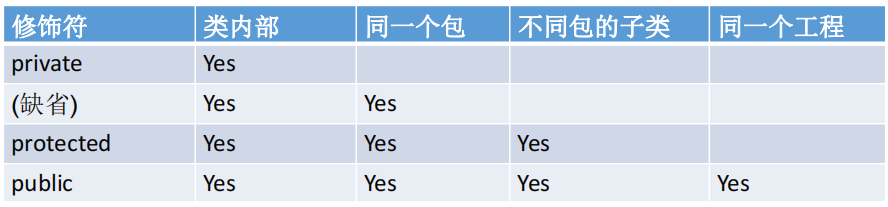
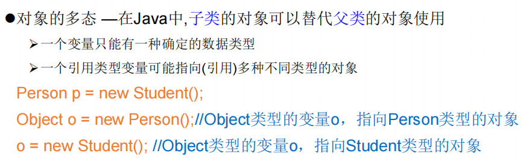
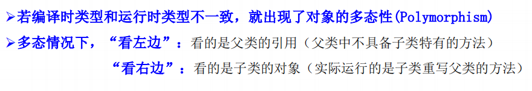
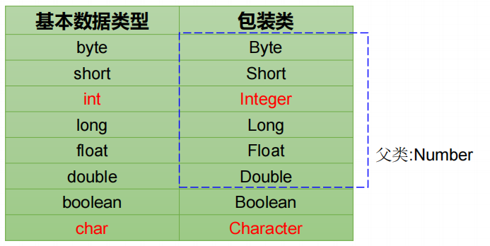

# 面向对象OOP


## 类和对象

### 类的结构（类的成员）


#### 类

类是一组属性（成员变量）和行为（成员方法）的集合。是抽象的。

类的创建

```java
public class 类的名称{
    （一个类里面的）多种成员变量;//属性声明
    (类里面含有的)多种成员方法，定义的时候没有static;//方法声明
}
```


#### 对象

对象是类的一个实例，创建一个对象的过程就是对类的实例化。

**注意，创建对象，也可以是在所在类的里面创建！！（有点套娃哦）**

##### 创建对象

```java
public class Puppy{
   public Puppy(String name){
      //这个构造器仅有一个参数：name
      System.out.println("小狗的名字是 : " + name ); 
   }
   public static void main(String[] args){
   	  //创建对象的格式如下：！！！！！！！！！！！！！！！！！！！！！！！！！
      Puppy myPuppy = new Puppy( "tommy" );
      //即: 类名 对象名字(自己取) = new 类名();
   }
}
```

##### 匿名对象

1. 没有显式地将创建出来的对象赋给一个变量名，即为匿名对象

2. 匿名对象**只能调用一次**
3. 使用场景：把匿名对象赋值给另外一个有名的对象，

```java
mall.show(new Phone());
//new Phone()是一个匿名对象
```

如果是需要重写方法的匿名对象，还有这样的写法：

```java
new Thread(){
    @Override
    public void run(){
        //.....
        
    }
    
}.start();
```

如果有需要，在两个匿名对象的声明可以嵌套：

```java
new Thread(new Runnable(){
    @Override
    public void run(){
        
        //...
    }    
    
}).start();
```


#### 属性（成员变量）

**属性，也是成员变量，= field、域等等名称**

##### 属性的声明


举例：

```java
public class Person{
    private int age; //无初始化的属性声明
    public String name = "Ben";// 有初始化的属性声明
}
```

##### 属性的调用

对象.属性名

##### 属性的初始化值

属性没有初始化之前的默认值和一维数组的默认初始化值一样。

##### 与局部变量的异同点

- 局部变量声明在方法、构造方法或者语句块中；
- 局部变量在方法、构造方法、或者语句块被执行的时候创建，当它们执行完成后，变量将会被销毁；
- 访问修饰符不能用于局部变量；
- 局部变量只在声明它的方法、构造方法或者语句块中可见；
- 局部变量是在栈上分配的。
- 局部变量没有默认值，所以局部变量被声明后，必须经过初始化，才可以使用。



##### 属性赋值的先后顺序

属性赋值的方法有以下几种：

1. 默认初始化
2. 显式初始化
3. 构造器中初始化
4. 通过”对象.方法“或者”对象.属性“的方式，进行赋值
5. 在代码块中赋值

以上的操作顺序是：1 - 2/5 - 3 - 4。（说明，2、5谁先谁后，在于类中谁先声明）

#### 方法

##### 方法的分类


##### 方法的声明

```java
权限修饰符 返回值类型 方法名(参数类型 参数名){
    ...
    方法体
    ...
    return 返回值;
}
```

1. **修饰符：**修饰符，这是可选的，告诉编译器如何调用该方法。定义了该方法的访问类型。

- 访问控制修饰符 : **default, public , protected, private**
- 非访问控制修饰符 : final, abstract, static, synchronized


2. **返回值类型 ：**方法可能会返回值。returnValueType 是方法返回值的数据类型。有些方法执行所需的操作，但没有返回值。在这种情况下，returnValueType 是关键字**void**。


3. **方法名：**是方法的实际名称，**属于标识符**。方法名和参数表共同构成方法签名。


4. **参数类型：**参数像是一个占位符。当方法被调用时，传递值给参数。这个值被称为实参或变量。参数列表是指方法的参数类型、顺序和参数的个数。参数是可选的，方法可以不包含任何参数。


5. **方法体：**方法体包含具体的语句，定义该方法的功能。

##### return关键字的使用

- 作用范围：方法体

- 作用：

1. 结束方法
2. 针对有返回值类型的方法，使用”return 数据“的方法返回所要的数据

- return 关键字后面不能声明执行语句

##### 方法使用中的注意点

- 方法的使用中，可以调用**当前类**的属性或方法	
  - 特殊情况：方法A中又调用了方法A，则为：递归方法

- 方法中，不可以定义方法

##### 方法重载Overload

- 定义：在同一个类中，允许存在一个以上的**同名方法**，只要它们的**参数个数或者参数类型不同**即可
- 特点：与返回值类型无关，只看参数列表，且参数列表必须不同。(参数个数或参数类型)。调用时，根据方法参数列表的不同来区别。
- 方法的重载规则

  - 被重载的方法必须改变参数列表(参数个数或类型不一样)；
  - 被重载的方法可以改变返回类型；
  - 被重载的方法可以改变访问修饰符；
  - 被重载的方法可以声明新的或更广的检查异常；
  - 方法能够在同一个类中或者在一个子类中被重载。
  - 无法以返回值类型作为重载函数的区分标准。

##### 可变个数的形参

JavaSE 5.0 中提供了**Varargs(**variable number of arguments**)**机制，允许直接定义能和多个实参相匹配的形参。从而，可以用一种更简单的方式，来传递个数可变的实参。

- 声明格式如下：在方法声明中，在指定参数类型后加一个省略号(...)

```java
//typeName... parameterName
//数据类型... 变量名
```

1. 可变参数方法的参数部分指定类型的参数个数可以是**0个，1个或多个**；
2. 可变个数形参的方法与同名的方法之间，彼此**构成重载**；
3. 可变参数方法的使用 与 方法参数部分使用数组是一致的，**无法构成重载不能共存**；
4. 方法的参数部分有可变形参，需要放在**形参声明的最后**；
5. 在一个方法的形参位置，**最多只能声明一个**可变个数形参

- 调用实例

```java
public class VarargsDemo {
    public static void main(String args[]) {
        // 调用可变参数的方法
        printMax(34, 3, 3, 2, 56.5);
        printMax(new double[]{1, 2, 3});
    }
    public static void printMax( double... numbers) {
        // double... numbers为可变个数形参
        if (numbers.length == 0) {
            System.out.println("No argument passed");
            return;
        }
 
        double result = numbers[0];
 
        for (int i = 1; i <  numbers.length; i++){
            if (numbers[i] >  result) {
                result = numbers[i];
            }
        }
        System.out.println("The max value is " + result);
    }
}
```

输出结果：

> The max value is 56.5
> 		The max value is 3.0


##### 方法参数的值传递机制

方法，必须由其所在类或对象**调用**才有意义。方法含有两种参数：

形参：方法声明时的参数；

实参：方法调用时，实际传给形参的参数值。

Java里方法的参数传递方式只有一种：**值传递。**即：将实际参数值的副本（复制品）传入方法内，而参数本身不受影响。

- 变量、参数是基本数据类型时   的值传递

将实参基本数据类型变量的**“数据值”**传递给形参

- 变量、参数是引用数据类型时   的值传递

将实参引用数据类型变量的**“地址值”**传递给形参。

另外，如果将对象（类的实例）进行赋值，赋值也是地址值，也就是：两个对象变量都指向了**堆空间中的同一个对象实体**。

##### 递归方法                                                                                                                                                                                                                                                                                                                                                                                                                                                                                                                                                                                                                                                                                                                                                                                                                                                                                                                                                                                                                                                                                                                                                                                                                                                                                                                                                                                                                                                                                                                                                                                                                                                                                                                                                                                                                                                                                                                                                                                                                                                                                                                                                                                                                                                                                                                                                                                                                                                                                                                                                                                                                                                                                                                                                                                                                                                                                                                                                                                                                                                                                                                                                                                                                                                                                                                                                                                                                                                                                                                                                                                                                                                                                                                                                                                                                                                                                                                                                                                                                                                                                                                                                                                                                                                                                                                                                                                                                                                                                                                                                                                                                                                                                                                                                                                                                                                                                                                                                                                                                                                                                                                                                                                                                                                                                                                                                                                                                                                                                                                                                                                                                                                                                                                                                                                                                                                                                                                                                                                                                                                                                                                                                                                                                                                                                                                                                                                                                                                                                                                                                                                                                                                                                                                                                                                                                                                                                                                                                                                                                                                                                                                                                                                                                                                                                                                                                                                                                                                                                                                                                                                                                                                                                                                                                                                                                                                                                                                                                                                                                                                                                                                                                                                                                                               

递归方法，resuision，即，方法体内调用它自身。

方法递归包含了一种隐式的循环，它会重复执行某段代码，但这种重复执行无须循环控制。

递归一定要向已知方向递归，否则这种递归就变成了无穷递归，类似于死循环。

##### main()方法

**每个java文件中只能有一个public的类，但是，其实每个类中都可以有自己的main()方法**

mian()的含义和作用：

1. 作为程序的入口
2. 作为普通的静态方法
3. 也可以作为我们与控制台交互的方式（因为main()方法的形参是字符串数组args）


#### 构造器(构造方法)

##### 作用

constructor构造器，作用是：**==创建对象；给对象进行初始化（比如对属性的初始化）==**。

##### 特征

- 每个类都有构造方法。
- 如果没有显式地为类定义构造方法，Java 编译器将会为该类提供一个**默认的空参的构造方法**。

默认的构造器：在每次创建对象就在使用默认的构造器：

```java
Person p1 = new Person(); //new + 构造器
```


- 在创建一个对象的时候，至少要调用一个构造方法。
- 多个构造器也**可以构成重载**

##### 分类


##### 定义构造器

语法格式：

```java
class Person{
    //构造器语法：
//    修饰符 类名(行参列表){
//        初始化语句
//    }
    public Person(){
        //初始化语句
    } 
}
```

举例：


##### 使用的注意事项


#### 代码块/初始化块

##### 作用

对java中的类或对象进行初始化

##### 分类

- 静态代码块

1. 结构格式：`static{}`

2. **随着类的加载就会被执行**，
3. 只会被执行一次
4. 如果一个类中定义了多个静态代码块，则按照声明的先后顺序执行
5. 静态代码块优先于非静态代码块的执行
6. 静态代码块内，**==不能调用非静态的属性和方法==**


- 非静态代码块

1. 结构形式：`{}`

2. **随着类的实例化(也就是对象的创建)才被执行**
3. 每创建一个对象，就会执行一次，基于此，可以通过非静态代码块对对象的属性等进行初始化
4. 如果一个类中定义了多个非静态代码块，则按照声明的先后顺序执行

#### 内部类

##### 定义

在Java中，允许一个类的定义位于另一个类的内部，前者称为内部类，后者称为外部类

##### 分类

- 成员内部类

直接定义在类里面的，在方法外、构造器外、代码块外的内部类。和类的成员一样，进一步也可以分为静态和非静态的。

- 局部内部类

定义在类的方法/构造器/代码块内部。**局部内部类不谈修饰符。**

```java
class OuterClass {   // 外部类
    // ...
    //非静态成员内部类
    class NestedClass1{...}// 嵌套类，或称为内部类
   
    //静态成员内部类
    static class NestedClass2{...}
    
    //局部内部类
    {
        class NestedClass3{...}//代码块内的内部类
    }
    public Person(){
        class NestedClass3{...}//构造器内的内部类
    }
    public void method(){
        class NestedClass4{...}//方法内的内部类
    }
}
```

##### 成员内部类的特性

- 作为类的成员


- 作为一个类


##### 内部类的使用

- 实例化成员内部类的对象

```java
/*文件名为InnerClassTest.java*/
public class InnerClassTest{
    public static void main(String[] args){
        //case 1： 创建Dog实例（静态的成员内部类）
        Person.Dog dog = new Person.Dog();
        dog.bark(); 
       
        //case 2； 创建Cat实例（非静态的成员内部类）
        Person p = new Person();//由于是非静态，需要先创建外部的实例
        Person.Cat cat = p.new Cat();
        cat.pur();
    }
}
class Person{
    
    String name;
    int age;
    static class Dog{
        public void bark(){
            System.out.println("bark bark bark!")
        }
    }
    class Cat{
        public void pur(){
            System.out.println("pur pur pur!")
        }
    }
}
```



- 局部内部的使用

**一般写在方法中，返回一个实现了某某接口功能的类的对象**

用法省略，见：InnerClassTest1.java


### 拓展知识

#### 特殊的类：JavaBean


#### UML类图

**类图**是软件工程的[统一建模语言](https://zh.wikipedia.org/wiki/統一建模語言)一种静态结构图，该图描述了系统的类集合，类的属性和类之间的关系。


#### MVC设计模式


#### 单例(Singleton)设计模式

略。

### interface接口

**接口和类，是两个并列的结构。**

#### 概述


#### 接口的声明

语法格式：

```java
[可见度] interface 接口名称 [extends 其他的接口名] {
        // 声明变量 
    	//都是全局常量，因此public static final这几个关键字可以省略
    
        // 抽象方法
    	//同理，public abstract 也可以省略
}
```

#### 接口与类的异同

1. 相似点：

- 一个接口可以有多个方法。
- **接口文件保存在 .java 结尾的文件中，文件名使用接口名**。
- 接口的字节码文件保存在 .class 结尾的文件中。
- 接口相应的字节码文件必须在与包名称相匹配的目录结构中。

2. 不同点：

- 接口**不能用于实例化对象**。
- 接口**没有构造方法**。
- 接口中所有的**方法必须是抽象方法**，Java 8 之后 接口中可以使用 default 关键字修饰的非抽象方法。
- 接口不能包含成员变量，除了 static 和 final 变量。
- 接口不是被类继承了，而是要被类实现。
- 接口支持多继承。

#### 接口的特性

- 接口中每一个方法也是隐式抽象的,接口中的方法会被隐式的指定为 **public abstract**（只能是 public abstract，其他修饰符都会报错）。
- 接口中可以含有变量，但是接口中的变量会被隐式的指定为 **public static final** 变量（并且只能是 public，用 private 修饰会报编译错误）。由于是全局常量，可以使用`接口.变量名`调用
- 接口中的方法是不能在接口中实现的，只能**由实现接口的类来实现接口中的方法**。


#### 接口的实现——implements关键字

当类实现接口的时候，**类要实现接口中所有的方法**。**否则，类必须声明为抽象的类**。

类使用implements关键字实现接口。在类声明中，**Implements关键字放在class声明后面**。

语法格式：

```java
class Subclass extends Superclass ...implements InterfaceA [,InterfaceB..., ...] {
    //接口各种变量的定义
    
    //接口各种抽象方法的重写
}
```




#### 接口间的继承

一个接口能继承另一个接口，和类之间的继承方式比较相似。接口的继承使用extends关键字，子接口继承父接口的方法。**接口的继承，可以多继承。**

例子：

```java
// 文件名: Football.java
public interface Football extends Sports
{
   //抽象方法： 
   public void homeTeamScored(int points);
   public void visitingTeamScored(int points);
   public void endOfQuarter(int quarter);
}
```

#### java8接口的新特性


开发中的注意点：


调用接口中的默认方法

```java
/*文件名为InterfaceA.java*/
public interface InterfaceA{
    //静态方法：
    public static void method1(){
        //方法体
    }
    //默认方法：
    public default void method2(){
        //方法体
    }
}

/*文件名为SubclassTest.java*/
class Subclass extends Superclass implements InterfaceA{
    public void myMethod(){
        method2();					//调用子类自己重写的默认方法
        super.method2();			//调用父类中声明的和默认方法同名同参数的非抽象方法
        InterfaceA.super.method2(); //调用接口中的默认方法
    }
}
```


## 三大特征

### 封装和隐藏

#### 对属性的封装

> 隐藏对象内部的复杂性，只对外公开简单的接口。便于外界调用，从而提高系统的可扩展性、可维护性。通俗的说，把该隐藏的隐藏起来，该暴露的暴露出来。这就是封装性的设计思想。

方法：通过**private关键字**对属性进行封装或叫隐藏，相当于从类外面不能直接对属性进行赋值，而是需要通过**setXXX方法**进行赋值;

Java中通过将数据声明为**私有的(private)**，再提供**公共的（public）方法:getXxx()和setXxx()**实现对该属性的操作，以实现下述目的：

1. 用private关键字来隐藏一个类中不需要对外提供的实现细节；

2. 用setXXX方法来为属性赋值，不需要返回值，是void；

3. 用getXXX方法来调用属性，方法需要return相应的值。


使用者只能通过事先定制好的方法来访问数据，可以方便地加入控制逻辑，限制对属性的不合理操作；

便于修改，增强代码的可维护性；

```java
public class Person{
    private String name;
    private int age;
    public int getAge(){
      return age;
    }

    public String getName(){
      return name;
    }

    public void setAge(int age){
      this.age = age;
    }
    
    public void setName(String name){
      this.name = name;
    }
}
```

#### 4种权限修饰符

Java权限修饰符**public**、**protected**、**(缺省)**、**private**置于**==类的成员==**定义前，用来限定对象对该类成员的访问权限：



- **default** (即默认，什么也不写）: 在同一包内可见，不使用任何修饰符。使用对象：类、接口、变量、方法。
- **private** : 在同一类内可见。使用对象：变量、方法。 **注意：不能修饰类（外部类）**
- **public** : 对所有类可见。使用对象：类、接口、变量、方法
- **protected** : 对同一包内的类和所有子类可见。使用对象：变量、方法。 **注意：不能修饰类（外部类）**

注意：

- 类的成员包括：属性、方法、构造器、内部类

- 而修饰类（class）的权限修饰**只可以**用public和（缺省）。其中：


### 继承性

> 多个类中存在相同属性和行为时，将这些内容抽取到单独一个类中，
>
> 那么多个类无需再定义这些属性和行为，只要继承那个类即可。

继承性解决的是：共性抽取的问题。

此处的多个类称为**子类(派生类/subclass)**，单独的这个类称为**父类(基类或超类/superclass)**。

#### 类的继承格式

```java
class 父类 {
}
 
class 子类 extends 父类 {
}
```

#### 继承的特性

1. 子类继承了父类**所有非private的属性和方法**；


2. 对于，父类中private的成员结构，子类不能直接调用，需要**借助getter/setter等方法**才行；


3. 子类继承父类后，可以自己继续进行**功能上的拓展（对应extends关键字）**；


4. Java支持：单继承、多重继承、不同类继承同一个类，但是**不支持多继承**


#### Object类

##### 定义

Object类是所有Java类的根父类如果在类的声明中未使用extends关键字指明其父类，则默认父类为java.lang.Object类。

例子：


##### 使用

**子类可以使用 Object 的所有方法**


#### 方法重写(override/overwrite)

##### 定义

在子类中可以根据需要对从父类中继承来的方法进行改造，也称为**方法的重置、覆盖**。

在程序执行时，子类的方法将覆盖父类的方法。

##### 重写规则

方法的定义语法：

```java
权限修饰符 返回值类型 方法名(参数类型 参数名) throws 异常类型{
    ...
    方法体
    ...
    return 返回值;
}
```
根据方法的结构，分别有以下注意点：

- 权限修饰符

1. 子类重写的方法使用的访问权限**不能小于**父类被重写的方法的访问权限。

   > 举例：如：如果父类的一个方法被声明为 public，那么在子类中重写该方法就不能声明为 protected

2. 子类**不能**重写父类中声明为**private权限**的方法

3. static的问题：

   1. 子类与父类中同名同参数的方法必须同时声明为非static的(即为重写)，或者同时声明为

   static的（不是重写）。因为static方法是属于类的，子类无法覆盖父类的方法。

   2. 也就是：声明为 static 的方法不能被重写，但是能够被再次声明

4. 子类**不能**重写父类中声明为 **final 权限**的方法

- 返回值类型

  子类重写的方法的返回值类型**不能大于**父类被重写的方法的返回值类型

- 方法名

  子类重写的方法**必须**和父类被重写的方法**具有相同的方法名称、参数列表**

- 异常类型

  子类方法抛出的异常**不能大于**父类被重写方法的异常

- 其他

1. 构造方法不能被重写

2. 如果不能继承一个类，则不能重写该类的方法
3. 子类和父类在同一个包中，那么子类可以重写父类所有方法，除了声明为 private 和 final 的方法。
4. 子类和父类不在同一个包中，那么子类只能够重写父类的声明为 public 和 protected 的非 final 方法。

##### 开发当中的做法

- 直接复制父类的方法头
- Eclipse：写出方法名的**前几个字母**，然后**alt+/**进行选择

### 多态性

#### 定义

理解为：一个事物的多种形态

多态性存在的前提：1）继承；2）重写；3）父类引用指向子类对象；

多态性的具体表现：**对象的多态性，即父类的引用指向子类的对象**

```java
Person p = new Man();
//如上所示，相当于，变量声明为父类类型Person，但是指向了子类对象Man
```



#### 用法

##### 适用于方法

当使用多态方式调用方法时，首先检查父类中是否有该方法，如果没有，则编译错误；如果有，再去**调用子类的同名重写的方法**。

简称：**编译时，看左边；运行时，看右边**



##### 不适用于属性

属性不存在多态性，此时**编译和运行都看左边**

##### 虚(拟)方法调用

多态性是运行时的行为，不是编译时行为


##### 调用子类特有的属性和方法——向下转型/强制类型转换


格式：

```java
class Person{
	String name="张三";
    int age=30;
    public void eat(){
        syso("eating")
    }
}

class Man{
    //子类的其他成员
    boolean isSmoking;
    public void earn(){}
}

Person p1 = new Man();     //多态性
syso(p1,name);			   //可以
syso(p1.age);				//可以
//调用子类特有的属性和方法：使用强制类型转换
Man m1 = (Man)p1;    //这里是强制类型转换，
m1.earn;					//可以
syso(m1.isSmoking);			//可以
```


#### 小结


## 常用类的使用

### Object类

lang包下的类，是所有Java类的根父类，即：如果在类的声明中未使用extends关键字指明其                                                                                                                                                                                                                                                                                                                                                                                                                                                                                                                                                                                                                                                                                                                                                                                                                                                                                                                                                                                                                                                                                                                                                                                                                                                                                                                                                                                                                                                                                                                                                                                                                                                                                                                                                                                                                                                                                                                                                                                                                                                                                                                                                                                                                                                                                                                               父类，则默认父类为java.lang.Object类。

#### 构造器

只有一个空参的构造器

```java
Object();
```

#### 属性

无

#### 方法

|          方法名字          | 用法                                                         |
| :------------------------: | ------------------------------------------------------------ |
|  protected Object clone()  | 创建并返回此对象的副本，少用。                               |
| protencted void finalize() | 当垃圾收集确定不再有对该对象的引用时，垃圾收集器在对象上调用该对象。<br />注意，一般不主动调用。 |
|       int hashcode()       | 返回对象的哈希码值。                                         |
|     String toString()      | 返回对象的字符串表示形式（类名和应用地址）。                 |
| boolean equals(Object obj) | 判断一些其他对象是否等于此对象。                             |

##### equals()方法

所有类都继承了Object，也就获得了equals()方法。equals()方法可以被重写。

- 用法


例子：

```java
Customer cust1 = new Customer("Tom",22);
Customer cust2 = new Customer("Tom",22);
System.out.println(cust1==cust2); //false
System.out.println(cust1.equals(cust2)); //false
```


- 重写equals()方法，使得自定义类在使用时候比较的是两个对象的”实体内容“是否相同

重写后的方法体大概长这样：

```java
public boolean equals(Object obj){
    if(this == obj){
        //地址一样
        return true;
    }
    if(obj instanceof Xxxxx){//Obj和要比较的对象的对象类型相同
        Xxxx cuts1 = (Xxxx)obj; //obj形参强转成相同对象类型
        //具体的功能实现
    }
    return false;
}
```

**在开发中使用快捷键重写equals()方法**

##### toString()方法

toString()方法在Object类中定义，其返回值是String类型，返回**类名和它的引用地址**。

- 用法


- 重写方法，使得自定义类在调用方法时候返回**类名和实体内容信息**

Eclipse中，有快捷方法生成重写方法。Source-->toString

### Wrapper包装类/封装类

#### 单元测试

使用Junit的java包，声明测试方法为public、没有返回值和形参。（在真实开发中，直接@Test然后导包就行）

在方法体内测试相关的代码，**只需要左键双击测试方法名**，然后run as - Junit Test1

```java
package test;

import org.junit.Test;

public class JunitTest1 {
	@Test
	public void umrobotTest() {
		//测试代码
	}
  
}
```

执行结构没有出现异常，为绿条；否则是红条。

单元测试的好处很多，有：

> 可以确保单个方法按照正确预期运行，如果修改了某个方法的代码，只需确保其对应的单元测试通过，即可认为改动正确。此外，测试代码本身就可以作为示例代码，用来演示如何调用该方法。
>
> 使用JUnit进行单元测试，我们可以使用断言（`Assertion`）来测试期望结果，可以方便地组织和运行测试，并方便地查看测试结果。此外，JUnit既可以直接在IDE中运行，也可以方便地集成到Maven这些自动化工具中运行。

#### 包装类的定义

针对八种基本数据类型定义相应的引用类型—包装类（封装类）



#### 使用


### 抽象类

> 随着继承层次中一个个新子类的定义，类变得越来越具体，而父类则更一般，更通用。类的设计应该保证父类和子类能够共享特征。有时将一个父类设计得非常抽象，以至于它没有具体的实例，这样的类叫做抽象类。

#### 类的声明

 Java 语言中使用 `abstract class` 来定义抽象类

#### abstract关键字的使用

见：？？？

#### 抽象类的使用场景


#### 抽象类的匿名子类

语法格式

```java
public class PersonTest{
    public static void main(String[] args){
        
        //***************创建抽象类的匿名子类**************
        //创建了匿名子类(抽象Person类的子类)的对象：P
        Person p = new Person(){
			@Override
			public void eat() {
				System.out.println(" can eat");
			}
			@Override
			public void breath() {
				System.out.println("can breath");
			}	
		};//分号不要忘  
    }
}

class abstract Person{
    public void eat(){
		syso("some method");
    }
	public void breath(){
        syso("some method");
    }
}

```

