# 入门介绍

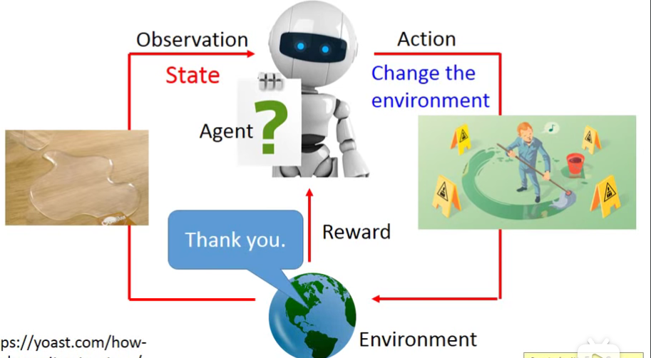

Policy based approach

目的：learning an Actor(也叫policy就是一个function，一般称为$π$​​​)

$π$：Action = $π$​（Observation），如下图

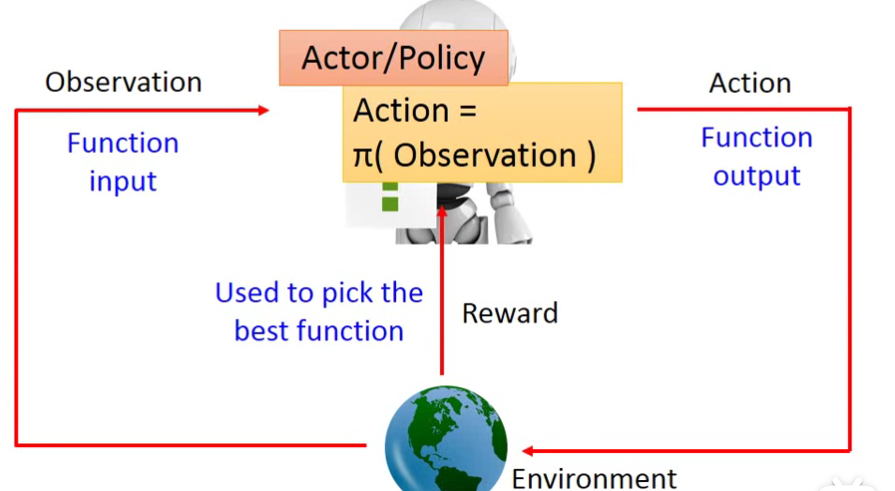

步骤：

- Step 1: define a set of function——用Neural network

输入：observation as a vector or matrix

输出：每个action对应一个**输出神经元**，一般表示为几率

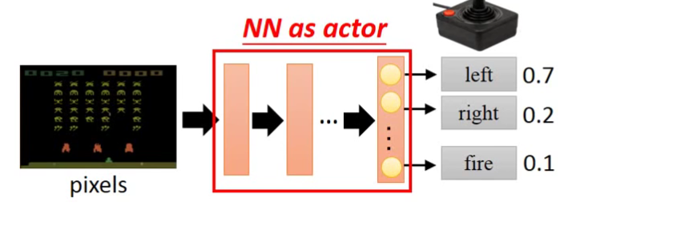

比起传统的表格法，神经网络更能**泛化**

- Step 2: goodness of function 

和监督学习一样，使用代价函数，这里是使用R~θ~的期望值

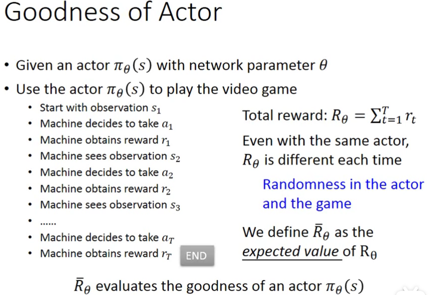

每个回合表示为一个trajectory（序列）τ

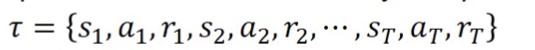

**某个**τ能得到的奖励是

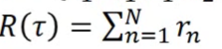

某个τ出现的概率表示为

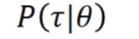

因此，所有可能的τ产生的奖励就是奖励的期望值：

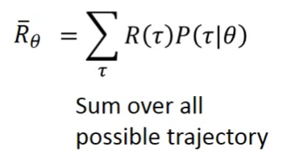

采样使用大数定律：

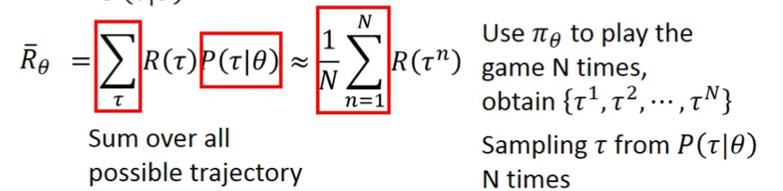

- Step 3: pick the best function

使用gradient ascent（和descent不同，这里是要最大化目标函数R），具体步骤：

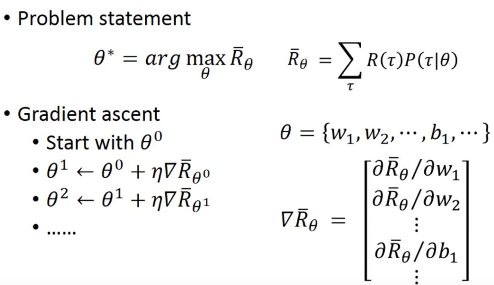

具体的，如何计算R的微分：

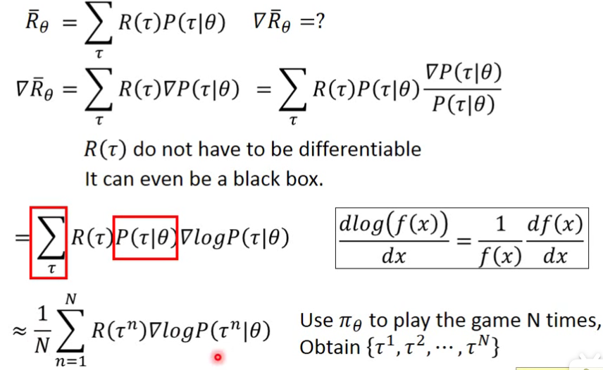

其中：

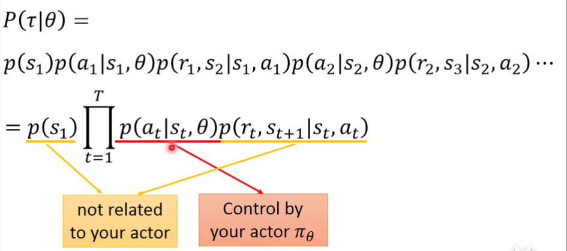

然后取log:

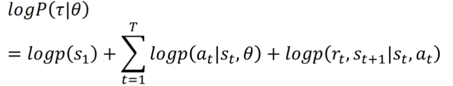

忽略与参数θ无关的项，求微分:

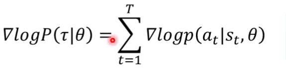

最后的奖励期望值表示为：

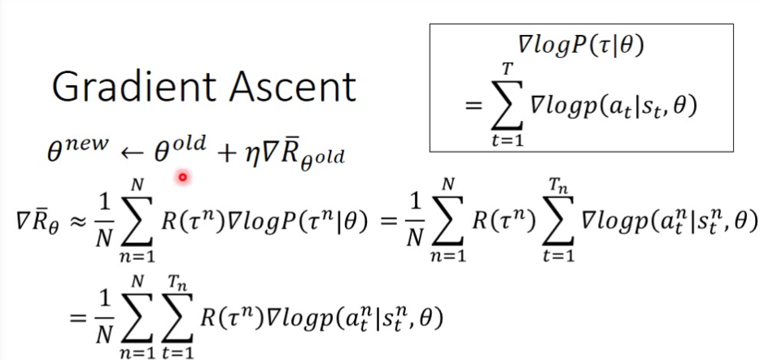

上式需要注意的地方：

- 它是符合直觉的，它考虑的是整个trajectory的reward，而不是但一个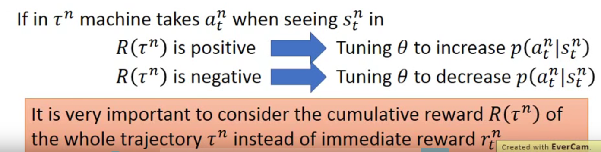

- 加log是为了归一化

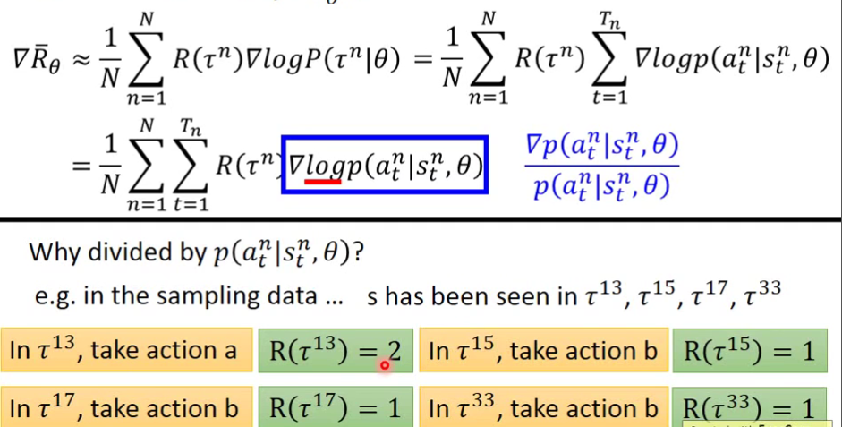

- 一般可以加一个baseline，以应对每个R(τ)都是正的情况：

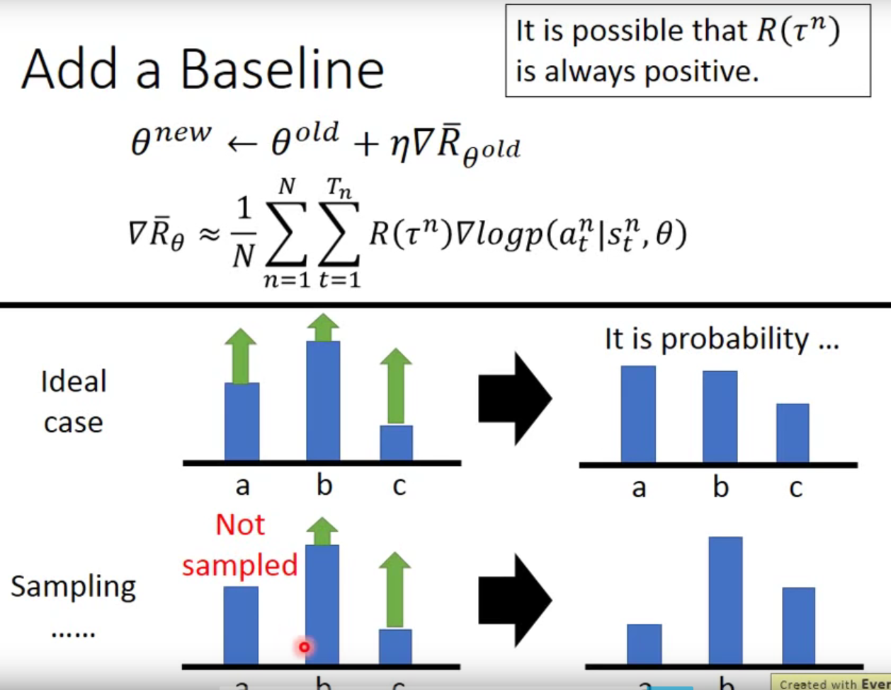

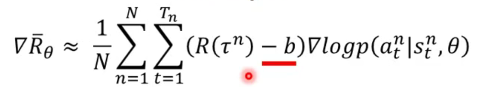

> “得到的奖励超过了某个baseline，才将这个动作出现的概率增加”

