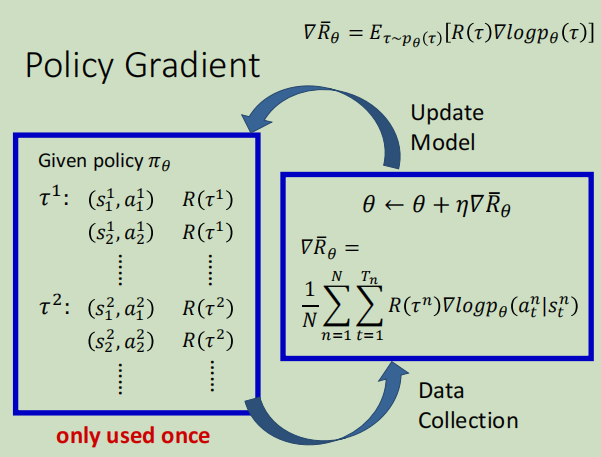
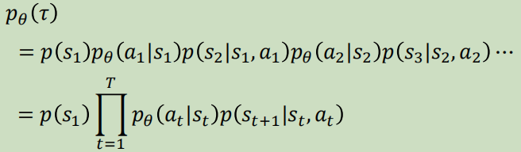
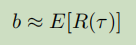
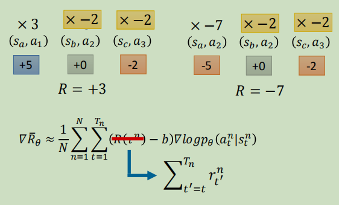
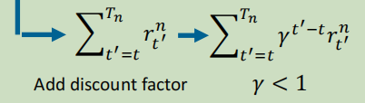

# 入门介绍

## Policy based approach

目的：learning an Actor(也叫policy就是一个function，一般称为$π$​​​)

$π$：Action = $π$​（Observation），如下图

### 原理

### 步骤：

- Step 1: define a set of function——用Neural network

输入：observation as a vector or matrix

输出：每个action对应一个**输出神经元**，一般表示为几率

比起传统的表格法，神经网络更能**泛化**

- Step 2: goodness of function 

和监督学习一样，使用代价函数，这里是使用R~θ~的期望值

每个回合表示为一个trajectory（序列）τ

**某个**τ能得到的奖励是

某个τ出现的概率表示为

具体可以写为：

因此，所有可能的τ产生的奖励就是奖励的期望值：

采样使用大数定律：

- Step 3: pick the best function

使用gradient ascent（和descent不同，这里是要最大化目标函数R），具体步骤：

具体的，如何计算R的微分：

其中：

然后取log:

忽略与参数θ无关的项，求微分:

最后的奖励期望值表示为：

上式需要注意的地方：

- 它是符合直觉的，它考虑的是整个trajectory的reward，而不是但一个

- 加log是为了归一化

### 技巧

#### 添加基线

- **一般可以加一个baseline**，以应对每个R(τ)都是正的情况：

> “得到的奖励超过了某个baseline，才将这个动作出现的概率增加”

基线的取值一般为：把 *τ* *n* 的值取期望，算一下 *τ* *n* 的平均值，即：

#### 给每一个动作分配合适的分数

原因： sample的次数有时候不够多，

> 只要在同一个回合里面，在同一场游戏里面，所有的状态跟动作的对都会使用同样的奖励项进行加权，这件事情显然是不公平的，因为在同一场游戏里面也许有些动作是好的，有些动作是不好的。假设整场游戏的结果是好的，并不代表这个游戏里面每一个动作都是对的。若是整场游戏结果不好，但不代表游戏里面的所有动作都是错的。所以我们希望可以给每一个不同的动作前面都乘上不同的权重。每一个动作的不同权重，它反映了每一个动作到底是好还是不好。

本来的权重是整场游戏的奖励的总和，现在改成从某个时间 *t* 开始，假设这个动作是在 *t* 这个时间点所执行的，从 *t* 这个时间点一直到游戏结束所有奖励的总和，才能代表这个动作的好坏。写成式子如下所示：

再进一步，我们把未来的奖励做一个折扣，如下式所示，由此得到的回报被称为**折扣回报**（discounted return)

最后，把 *R* *−* *b* 这一项合起来，我们统称为**优势函数（advantage function）**，用 A^θ^(s~t~ , a~t~) 来代表优势函数。

