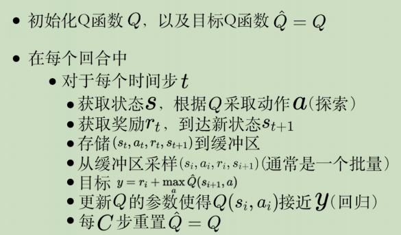
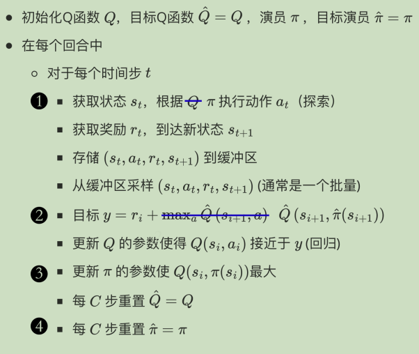

# Pathwise Derivative Policy Gradient路径衍生策略梯度

**pathwise derivative policy gradient**，路径衍生策略梯度，看成DQN解连续动作的一种方法，也是一种特殊的AC方法。

一般Q-Learning只能处理离散的动作，如果是连续的，**那就要训练actor π，它输出的action是能让Q函数的值最大**。原理图如下：

## 算法步骤

## 与DQN相比的改变

DQN:

PDPG：**（有4处不同）**

注意，PDPG的重大不同在于：**argmax 的问题直接用训练actor来解决（训练方向：让Q最大）**。详见原理图。

