# Sparse Reward稀疏奖励

如果环境中的奖励非常地稀疏，强化学习的问题就会变得非常的困难（比如让机器人拧螺丝）。

## reward shaping设计奖励

举个“骗人类小孩去学习”的例子，就是我们自己想办法设计一些奖励，**它不是环境真正的奖励**，来引导小孩agent做出正确的选择。

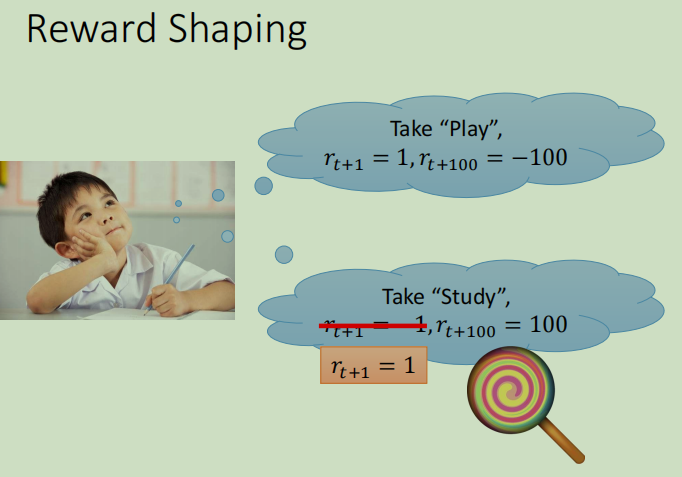

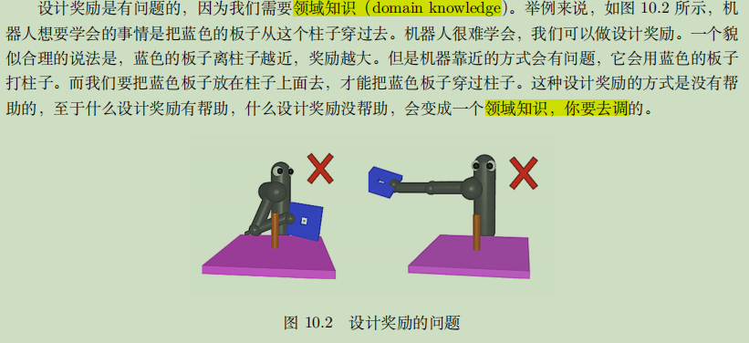

## Curiosity好奇心

在好奇心驱动的奖励机制下，会加上一个新的奖励函数：**内在好奇心模块(intrinsic curiosity module, ICM)**，变成：

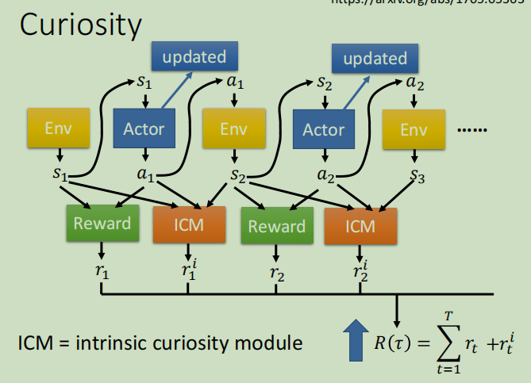

即，不止希望r越大越好，还希望r^i^越大越好。

### ICM模块的设计

#### 原始设计

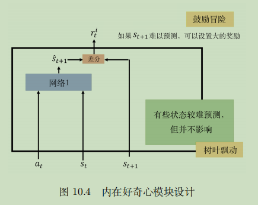

输入 3 个东西，输入现在的状态 s~^t^~，输入在这个状态采取的动作a~t~，输入下一个状态 s~^t+1^~。

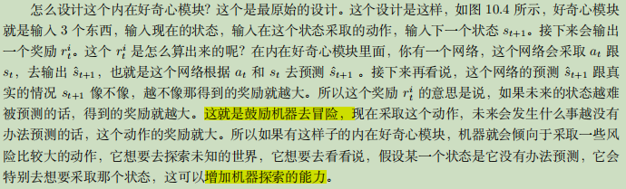

#### 改进设计(with特征提取器)

但是，某一些状态很难被预测并不代表它就是好的，它就应该要去被尝试的。

举例来说，可能在某个游戏里面，背景会有风吹草动，会有树叶飘动。那也许树叶飘动这件事情，是很难被预测的，对机器来说它在某一个状态什么都不做，看着树叶飘动，发现这个树叶飘动是没有办法预测的，接下来它就会一直站在那边，看树叶飘动。

💡**所以光是有好奇心是不够的，还要让它知道说，什么事情是真正重要的（也就是要过滤不需要的信息，提取特征）。**

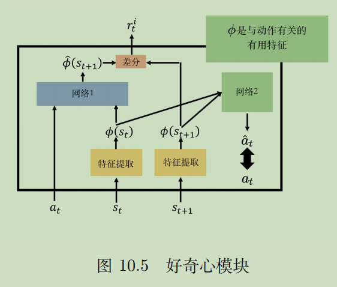

特征提取器的作用：它是输入一个状态，输出一个**特征向量来代表这个状态**。

如何做到过滤：网络2。如上图。

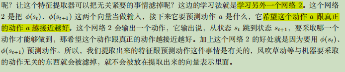

## curriculum learning课程学习

定义：其实就是为机器规划学习的顺序（在深度学习里面也会用到的概念）

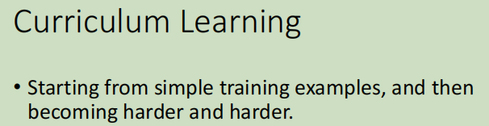

举例：机器手学习把板子压到柱子里面

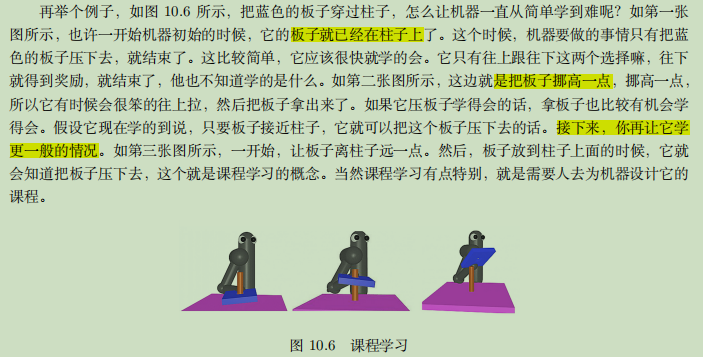

#### 方法：逆向课程学习

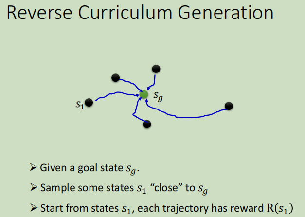

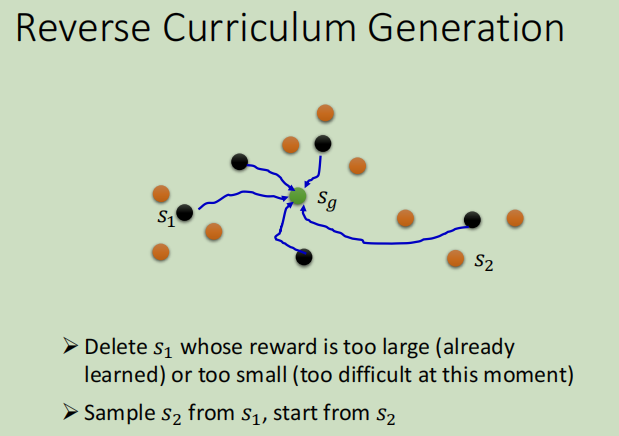

## hierarchical RL分层强化学习

指导思想：有一些智能体负责比较高级的东西，它**负责订目标**，订完目标以后，再分配给其他的智能体，去把它执行完成。

例子：粉红色就是每次定下来的小目标

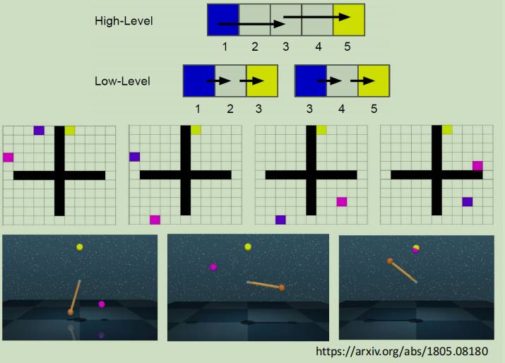

注意：

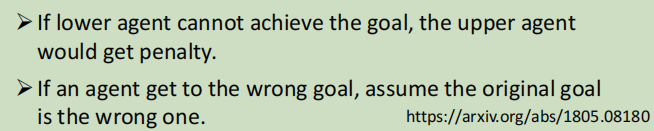

