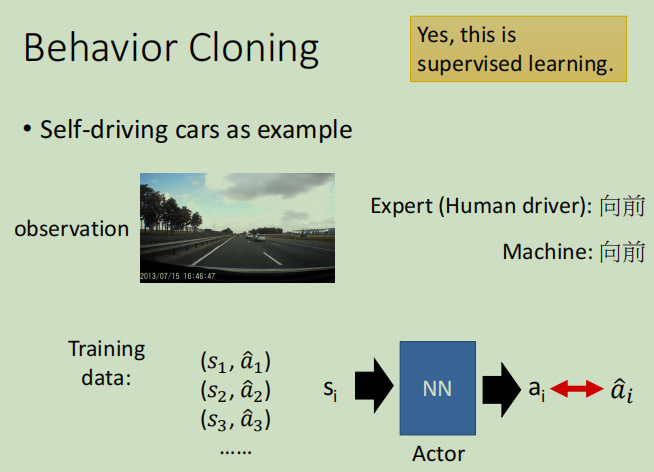
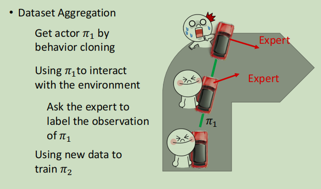
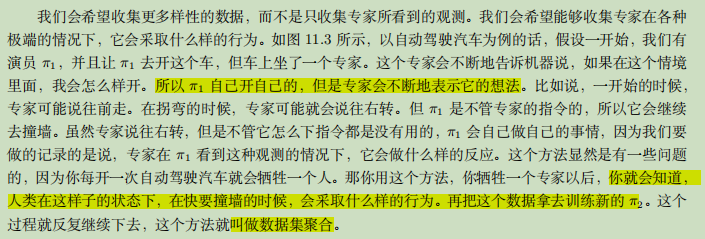
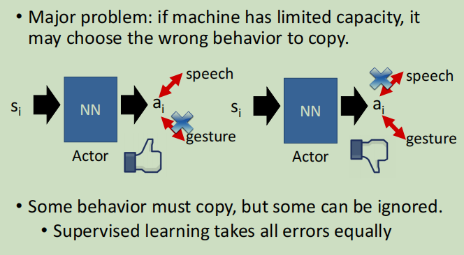
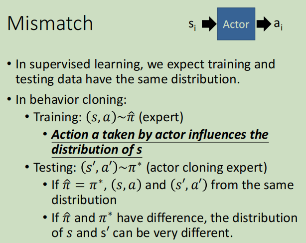
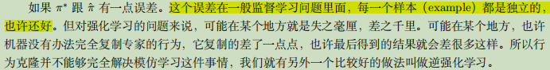

# Imitation learning 模仿学习IL

IL也叫：**示范学习（learning from demonstration），学徒学习（apprenticeship learning），观察学习（learning by watching）**。

很多时候是无法吃环境中得到明确的reward 的。

例子：自动驾驶撞人的reward 和撞动物的reward如何定很难，但是收集很多类的开车记录是可以做到的。

在模仿学习里面，我们介绍两个方法：**行为克隆（behavior cloning，BC）**和**逆强化学习（inverse reinforcement learning，IRL**），逆强化学习也被称为**逆最优控制（inverse optimalcontrol）**。

## Behavior Cloning行为克隆

BC和监督学习是一模一样的，即：尽量让机器学会和专家一样的行为。举例：

### DAgger数据集聚合

但是光做BC也是不够的，原因是，专家的行为可能不够，可能agent永远不知道撞墙如何处理，因为训练数据里从来没有撞墙。

**解决方法：数据集聚合(dataset aggregation , DAgger)**

解释：

### BC的其他问题

- 完全模仿专家的行为，不知道哪些是重要的（举例：shedon学中文）

- 在做行为克隆的时候，训练数据跟测试数据是不匹配的。

在RL中，采取的action是会影响到接下来见到的state（但是一般的监督学习的训练数据都是独立的）。但是在做BC的时候，只能看到专家π hat 的一堆状态-动作对。

## Inverse RL逆强化学习

