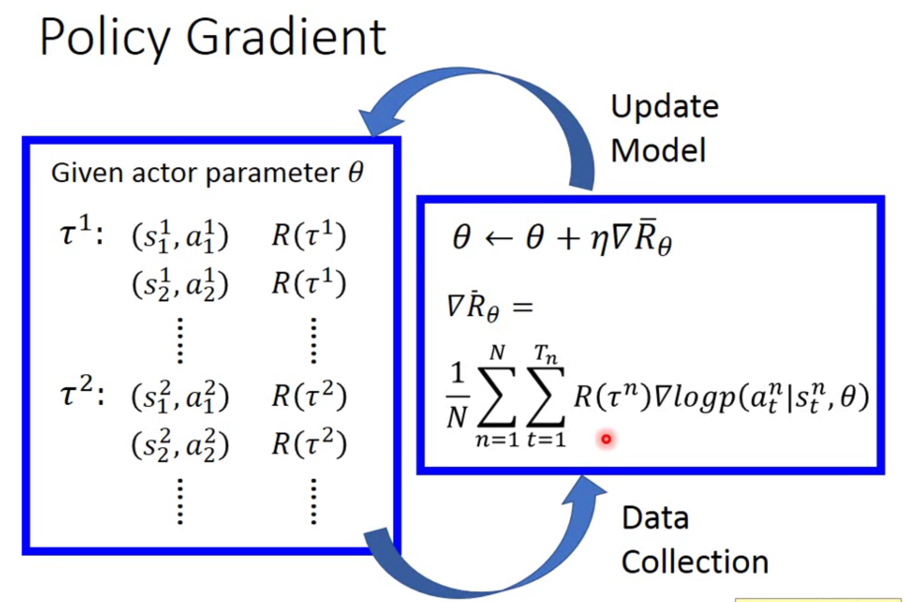
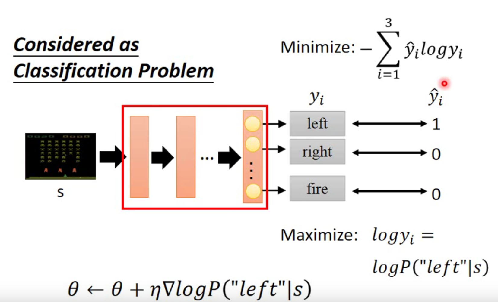
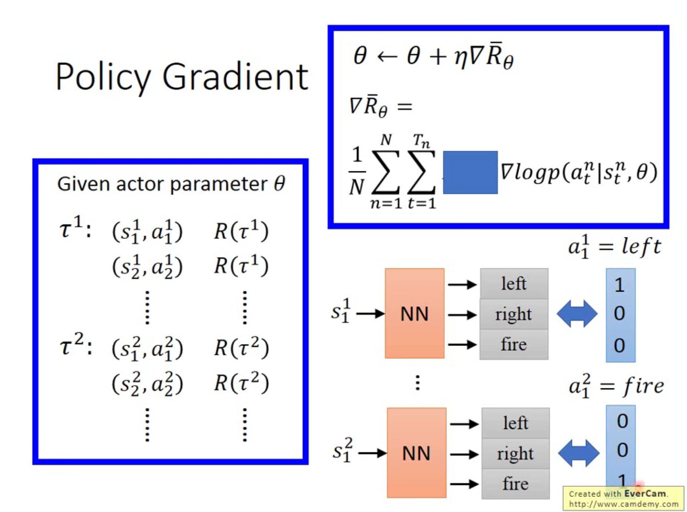
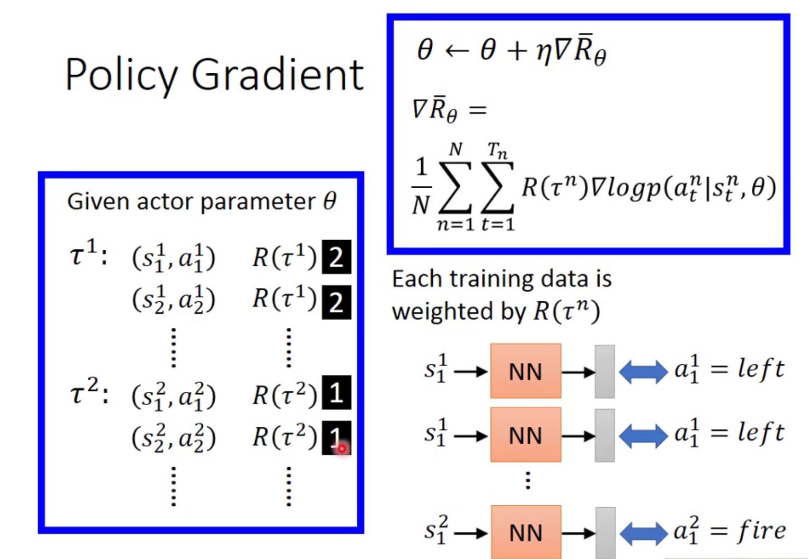

# Policy Gradient

具体的实施步骤

为什么会有log呢？将actor看成是一个分类器：

因此，当把R(τ)省略不看的时候，每个τ相当于给actor这个分类器提供了training data：

然后与正常的regression不同的是：**这里有了R(τ)，**就相当于在**训练一个分类器的时候加了权重**，每次训练完一次后，又得到新的training data，如此往复。

