# 	Learning to interact with environment

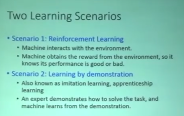

Actor, Environment, Reward三者的关系：

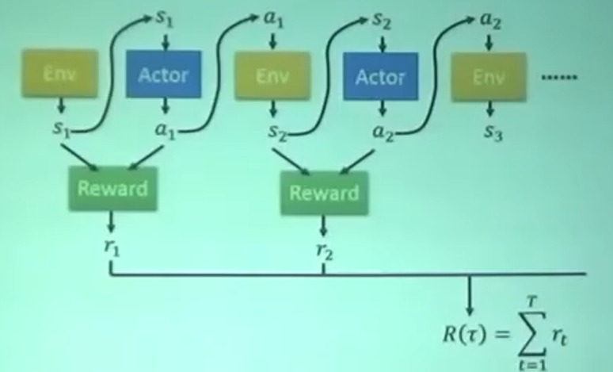

## Critic

### 状态价值函数V^π^(s)

注意到，以上是critic的一种，**会随着actor的不同（也就是π），Critics给出的评价也不同**

如何estimate 这个V^π^(s)：

- Monte-Carbo based approach（蒙特卡罗）

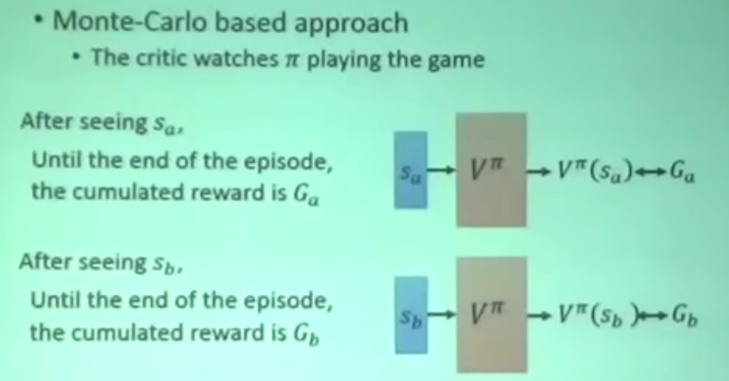

- Temporal-difference approach（时序差分）

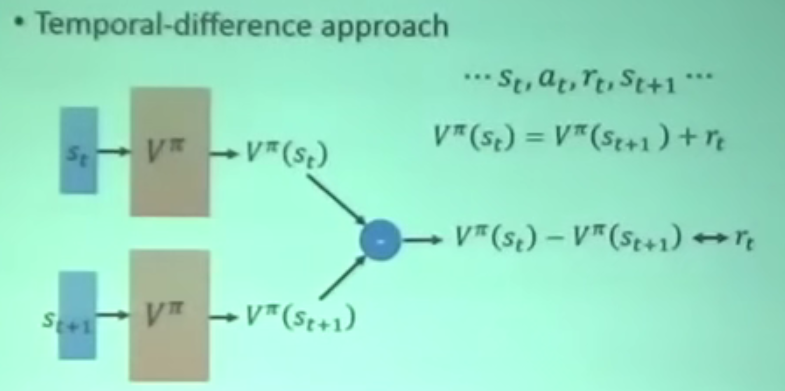

- 两者区别

暂略

### 动作价值函数（Q^π^(s,a)，Q函数）

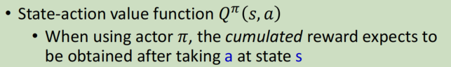

对于离散的动作，可以改写Q函数：

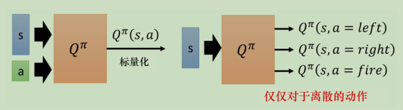

💡使用Q函数进行策略迭代（Q-Learning）

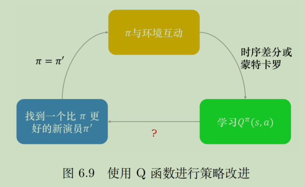

原理：

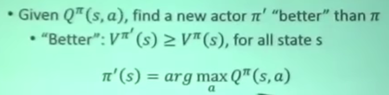

注意：这里的action只能是离散的（左移、右移、开火）

💡DQN的七种实现和改进：**论文-Rainbow**

## Actor-Critic

> 之前学习actor的时候是看reward function的输出来看如何update actor，在互动过程中有非常大的随机性，AC的精神在于不去看环境的reward了，因为环境的raward变化太大，而是跟Critic学。

### 优势演员-评论家算法

advantage AC（A2C）

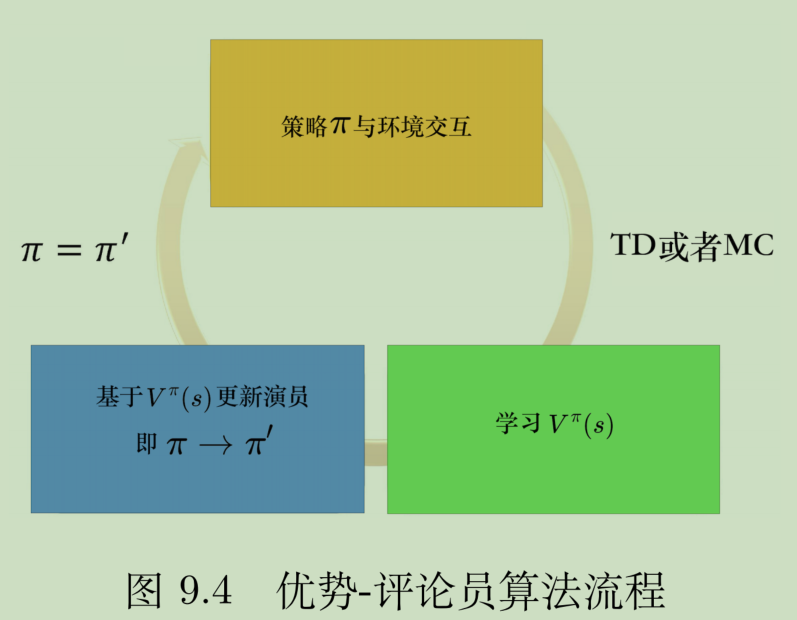

### 异步优势演员-评论家算法(A3C)

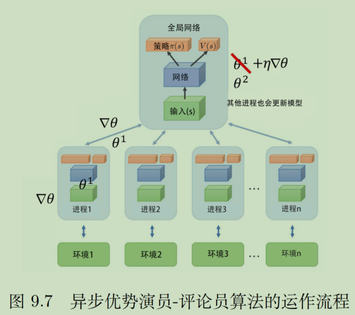

### 特例：路径衍生策略梯度

**pathwise derivative policy gradient**，路径衍生策略梯度，看成DQN解连续动作的一种方法，也是一种特殊的AC方法。

一般Q-Learning只能处理离散的动作，如果是连续的，那就要训练actor π，它输出的action是能让Q函数的值最大。原理图如下：

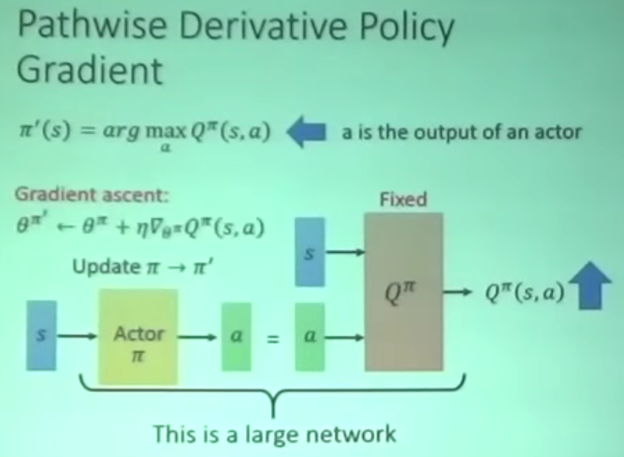

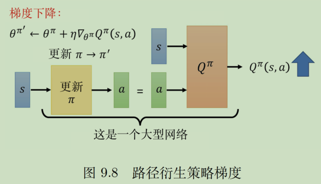

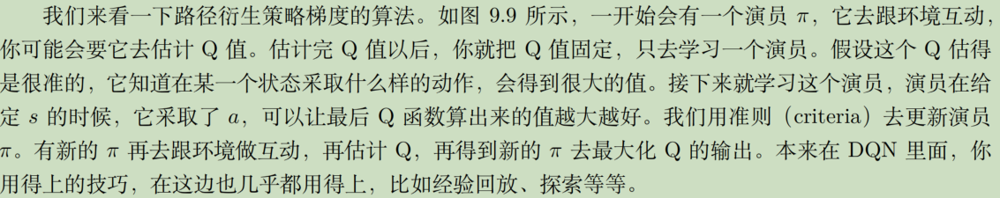

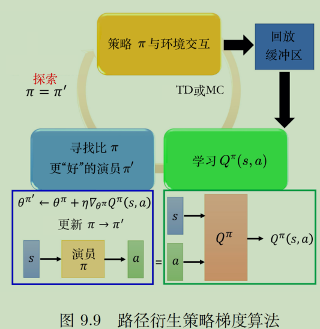

## Inverse RL

没有reward function。因为现实中的很多问题就是不好定义reward的。

用 Inverse RL推出reward function，然后再用RL去找最好的actor

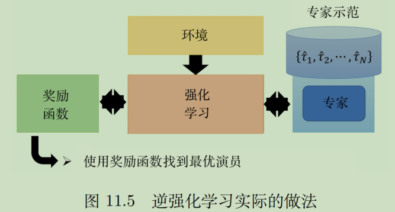

逆强化学习的原理框架：

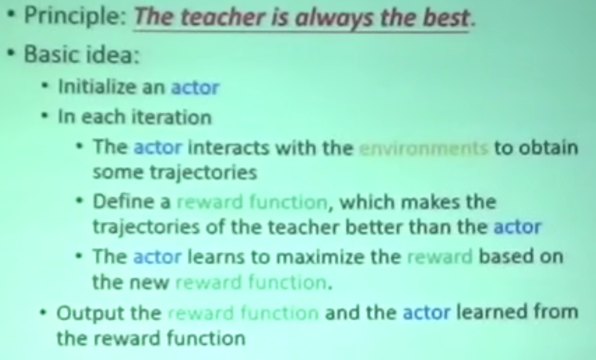

