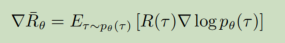
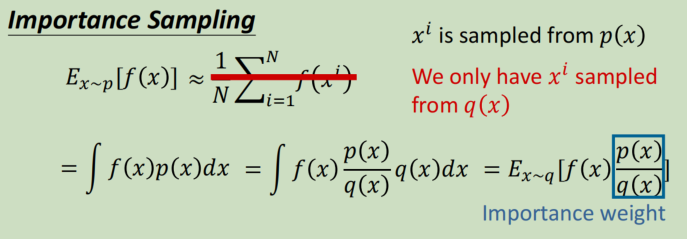
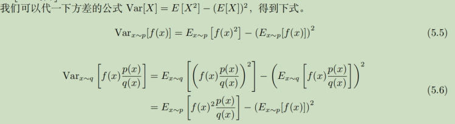
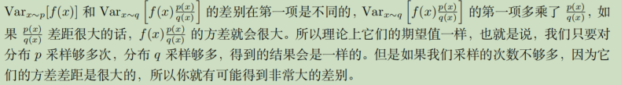
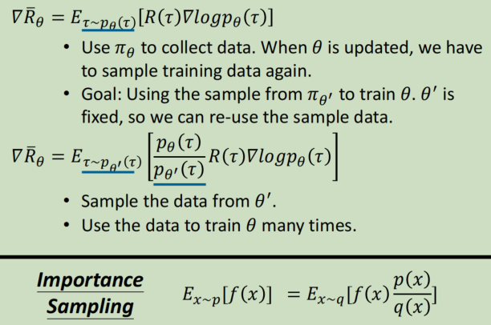
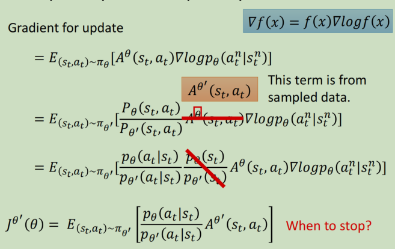
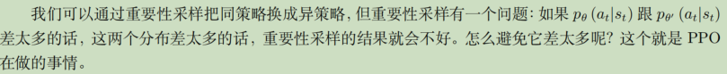
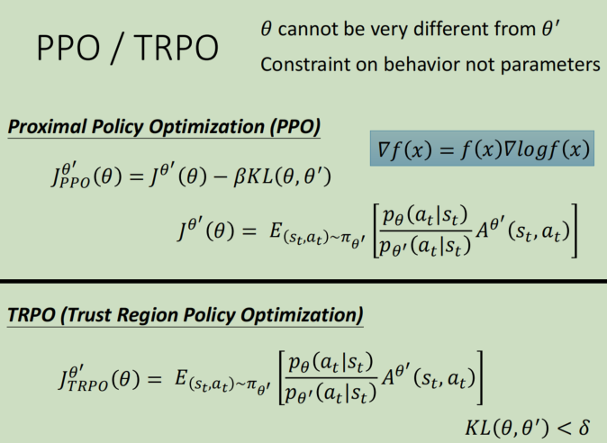
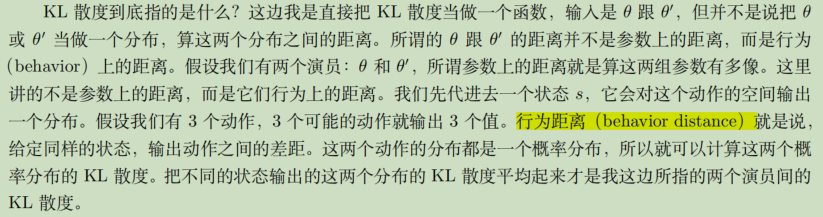
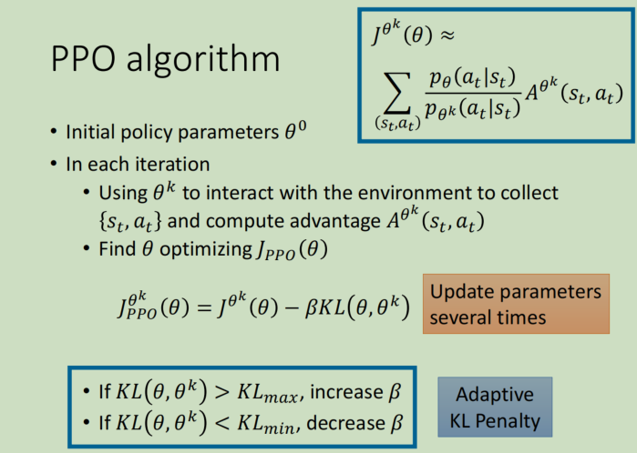

# 近端策略优化（proximal policy optimization，PPO）

PPO是policy gradient 的一个变形。是openAI的默认算法

Policy gradient回顾：见1.

## on-policy vs off-policy

### 定义

on-policy：拿去和环境互动的agent，和要学习得到的agent是同一个

off-policy：不是同一个。

Policy Gradient是一个on-policy的做法

### 由来

💡为什么需要off-policy的原因

> 从 *θ* 变成 *θ′* ，概率 *pθ*(*τ* ) 就不对了，之前采样出来的数据就不能用了。所以策略梯度是一个会花很多时间来采样数据的算法，大多数时间都在采样数据，智能体去跟环境做互动以后，接下来就要更新参数。你只能更新参数一次。接下来你就要重新再去收集数据，才能再次更新参数。

off-policy的好处：收集到的数据可以重复使用，更新参数很多次。

### 重要性采样

但是如果是方差的话：

### 将重要性采样用在off-policy

具体的gradient更新：

## PPO和TRPO

算法需要最大化的目标函数如下：

做示范的模型不能够跟真正的模型差太多，差太多的话，重要性采样的结果就会不好。我们在训练的时候，多加一个约束（constrain）。这个约束是 *θ* 跟 *θ′* 输出的动作的 KL 散度（KL divergence），

### KL散度

### 近端策略优化惩罚(PPO1)算法步骤

### 近端策略优化裁剪(PPO2)

