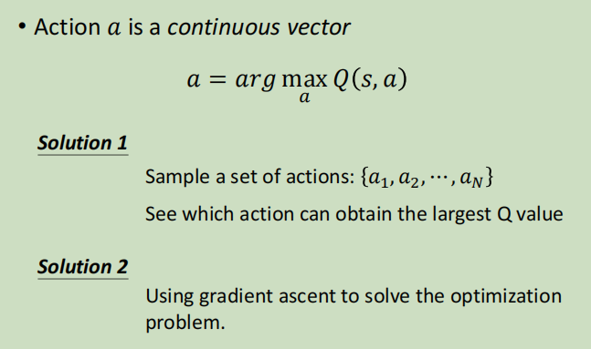

# Q-learning for continuous action

很多时候动作并不是离散的，比如机器人身上50个关节的角度，比如自动驾驶方向盘的左转几度右转几度。动作变成了一个向量，每个维度都是一个实数，是连续的。

## 方案1&方案2

方案1：

方案2：

把a当成参数，找一组a去最大化Q函数（目标函数），是一个优化问题。

## 方案3:设计网络

（颜色块表示向量大小）

另外注意，∑代表的矩阵一定是正定的，原因：

所以，a等于μ(s)的时候能够让Q函数最大，即：

## 方案4：不使用DQN

使用A-C方法

