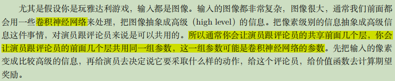

# Actor-Critic

A-C算法是结合**策略梯度**和**时序差分学习**的强化学习方法。演员是指策略函数π~θ~(a|s)，评论员指价值函数V^π^(s)。

## 策略梯度回顾

加完基线和折扣因子的梯度：

 

因此，G作为一个随机变量，方差可能会比较大，但是我们每次更新参数之前做采样的次数不可能太多，因此一种解决办法就是直接估测G的期望值。

如何拿期望值代替采样的值呢？方法就是DQN。有两种评论员：

💡两种函数的输入输出如下所示：

## A-C算法

前述，则随机变量G的期望值正好就是Q函数的定义，则

用价值函数V来表示基线，则最后策略梯度表示为：

## A2C算法

### 原理

如果直接按照上面操作的话也行，不过需要估计两个网络：Q和V。

如何解决呢？根据Q和V的函数定义，可以如下：

紫色的式子就称为：**advantage function，优势函数**。

### 算法流程

### 技巧

#### 技巧1：估计策略π和估计V的网络参数可以共用

我们需要估计两个网络：V 函数和策略π的网络（也就是演员）。其中，V是输入一个状态，输出一个标量；π(s)是输入一个状态：

- 如果动作是离散的，就是输出动作的分布；
- 如果动作是连续的，就是输出一个连续的向量。

以下就是离散的例子

输入一个状态，它决定你现在要采取哪一个动作。这两个网络，演员和评论员的输入都是 *s*，**所以它们前面几个层（layer）是可以共享的（绿色部分）。**以图像输入为例子：

#### 技巧2：探索机制

常见的探索方法就是，对π的输出的分布加约束，使得分布的熵不要太小，也就是希望不同的动作被采用的概率能够平均一些。

这样在测试的时候，它才会多尝试各种不同的动作，才会把这个环境探索的比较好，才会得到比较好的结果。

## A3C算法

异步优势演员-评论员算法

