# Q-Learning

复习：见3.md。

## MC与TD的差别

蒙特卡罗最大的问题就是方差很大

## Q-learning

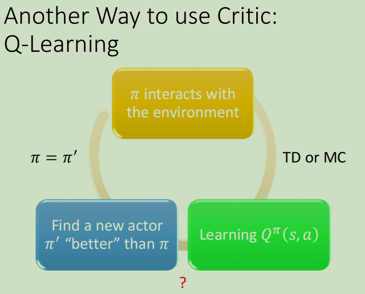

学习得到Q函数后，如何得到*π′* 呢：

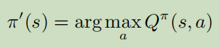

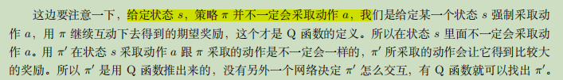

## 证明Q函数决定的π‘一定比π好

略

## 技巧

### 目标网络Target Network

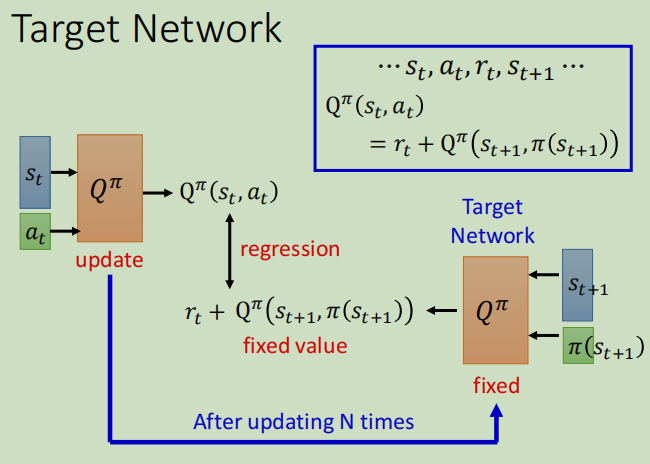

使用TD的时候，两个Q不要同时更新训练，而是一个右边那个固定，然后训练左边的Q(这样其实也就变成了回归regression问题)。训练很多次后，再用更新过的Q去替换掉固定住的Q。

 

### 探索Exploration

当我们使用 Q 函数的时候，策略完全取决于 Q 函数。给定某一个状态，你就穷举所有的 *a*，看哪个 *a* 可以让 Q 值最大，它就是采取的动作，如下式所示。

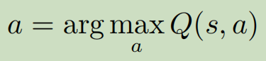

这个跟策略梯度不一样，在**做策略梯度的时候，输出其实是随机的**。我们输出一个动作的分布，根据这个动作的分布去做采样，所以在策略梯度里面，你每次采取的动作是不一样的，是有随机性的。

像这种 Q 函数，如果我们采取的动作总是固定的，会遇到的问题就是这不是一个好的收集数据的方式。因为假设我们要估某一个状态，可以采取动作 *a*1, *a*2, *a*3。我们要估测在某一个状态采取某一个动作会得到的 Q 值，一定要在那一个状态采取过那一个动作，才估得出它的值。如果没有在那个状态采取过那个动作，我们其实估不出那个值的。如果是用深的网络，就 Q 函数是一个网络，这种情形可能会没有那么严重。但是一般而言，假设 Q 函数是一个表格，没有看过的状态-动作对，它就是估不出值来。网络也是会有一样的问题，只是没有那么严重。

结果：

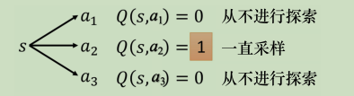

这个问题就是**探索-利用窘境**。解决方法：

#### ε-贪心（ε-greedy）

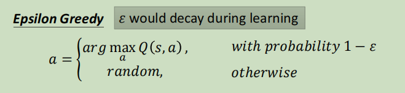

通常 *ε* 就设一个很小的值，1 *−* *ε* 可能是 90%，也就是 90% 的概率会按照 Q 函数来决定动作，但是我有 10% 的概率是随机的。

随着训练次数越来越多，就会减小探索，会把ε的值变小。

#### 玻尔兹曼探索(Boltzmann Exploration)

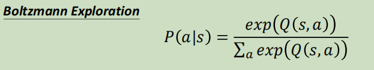

这个方法就比较像是策略梯度。**在策略梯度里面，网络的输出是一个期望的动作空间上面的一个的概率分布，再根据概率分布去做采样。**

具体的做法就是如上式：

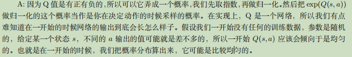

#### 经验回访(Replay Buffer)

回放缓冲区(RB)，又称回放内存（replay memory），有某一个策略 *π* 去跟环境做互动，它会去收集数据。我们会把所有的数据放到一个数据缓冲区（buffer）里面。（里面的每一笔数据就是记得说，我们之前在某一个状态 *s~t~*，采取某一个动作 *a~t~*，得到了奖励 *r~t~*，跳到状态 s~t+1~）

但是，回放缓冲区里的经验可能来自不同的策略π，这没有关系，原因：

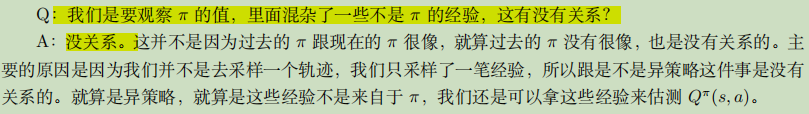

有了RB后，训练Q就需要在每次迭代里面从RB里面挑一个批量batch出来，里面有一把经验，根据这把经验去更新Q，具体如下：

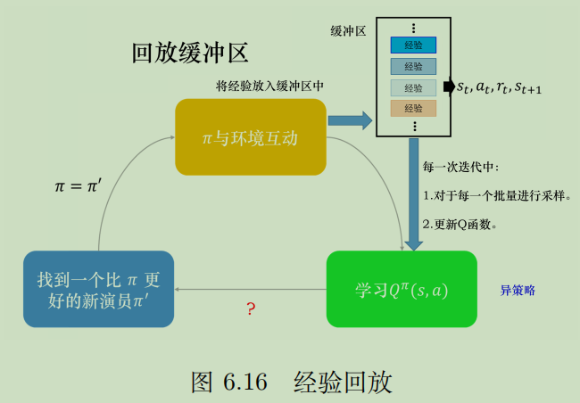

## DQN算法步骤

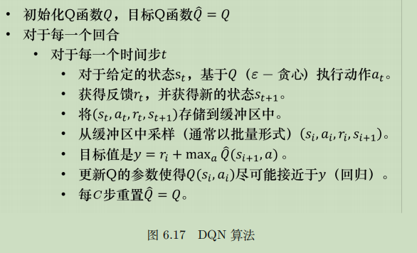

注意，目标值用的是Target Network算的，为：

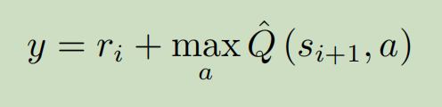

其中 *a* 是让Q hat的值最大的 *a*。

