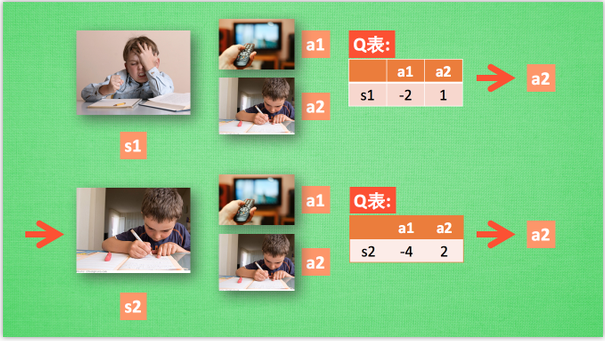
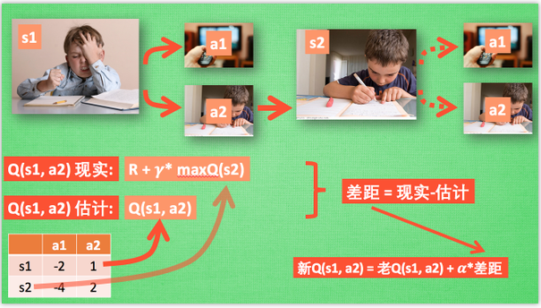

# Q-learning

## 行为准则Q表

## Q-learning决策

## Q-learning更新

off-policy的更新：

## Q-learning的算法步骤

每次更新我们都用到了 Q 现实和 Q 估计, 而且 Q learning 的迷人之处就是 在 Q(s1, a2) 现实 中, 也包含了一个 Q(s2) 的最大估计值, 将对下一步的衰减的最大估计和当前所得到的奖励当成这一步的现实。

其中：

- Epsilon greedy 是用在决策上的一种策略, 比如 epsilon = 0.9 时, 就说明有90% 的情况我会按照 Q 表的最优值选择行为, 10% 的时间使用随机选行为. 
- alpha是学习率, 来决定这次的误差有多少是要被学习的, alpha是一个小于1 的数. 
- gamma 是对未来 reward 的衰减值. 

## γ的含义

## 简单例子

