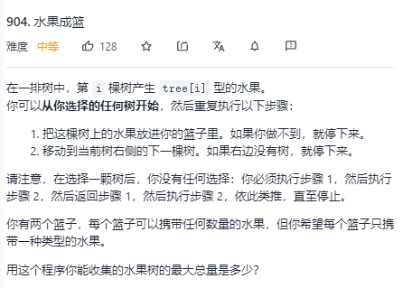

# 💡算法

## 递归

基线条件

递归条件


# 数组

重要方法：

## 双指针（快慢指针）

双指针法（快慢指针法）： **通过一个快指针和慢指针在一个for循环下完成两个for循环的工作**

## 动态窗口

也是双指针的一种，但是对于子序列有一些特定的要求

所谓滑动窗口，**就是不断的调节子序列的起始位置和终止位置，从而得出我们要想的结果**

例题：



滑动窗口解法：


## 二分查找

前提：**有序，不重复**的序列

- 查找区间是左闭右闭

```java
class Solution {
    public int search(int[] nums, int target) {
        // 避免当 target 小于nums[0] nums[nums.length - 1]时多次循环运算
        if (target < nums[0] || target > nums[nums.length - 1]) {
            return -1;
        }
        int left = 0, right = nums.length - 1;//注意1
        while (left <= right) {//注意2
            int mid = left + ((right - left) >> 1);
            if (nums[mid] == target)
                return mid;
            else if (nums[mid] < target)
                left = mid + 1;//注意3
            else if (nums[mid] > target)
                right = mid - 1;//注意4
        }
        return -1;
    }
}
```


- 查找区间是左闭右开

```java
class Solution {
    public int search(int[] nums, int target) {
        int left = 0, right = nums.length;//注意1
        while (left < right) {//注意2
            int mid = left + ((right - left) >> 1);///思考：为什么这么写？！！
            if (nums[mid] == target)
                return mid;
            else if (nums[mid] < target)
                left = mid + 1;//注意3
            else if (nums[mid] > target)
                right = mid;//注意4
        }
        return -1;
    }
}
```

- 变种：查找target出现的最左位置和最右位置


- 变种：**有序**二维数组中某些元素的查找（那个角是最大元素，那个角是最小元素）

有序二维数组的性质：任取一个数mid 满足 `最小值<mid<最大值`，那么矩阵中不大于mid 的数，肯定全部分布在矩阵的左上角。

于是二分法变成了从某一个角落开始的走格子问题。

## Z字形查找


# 字符串

## KMP算法

获取模式串在文本串出现的起始位置：

```java
public int strStr(String haystack, String needle) {
        //法0：2个循环的暴力匹配
        //法1：KMP算法，使用前缀表
        if(needle.length() == 0){
            return 0;//模式串为0，直接返回-1
        }

        int[] next = new int[needle.length()];
        getNext(next,needle);
        int j = -1;
        for(int i=0; i<haystack.length(); i++){//i遍历文本串
            //遇到不匹配的冲突点：
            while(j>=0 && haystack.charAt(i) != needle.charAt(j+1)){
                j=next[j];
            }

            //遇到匹配的：一直匹配下去，即j开始递增
            if(haystack.charAt(i) == needle.charAt(j+1)){
                j++;
            }
            if(j==needle.length()-1){//找到了整串，可以结束
                return (i-needle.length()+1);
            }
        }
        return -1;
    }
    /**获取模式串的前缀表next */
    public void getNext(int[] next, String s){
        int j = -1;
        next[0] = j;
        for(int i = 1;i<s.length();i++){
            while(j>=0 && s.charAt(i) != s.charAt(j+1)){
                j = next[j];
            }

            if(s.charAt(i) == s.charAt(j+1)){
                j++;
            }
            next[i] = j;
        }
    }
```

# 哈希法

判断一个元素是否出现在集合里；

判断一个元素是否出现过；

## 数组作为哈希表


## 集合Set作为哈希表


## 映射map作为哈希表


# 栈

先进后出。

适合于对称匹配类的题目。


