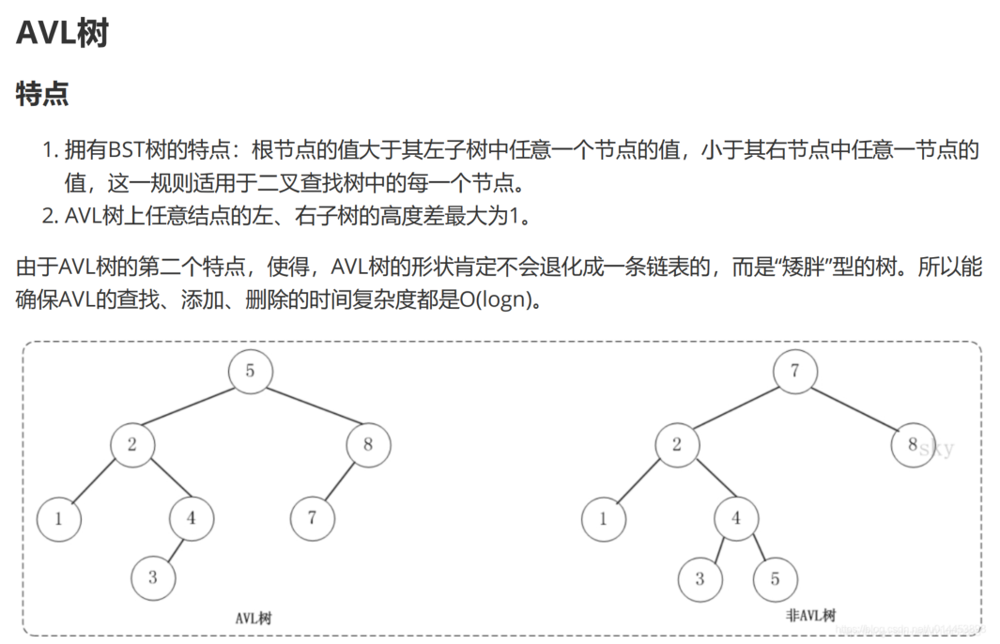

# 树

## 相关概念

## 类型

### 满二叉树

深度为k，有2^k-1个节点的二叉树。

### 完全二叉树

完全二叉树的定义如下：**在完全二叉树中，除了最底层节点可能没填满外，其余每层节点数都达到最大值，并且最下面一层的节点都集中在该层最左边的若干位置。若最底层为第 h 层，则该层包含 1~ 2^（h-1 ）个节点。**

**如果该二叉树的所有叶子节点都在最后一层或者倒数第二层，而且最后一层的叶子节点在左边连续，倒数第二层的叶子节点在右边连续，我们称为完全二叉树**

### 二叉搜索树（BST）

前面介绍的树，都没有数值的，而二叉搜索树是有数值的了，**二叉搜索树是一个有序树**。

- 若它的左子树不空，则左子树上所有结点的值均**小于**它的根结点的值；
- 若它的右子树不空，则右子树上所有结点的值均**大于**它的根结点的值；
- 它的左、右子树也分别为二叉排序树。

#### 好处

查询的时间复杂度比链表快，链表的查询时间复杂度是O(n)，二叉排序树平均是O(logn)。二叉排序树越平衡，越能模拟二分法，所以越能想二分法的查询的时间复杂度O(logn)。

#### 不足

但是BST树有一个不足的地方，就是如果插入的结点的值的顺序，是越来越小或者越来越大的，那么BST就会退化为一条链表，那么其查询的时间复杂度就会降为O(n)。

### 平衡二叉搜索树（BBST/AVL）

**它是一棵空树或它的左右两个子树的高度差的绝对值不超过1，并且左右两个子树都是一棵平衡二叉树**

### 红黑树

**红黑树是一棵二叉搜索树**，它在每个节点增加了一个存储位记录节点的颜色，可以是RED,也可以是BLACK；通过任意一条从根到叶子简单路径上颜色的约束，红黑树保证最长路径不超过最短路径的二倍，因而**近似平衡**。

具体先略

### 平衡多路查找树

#### B树

#### B+树

### 顺序存储二叉树（数组存储）

### 线索化二叉树

前驱节点

后继节点

## 存储方式

### 链式存储

### 顺序存储

## 💡遍历方式

### 广度优先

#### 层次遍历

### 深度优先

#### 前序

#### 中序

#### 后序

