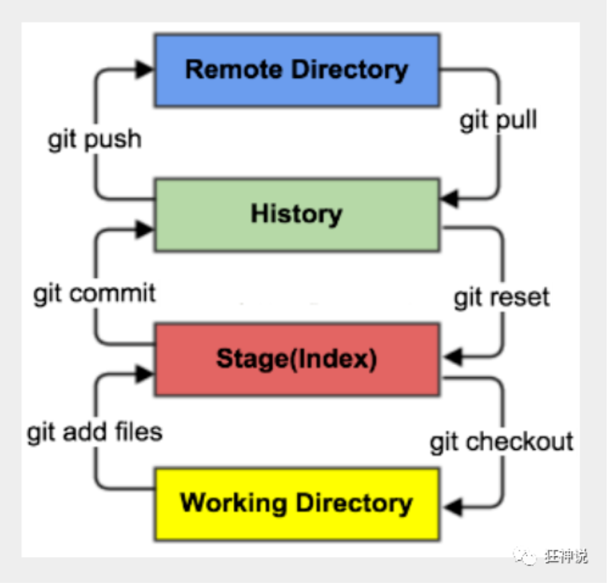

# Git

最强大的版本控制工具

**Git Bash：**Unix与Linux风格的命令行，使用最多，推荐最多

**Git CMD：**Windows风格的命令行

**Git GUI**：图形界面的Git，不建议初学者使用，尽量先熟悉常用命令

## 常用的Linux命令

平时一定要多使用这些基础的命令！

1）、$cd$ : 改变目录。

2）、cd ..：回退到上一个目录，直接cd进入默认目录

3）、pwd : 显示当前所在的目录路径。

4）、ls(ll):  都是列出当前目录中的所有文件，只不过ll(两个ll)列出的内容更为详细。

5）、touch : 新建一个文件 如 touch index.js 就会在当前目录下新建一个index.js文件。

6）、rm:  删除一个文件, rm index.js 就会把index.js文件删除。

7）、mkdir:  新建一个目录,就是新建一个文件夹。

8）、rm -r :  删除一个文件夹, rm -r src 删除src目录

```
rm -rf / 切勿在Linux中尝试！删除电脑中全部文件！
```

9）、mv 移动文件, mv index.html src index.html 是我们要移动的文件, src 是目标文件夹,当然, 这样写,必须保证文件和目标文件夹在同一目录下。

10）、reset 重新初始化终端/清屏。

11）、clear 清屏。

12）、history 查看命令历史。

13）、help 帮助。

14）、exit 退出。

15）、#表示注释


## Git 基本理论

Git本地有三个工作区域：工作目录（Working Directory）、暂存区(Stage/Index)、资源库(Repository或Git Directory)。如果在加上远程的git仓库(Remote Directory)就可以分为四个工作区域。文件在这四个区域之间的转换关系如下：




