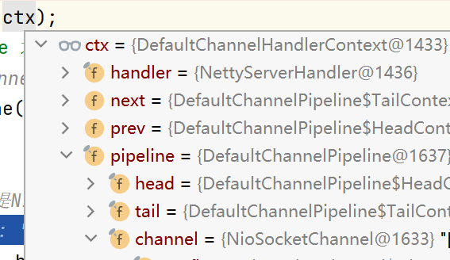
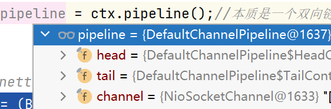
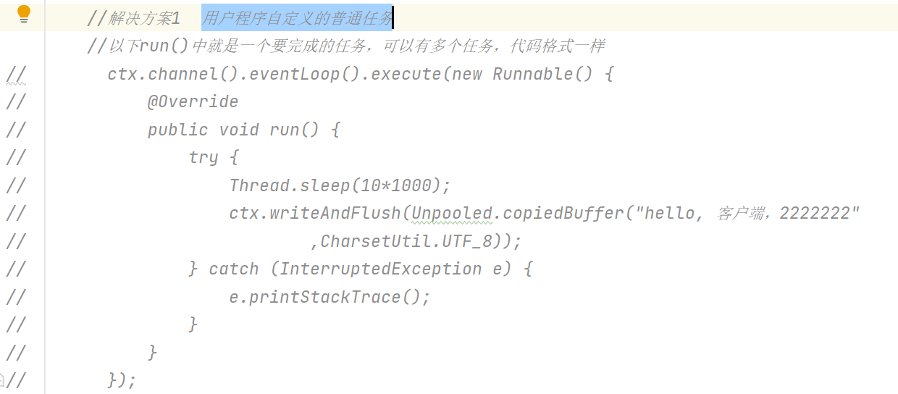
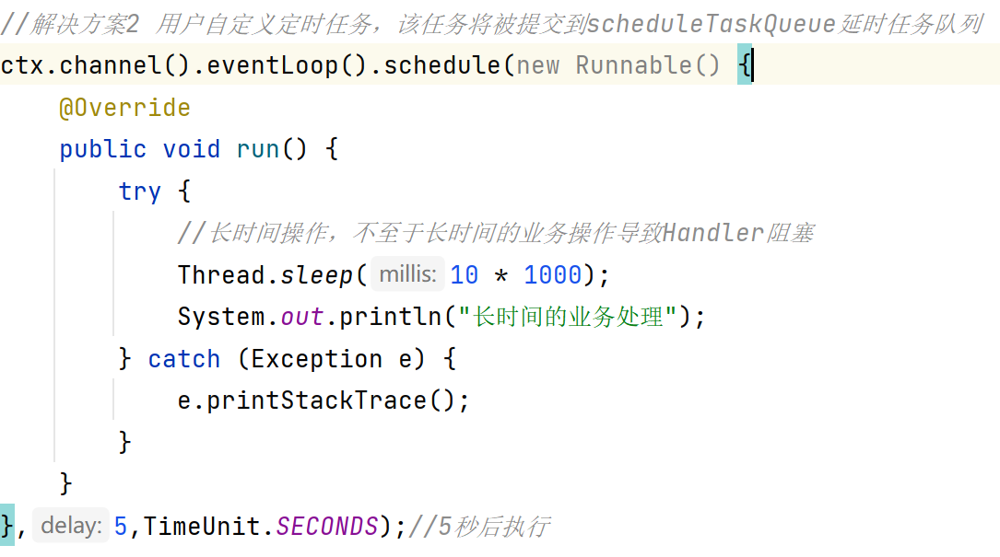

# Java网络编程基本常识

BIO、NIO和AIO这三个概念分别对应三种通讯模型：阻塞、非阻塞、非阻塞异步，具体这里就不详细写了。网上好多博客说Netty对应NIO，准确来说，应该是既可以是NIO，也可以是AIO，就看你怎么实现。

**这三个概念的区别如下：**

1）BIO：一个连接一个线程，客户端有连接请求时服务器端就需要启动一个线程进行处理,线程开销大。

2）NIO：一个请求一个线程，客户端发送的连接请求会注册到多路复用器上，多路复用器轮询到该连接有I/O请求时才启动一个线程进行处理；

3）AIO：一个有效请求一个线程，客户端的I/O请求都是由OS先完成了再通知服务器应用去启动线程进行处理。

**通俗地概括一下就是：**

1）BIO是面向流的，NIO是面向缓冲区的；

2）BIO的各种流是阻塞的，而NIO是非阻塞的；

3）BIO的Stream是单向的，而NIO的channel是双向的。

# 线程模型

## 传统IO阻塞模型

## Reactor模式（反应器/分发者dispatcher/通知者模式notifier）

Reactor模式的分类：

单Reactor单线程

单Reactor多线程

主从Reactor多线程

# Netty模式

netty可以认为是在主从Reactor上做了改进

pipeline 和 channel 的关系：有点类似于相互包含

ctx对象，则把两个都包含了进去

## Netty特性与重要组件

### 异步处理机制

#### taskQueue自定义普通任务

#### scheduleTaskQueue自定义延时任务

### ChannelFuture异步机制

