# P3 布尔逻辑与布尔门

### AND 

## OR

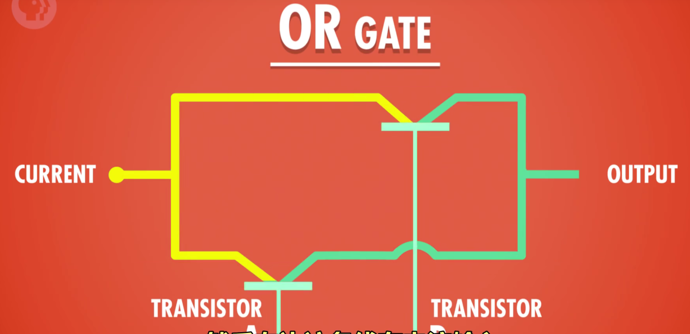

## NOT

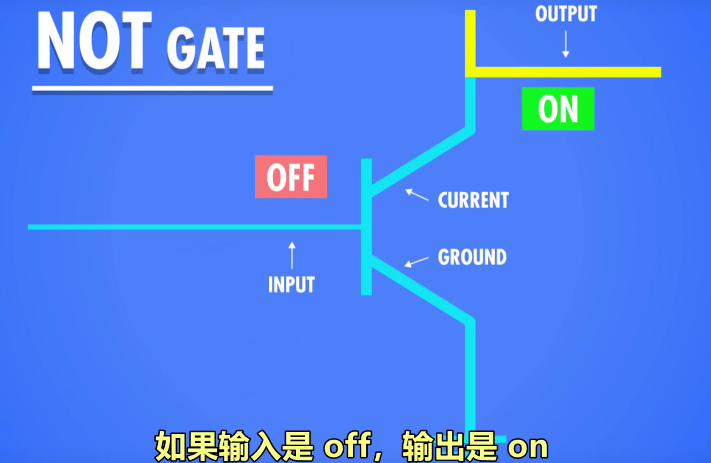

## XOR异或

# P7 中央处理器Central Processing Unit(CPU)

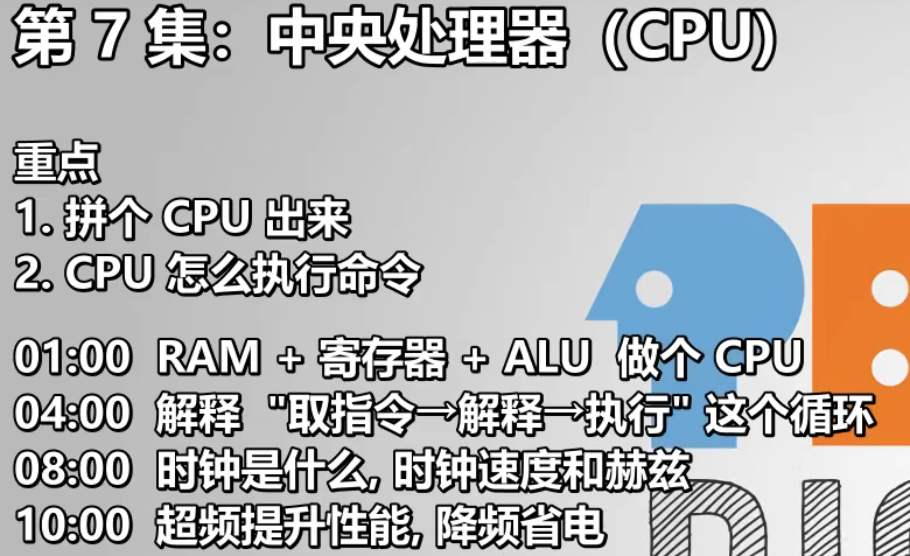

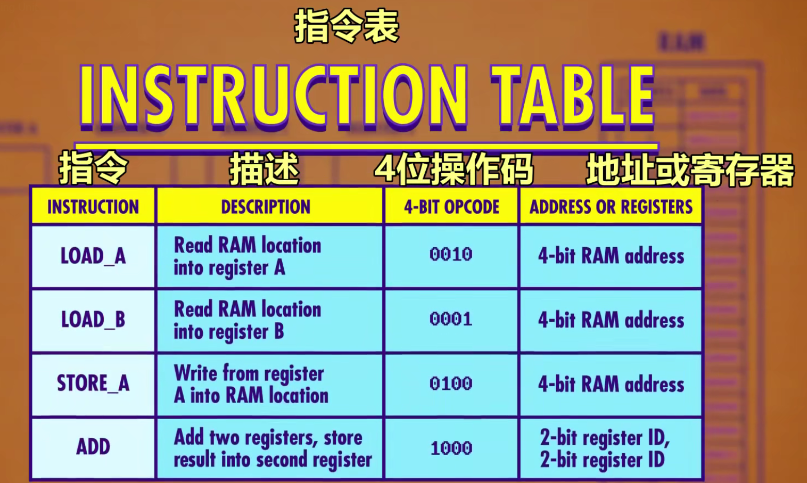

## 取指令：

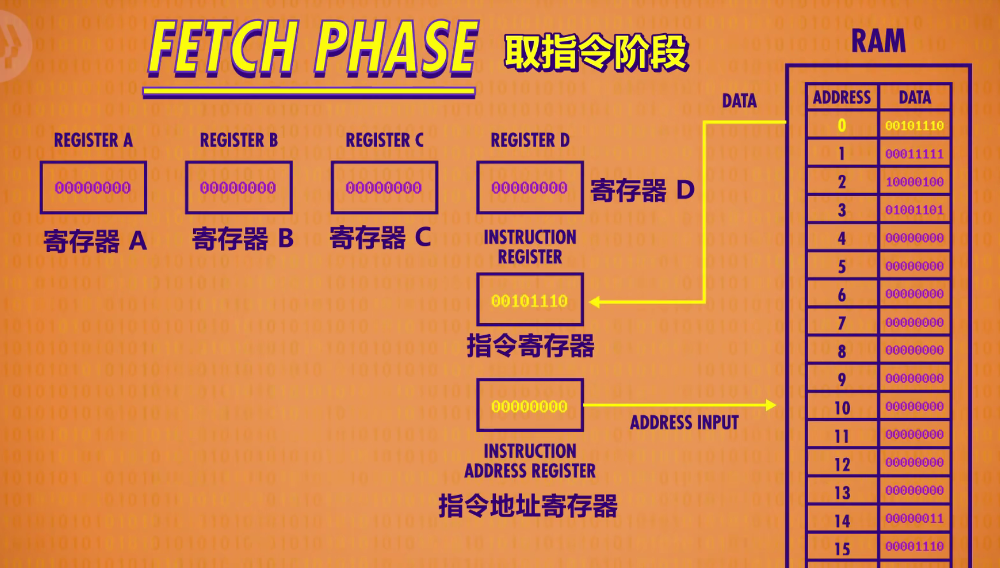

## 解码（查表）：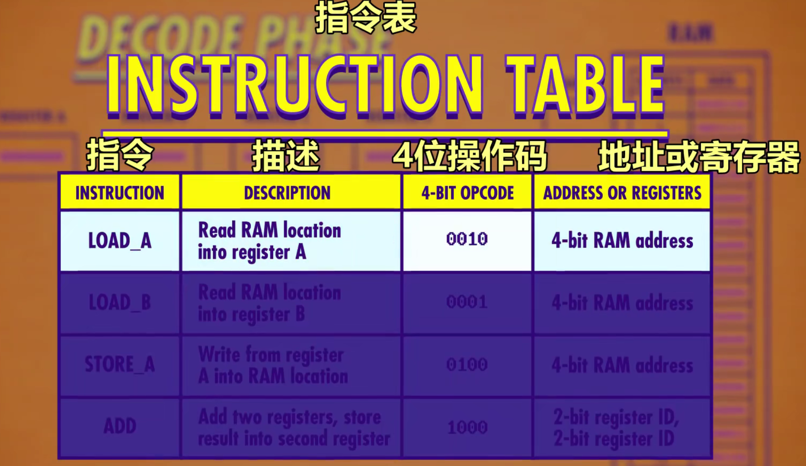

## 执行：

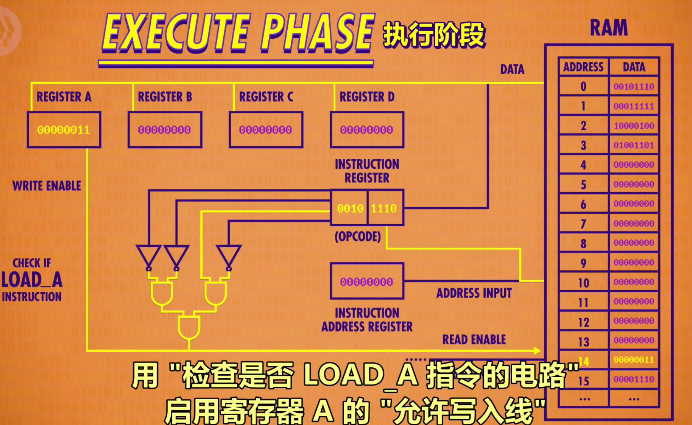

抽象后成一个整体的**控制单元**：

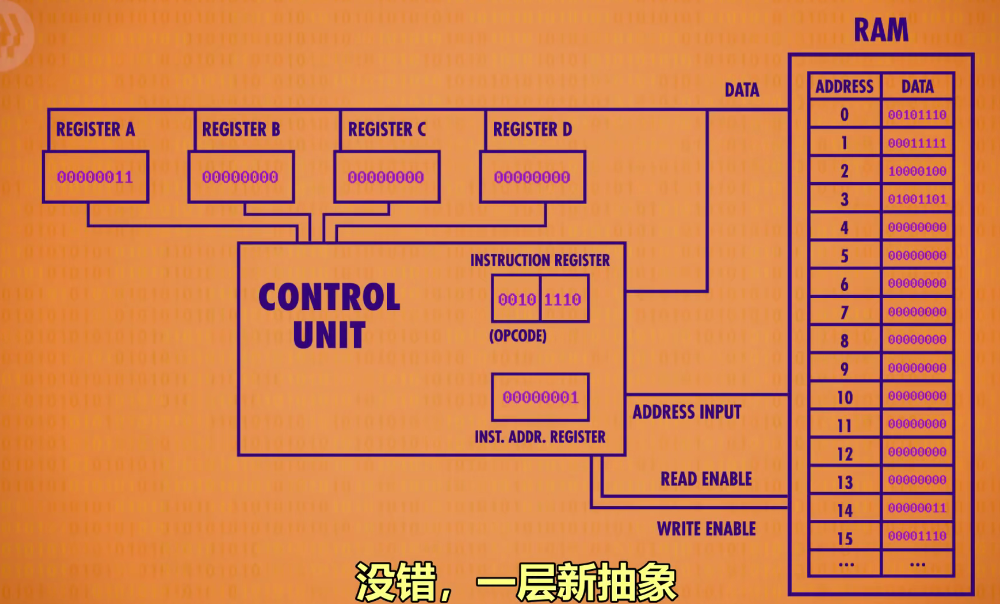

## 更多功能：

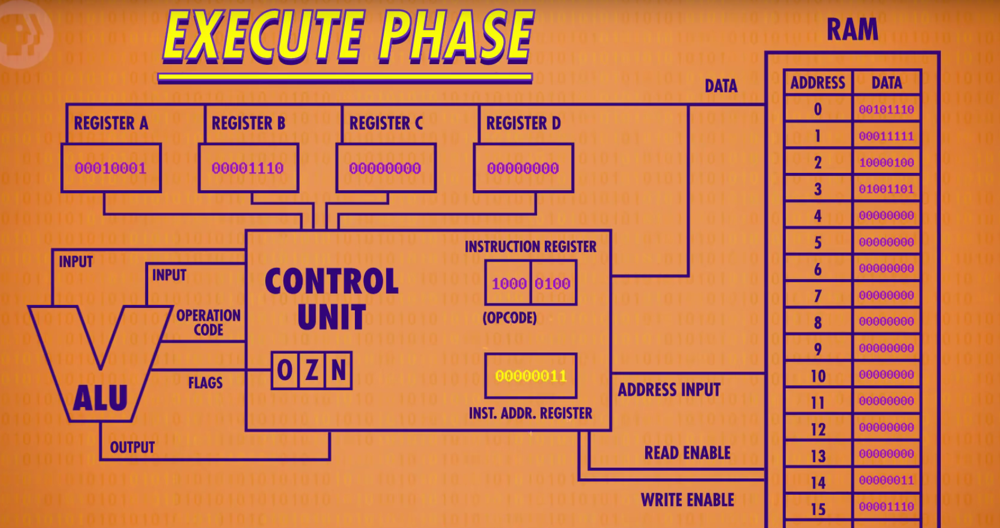

## 再加上时钟

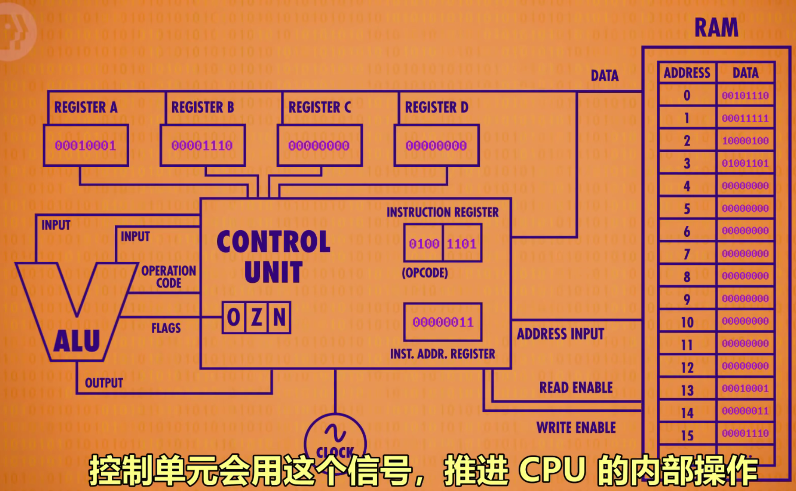

### 时钟速度

CPU执行每次“取指令-解码-执行”所用的速度，单位赫兹。

超频、降频。

动态频率调整 dynamic frequency scaling。

## 进一步抽象后

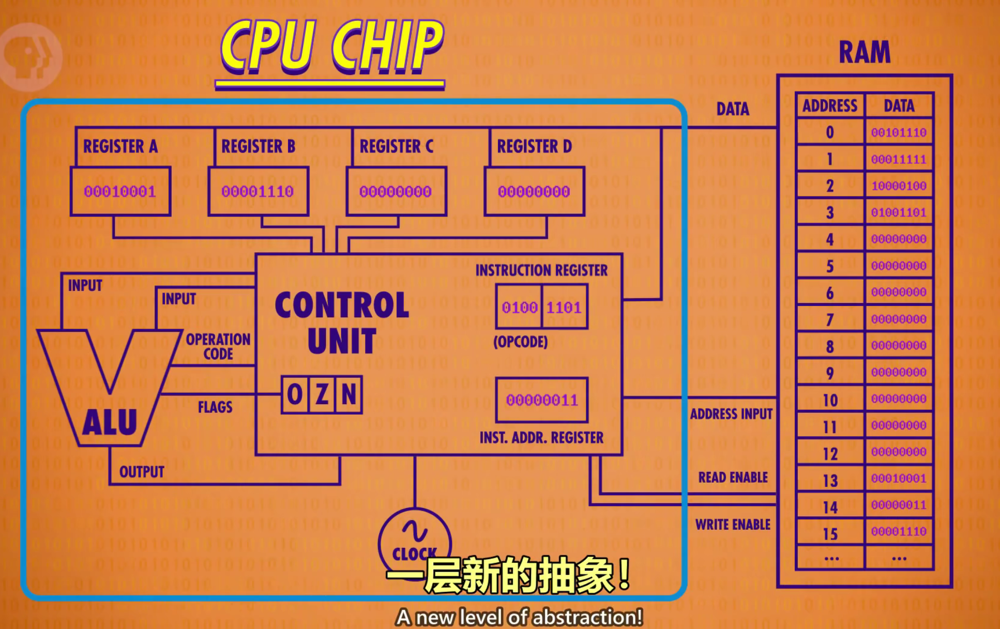

