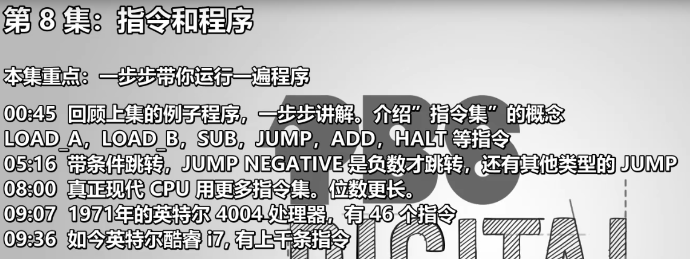
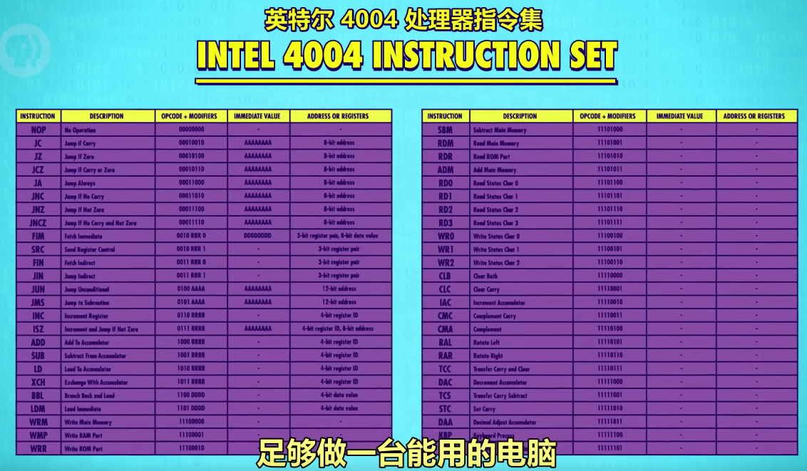
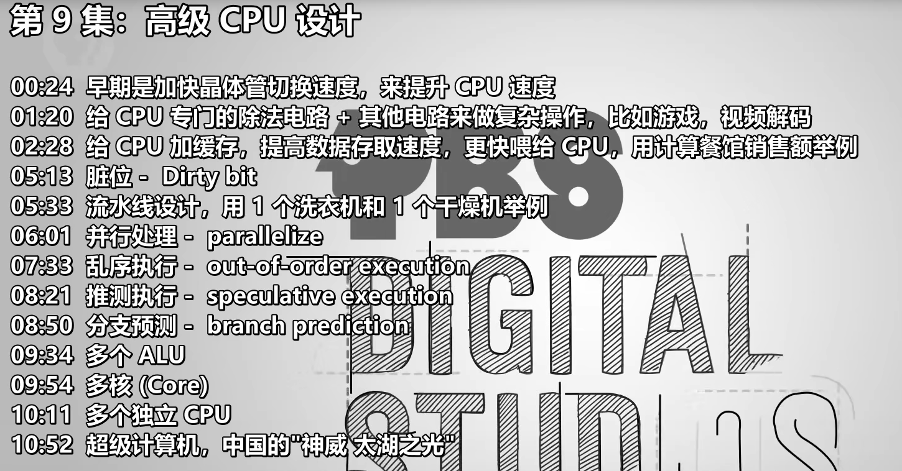
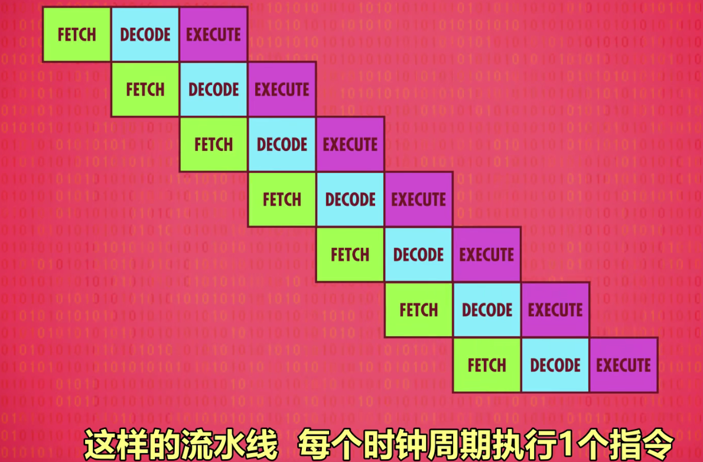
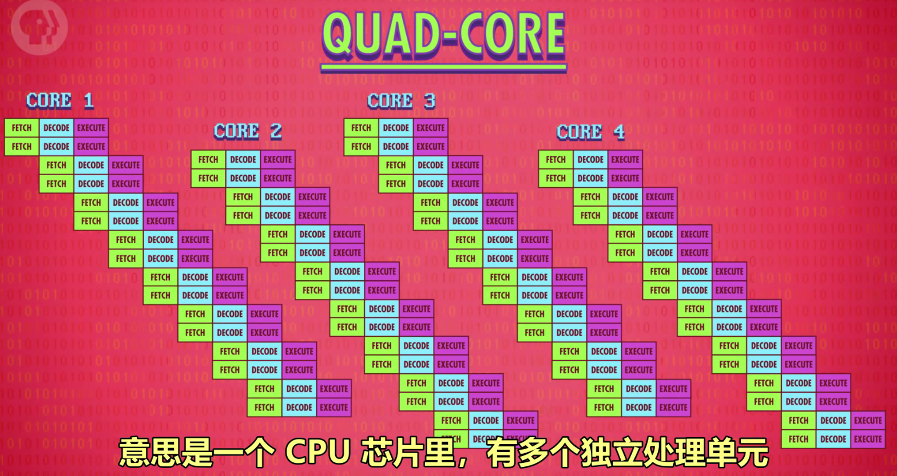
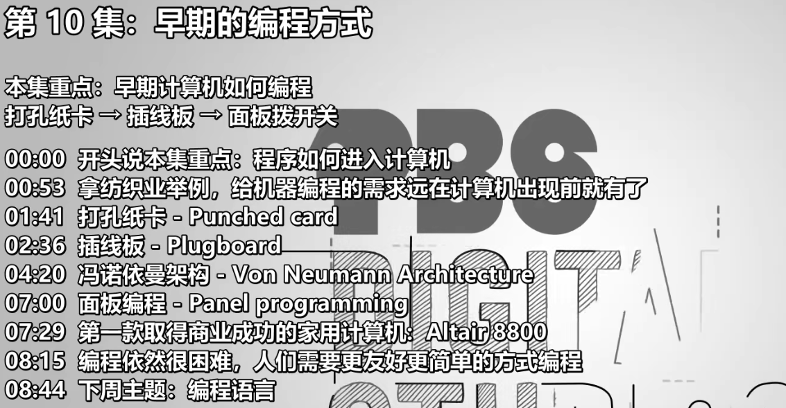
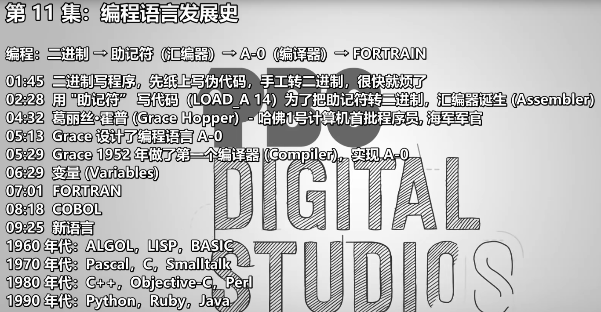
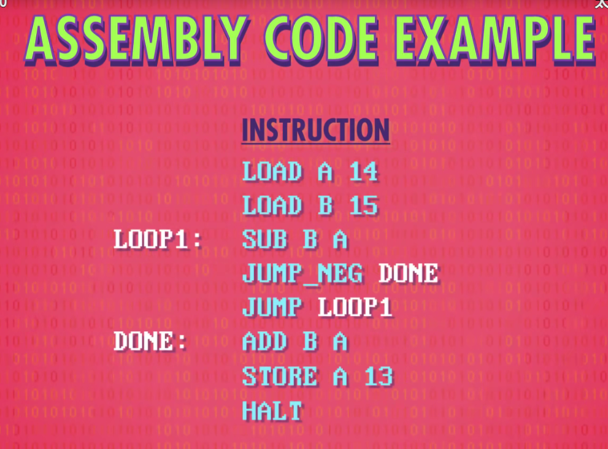
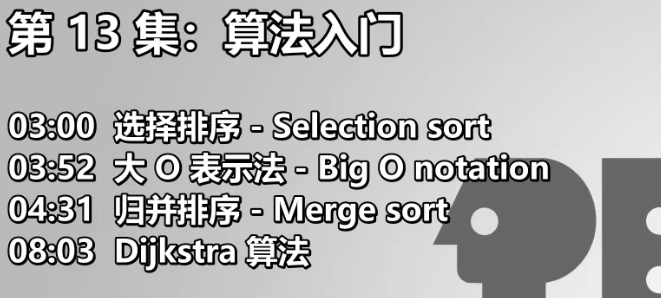

# P3 布尔逻辑与布尔门

### AND 

## OR

## NOT

## XOR异或

# P7 中央处理器Central Processing Unit(CPU)

## 取指令：

## 解码（查表）：

## 执行：

抽象后成一个整体的**控制单元**：

## 更多功能：

## 再加上时钟

### 时钟速度

CPU执行每次“取指令-解码-执行”所用的速度，单位赫兹。

超频、降频。

动态频率调整 dynamic frequency scaling。

## 进一步抽象后

# P8 指令与程序

指令长度（instruction length）

可变指令长度（variable length instruction）

## 指令集

# P9 高级CPU设计

## 指令流水线

## 多核

# P10 早期编程方式

# P11 编程语言发展史

## 编译器

# P12 编程原理——语句与函数

statements and functions

# P13 算法入门

## 大O表示法

big O notation

# P14 数据结构