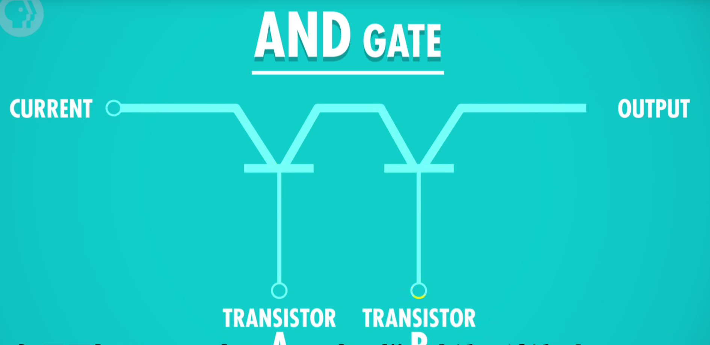
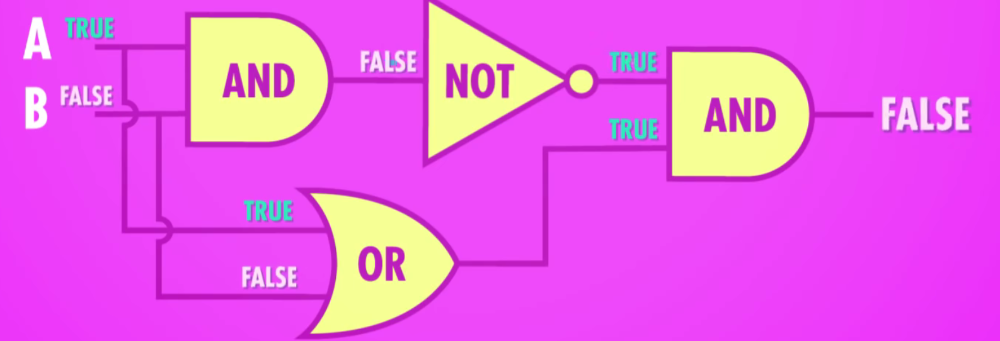

# P3 布尔逻辑与布尔门

### AND 

## OR

## NOT

## XOR异或

# P7 中央处理器Central Processing Unit(CPU)

## 取指令：

## 解码（查表）：

## 执行：

抽象后成一个整体的**控制单元**：

## 更多功能：

## 再加上时钟

### 时钟速度

CPU执行每次“取指令-解码-执行”所用的速度，单位赫兹。

超频、降频。

动态频率调整 dynamic frequency scaling。

## 进一步抽象后

# P8 指令与程序

指令长度（instruction length）

可变指令长度（variable length instruction）

## 指令集

# P9 高级CPU设计

## 指令流水线

## 多核

# P10 早期编程方式

# P11 编程语言发展史

## 编译器

# P12 编程原理——语句与函数

statements and functions

# P13 算法入门

## 大O表示法

big O notation

# P14 数据结构

## 数组

## 字符串

字符串在内存里以“二进制值0”结尾，这叫**字符"null"**

## 结构体

## 节点Node

## 链表

可以存多个节点

## 队列queue和栈stack

dequeue 出队

enqueue 入队

## 树

**节点root**

父节点、子节点

根节点、叶节点

## 图

# P15 阿兰 图灵

可判定性问题

# P16 软件工程

# P17 集成电路与摩尔定律

集成电路，IC

印刷电路版，PCB

## 光刻

# 💡P18 操作系统

操作系统提供API来抽象硬件，为：**“设备驱动程序”**

虚拟内存

## Unix

内核：内存管理、多任务、I/O处理等

# P19 内存&储存介质

## 延迟线存储器 delay line memory

## 磁芯存储器

## 内存层次结构

## 软盘

## 光盘

## 固态硬盘SSD

Solid State Drive

# P20 文件系统

## 文件格式

txt文本文件

wav音频文件

.bmp 位图文件

## 目录文件

## 文件系统

### 平面文件系统

### 分层文件系统

**根目录**

# P21 压缩

## 无损压缩

## 霍夫曼树

## 有损压缩

视频

音频

# P22 命令行界面

## QWERTY 打字机

## 电传打字机

# P23 屏幕与2D图形显示

## 阴极射线管

# P24 冷战与消费主义

# P25 个人计算机革命

