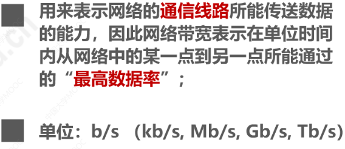

# 第一章 概述

## 1.1 计算机网络在信息时代的作用

很大！

## 1.2 因特网概述

### 1 网络、互联网（互连网）、因特网

​		由***节点(Node)***和连接节点的***链路(link)***组成

​		多个网络通过路由器进行互联，形成更大的网络，即**<u>互联网</u>**

​		因特网(Internet)是世界上最大的互联网络（用户数以亿计，互连的网络数以百万计）

- 注意区别：
  - Internet：专有名词，专指因特网，通讯规则是TCP/IP协议。
  - internet：通用名词，通讯协议可以是任意的

### 2 因特网发展的三个阶段

- 因特网服务提供者ISP:

- 基于ISP的三层结构的因特网：
  根据提供服务的覆盖面积大小和拥有的IP地址数量不同

### 3 因特网的标准化工作

### 4 因特网的(功能)组成

- 边缘部分

- 核心部分

在网络核心部分，路由器起到了特殊作用，是实现分组交换的关键构件，**<u>其任务是：转发收到的分组。</u>**

## 1.3 三种交换方式

### 1 电路交换（circuit switching）

交换(Switching)就是按照某种方式动态地分配传输线路的资源

电话交换机接通电话线的方式称为电路交换：（示意图如下）

电路交换的三个步骤

1. 建立连接（分配通信资源）
2. 通话（一直占用通信资源）
3. 释放连接（归还通信资源）

但是如果用来传输计算机数据的话就会效率很低，因为计算机数据是突发式地出现在线路上的

### 2 分组交换（Packet Switching）

如，以下的主机H6要将分组转发到主机H2：

> 报文：表示消息的整块数据

1. H6把较长的报文分成一个个等长的数据段，每个数据段前面加上由必要的控制信息组成的==***首部***== ，就构成了***==分组(Packet)==***，也简称为“***==包==***”，首部也可以称为“包头”。                                                                                                                                                                                                                                                                                                                                                                                                                                                                                                                                                                                                                                                                                                                                                                                                                                                                                                                                                                                                                                                                                                                                                                                                                                                                                                                                                                                                                                                                                                                                                                                                                                                                                                                                                                                                                                                                                                                                                                                                                                                                                                                                                                                                                                                                                                                                                                                                                                                                                                                                                                                                                                                                                                                                                                                                                                                                                                                                                                                                                                                                                                                                                           
2. 分组交换机（路由器）收到一个分组后，先将分组暂时存储下来，再检查其首部，按照首部中的目的地址进行查表转发，找到合适的转发接口，通过该接口转发给下一个分组交换机；
3. 经过各分组交换机的存储转发，最终到达H2，主机H2去掉首部，将数据段组合，还原出原始报文

总结：

### 3 报文交换（Message Switching）

交换节点也采用存储转发方式，对报文大小没有限制，要求交换节点有较大的存储空间。用于电报通信网，现在较少使用，不介绍。

- 三种交换的对比（ABCD为分组传输路径上的4个结点交换机）：

慕课课堂测试：

## 1.4 计算机网络的定义和分类

### 1 计算机网络的定义

没有明确定义，最简单定义：

​	一些相互连接的、自治的计算机的集合，其中：

因此下图并不是一个计算机网络，而只是一个大型机系统：

较好的定义：

### 2 计算机网络的分类

其中，拓扑结构可以分为：

以上四种基本的网络拓扑还可以互连为更复杂的网络。

​		慕课测试：

## 1.5 计算机网络的性能指标

### 1 速率

比特（bit)：计算机中数据量的单位，是二进制数字中的1或0。其他数据量单位包括：

**速率**：传送比特的速率，也称为**比特率**或**数据率**。常用数据率单位：

小例：

### 2 带宽

在模拟信号系统中的意义：

在计算机网络中的意义：”**最高数据率**“

### 3 吞吐量

单位和速率一样

### 4 时延

分组从源主机传送到目的主机的过程中，产生时延的地方：

- 发送时延：源主机将分组发往传输线路

计算公式为：

其中，对于发送速率有以下几种限制因素：（发送数量的理论最大值）

由上可知，***在构建网络时，要尽量做到各设备间以及传输介质的速率匹配***

- 传播时延：代表分组的电信号在链路上的传输

计算公式为：

不同介质的传播速率：

- 处理时延：路由器收到分组后进行存储转发，这里将有些教材中的**排队时延**也算进去

一般不方便计算，因为网络中的数据流量动态变化

**网络时延由以上三部分组成。**

在处理时延不考虑的情况下，关于哪个发送时延和传播时延哪个占主导的问题不是固定的，看例子：

### 5 时延带宽积

等于：传播时延X带宽

把传输链路看成是一个管道：

### 6 往返时间

RTT（Round-Trip-Time）：双向交互一次所需要的时间

定义：从源主机发送分组开始，直到源主机收到来自目的主机的确认分组为止。

比如以下例子：

注意，因为卫星链路的传播时延较高，所以一般是卫星链路耗时较多

### 7 利用率

- 信道利用率
- 网络利用率

信道利用率**==并非越高越好==**，因为引起的网络时延也会增加：

如下：

可见：

因此，需要使用一些机制，使其可以根据情况动态调整输入到网络中的通信量，使U保持在一个合理的范围内

### 8 丢包率

定义：分组的丢失率，在一定的时间范围内，传输过程中==丢失的分组数量和总分组数量的比率==

分组丢失的两种情况：

丢包率反应了网络的拥塞情况：

