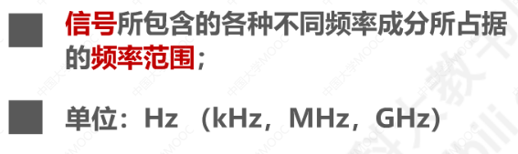
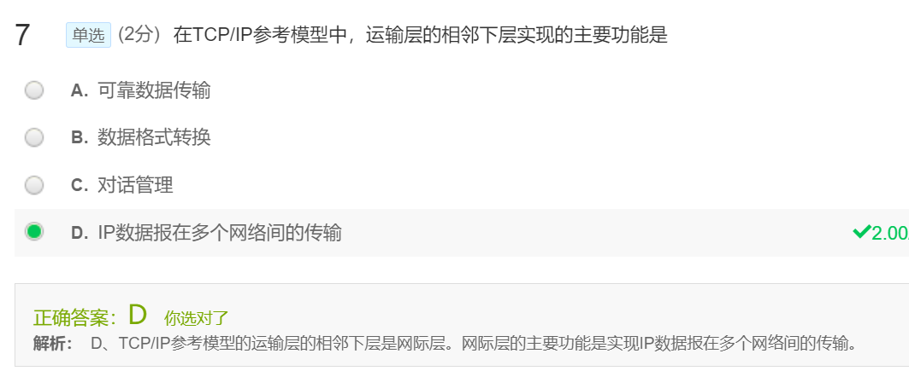

- [第一章 概述](#------)
  * [1.1 计算机网络在信息时代的作用](#11--------------)
  * [1.2 因特网概述](#12------)
    + [1 网络、互联网（互连网）、因特网](#1----------------)
    + [2 因特网发展的三个阶段](#2-----------)
    + [3 因特网的标准化工作](#3----------)
    + [4 因特网的(功能)组成](#4-----------)
  * [1.3 三种交换方式](#13-------)
    + [1 电路交换（circuit switching）](#1------circuit-switching-)
    + [2 分组交换（Packet Switching）](#2------packet-switching-)
    + [3 报文交换（Message Switching）](#3------message-switching-)
    + [4 三种交换的对比](#4--------)
  * [1.4 计算机网络的定义和分类](#14------------)
    + [1 计算机网络的定义](#1---------)
    + [2 计算机网络的分类](#2---------)
  * [1.5 计算机网络的性能指标](#15-----------)
    + [1 速率](#1---)
    + [2 带宽](#2---)
    + [3 吞吐量](#3----)
    + [4 时延](#4---)
    + [5 时延带宽积](#5------)
    + [6 往返时间](#6-----)
    + [7 利用率](#7----)
    + [8 丢包率](#8----)
  * [1.6 计算机网络体系结构](#16----------)
    + [1.6.1常见的计算机网络体系结构](#161------------)
    + [1.6.2 分层的必要性](#162-------)
    + [1.6.3 分层思想举例](#163-------)
    + [1.6.4专用术语](#164----)
      - [1 实体](#1---)
      - [2 协议](#2---)
      - [3 服务](#3---)
  * [第一章习题](#-----)

<small><i><a href='http://ecotrust-canada.github.io/markdown-toc/'>Table of contents generated with markdown-toc</a></i></small>
# 第一章 概述

## 1.1 计算机网络在信息时代的作用

很大！

## 1.2 因特网概述

### 1 网络、互联网（互连网）、因特网

​		由***节点(Node)***和连接节点的***链路(link)***组成

​		多个网络通过路由器进行互联，形成更大的网络，即**<u>互联网</u>**

​		因特网(Internet)是世界上最大的互联网络（用户数以亿计，互连的网络数以百万计）

- 注意区别：
  - Internet：专有名词，专指因特网，通讯规则是TCP/IP协议。
  - internet：通用名词，通讯协议可以是任意的

### 2 因特网发展的三个阶段

- 因特网服务提供者ISP:

- 基于ISP的三层结构的因特网：
  根据提供服务的覆盖面积大小和拥有的IP地址数量不同

### 3 因特网的标准化工作

### 4 因特网的(功能)组成

- 边缘部分

- 核心部分

在网络核心部分，路由器起到了特殊作用，是实现分组交换的关键构件，**<u>其任务是：转发收到的分组。</u>**

## 1.3 三种交换方式

### 1 电路交换（circuit switching）

交换(Switching)就是按照某种方式动态地分配传输线路的资源

电话交换机接通电话线的方式称为电路交换：（示意图如下）

电路交换的三个步骤

1. 建立连接（分配通信资源）
2. 通话（一直占用通信资源）
3. 释放连接（归还通信资源）

但是如果用来传输计算机数据的话就会效率很低，因为计算机数据是突发式地出现在线路上的

### 2 分组交换（Packet Switching）

如，以下的主机H6要将分组转发到主机H2：

> 报文：表示消息的整块数据

1. H6把较长的报文分成一个个等长的数据段，每个数据段前面加上由必要的控制信息组成的==***首部***== ，就构成了***==分组(Packet)==***，也简称为“***==包==***”，首部也可以称为“包头”。                                                                                                                                                                                                                                                                                                                                                                                                                                                                                                                                                                                                                                                                                                                                                                                                                                                                                                                                                                                                                                                                                                                                                                                                                                                                                                                                                                                                                                                                                                                                                                                                                                                                                                                                                                                                                                                                                                                                                                                                                                                                                                                                                                                                                                                                                                                                                                                                                                                                                                                                                                                                                                                                                                                                                                                                                                                                                                                                                                                                                                                                                                                                                           
2. 分组交换机（路由器）收到一个分组后，先将分组暂时存储下来，再检查其首部，按照首部中的目的地址进行查表转发，找到合适的转发接口，通过该接口转发给下一个分组交换机；
3. 经过各分组交换机的存储转发，最终到达H2，主机H2去掉首部，将数据段组合，还原出原始报文

总结：

### 3 报文交换（Message Switching）

交换节点也采用存储转发方式，对报文大小没有限制，要求交换节点有较大的存储空间。用于电报通信网，现在较少使用，不介绍。

### 4 三种交换的对比

ABCD为分组传输路径上的4个结点交换机：

慕课课堂测试：

## 1.4 计算机网络的定义和分类

### 1 计算机网络的定义

没有明确定义，最简单定义：

​	一些相互连接的、自治的计算机的集合，其中：

因此下图并不是一个计算机网络，而只是一个大型机系统：

较好的定义：

### 2 计算机网络的分类

其中，拓扑结构可以分为：

以上四种基本的网络拓扑还可以互连为更复杂的网络。

​		慕课测试：

## 1.5 计算机网络的性能指标

### 1 速率

比特（bit)：计算机中数据量的单位，是二进制数字中的1或0。其他数据量单位包括：

**速率**：传送比特的速率，也称为**比特率**或**数据率**。常用数据率单位：

小例：

### 2 带宽

- 在模拟信号系统中的意义：

- 在计算机网络中的意义：”**最高数据率**“

### 3 吞吐量

单位和速率一样

### 4 时延

分组从源主机传送到目的主机的过程中，产生时延的地方：

- 发送时延：源主机将分组发往传输线路

计算公式为：

其中，对于发送速率有以下几种限制因素：（发送数量的理论最大值）

由上可知，***在构建网络时，要尽量做到各设备间以及传输介质的速率匹配***

- 传播时延：代表分组的电信号在链路上的传输

计算公式为：

不同介质的传播速率：

- 处理时延：路由器收到分组后进行存储转发，这里将有些教材中的**排队时延**也算进去

一般不方便计算，因为网络中的数据流量动态变化

**网络时延由以上三部分组成。**

在处理时延不考虑的情况下，关于哪个发送时延和传播时延哪个占主导的问题不是固定的，看例子：

### 5 时延带宽积

等于：传播时延X带宽

把传输链路看成是一个管道：

### 6 往返时间

RTT（Round-Trip-Time）：双向交互一次所需要的时间

定义：从源主机发送分组开始，直到源主机收到来自目的主机的确认分组为止。

比如以下例子：

注意，因为卫星链路的传播时延较高，所以一般是卫星链路耗时较多

### 7 利用率

- 信道利用率
- 网络利用率

根据排队论，信道利用率**==并非越高越好==**，因为引起的网络时延也会增加：

如下：

可见：

因此，需要使用一些机制，使其可以根据情况动态调整输入到网络中的通信量，使U保持在一个合理的范围内

### 8 丢包率

定义：分组的丢失率，在一定的时间范围内，传输过程中==丢失的分组数量和总分组数量的比率==

分组丢失的两种情况：

丢包率反应了网络的拥塞情况：

## 1.6 计算机网络体系结构

### 1.6.1常见的计算机网络体系结构

- OSI（开放系统互联参考模型）体系结构——**法律**上的国际标准
  - 失败有多种原因

- TCP/IP协议——**事实**上的国际标准
  - 相当于将物理层和数据链路层合并成为网络接口层
  - 并去掉会话层和表示层
  - 在网络层使用的协议是IP协议(网际协议)，**网络层也常称为网际层**

如图所示，

一般两个要联网的用户的主机操作系统中，通常都带有符合TCP/IP体系结构标准的TCP/IP协议族，

​	而用于网络互联的路由器也同理，带有TCP/IP协议族，不过一般只包含网络接口层和网际层

- 对于各个层次，
  - 网络接口层：没有规定具体的内容，这样可以互连各种不同的接口（有线的以太网接口、无线局域网的WiFi接口等）

  - 网际层：**IP协议**是核心协议，IP协议可以：

    - 将不同的网络接口进行互联
    - 向其上的TCP和UDP提供网络互连服务

  - 运输层：**TCP**和**UDP**是两个重要协议，在享受IP协议提供的网络互连服务基础上：

    - TCP向应用层的相应协议提供可靠传输的服务
    - UDP提供不可靠传输的服务

  - 应用层：包含了大量的应用层协议，如HTTP...SMTP和DNS...RTP协议等等

    

另外，使用TCP/IP表示整个协议大家族，常称为TCP/IP协议族（嵌入系统开发领域称为TCP/IP协议栈，因为结构图和数据结构的栈画法类似）

注意，由于网络接口层没有什么具体的内容，这对于学习不利，一般综合OSI和TCP/IP的优点，采用一种**原理体系结构**进行教学：

慕课课堂小测：

### 1.6.2 分层的必要性

计算机网络是个复杂的系统，”分层“可以将复杂的问题转化为若干较小的局部问题，易于研究和处理。

下面，由简单到复杂，来看看计算机网络面临的主要问题，以及如何将问题划分到相应的层次，层层处理：

- 两台计算机、一条网线的情况：

- 多台主机，一条总线的情况

  

  -  A向C发送数据的话：

  

  - B、D同时向总线发送信号的话：

  

尽管总线型网络早已淘汰，现在都是以太网交换机互连形成的交换式以太网。以太网交换机的实现，都是**==数据链路层==**的问题。

- 带有3个路由器、4个网络互连起来的小型互联网的情况：

> ip地址的前3个十进制数字用来标识网络，第4个十进制数用来标识主机

假设某台主机中运行着两个与网络通信相关的应用进程（比如浏览器进程和QQ进程），服务器中运行着与网络通信相关的服务器进程，则有以下运输层问题：

解决了运输层的问题后，只需制定各种应用层协议，并按照协议标准编写相应的应用程序，则可以通过应用进程间的交互来完成特定的网络应用。这些则是应用层的问题：

以下总结各个分层要解决的问题:

- 慕课课堂小测：

### 1.6.3 分层思想举例

假设网络拓扑如下，主机属于网络N1，web服务器属于网络N2，N1N2通过路由器互连：

主机和web服务器基于网络的通信，实际上是主机中的浏览器应用进程与web服务器应用进程之间的通信。

各层起到的作用如下：（从主机端按体系结构自顶向下的顺序看）

- 应用层构建**HTTP请求报文**，报文的内容如下

- 运输层给HTTP报文添加一个TCP首部，使之成为**TCP报文段**，TCP报文段的首部格式如下

- 网络层给TCP报文段添加一个IP首部，成为**IP数据报**，IP数据报首部格式如下：

- 数据链路层给IP数据报添加一个首部一个尾部，使之成为**帧**，以太网帧首部和尾部的格式如下：

- 物理层将帧看作是**比特流**，由于N1是以太网，所以物理层会给比特流前面添加**前导码**，前导码的内容如下，物理层将该加有前导码的比特流变换成相应的信号发送到传输媒体：

- 信号通过传输媒体到底路由器后，路由器的处理过程如下：

路由器的网络层解析IP数据报的首部，从中提取**目的网络地址**，然后查找自身的**路由表**，确定**转发端口**，以便进行转发：

路由器的物理层同理，将相应的信号发送到传输媒体。

- 通过传输媒体到达web服务器。web服务器的处理流程则也是相似，不过是自底向上。
  - 最后，web服务器对HTTP请求报文进行解析，然后给主机发回HTTP响应报文。
- 响应报文的传输过程与请求报文的传输过程类似：

慕课测试：

### 1.6.4专用术语

最具代表性的三个：**实体、协议、服务**。

#### 1 实体

定义：

具体如下，方框表示实体，对等实体用连线表示：

举例，通信双方的网卡、正在进行通信的应用进程，都是对等实体。

#### 2 协议

- 协议：控制两个对等实体进行逻辑通信的规则的集合（逻辑通信其实不存在，是我们假设出来方便研究专门某一层的）

- 协议的三要素：**语法、语义、同步**

  语法：定义通信双方所交换信息的格式

例如以下是IP数据报格式，小格子称为**字段**，或者，**域**。数字表示字段的长度，单位是位（比特）。

​	语义：定义收发双方所要完成的操作

​		比如主机和服务器的例子，服务器收到报文后会进行解析，查找所求内容，并将找到的内容封装在一个HTTP响应报文中发回给主机。

​	同步：定义通讯双方的时序关系（而不是指始终频率同步）

​		例如，TCP采用”三报文握手“建立连接的过程：

#### 3 服务

在协议的控制下，两个对等实体间的逻辑通信使得本层能够向上一层提供服务

- 服务访问点：在同一系统中**相邻两层的实体交换信息的逻辑接口**，用于区分不同的服务类型

- 服务原语：上层使用下层所提供的服务必须通过与下层**交换一些命令**，这些命令称为服务原语

两者如图所示：

- 协议数据单元PD：**对等层次之间传送的数据包**，称为该层的协议数据单元

如图所示：

- 服务数据单元SDU：**同一系统内，层与层之间交换的数据包**

## 第一章习题

- 慕课测试

