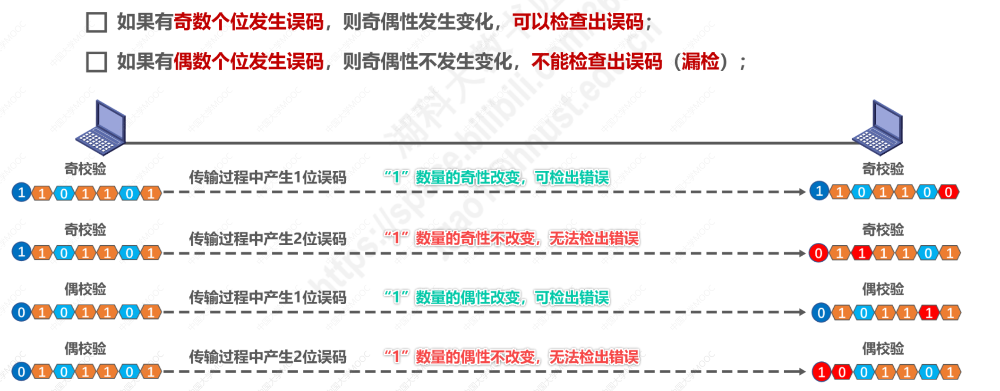
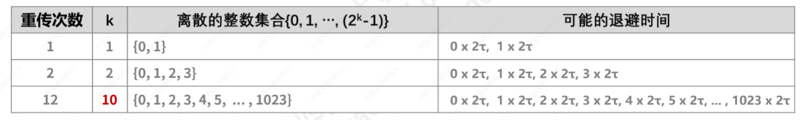

# 第三章 数据链路层

## 3.1 数据链路层概述

- 数据链路层在网络结构体系中的地位

主机H1给主机H2发送数据的过程（从五层结构体系来看）：

在研究数据链路层时，可以简化为：

- 数据链路层的基本概念：

- 数据链路层的三个重要问题（使用点对点信道的数据链路层举例）

1. 封装成帧：数据链路层给网络层交付的协议数据单元添加帧头和帧尾的操作

2. 差错检测：接收方主机根据帧尾中的检错码检测帧中是否有误码

> 误码：比特0可能变成比特1，反之亦然

3. 可靠传输：

- 数据链路层的其他问题（特别对于使用广播信道的数据链路层）

1. 地址/编址问题

- 碰撞问题（对于共享局域网而言）

- 其他问题：
  

以及包括：

- 集线器（物理层互连设备）和交换机（和网桥一样是数据链路层互连设备）的区别

## 3.2 封装成帧

### 帧头和帧尾

- 帧头和帧尾包含重要控制信息（如下所示）

  

- 帧头和帧尾的作用之一是==帧定界==（但并不是所有的帧都包含帧定界标志）

- 但并不是所有帧都包含帧定界标志，以下就是MAC帧的例子：

### 透明传输

**数据链路层对上层交付的传输数据没有任何限制**，就好像数据链路层不存在一样

- 面向字节的物理链路，使用字节填充（或称字符填充）的方法来实现透明传输。
  - 比如，采用添加转移字符ESC（长度1个字节，十进制为27）的方法：

- 面向比特的物理链路使用比特填充的方法实现透明传输
  - 比如，采用零比特填充法：

零比特填充法考题：

### 最大传送单元（MTU）

## 3.3 差错检测

**比特差错**和**误码率BER(Bit Error Rate)**

使用**差错检测码**来检测数据在传输过程中是否产生了比特差错，是数据链路层的重要问题

### 奇偶校验

在待发送的数据后面**添加1位奇偶校验位**，使整个数据（包括所添加的校验位在内）中”1“的个数为奇数（奇校验）或偶数（偶校验）

由于奇偶校验的漏检率比较高，因此计算机网络的数据链路层一般不会采用这种检验方法。

### 循环冗余校验CRC(Cyclic Redundancy Check)

CRC操作过程如下：

发送方的操作如下：

接收方的操作如下：

生成多项式举例：

例题1：

其中，图中加号表示**异或运算**

最后发送的数据为：101001001（最后的001为余数）

例题2：

## 3.4 可靠传输

### 3.4.1基本概念

### 3.4.2 可靠传输的实现机制

以上种可靠传输实现机制的基本原理并不仅限于数据链路层，而是可以应用到计算机网络体系结构的各层协议种。

#### 1 停止等待协议SW（Stop-and-Wait）

也常称为自动请求重传协议（Automatic Repeat reQuest, ARQ）

ACK，确认分组；NAK，否认分组。

##### 情况一：确认与否认

发送方只有收到接收方的确认分组后，才会将对应的数据分组从缓存中删除，实现机制如下：

##### 情况二：超时重传

如果发送出去的分组丢失了，则：

加上超时重传的手段后，实现机制如下：

##### 情况三：确认丢失

如果接受方发送的确认分组在传输过程中丢失了（如下图所示），那么发送方就会在超时后进行重传，则接收方如何判断此时的数据分组是否是重复的分组呢？

为了避免**分组重复**的传输错误，必须给**每个分组带上序号**：

在停止等待下，只需要0和1就可以区分分组，实现机制如下：

##### 情况四：确认（分组）迟到

如果确认分组因为某些原因迟到了，发送方如何知道接受方的确认分组是针对那个分组呢？这时就需要给确认分组也进行编号（同样只需要0和1就够）

注意，对于数据链路层的点对点信道，往返时间比较固定，不会出现确认迟到的情况。因此，**如果只在数据链路层使用SW协议，可以不用给确认分组编号。**

SW协议的注意事项总结：

##### 停止等待协议的信道利用率

T~D~：发送方发送数据分组所花费的发送时延，

RTT：收发双方之间的往返时间

T~A~：接收方发送确认分组所耗费的发送时延（常常忽略）

例题：

慕课与考研题：

#### 2 回退N帧协议GBN（Go-Back-N）

在SW协议的基础，使用流水线传输可以提高信道利用率：

GBN在流水线的基础上，利用**发送窗口**来限制发送方**可连续发送的数据分组的个数**。

前提：

##### 情况一：无差错情况

##### 情况二：累积确认

如果序号为1的确认分组ACK1丢失了，但是ACK4还是被发送方接收到了，则发送窗口仍然会向前移动

##### 情况三：有差错情况

如果发送的数据分组中某一个数据分组出现了误码，

则，接收方会把该数据分组丢弃，后续的数据分组序号与接收窗口中的序号不匹配，则都会被丢弃，

每丢弃一个分组，就返回给发送方上一个按序接收的数据分组的确认分组：

如果收到这几个重复的确认后还是不会触发发送方立刻重传，则，一段时间后，重传计时器超时，：

##### 情况四：W~T~超过取值范围

##### 小结

考研与慕课题：

#### 3 选择重传协议SR

SR协议的定义：

举例说明SR的工作原理，前提和假设如下：

##### 分组丢失的情况

接受方的发送窗口，只能向前滑动2个位置，因为3号数据分组是未按序到达的数据分组

发送方收到确认分组后，只能向前滑动2个位置，并继续发送4号5号数据分组

在这过程中，2号数据分组的重传计时器早晚会超时，则发送方重传2号数据分组，如下：

重传2号分组后，接收方的接收窗口可以向前滑动了：

##### 窗口大小问题

- 发送窗口：

- 接收窗口：

##### 小结

考研与慕课题：

## 3.5 点对点协议PPP

Point-to-Point Protocol是目前使用最广泛的点对点数据链路层协议

##### 应用

##### 内容

##### PPP协议的帧格式

其中，协议字段的不同取值，表示数据链路层与不同的网络层协议对应：

##### PPP帧的透明传输问题

- 面向字节的异步链路——字节填充法（插入转义字符）

- 面向比特的同步链路——比特填充法（插入比特0）

##### PPP协议的差错检测

##### PPP协议的工作状态

以拨号接入为例，

慕课题：

## 3.6 媒体借入控制MAC

### 3.6.1 基本概念

#### 定义

#### 分类

### 3.6.2 媒体接入控制——静态划分信道

#### 信道复用

##### 频分复用FDM

##### 时分复用TDM

时分复用技术将传输线路的带宽资源按**时隙**轮流分配给不同的用户，将时间划分为一段段等长的时间**复用帧(TDM帧)**

##### 波分复用WDM

即，光的频分复用：

##### 码分复用CDM（码分多址CDMA）

- 复用与多址的概念区分：

- CDM的特点与应用：

- 码分多址CDMA的实现

  - 直接序列扩频DSSS

  

  - 码片序列的**挑选原则**

    

    - 任何一个码片向量和该码片向量自己的规格和内机为0：

      

    - 任何一个码片向量和其他各站码片反码的向量的内积也是0：

    

    - 任何一个码片向量和该码片反码向量的规格和内机为-1：

    

    - 码片序列相关题目：

    

### 3.6.3 媒体接入控制——动态接入控制——随机接入——CSMA/CD协议

- 冲突与碰撞：

#### CSMA/CD的基本概念：

> 96比特时间是指，发送96比特所耗费的时间，也称为**帧间最小间隔**

举例说明MA/CS/CD：

#### 争用期（碰撞窗口）

主机A和D处于总线型以太网的两端，以太网单程端到端的传播时延为tao，纵坐标为时间：

**δ表示？？？？？？？？？？**

#### 最小帧长

假设A正在给D发送一个很短的帧，边发送边检测碰撞，

发送完毕后，就不再针对该帧进行检测碰撞了：

在**该帧的传输过程**中，C也要发送帧，检测到96比特空闲时间后就立即发送帧：

主机D会收到主机A发送的遭遇碰撞后的帧，主机D会将该帧丢弃，但对于主机A而已：

#### 最大帧长

很长的帧会导致A长时间占用总线，而总线上的其他主机迟迟拿不到总线的使用权，而且，还可能导致D的接收缓冲区无法装下该帧而产生溢出

因此，以太网的帧长也应该有上限：

#### 截断二进制指数退避算法

退避时间的计算方法如下：

计算举例如下：

#### 信道利用率

使用CSMA/CD协议的共享式以太网的信道利用率

如图所示，横坐标为时间，总线上的某个主机**可能发送多次碰撞，进行多次退避**后，成功发送了一个帧；在最极端的情况下，收发主机在总线的两端，因此还要经过一个单程端到端的传播时延tao后，总线才能完全进入空闲状态，则发送一帧所需的平均时间为：

为了提高信道利用率，应该：

#### 总结

- 帧发送流程图

- 帧接收流程图

习题：

## 3.7 MAC地址、IP地址以及ARP协议

### 3.7.1 MAC地址

使用点对点信道的数据链路层，不需要使用地址：

而使用广播信道的数据链路层，必须使用地址，来**区分主机**：

#### 定义

#### MAC的别称

例子：一块网卡的结构如下

一般情况下，用户主机会包含两个网络适配器：有限局域网适配器（有线网卡）和无线局域网适配器（无线网卡）。

#### IEEE 802局域网的MAC地址格式

#### MAC地址的类型

普通人一般会拥有多少个全球管理的单播MAC地址呢？

​	台式机、智能手机、笔记本电脑上的以太网接口、WiFi接口、蓝牙接口都分配有全球单播的MAC地址，而每台交换机和路由器都拥有多个网络接口，也就拥有多个全球单播的MAC地址。对于使用EUI-48的应用程序，IEEE的目标寿命为100年，目前鼓励采用EUI-64作为替代。

#### MAC地址的发送顺序

#### MAC地址的使用举例

##### 1 单播地址

主机C的网卡发现该单播帧的目的MAC地址与自己的MAC地址匹配，于是接收该帧，并将该帧交给其上层处理。

##### 2 广播地址

主机A和C都会收到该广播帧，发现该帧的目的MAC地址字段的内容是广播地址，就知道该帧是广播帧，接受该帧，并将该帧交给上层处理。

##### 3 多播地址

判断MAC地址是否是多播地址的方法：

主机B和C发现，该**多播帧**的目的MAC地址在自己的**多播组列表**中，则会接受该帧，并送交上层处理。而D发现不在自己的多播组列表中，则会丢弃该多播帧。

另外：

#### 随机MAC地址

导火索为斯诺登的棱镜事件，开始提供MAC地址功能。目前大多数移动设备已经采样随机MAC地址功能。

### 3.7.2 IP地址

注意，IP地址属于网络层的范畴，而非数据链路层！

IP地址是因特网上主机和路由器所使用的地址，用于标识两部分信息：

- 网络编号：标识因特网上数以百万计的网络

- 主机编号：标识同一网络上不同主机（或路由器接口）

例如，对于下图N8而言：

哪些部分是主机编号，哪些部分为网络编号，将在网络层介绍。

