# 第二章 物理层

## 2.1 物理层的基本概念

- 传输媒体的分类：

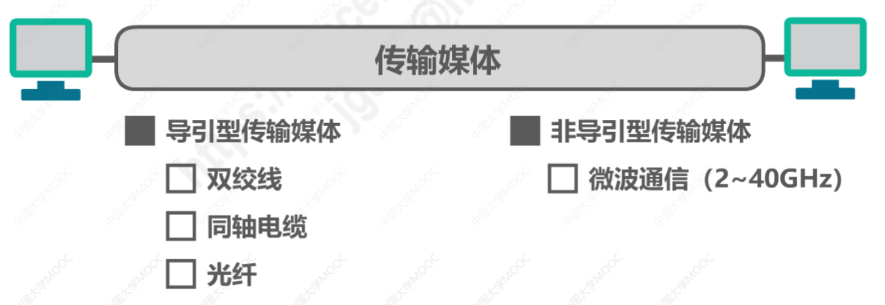

注意，WiFi属于微波通信。

- 物理层的主要任务：机械特性、电气特性、功能特性、过程特性：

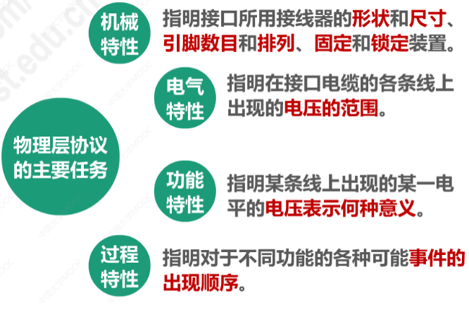

由于 传输媒体的种类众多，物理连接方式也很多（例如点对点连接、广播连接等），因此物理层协议的种类就比较多，每种物理层协议都包含了上述的四个具体内容。

- 物理层的作用

慕课测试：
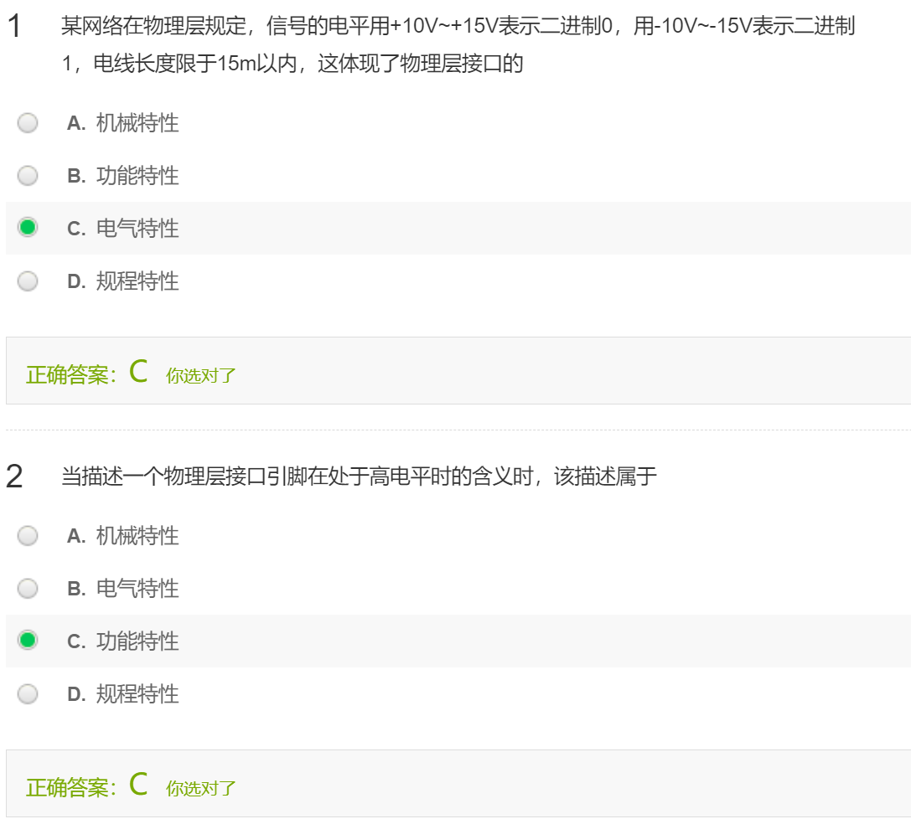

## 2.2 物理层下面的传输媒体

注意，传媒媒体==不属于==计算机网络体系结构的任何一层

分类有两种：

- 导引型传输媒体

  - 同轴电缆

  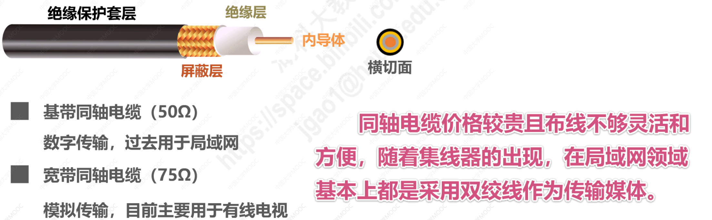

  - 双绞线

  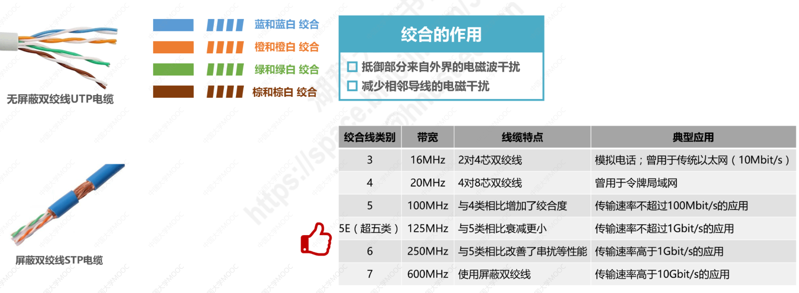

  - 光纤

  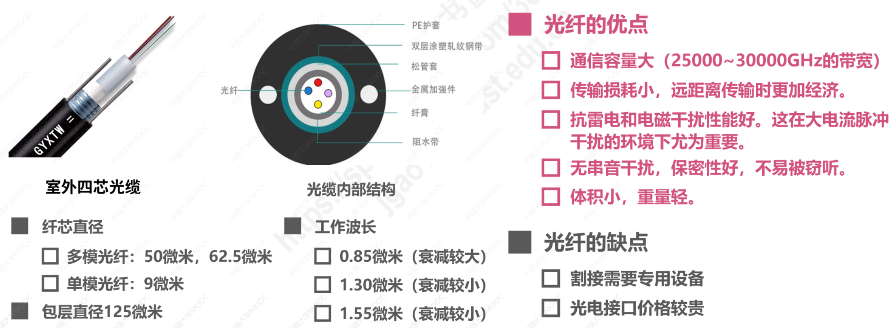

  ​				光在光纤中传输的工作原理：略

  - 电力线

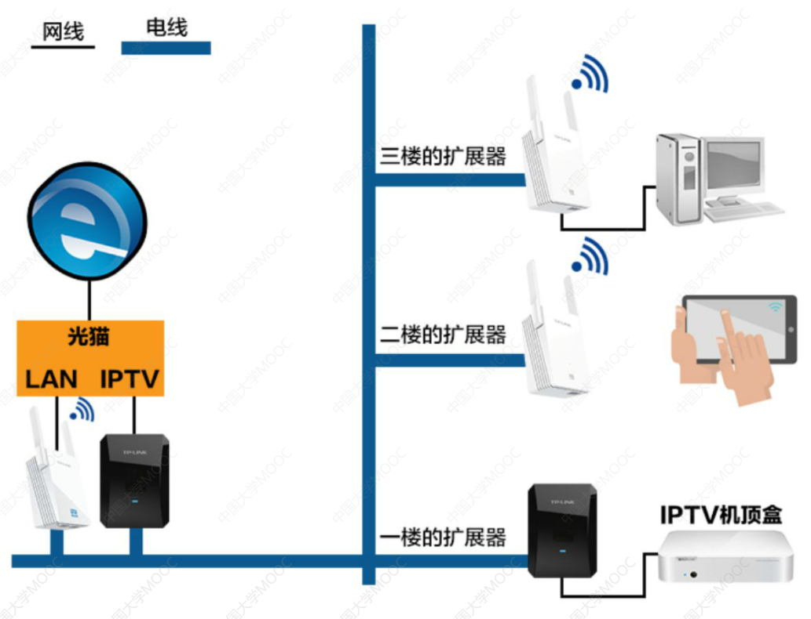

- 非导引型传输媒体

  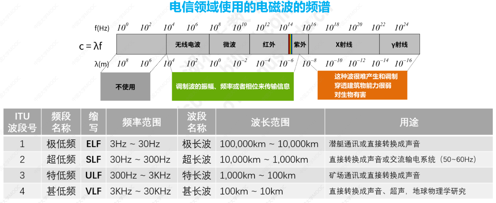

  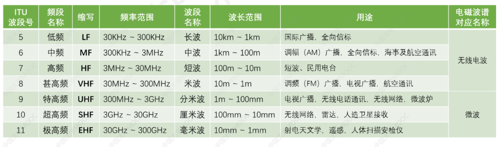

  - 无线电波

  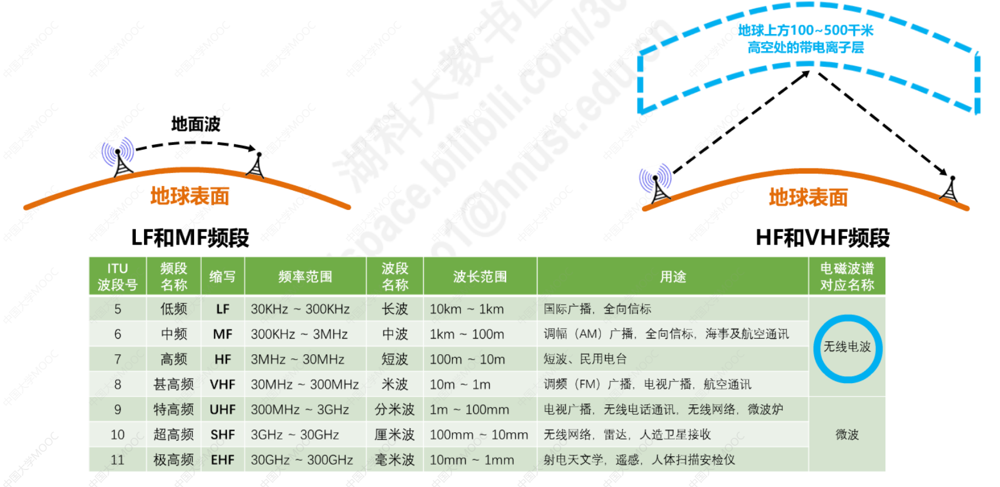

  - 微波

  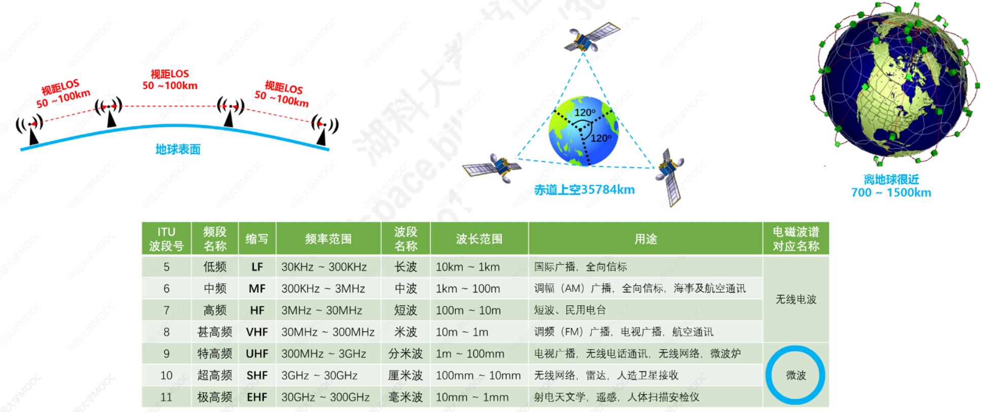

  - 红外线

    ​	并不陌生，例如电视遥控、空调遥控

    ​	现在电脑已经基本上取消了红外接口，但是很多智能手机还带有红外接口

  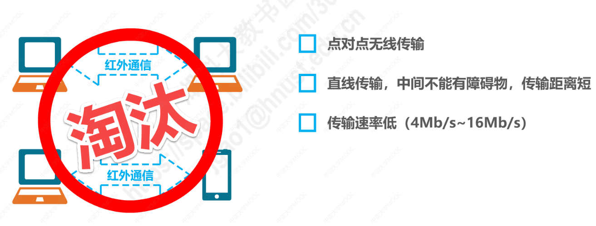

  - 可见光（LiFi）

    还在研究阶段

  慕课测试：

  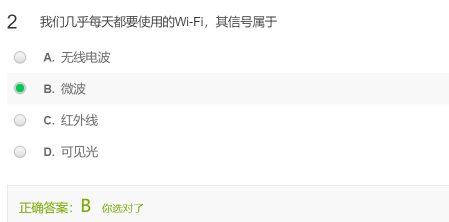

  

## 2.3 传输方式

1. 串行传输：一个比特一个比特依次发送，因此在发送端和接受端只需要一条线路
2. 并行传输：一次发送N个比特，需要有N条传输路线

- 注意：
  - 计算机网络中，数据在传输线路上的传输是串行传输
  - 计算机内部的传输，常采用并行传输方式（例如CPU与内存之间通过总线进行数据传输）。常见的数据总线宽度有8位、16位、32位和64位

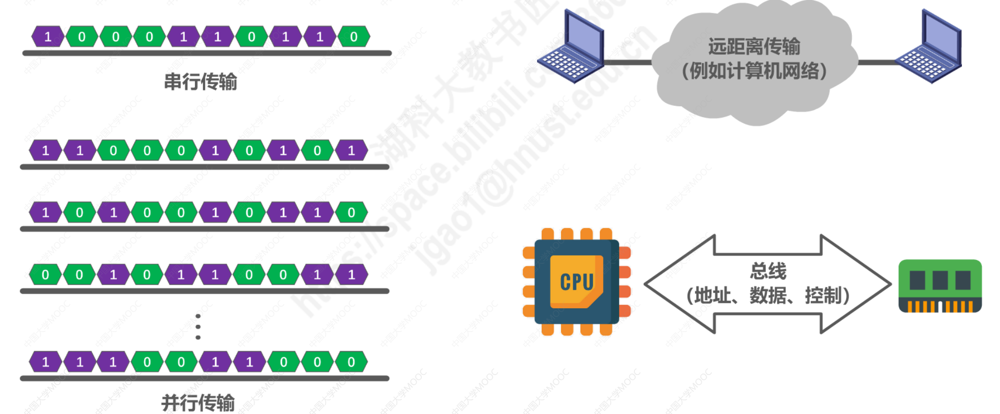

3. 同步传输：数据块以稳定的比特流的形式进行传输，字节间没有间隔；接收端在每个比特信号的中间时刻进行检测，以判别比特0或1

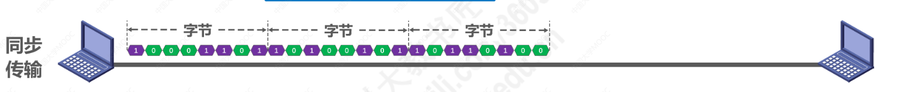

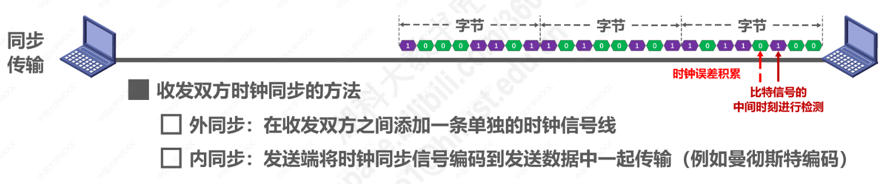

4. 异步传输：以字节为独立的传输单位，字节之间的时间间隔不是固定的。通常在每个字节前后加上==起始位==和==结束位==

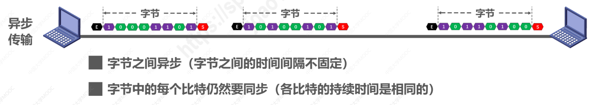

5. 单向通信（单工）
6. 双向交替通信（半双工），又称为双向交替通信

7. 双向同时通信（全双工）

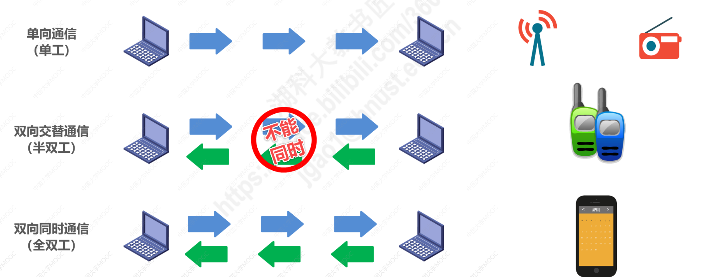