# 第二章 物理层

## 2.1 物理层的基本概念

- 传输媒体的分类：

注意，WiFi属于微波通信。

- 物理层的主要任务：机械特性、电气特性、功能特性、过程特性：

由于 传输媒体的种类众多，物理连接方式也很多（例如点对点连接、广播连接等），因此物理层协议的种类就比较多，每种物理层协议都包含了上述的四个具体内容。

- 物理层的作用

慕课测试：

## 2.2 物理层下面的传输媒体

注意，传媒媒体==不属于==计算机网络体系结构的任何一层

分类有两种：

- 导引型传输媒体

  - 同轴电缆

  

  - 双绞线

  

  - 光纤

  

  ​				光在光纤中传输的工作原理：略

  - 电力线

- 非导引型传输媒体

  

  

  - 无线电波

  

  - 微波

  

  - 红外线

    ​	并不陌生，例如电视遥控、空调遥控

    ​	现在电脑已经基本上取消了红外接口，但是很多智能手机还带有红外接口

  

  - 可见光（LiFi）

    还在研究阶段

  慕课测试：

  

  

## 2.3 传输方式

1. 串行传输：一个比特一个比特依次发送，因此在发送端和接受端只需要一条线路
2. 并行传输：一次发送N个比特，需要有N条传输路线

- 注意：
  - 计算机网络中，数据在传输线路上的传输是串行传输
  - 计算机内部的传输，常采用并行传输方式（例如CPU与内存之间通过总线进行数据传输）。常见的数据总线宽度有8位、16位、32位和64位

3. 同步传输：数据块以稳定的比特流的形式进行传输，字节间没有间隔；接收端在每个比特信号的中间时刻进行检测，以判别比特0或1

4. 异步传输：以字节为独立的传输单位，字节之间的时间间隔不是固定的。通常在每个字节前后加上==起始位==和==结束位==

5. 单向通信（单工）
6. 双向交替通信（半双工），又称为双向交替通信

7. 双向同时通信（全双工）

慕课测试：

## 2.4 编码与调制

消息发送的过程：

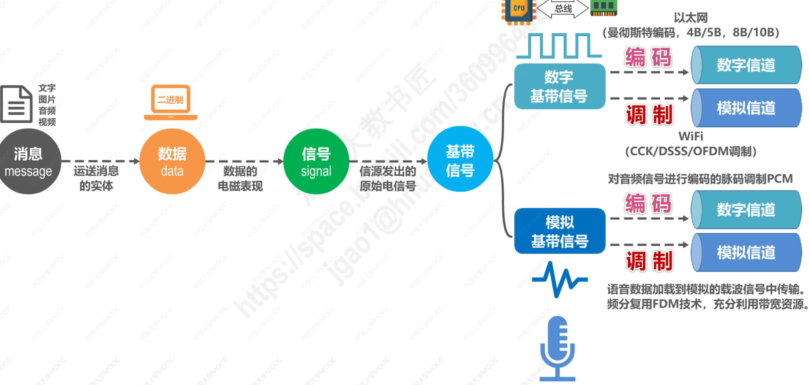

- 码元：在使用时间域的波形表示数字信号时候，代表不同离散数值的**基本波形**

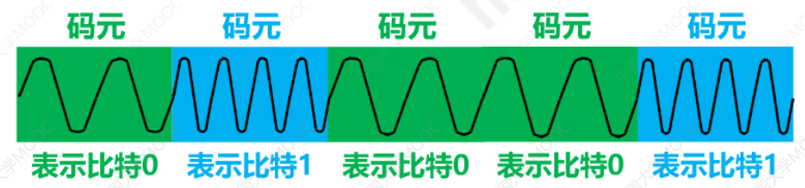

- 传输媒体与信道的关系

传输媒体不能之间与信道划等号，对于单工传输，传输媒体中只包含一个信道，对于半双工和全双工传输，传输媒体包含两个信道

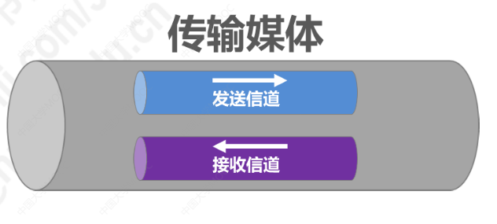

在计算机网络中，**常见的是将数字基带信号通过编码或调制的方法在相应信道进行传输**

- 几种常用编码如下：

1. **不归零编码**：整个码元时间内，电平不会出现零电平（一直都是正或者负）

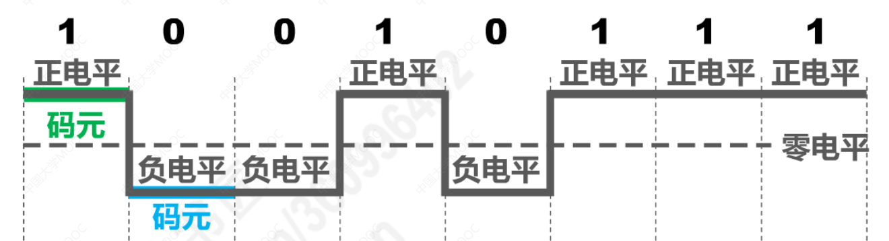

如何判断码元的数量？这需要一根额外的传输线来传输时钟信号，使接收方和发送方同步。

因为不归零编码存在同步问题，所以计算机网络一般使用不归零编码

2. **归零编码**：每个码元传输结束后都要”归零“，接收方只要在信号归零后进行采样

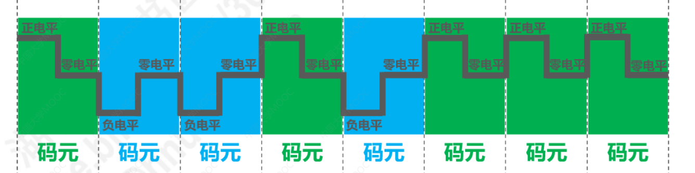

优点是自同步，缺点是编码效率低

3. **曼彻斯特编码**：负跳变表示比特1，正跳变表示比特0（也可自行定义），码元中间时刻的跳变即表示时钟又表示数据

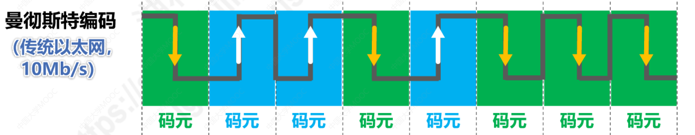

4. **差分曼彻斯特编码**：跳变仅表示时钟，码元开始处电平是否发生变化表示数据，

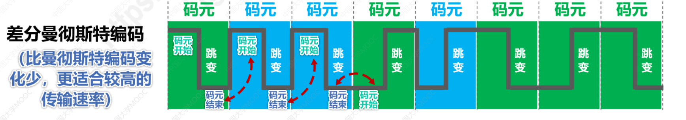

常用编码考研题目：

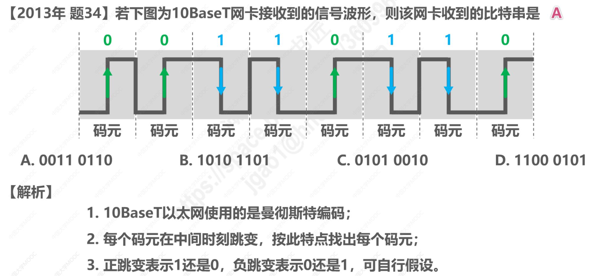

- 基本调制方法

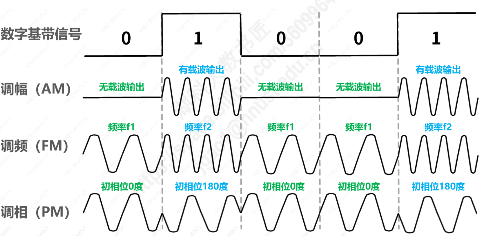

使用基本调制方法，1个码元只能包含1个比特信息。

- 混合调制方法

正交振幅调制QAM

​		例如QAM-16：又12种相位，每种相位又1或2种振幅可选，如以下星座图所示：

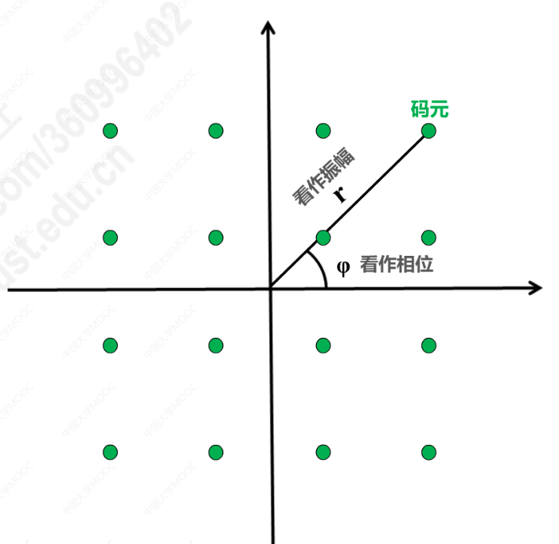

由于QAM-16可以调制出16种波形，每种码元可以对应表示4个比特（16=2的4次方）

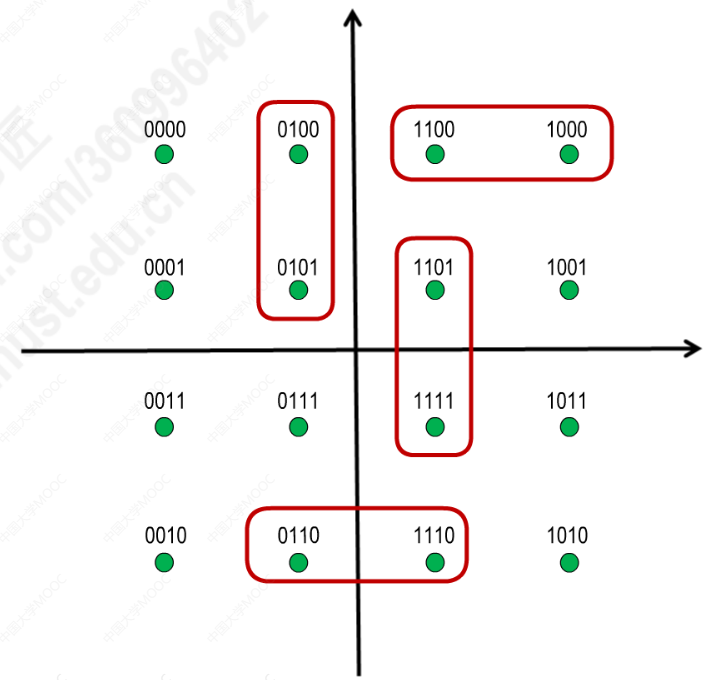

慕课测试：

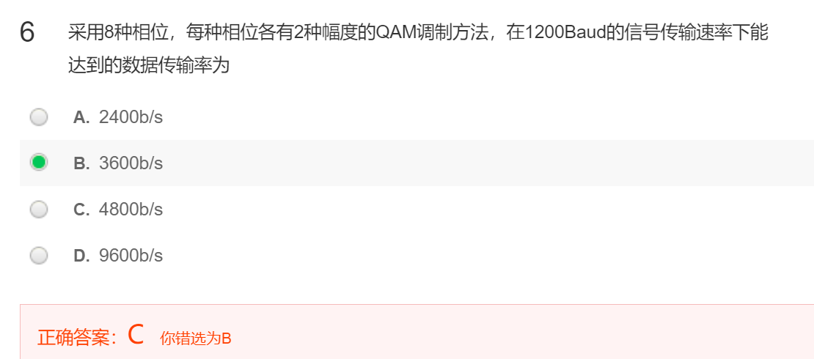

## 2.5 信道的极限容量

码间串扰：信号波形失去了码元之间的清晰界限

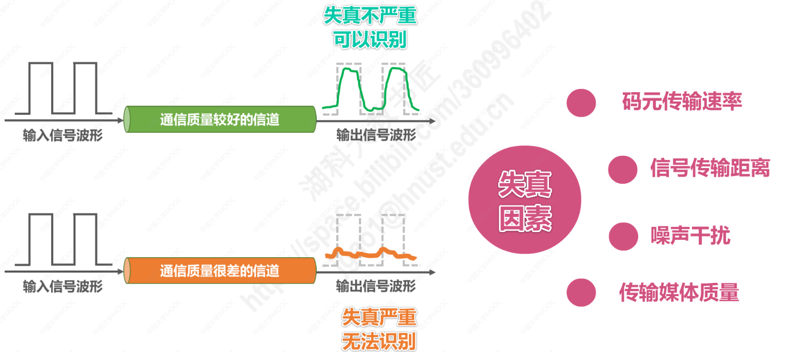

- 奈氏准则：在假定的理想条件下，**为了避免码间串扰，码元传输速率是有上限的**
  - 理想低通信道的最高码元传输速率=2W Baud = 2 W码元/秒
  - 理想带通信道的最高码元传输速率=2W Baud = W码元/秒，其中
    - W：信道带宽（单位位Hz）,
    - Baud：波特，即码元/秒

