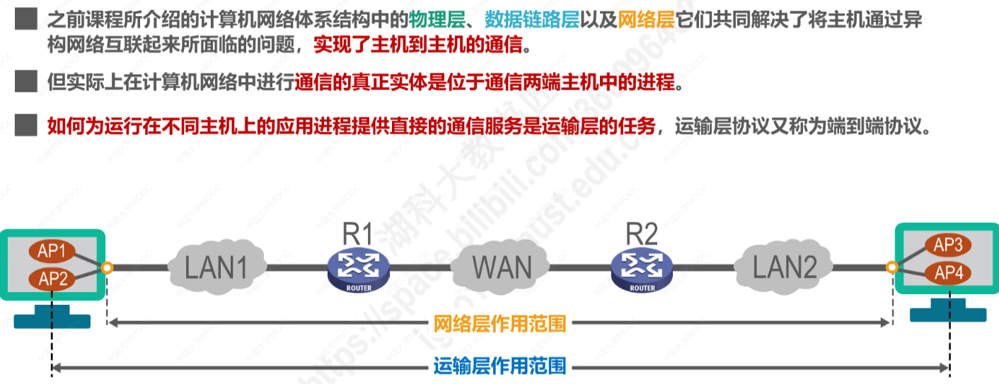
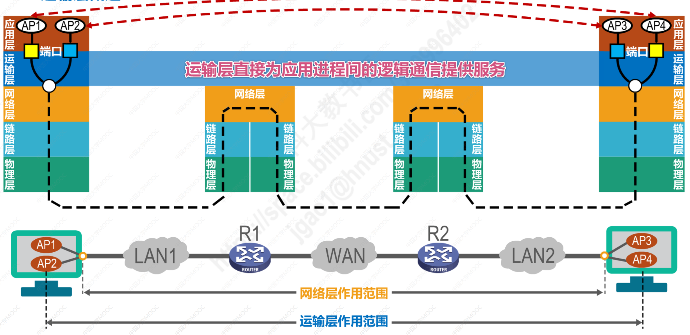
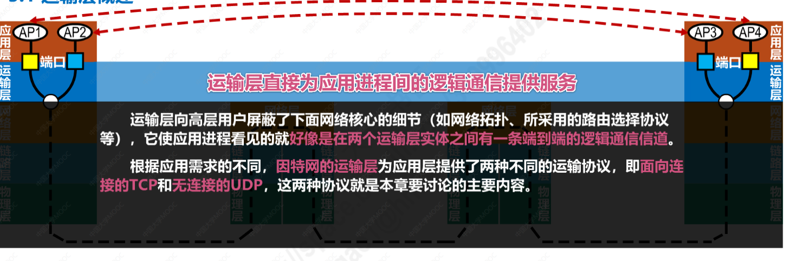
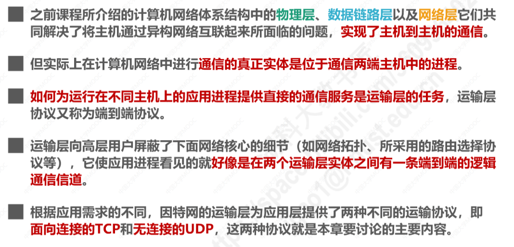
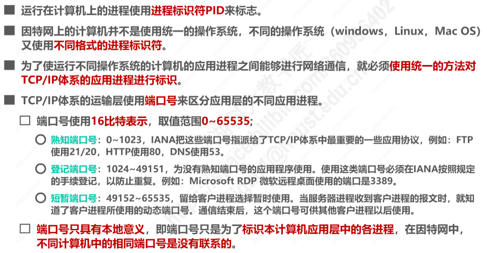
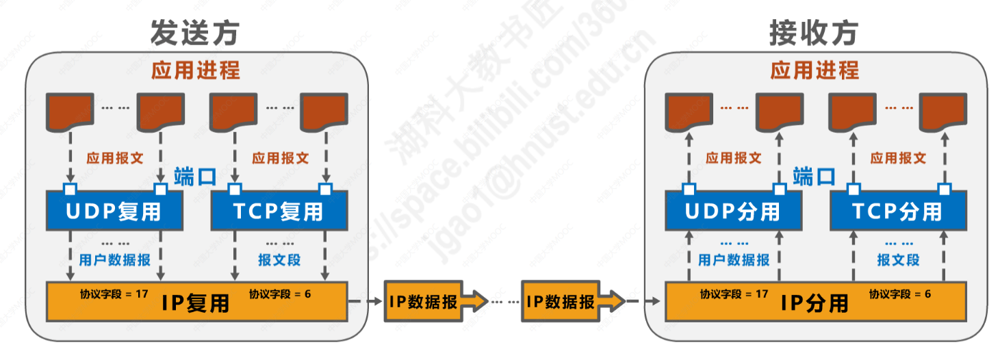
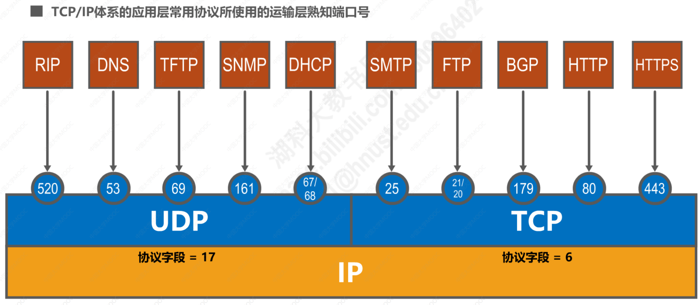
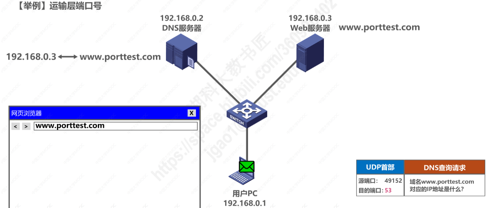

# 第五章 运输层

## 5.1 概述

### 运输层的作用范围

### 计算机网络体系结构的角度理解运输层

注意，以上端口并非物理端口，而是**指用来区分不同应用进程的标识符。**

为了简单起见，可以理解为运输层直接为应用进程间的逻辑通信提供服务，如下图所示：

### 小结

## 5.2 端口号、复用、分用的概念

### 端口号

### 发送方的复用和接收方的分用

### 运输层端口号的作用——实例

用户PC、DNS服务器、Web服务器通过交换机进行互连，处于同一个以太网中。

DNS服务器中记录有：Web服务器的域名所对应的IP地址

例子：

DNS查询请求报文——UDP用户数据报（DNS查询请求）——UDP用户数据报（DNS响应）——TCP报文段（HTTP请求报文）——TCP报文段（HTTP响应报文）

其他图片略。

## 5.3 UDP和TCP的对比

