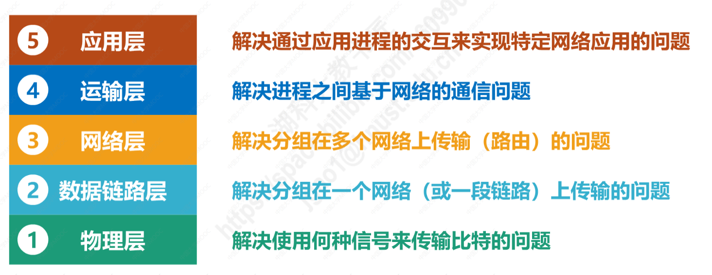
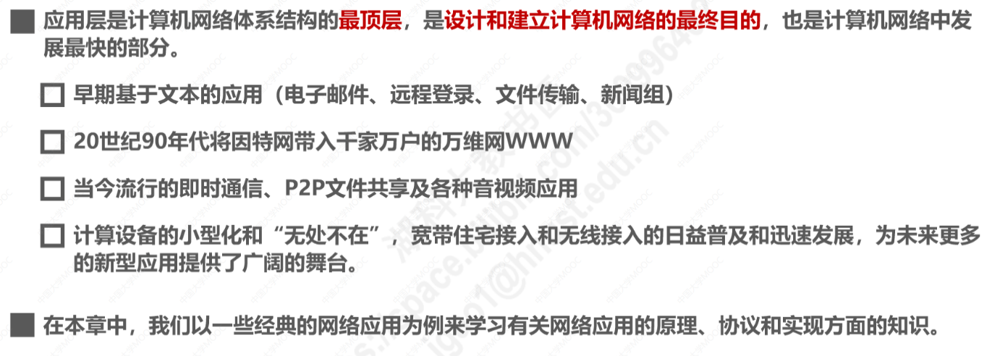
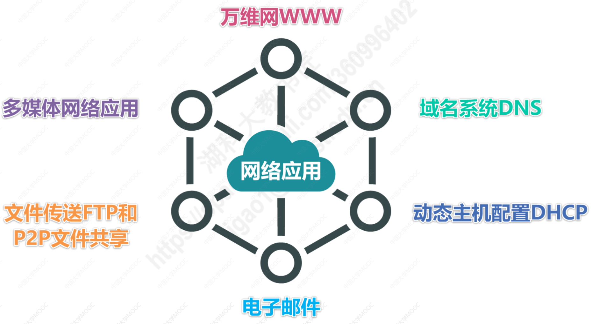
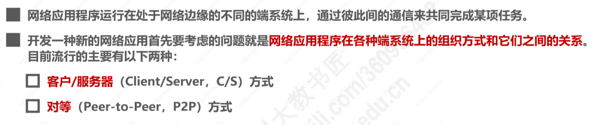
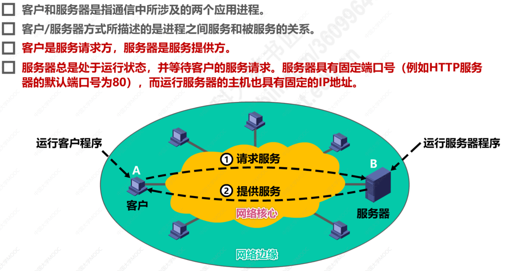
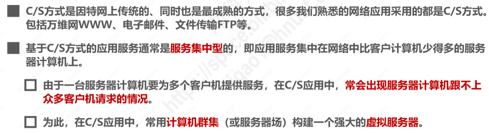
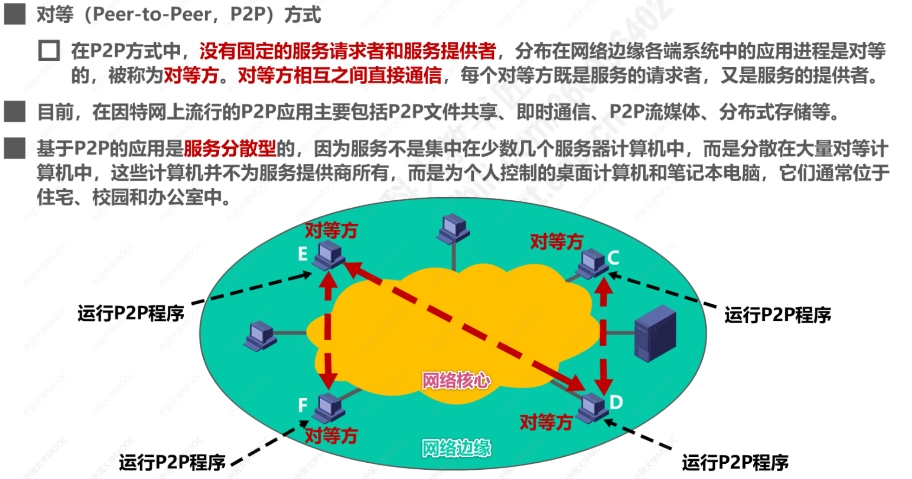
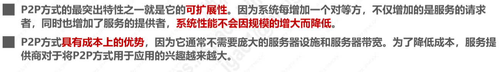
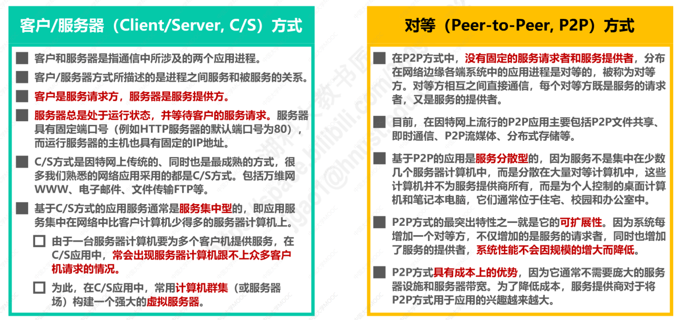

> \5. 应用层
>     \1. 掌握DNS协议
>         \1. 名字空间
>         \2. 指针查询（反向查找或逆向解析）基本原理
>         \3. DNS缓存
>     \2. FTP协议（活化石）：
>         \1. 控制流和数据流
>         \2. 两种工作模式： PASV 和 PORT
>         \3. 各种指令和响应码
>         \4. 断点续传和匿名FTP的概念
>     \5. HTTP协议： 
>         \1. 报文格式：请求报文，响应报文，请求头各种字段，响应头各种字段
>         \2. HTTP状态码
>     \2. HTTPS协议
>         \1. 握手的详细过程
>         \2. 摘要算法，数字签名，数字证书的原理和过程

# 第六章 应用层

## 6.1 概述

## 6.2 客户-服务器方式和对等方式

### 客户/服务器方式(C/S)

### 对等方式（Peer to Peer，P2P）

### 小结

## 6.3 动态主机配置协议DHCP

