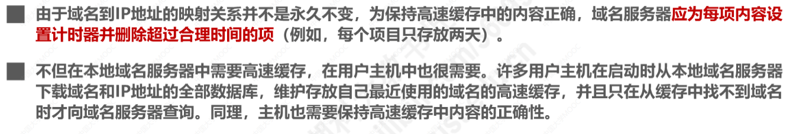

> \5. 应用层
>     \1. 掌握DNS协议
>         \1. 名字空间
>         \2. 指针查询（反向查找或逆向解析）基本原理
>         \3. DNS缓存
>     \2. FTP协议（活化石）：
>         \1. 控制流和数据流
>         \2. 两种工作模式： PASV 和 PORT
>         \3. 各种指令和响应码
>         \4. 断点续传和匿名FTP的概念
>     \5. HTTP协议： 
>         \1. 报文格式：请求报文，响应报文，请求头各种字段，响应头各种字段
>         \2. HTTP状态码
>     \2. HTTPS协议
>         \1. 握手的详细过程
>         \2. 摘要算法，数字签名，数字证书的原理和过程

# 第六章 应用层

## 6.1 概述

## 6.2 客户-服务器方式和对等方式

### 客户/服务器方式(C/S)

### 对等方式（Peer to Peer，P2P）

### 小结

## 6.3 动态主机配置协议DHCP

### 作用

DHCP (Dynamic Host Configuration Protocol) 提供了即插即用的连网方式，用户不再需要手动配置 IP 地址等信息。

DHCP 配置的内容不仅是 IP 地址，还包括子网掩码、网关 IP 地址。

### 工作过程

DHCP使用C/S方式。DHCP是TCP/IP协议体系中的协议，使用运输层的UDP提供的服务（DHCP服务器UDP端口是67，DHCP客户使用的UDP端口是68）

（一）客户端发送 **Discover 报文**（DHCP发现报文），**该报文的目的地址为 255.255.255.255:67，源地址为 0.0.0.0:68**，被放入 UDP 中，该报文被广播到同一个子网的所有主机上。如果客户端和 DHCP 服务器不在同一个子网，就需要使用中继代理。

DHCP报文的格式比较复杂，对于发现报文，其内部封装有事务ID和DHCP客户端的MAC地址。

（二）DHCP 服务器收到 Discover 报文之后，根据其中封装的DHCP客户端的MAC地址查找自己的数据库，看是否有针对该MAC地址的配置信息。

如果有，则使用这些配置信息构建**DHCP 提供报文（Offer）**。如果没有，则采用默认配置信息来构建并发送DHCP提供报文。

**因为客户端可能收到多个 DHCP 服务器提供的信息，因此客户端需要进行选择（一般选择先到的那个）**。

DHCP服务器再给DHCP客户挑选IP地址时，使用ARP来确保IP地址未被占用：

（三）如果客户端选择了某个 DHCP 服务器提供的信息，那么就发送**DHCP请求报文（ Request 报文）**给该 DHCP 服务器。

源地址仍为0.0.0.0，因为此时DHCP客户才从多个DHCP服务器中挑选一个作为自己的DHCP服务器，它首先需要争得改服务器的同意，之后才能正式使用向该DHCP服务器租用的IP地址；

目的地址为广播地址，不需要单播发送。

DHCP请求报文中封装信息如下：

（四）DHCP 服务器发送 **DHCP确认报文（Ack 报文**），表示客户端此时可以使用提供给它的信息。

DHCP客户在使用IP地址前，也会使用ARP检测：

当租用期过了一半时，DHCP客户会向DHCP服务器发送DHCP请求报文，来请求更新租用期。DHCP服务器的反应有以下三种情况：

DHCP客户可以随时提前终止DHCP服务器所提供的租用期，只需发送**DHCP释放报文段**即可：

### 中继代理

解决办法：给路由器配置DHCP服务器的IP地址，使之成为DHCP中继代理

### 小结

## 💡6.4 域名系统DNS(Domain Name System)

> . 掌握DNS协议
>         \1. 名字空间
>         \2. 指针查询（反向查找或逆向解析）基本原理
>         \3. DNS缓存

### DNS的作用

对于大多数网络应用，一般使用域名来访问目的主机，而不是IP地址。

在浏览器输入域名时：

用户主机首先在自己的DNS高速缓存中查找该域名所对应的IP地址，如果没有找到，则会向网络中的某台DNS服务器查询。

### 层次树状结构的域名结构

#### 顶级域名

#### 因特网的域名空间

### 域名服务器

### 域名解析的过程

#### 递归查询

#### 迭代查询

#### 高速缓存

### 课上习题

### 小结

## 6.5 文件传送协议FTP

>   \2. FTP协议（活化石）：
>         \1. 控制流和数据流
>         \2. 两种工作模式： PASV 和 PORT
>         \3. 各种指令和响应码
>         \4. 断点续传和匿名FTP的概念

### 应用举例

ftp采用C/S方式，

可以使用操作系统自带的FTP服务器软件，创建一个FTP服务器站点：

则可以在客户计算机中使用浏览器通过创建的IP地址来访问FTP服务器，或者系统自带的命令行工具访问FTP服务器：

也可以使用FTP客户端工具：

### 💡基本工作原理

#### 主动模式

#### 被动模式

### 课上习题

### 小结

## 6.6 电子邮件

### 主要构件

电子邮件系统使用C/S方式，电子邮件系统的三个主要构件：

- 用户代理

- 邮件服务器
- 电子邮件所需的协议

#### 用户代理

#### 邮件服务器

#### 邮件协议

### 发送过程

### 简单邮件传送协议SMTP

SMTP客户与服务器之间通过命令与应答的交互方式，最终实现SMTP客户发送邮件给SMTP服务器：

#### 具体过程

- 电子邮件信息格式

#### 多用途因特网邮件扩展MIME

### 邮件读取协议

### 基于万维网的电子邮件

### 课上习题

### 小结

