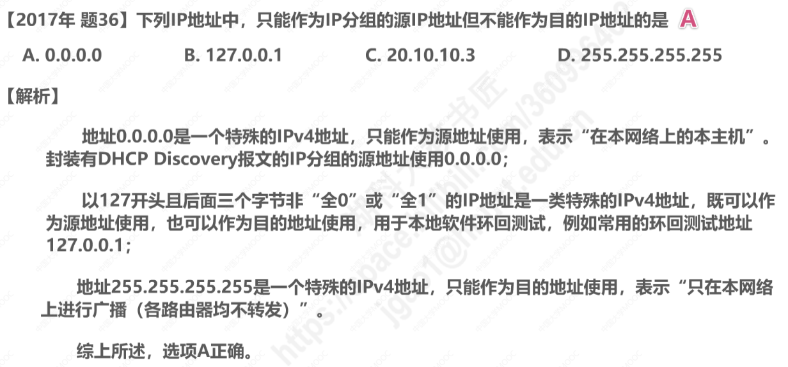

# 第四章 网络层

## 4.1 网络层概述

网络层的主要任务是**实现网络互连**，进而**实现数据包在各网络之间的传输**。

要实现网络层任务，需要解决以下问题

1. 网络层向运输层提供怎样的服务（“可靠传输”还是“不可靠传输”）

   ​	对于误码、（被路由器）丢弃、或失序（按序发送的数据包不能按序到达），如果不采取任何措施，则是不可靠传输服务；如果采取措施，并使得接收方能正确接收数据包，则是可靠传输服务。

2. 网络层寻址问题

3. 路由选择问题

路由器收到数据包后，是依据什么来决定，将数据包从自己的哪个接口转发出去呢？

## 4.2 网络层提供的两种服务

### 面向连接的虚电路(virtual circuit)服务

### 无连接的数据报服务

### 小结

## 4.3 IPv4地址及其应用

### 4.3.1 概述

#### IPv4地址的表示方法——点分十进制表示方法

#### 8位二进制整数转为十进制数

二进制转十进制的举例：

#### 十进制正整数转为8进制二进制数——除2取余法/凑值法

慕课题：

### 4.3.2 分类编址的IPv4地址

五类地址：

#### A类地址

#### B类地址

#### C类地址

练习：

慕课题：

### 4.3.3 划分子网的IPv4地址

划分子网需求的出现

如图，某单位有个大型局域网需要连接到因特网，申请C类的话IP地址数量太少，B类的话有可能会太多。

随着该单位的发展，有可能需要划分成三个独立的网络：

但是，可以从主机号部分借用一部分作为子网号：

但是，如果未在图中标记子网号部分，那么我们和计算机又如何知道分类地址中主机号有多少比特被用作子网号了呢？

#### 子网掩码

#### 划分子网的细节

作为C类网的所以IP地址：

划分子网后的IP地址：

练习题与考研题：

#### 默认子网掩码

### 4.4.3 无分类编址的IPv4地址

#### 无分类域间路由选择CIDR

